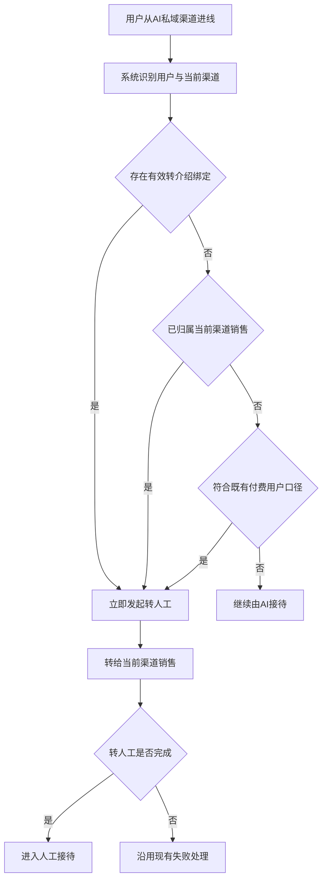
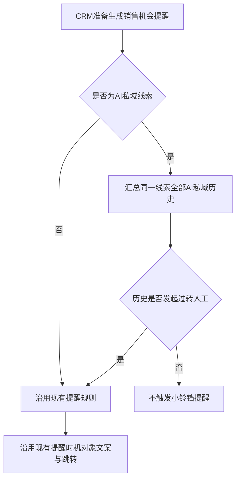

# PRD-AI 私域自动转人工与 CRM 提醒优化

## 一、修订记录

| 版本号 | 修改日期 | 修改原因 | 修订人 |
|---|---|---|---|
| v1.0 | 2026-09-07 | 初稿 | AI PRD Writer |

## 二、需求概述

- **背景/现状**：当已有明确销售关系或付费身份的用户再次从 AI 私域渠道进线时，系统仍可能先由 AI 接待；同时，从未发起过转人工的 AI 私域线索也会进入 CRM 销售机会提醒。
- **需求目标**：当用户命中任一重点身份条件时，系统应立即转给当前渠道销售；当 AI 私域线索历史上从未发起过转人工时，CRM 不应对该线索触发小铃铛销售机会提醒。
- **核心逻辑简述**：用户重新进线后，系统校验有效转介绍绑定、当前渠道销售归属和既有付费身份，任一命中即发起转人工。CRM 生成销售机会提醒前，应汇总同一线索在全部 AI 私域渠道中的转人工历史，仅保留发起过转人工的线索。

## 三、术语表

| 术语 | 定义 |
|---|---|
| AI 私域线索 | 由已接入 AI 的私域渠道产生，并进入 CRM 管理的客户线索 |
| 当前渠道销售 | 当前私域渠道配置的承接销售 |
| 发起过转人工 | 同一 CRM 线索在任一 AI 私域渠道中曾发起转人工动作，不要求转人工成功 |
| 小铃铛销售机会提醒 | CRM 现有的销售机会场景提醒，提醒时机、对象、文案和跳转均沿用现有配置 |

## 四、调整范围

| 优先级 | 功能模块 | 调整内容 |
|---|---|---|
| P1 | AI 私域进线识别 | 用户重新进线后增加三类身份条件判断 |
| P1 | 自动转人工 | 任一条件命中后立即发起转人工，并转给当前渠道销售 |
| P1 | CRM 销售机会提醒 | 过滤历史上从未发起过转人工的 AI 私域线索 |
| P1 | 历史转人工判断 | 按同一 CRM 线索在全部 AI 私域渠道中的历史记录判断 |

## 五、业务流程图

**主流程：AI 私域进线与自动转人工**

**辅流程：CRM 小铃铛销售机会提醒**

## 六、可交互原型

[查看可交互原型](https://minio.yc345.tv/onionext/prototypes/ai-private-auto-handoff-crm-alert/index.html)

## 七、功能需求详细描述

### 7.1 AI 私域用户识别与自动转人工

| 功能名称 | 功能说明 | 功能类型 | 详细规则 | 异常与边界 |
|---|---|---|---|---|
| 进线身份识别 | 用户从任一 AI 私域渠道重新进线后，识别与自动转人工相关的身份条件 | 自动判断 | 每次进线均以当前有效信息判断，不沿用上一次判断结果 | 身份信息读取异常时不新增兜底规则，沿用现有进线处理 |
| 有效转介绍绑定判断 | 判断用户当前是否存在有效的转介绍绑定关系 | 自动判断 | 当前绑定关系有效即命中；已失效或已解除的历史绑定不命中 | 绑定状态以系统现有转介绍关系为准 |
| 当前渠道销售归属判断 | 判断线索当前是否已归属本次进线渠道配置的销售 | 自动判断 | 仅当线索当前归属销售与当前渠道销售一致时命中；归属其他销售不命中 | 当前渠道没有可用销售时，转人工失败处理沿用现有逻辑 |
| 付费用户判断 | 按系统现有付费用户口径判断 | 自动判断 | 命中现有付费用户条件即命中，本次不修改付费用户定义 | 付费信息读取与异常处理沿用现有逻辑 |
| 自动转人工 | 任一身份条件命中后立即发起转人工 | 自动动作 | 三项条件为“或”关系；识别完成后立即执行，不进入 AI 首轮接待；承接人为当前渠道销售 | 多项同时命中时只发起一次；失败处理、用户侧提示和后续状态沿用现有逻辑 |
| 未命中处理 | 三项条件均未命中时继续由 AI 接待 | 自动动作 | 不发起本次新增的自动转人工，后续仍可按现有规则或用户行为转人工 | 不改变现有 AI 接待与转人工规则 |

### 7.2 自动转人工业务信息

| 业务信息 | 含义 | 是否必须 | 可能结果 | 来源与空值处理 |
|---|---|---|---|---|
| 当前私域渠道 | 本次用户进线所属的 AI 私域渠道 | 是 | 系统现有全部 AI 私域渠道 | 来自本次进线；无法识别时沿用现有进线处理 |
| 当前渠道销售 | 当前渠道配置的承接销售 | 是 | 具体销售、无可用销售 | 来自渠道现有配置；无可用销售时沿用现有转人工失败逻辑 |
| 转介绍绑定状态 | 用户当前是否存在有效转介绍绑定 | 是 | 有效、无有效绑定 | 来自现有转介绍关系；仅当前有效关系命中 |
| 当前销售归属 | 线索当前归属销售是否为当前渠道销售 | 是 | 一致、不一致、无归属 | 来自 CRM 当前归属；仅“一致”命中 |
| 付费用户判断结果 | 用户是否符合现有付费用户口径 | 是 | 符合、不符合 | 来自现有付费用户识别；空值按现有逻辑处理 |
| 转人工发起结果 | 本次是否已经发起转人工 | 是 | 已发起、未发起 | 任一条件命中时记录为已发起；多条件命中只记录一次 |

### 7.3 CRM 小铃铛销售机会提醒过滤

| 功能名称 | 功能说明 | 功能类型 | 详细规则 | 异常与边界 |
|---|---|---|---|---|
| AI 私域线索识别 | 在 CRM 生成销售机会提醒前识别线索是否属于 AI 私域 | 自动判断 | 非 AI 私域线索不进入本次新增过滤，继续沿用现有提醒规则 | 线索来源无法识别时沿用现有提醒规则 |
| 历史转人工汇总 | 汇总同一 CRM 线索在全部 AI 私域渠道中的转人工历史 | 自动判断 | 只判断是否存在至少一次转人工发起记录，不要求成功，不限当前渠道 | 同一用户存在多条线索时，按 CRM 现有线索归并关系判断，不新增跨线索合并 |
| 小铃铛过滤 | 从未发起过转人工的 AI 私域线索不提醒 | 自动过滤 | 历史存在转人工发起记录时，线索继续参与现有销售机会提醒；不存在时从本批次提醒中排除 | 过滤只影响是否提醒，不删除线索，不改变线索归属和状态 |
| 现有提醒沿用 | 保持小铃铛现有提醒体验不变 | 现有功能 | 提醒时机、接收销售、提醒文案、跳转目标均不调整 | 现有提醒失败与重试逻辑不调整 |

### 7.4 CRM 提醒判断业务信息

| 业务信息 | 含义 | 是否必须 | 可能结果 | 来源与空值处理 |
|---|---|---|---|---|
| 线索来源 | 判断线索是否属于 AI 私域 | 是 | AI 私域、其他来源、无法识别 | 来自 CRM 现有来源信息；无法识别时沿用现有规则 |
| 转人工历史范围 | 同一 CRM 线索在全部 AI 私域渠道中的历史记录 | 是 | 有记录、无记录 | 来自现有转人工记录；无记录视为从未发起 |
| 转人工发起状态 | 历史中是否至少发起过一次转人工 | 是 | 发起过、从未发起 | 发起失败也属于发起过 |
| 本批次提醒结果 | 当前线索是否进入小铃铛销售机会提醒 | 是 | 参与现有提醒、不提醒 | 由线索来源和转人工发起状态共同决定 |

### 7.5 状态与边界规则

1. 当用户同时命中多个自动转人工条件时，系统只发起一次转人工。
2. 当自动转人工重复触发时，系统沿用现有重复转人工处理，不新增提醒或状态。
3. 当自动转人工失败时，用户侧表现、接待状态和后续处理均沿用现有逻辑。
4. 当 AI 私域线索历史上发起过转人工但未成功时，该线索仍可参与现有小铃铛销售机会提醒。
5. 当 AI 私域线索只在其他 AI 私域渠道发起过转人工时，该历史仍计入判断。
6. 当 AI 私域线索从未发起过转人工时，CRM 不触发小铃铛提醒，但线索继续保留在原页面和原归属下。
7. 当非 AI 私域线索进入 CRM 提醒流程时，系统完全沿用现有规则。
8. 联调前需准备：三类条件分别命中的用户、三项均未命中的用户、转人工失败用户、历史发起成功与失败的 AI 私域线索、从未发起的 AI 私域线索。冒烟账号与数据待产品提供。

## 八、埋点与数据需求

本次不新增埋点。

## 九、权限说明

本次不新增页面、入口或操作权限，沿用现有 AI 私域接待与 CRM 销售机会提醒权限。
