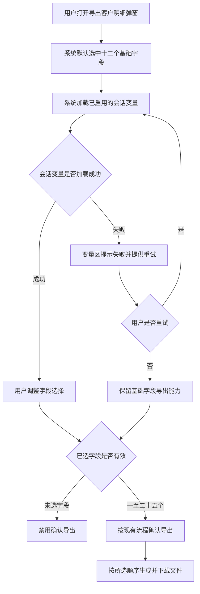

# PRD - AI员工明细自定义导出字段

## 一、修订记录

| 版本号 | 修改日期 | 修改原因 | 修订人 |
| --- | --- | --- | --- |
| v1.0 | 2026-09-01 | 初稿 | AI PRD Writer |

## 二、需求概述

- **背景/现状**：当运营人员从「企业微信 - AI员工明细」页导出客户明细时，现有导出内容固定，无法按本次分析需要选择基础字段和已启用的会话变量。
- **需求目标**：当运营人员发起客户明细导出时，系统应允许其选择本次导出的字段，并在不改变现有导出范围和流程的前提下生成对应内容。
- **核心逻辑简述**：当运营人员打开「导出客户明细」弹窗时，系统应默认选中全部十二个基础字段且不选会话变量；用户可在合计二十五个字段以内调整选择，保留至少一个字段后按现有流程完成导出。

## 三、术语表

| 术语 | 定义 |
| --- | --- |
| AI员工 | 在「企业微信 - AI员工明细」页面展示并负责接待客户的员工。 |
| 基础字段 | 当前客户明细导出中已有、可直接选择的十二项固定业务信息。 |
| 会话变量 | 在会话变量配置中处于已启用状态、可作为客户明细附加列导出的业务信息。 |

## 四、调整范围

| 编号 | 调整模块 | 调整内容 |
| --- | --- | --- |
| 1 | 企业微信 - AI员工明细页 | 沿用现有「导出客户明细」入口，不改变入口位置和使用权限。 |
| 2 | 导出客户明细弹窗 | 在现有时间范围配置基础上叠加字段选择区域，分为基础字段和会话变量两个区域。 |
| 3 | 字段选择规则 | 默认选中十二个基础字段；允许勾选已启用的会话变量；总选择数为一至二十五个。 |
| 4 | 导出文件内容 | 按用户本次选择输出字段，基础字段在前、会话变量在后，各区域按弹窗展示顺序排列。 |
| 5 | 会话变量异常处理 | 会话变量加载失败时保留基础字段选择和导出能力，并提供失败提示及重试入口。 |
| 6 | 现有导出流程 | 沿用现有时间范围、导出进度、文件命名、数据范围及结果反馈，不调整其他导出流程。 |

## 五、业务流程图

## 六、可交互原型

可交互原型：生成中（步骤 5 发布后回填链接）

## 七、功能需求详细描述

### 7.1 「导出客户明细」入口

| 字段 | 内容 |
| --- | --- |
| 功能按钮 | 导出客户明细 |
| 功能说明 | 打开现有「导出客户明细」弹窗，配置时间范围和本次导出字段。 |
| 是否必填 | - |
| 功能类型 | 按钮 |
| 交互说明 | 点击后打开弹窗；不要求选择员工，导出所选时间范围内的全部AI员工数据。 |
| 备注 | 入口位置、权限和导出进行中的状态沿用现有规则。 |

### 7.2 「导出客户明细」弹窗

| 字段 | 内容 |
| --- | --- |
| 功能名称 | 导出客户明细 |
| 功能说明 | 在现有时间范围配置中叠加字段选择，供用户决定本次导出文件包含的列。 |
| 功能类型 | 弹窗 |
| 交互说明 | 弹窗打开后展示现有时间范围、基础字段、会话变量和操作按钮；用户完成配置并点击「确认导出」后，进入现有导出进度流程。 |
| 备注 | 每次打开均恢复默认状态；关闭弹窗、取消操作或完成导出后，不保留上一次字段选择。 |

### 7.3 字段选择区域

#### 7.3.1 基础字段

基础字段固定展示十二项，均来源于现有客户明细导出内容。每次打开弹窗时默认全部选中，按下表顺序展示并导出：

| 序号 | 字段名称 | 字段说明 | 字段来源 | 默认状态 | 空值规则 |
| --- | --- | --- | --- | --- | --- |
| 1 | 微信昵称 | 客户在微信中展示的昵称。 | 现有客户明细 | 选中 | 沿用现有规则 |
| 2 | 添加好友状态 | AI员工与客户当前的好友关系状态。 | 现有客户明细 | 选中 | 沿用现有规则 |
| 3 | 负责人 | 客户当前所属AI员工。 | 现有客户明细 | 选中 | 沿用现有规则 |
| 4 | 客户回复消息数 | 现有统计口径下客户回复AI员工的消息数量。 | 现有客户明细 | 选中 | 沿用现有规则 |
| 5 | 员工发送消息数 | 现有统计口径下AI员工向客户发送的消息数量。 | 现有客户明细 | 选中 | 沿用现有规则 |
| 6 | 好友添加时间 | 客户成为AI员工好友的时间。 | 现有客户明细 | 选中 | 沿用现有规则 |
| 7 | 是否访问活跃（1日） | 客户在最近一日内是否存在访问活跃行为。 | 现有客户明细 | 选中 | 沿用现有规则 |
| 8 | 学段 | 客户当前所属学段。 | 现有客户明细 | 选中 | 沿用现有规则 |
| 9 | 接待状态 | 客户当前所处的接待状态。 | 现有客户明细 | 选中 | 沿用现有规则 |
| 10 | 转人工原因分类 | 客户会话转人工处理的原因分类。 | 现有客户明细 | 选中 | 沿用现有规则 |
| 11 | 用户年级 | 客户当前所属年级。 | 现有客户明细 | 选中 | 沿用现有规则 |
| 12 | 用户身份 | 客户当前的业务身份。 | 现有客户明细 | 选中 | 沿用现有规则 |

#### 7.3.2 会话变量

| 项目 | 规则 |
| --- | --- |
| 展示范围 | 仅展示当前处于已启用状态的会话变量；未启用和已停用的会话变量不展示。 |
| 默认状态 | 每次打开弹窗时全部不选中。 |
| 展示顺序 | 沿用会话变量在弹窗中的展示顺序。 |
| 重复排除 | 即使会话变量中存在「学段」「用户年级」「用户身份」「是否访问活跃」等同义内容，也不在会话变量区域重复展示。 |
| 勾选方式 | 用户可逐项勾选或取消；不提供拖拽排序。 |
| 导出列名 | 使用会话变量在页面中展示的中文名称。 |
| 导出取值 | 使用该客户对应会话变量在页面中的当前展示值。 |
| 日期取值 | 转换为便于阅读的中文日期或日期时间，与页面展示保持一致。 |
| 布尔取值 | 转换为页面使用的可读中文结果，与页面展示保持一致。 |
| 无值处理 | 客户没有对应值时，该单元格留空。 |

#### 7.3.3 选择数量与状态

| 状态或操作 | 触发条件 | 系统行为 |
| --- | --- | --- |
| 默认状态 | 每次打开弹窗 | 选中十二个基础字段，不选会话变量，显示「已选12/25」。 |
| 正常选择 | 已选数量为一至二十四个 | 未选字段均可继续勾选，已选数量随操作即时更新。 |
| 达到上限 | 已选数量达到二十五个 | 显示「已选25/25」；所有未选字段置灰且不可勾选；已选字段仍可取消。 |
| 解除上限 | 在已选二十五个时取消任一字段 | 已选数量即时减少，所有因数量上限置灰的未选字段恢复可选。 |
| 最少选择 | 已选数量为一个 | 最后一个已选字段仍可取消；取消后进入未选择状态并禁用「确认导出」。 |
| 未选择字段 | 已选数量为零 | 显示「请至少选择1个导出字段」，禁止确认导出。 |

### 7.4 按钮与状态

| 按钮名称 | 功能说明 | 激活条件 | 禁用条件与提示 |
| --- | --- | --- | --- |
| 取消 | 关闭弹窗且不执行导出。 | 始终激活。 | 无。 |
| 关闭 | 关闭弹窗且不执行导出。 | 始终激活。 | 无。 |
| 重试 | 重新加载已启用的会话变量。 | 会话变量加载失败时激活。 | 变量加载正常时不展示。 |
| 确认导出 | 按本次时间范围和所选字段进入现有导出流程。 | 时间范围符合现有规则，且已选择一至二十五个字段。会话变量加载失败但已选择基础字段时，仍可激活。 | 时间范围不符合现有规则时，沿用现有提示；未选择字段时置灰，并提示「请至少选择1个导出字段」。 |

### 7.5 导出字段顺序与文件内容

| 项目 | 规则 |
| --- | --- |
| 数据范围 | 导出所选时间范围内的全部AI员工数据，不依据页面上的员工选择状态缩小范围。 |
| 字段范围 | 仅输出用户本次选中的基础字段和会话变量。 |
| 分区顺序 | 所有选中的基础字段排列在前，所有选中的会话变量排列在后。 |
| 区内顺序 | 基础字段按本需求中十二个基础字段的展示顺序排列；会话变量按弹窗展示顺序排列。 |
| 时间范围 | 沿用现有导出时间范围及其校验规则。 |
| 导出进度 | 沿用现有进度展示、完成反馈和失败反馈。 |
| 文件命名 | 沿用现有客户明细导出文件命名规则。 |
| 空值 | 基础字段沿用现有规则；会话变量无值时留空。 |

### 7.6 会话变量加载与异常处理

| 状态或场景 | 触发条件 | 展示与交互 |
| --- | --- | --- |
| 加载中 | 弹窗正在获取已启用的会话变量 | 会话变量区域展示「会话变量加载中」；基础字段正常展示和选择。 |
| 加载成功且有数据 | 获取到一个或多个已启用的会话变量 | 按弹窗顺序展示可选项，默认均不选中。 |
| 加载成功但无数据 | 没有已启用的会话变量，或已启用项全部属于需排除的重复字段 | 会话变量区域展示「暂无可选的已启用会话变量」；基础字段正常导出。 |
| 加载失败 | 会话变量未能成功获取 | 会话变量区域展示「会话变量加载失败，请重试」及「重试」按钮；基础字段正常选择，满足其他条件时仍可确认导出。 |
| 重试成功 | 用户点击「重试」后成功获取数据 | 移除失败提示，按正常规则展示会话变量，默认均不选中。 |
| 重试失败 | 用户点击「重试」后仍未成功获取数据 | 保持失败提示和重试入口，不阻断基础字段导出。 |
| 导出时变量已停用 | 用户选中变量后，该变量在确认导出前变为停用状态 | 停止本次提交，提示「所选会话变量已不可用，请重新选择导出字段」，刷新会话变量区域并保留仍然有效的选择。 |
| 导出结果无数据 | 现有数据范围内没有可导出的客户数据 | 沿用现有无数据提示与结束流程。 |
| 导出失败 | 文件生成或下载失败 | 沿用现有失败提示，结束后可再次打开弹窗；再次打开恢复默认字段选择。 |

### 7.7 现有流程沿用规则

1. 弹窗不增加员工选择；无论页面当前查看哪位员工，均按现有规则导出所选时间范围内的全部AI员工数据。
2. 弹窗不提供字段拖拽排序，导出顺序仅按基础字段在前、会话变量在后及各自展示顺序确定。
3. 弹窗不记忆用户上一次字段选择；取消、关闭或导出完成后再次打开，均恢复十二个基础字段全选、会话变量全不选。
4. 除字段选择及其异常处理外，时间范围、进度反馈、文件命名、数据范围、无数据反馈和导出失败反馈均沿用现有规则。

### 7.8 测试数据说明

冒烟数据待产品提供。

## 八、埋点与数据需求

沿用现有导出相关统计，本次不新增统计要求。

## 九、权限说明

沿用现有「企业微信 - AI员工明细」页面及「导出客户明细」能力的权限规则，本次不新增角色或权限差异。
