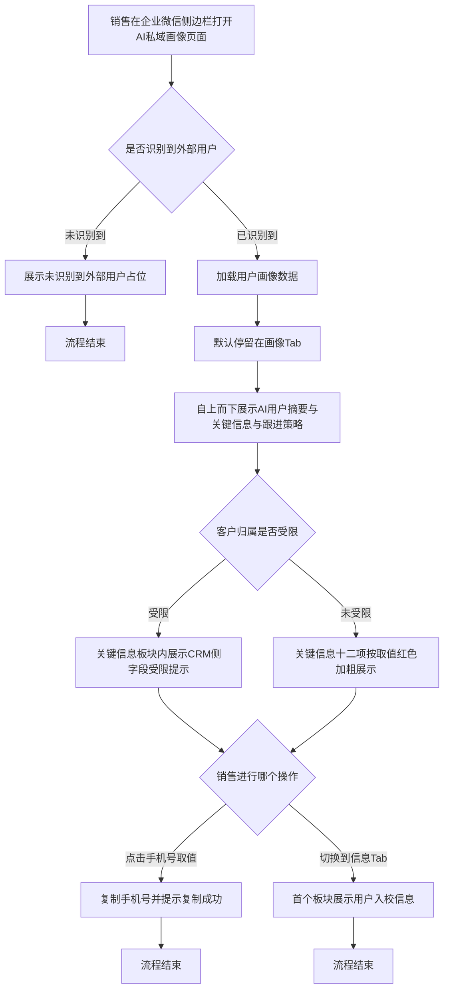

# PRD-企微侧边栏画像板块信息重组

## 一、修订记录

| 版本号 | 修改日期 | 修改原因 | 修订人 |
|--------|----------|----------|--------|
| v1.0 | 2026-08-24 | 初稿 | AI PRD Writer |

## 二、需求概述

- **背景/现状**：销售在企业微信侧边栏跟进用户时，手机号、年级、付费属性等必看的关键信息被放在「信息」Tab，而销售进入侧边栏默认停在「画像」Tab，每次都要多切一次 Tab 才能看到；同时「画像」Tab 的关键信号四宫格中，本周学时长期无数据，占据首屏却不产生跟进价值。
- **需求目标**：当销售打开企业微信侧边栏时，「画像」Tab 内应直接展示关键信息的全部十二项字段，且「画像」Tab 内不再出现关键信号四宫格与学习时长内容。
- **核心逻辑简述**：销售打开侧边栏后默认停在「画像」Tab，自上而下依次看到 AI 用户摘要、关键信息、跟进策略三块内容，无需切换 Tab 即可获取用户身份与付费事实信息。

### SCOPE（本次必做）

1. 「关键信息」板块从「信息」Tab 整体移动到「画像」Tab，位置在 AI 用户摘要卡之后、跟进策略之前。
2. 删除「关键信息」板块标题右侧的来源副标题，板块标题仅保留「关键信息」。
3. 删除「画像」Tab 的关键信号四宫格全部四格：本周学时、本周答题正确率、近 30 天接通率、企微对话情感。
4. 删除四宫格下方专用于解释三格取不到数的归属受限内联提示。
5. 「关键信息」板块自带的归属受限内联提示随板块一起迁入「画像」Tab。
6. 「信息」Tab 保留，移出关键信息后首个板块变为用户入校信息。

### NON-GOAL（明确不做）

1. 不在「对话」Tab 或页面其他位置补展示企微对话情感，接受该指标从侧边栏消失。
2. 不在页面其他位置补展示本周学时与本周答题正确率，接受这两项指标从侧边栏消失。
3. 不调整「关键信息」十二项字段的名称、取值来源、去重规则与空值兜底口径。
4. 不调整 Tab 顺序，仍为画像 / 信息 / 学情 / 外呼 / 对话五个 Tab。
5. 不调整顶部分层信息卡，以及学情 / 外呼 / 对话三个 Tab 的任何内容。
6. 不调整「外呼」Tab 的近 30 天接通率展示。
7. 不调整「信息」Tab 剩余四块（用户入校信息、付费意向、续费机会、画像信息）的内容与相互顺序。

### ACCEPT（验收标准）

1. 销售打开侧边栏后默认停在「画像」Tab，自上而下只看到 AI 用户摘要卡、关键信息、跟进策略三块内容。
2. 「画像」Tab 内不出现任何四宫格指标，页面上不出现本周学时字样。
3. 「关键信息」板块在「画像」Tab 内完整展示十二项字段，取值红色加粗，手机号点击后提示复制成功。
4. 「关键信息」板块标题只有「关键信息」四个字，无来源副标题。
5. 客户归属受限时，「画像」Tab 的「关键信息」板块内展示受限提示，且提示文案限定于 CRM 侧字段。
6. 切换到「信息」Tab 后，首个板块为用户入校信息，其后依次为付费意向、续费机会、画像信息。

### 测试数据说明

冒烟数据待产品提供。至少需要两个账号：一个客户归属在当前坐席名下（用于验证关键信息十二项完整展示），一个客户不在当前坐席名下（用于验证归属受限提示随板块迁入后的展示位置）。

## 三、术语表

| 术语 | 定义 |
|------|------|
| AI 私域画像页面 | 企业微信侧边栏内的移动端页面，结构为顶部分层信息卡加画像 / 信息 / 学情 / 外呼 / 对话五个 Tab |
| 画像 Tab | AI 私域画像页面的第一个 Tab，也是默认停留的 Tab；本次调整后自上而下为 AI 用户摘要卡、关键信息、跟进策略 |
| 信息 Tab | AI 私域画像页面的第二个 Tab；本次移出关键信息后，自上而下为用户入校信息、付费意向、续费机会、画像信息 |
| 关键信息 | 由客户 CRM 基础信息七项与企微用户标签五项整合去重后的十二项核心字段集合，取值统一红色加粗展示 |
| 关键信号四宫格 | 画像 Tab 内以两列网格展示的四个指标格，包含本周学时、本周答题正确率、近 30 天接通率、企微对话情感；本次整体删除 |
| 归属受限 | 当前客户不在本坐席名下或 CRM 中无该客户线索时的状态，此时客户 CRM 侧字段取不到值 |
| 归属受限内联提示 | 展示在受限板块内部的橙色说明文案，用于向销售解释该板块为何无数据 |
| 画像信息 | 「信息」Tab 内的用户基础信息板块，每个字段名后带字段说明提示图标 |

## 四、调整范围

1. **关键信息板块迁移**：将「关键信息」板块从「信息」Tab 顶部整体移动到「画像」Tab，落位于 AI 用户摘要卡之后、跟进策略之前；板块内十二项字段、红色加粗样式、手机号点击复制交互全部沿用现有配置，不做任何修改。
2. **关键信息板块标题精简**：删除板块标题右侧的来源副标题，标题仅保留「关键信息」。
3. **关键信号四宫格删除**：删除「画像」Tab 内的关键信号四宫格，四个指标格（本周学时、本周答题正确率、近 30 天接通率、企微对话情感）全部移除，不在页面其他位置补展示。
4. **四宫格受限提示删除**：删除四宫格下方专门解释「学时、正确率、接通率三格取不到数」的归属受限内联提示。
5. **关键信息受限提示随迁**：「关键信息」板块自带的归属受限内联提示随板块一起迁入「画像」Tab，展示位置仍在板块标题之下、字段列表之上，提示范围仍限定于 CRM 侧字段。
6. **信息 Tab 板块顺序顺延**：「信息」Tab 保留，移出关键信息后首个板块变为用户入校信息，其后依次为付费意向、续费机会、画像信息，四块内容本身不做修改。

> 页面结构说明：本次不新建页面、不新增 Tab、不调整 Tab 顺序。调整后「画像」Tab 自上而下为：AI 用户摘要卡 → 关键信息 → 跟进策略。「信息」Tab 自上而下为：用户入校信息 → 付费意向 → 续费机会 → 画像信息。

## 五、业务流程图

**主流程：销售打开侧边栏到在画像 Tab 完成关键信息查看**

## 六、可交互原型

在线预览：[点击查看可交互原型](https://minio.yc345.tv/onionext/prototypes/wework-sidebar-profile-regroup/index.html)（内网，需飞连）

原型模式：html-wireframe（非最终 UI）

> 原型为单文件移动端页面，按现网侧边栏页面结构对齐绘制，用于评审调整后的板块顺序与关键信息落位。顶部「原型状态切换」控件不属于页面内容，仅用于演示归属正常与归属受限两种状态。

## 七、功能需求详细描述

### 7.1 关键信息板块（迁入画像 Tab）

功能、弹窗、按钮类型：信息展示区

生成列表：

| 功能按钮 | 功能说明 | 是否必填 | 功能类型 | 交互说明 | 备注 |
|---|---|---|---|---|---|
| 关键信息板块 | 在画像 Tab 内集中展示用户身份与付费事实的十二项核心字段 | 否 | 信息展示区 | 位于「画像」Tab 内，AI 用户摘要卡之后、跟进策略之前；板块标题为「关键信息」，标题右侧不带任何来源副标题；十二项字段自上而下按固定顺序整段展示，不折叠、不分页 | 由「信息」Tab 顶部整体迁入；字段内容、顺序、样式全部沿用现有配置 |
| 手机号取值 | 点击后复制手机号到剪贴板 | 否 | 可点击文本 | 手机号取值带下划线标识可点击；点击后复制手机号并弹出提示「复制成功」；手机号无值时不响应点击、不弹提示 | 十二项中仅手机号可点击复制，其余字段取值不可点击 |

关键信息字段清单（迁移后位于画像 Tab，全部红色加粗展示，顺序不变）：

| 字段名称 | 字段说明 | 字段来源 | 备注 |
|---|---|---|---|
| 手机号 | 用户绑定的手机号 | 客户 CRM 基础信息 | 空值时展示占位符「—」；有值时可点击复制 |
| 洋葱ID | 用户在洋葱的唯一标识 | 客户 CRM 基础信息 | 空值时展示占位符「—」 |
| 学段 | 用户所处学段，如初中 | 客户 CRM 基础信息 | 空值时展示占位符「—」 |
| 年级 | 用户所处年级，如七年级 | 客户 CRM 基础信息 | 与企微用户标签同名项已去重，只取 CRM 侧 |
| 客户类型 | 用户类型，取值为新增或付费 | 客户 CRM 基础信息 | 空值时展示占位符「—」 |
| 所在地 | 用户所在省市区，如湖北省武汉市 | 客户 CRM 基础信息 | 与企微用户标签同名项已去重，只取 CRM 侧 |
| 到期时间 | 用户权益到期时间 | 客户 CRM 基础信息 | 空值时展示占位符「—」 |
| 用户身份 | 用户身份，如学生 | 企微用户标签 | 空值时展示占位符「—」 |
| 付费属性 | 付费情况，如未付费用户 | 企微用户标签 | 同一维度命中多个标签时按接口返回顺序用顿号拼接全部取值 |
| 用户支付金额总和 | 用户历史累计支付金额区间，如 1000 元以内 | 企微用户标签 | 空值时展示占位符「—」 |
| 用户续费次数 | 用户历史续费次数 | 企微用户标签 | 无续费记录时展示「0次」，不展示占位符 |
| 服务期归属 | 用户服务期归属，如电销或网销 | 企微用户标签 | 空值时展示占位符「—」 |

异常场景：

| 场景 | 展示 |
|---|---|
| 客户归属受限 | 板块标题下方展示归属受限内联提示，提示范围限定为 CRM 侧字段；前七项取占位符「—」，后五项企微用户标签字段仍正常展示取值 |
| 单个字段无取值 | 该字段行展示占位符「—」；用户续费次数无记录时展示「0次」 |
| 全部字段无取值 | 板块结构与十二个字段行仍完整展示，取值统一为占位符「—」，不展示空态插画 |

### 7.2 关键信息板块的归属受限内联提示（随板块迁入）

功能、弹窗、按钮类型：提示文案

生成列表：

| 功能按钮 | 功能说明 | 是否必填 | 功能类型 | 交互说明 | 备注 |
|---|---|---|---|---|---|
| 归属受限内联提示 | 向销售解释关键信息中 CRM 侧字段为何无取值 | 否 | 提示文案 | 位于「画像」Tab 关键信息板块内，板块标题之下、字段列表之上；橙色小字展示；仅在客户归属受限时出现，归属正常时整行不渲染 | 随关键信息板块从「信息」Tab 迁入，文案内容与触发条件沿用现有配置 |

状态切换：

| 状态 | 触发条件 | 展示 |
|---|---|---|
| 展示提示 | 当前客户不在本坐席名下，或 CRM 中无该客户线索 | 板块标题下方展示橙色受限提示文案，并标明受限范围为 CRM 侧字段 |
| 不展示提示 | 客户归属正常 | 提示整行不渲染，板块标题直接接字段列表 |

### 7.3 关键信号四宫格（本次删除）

功能、弹窗、按钮类型：信息展示区（删除）

生成列表：

| 功能按钮 | 功能说明 | 是否必填 | 功能类型 | 交互说明 | 备注 |
|---|---|---|---|---|---|
| 关键信号四宫格 | 原以两列网格在画像 Tab 展示四个跟进参考指标 | 否 | 信息展示区（删除） | 本次整体删除，删除后 AI 用户摘要卡下方直接接关键信息板块，不留空白区域、不留占位文案 | 四个指标格全部移除，不在页面其他位置补展示 |
| 四宫格归属受限内联提示 | 原用于解释学时、正确率、接通率三格为何取不到数 | 否 | 提示文案（删除） | 随四宫格一并整条删除；顶部全局归属受限提示条不受影响，仍按现有配置展示 | 该提示解释的三格已删除，保留会造成提示与内容错位 |

被删除的四个指标格及处理方式：

| 指标格名称 | 原展示内容 | 本次处理 | 是否在其他位置保留 |
|---|---|---|---|
| 本周学时 | 用户本周累计学习时长，单位分钟 | 删除 | 不保留，页面上不再展示该指标 |
| 本周答题正确率 | 用户本周答题正确率百分比 | 删除 | 不保留，页面上不再展示该指标 |
| 近30天接通率 | 用户近 30 天外呼接通率百分比 | 删除 | 「外呼」Tab 的近 30 天外呼概况中仍有接通率，本次不做任何调整 |
| 企微对话情感 | 用户近期企微对话情感倾向及走势箭头 | 删除 | 不保留，页面上不再展示该指标 |

### 7.4 画像 Tab 板块顺序（调整后）

功能、弹窗、按钮类型：Tab

生成列表：

| 功能按钮 | 功能说明 | 是否必填 | 功能类型 | 交互说明 | 备注 |
|---|---|---|---|---|---|
| 画像 Tab | 承载 AI 用户摘要、关键信息、跟进策略三块内容 | 否 | Tab | Tab 名称与位置不变，仍为第一个 Tab 且为页面默认停留 Tab；自上而下依次为 AI 用户摘要卡、关键信息、跟进策略 | AI 用户摘要卡与跟进策略沿用现有配置，包含各自的加载中占位表现 |

调整前后板块顺序对照：

| 顺序 | 调整前 | 调整后 |
|---|---|---|
| 1 | AI 用户摘要卡 | AI 用户摘要卡 |
| 2 | 关键信号四宫格 | 关键信息 |
| 3 | 四宫格归属受限内联提示 | 跟进策略 |
| 4 | 跟进策略 | — |

### 7.5 信息 Tab 板块顺序（调整后）

功能、弹窗、按钮类型：Tab

生成列表：

| 功能按钮 | 功能说明 | 是否必填 | 功能类型 | 交互说明 | 备注 |
|---|---|---|---|---|---|
| 信息 Tab | 承载用户入校信息、付费意向、续费机会、画像信息四块内容 | 否 | Tab | Tab 名称与位置不变，仍为第二个 Tab；移出关键信息后首个板块变为用户入校信息，其余三块顺序不变 | 保留该 Tab；四块内容本身沿用现有配置，不做修改 |

调整前后板块顺序对照：

| 顺序 | 调整前 | 调整后 |
|---|---|---|
| 1 | 关键信息 | 用户入校信息 |
| 2 | 用户入校信息 | 付费意向 |
| 3 | 付费意向 | 续费机会卡 |
| 4 | 续费机会卡 | 画像信息 |
| 5 | 画像信息 | — |

异常场景：移出关键信息后，「信息」Tab 不出现空白区域，用户入校信息板块直接顶到 Tab 内容区上边缘。

### 7.6 横切规则

跳转闭环：

| 操作 | 结果 |
|---|---|
| 在「画像」Tab 点击手机号取值 | 停留在当前 Tab，弹出提示「复制成功」，不发生页面跳转 |
| 从「画像」Tab 切换到「信息」Tab | 内容区切换为「信息」Tab，首个板块为用户入校信息；再切回「画像」Tab 时，关键信息板块仍保持整段展示状态 |

状态兜底：

| 场景 | 展示 |
|---|---|
| 未识别到外部用户 | 整页展示「未识别到外部用户，请从单聊会话工具栏打开」，不渲染任何 Tab |
| 画像数据加载失败 | 整页展示加载失败提示与重试入口，沿用现有配置 |
| AI 用户摘要生成中 | AI 用户摘要卡与跟进策略各自展示加载中占位，关键信息板块不受影响、正常展示取值 |

## 八、埋点与数据需求

## 九、权限说明
