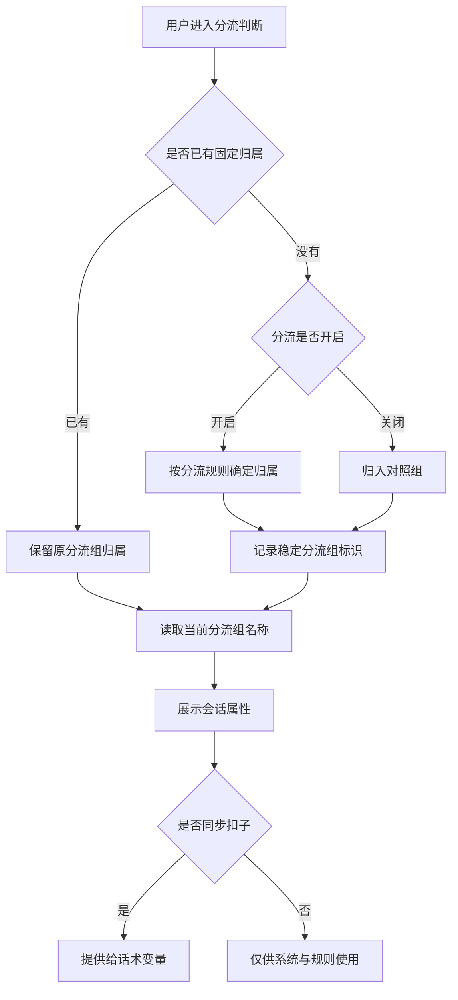
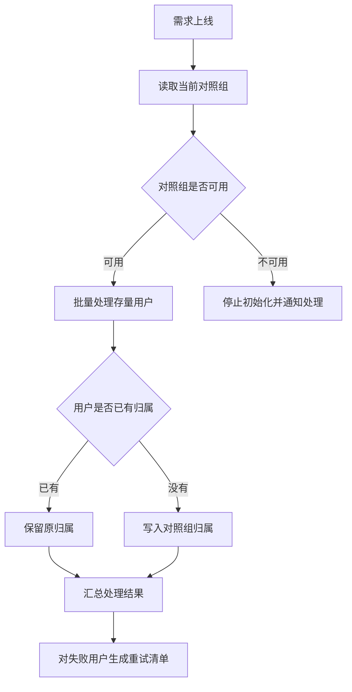

# PRD-企微机器人分流组会话属性

## 一、修订记录

| 版本号 | 修改日期 | 修改原因 | 修订人 |
|---|---|---|---|
| v1.0 | 2026-09-01 | 初稿 | AI PRD Writer |
| v1.1 | 2026-09-01 | 补充分流能力前置依赖并校正系统预设属性编辑边界 | AI PRD Writer |

## 二、需求概述

- **背景/现状**：当运营查看或使用用户会话属性时，系统尚未提供用户固定归属的分流组，无法直接按分流组筛选用户或在话术中引用组名。
- **需求目标**：当系统确定用户的分流组后，应在基础信息中记录并展示当前分流组名称，且允许该只读属性用于规则条件与话术变量。
- **核心逻辑简述**：系统以稳定的分流组标识记录用户归属，并按当前配置展示组名；新用户确定归属时写入，存量用户上线时统一归入对照组。
- **前置依赖**：本需求依赖「企微机器人用户分流配置」提供分流组配置、用户固定归属和分流开关能力；当前代码中的 `TriggerRuleGroup` 是规则分组，不是本需求所指的用户分流组，不可直接复用为归属数据源。

## 三、术语表

| 术语 | 定义 |
|---|---|
| 所属分流组 | 用户被固定分配到的分流组，属性展示当前分流组名称 |
| 固定归属 | 用户一旦归入某个分流组，后续不因分流开关或比例调整而改变 |
| 当前执行组 | 某次规则判断实际采用的分流组；分流关闭时可能临时采用对照组，与固定归属不同 |
| 同步扣子 | 将该会话属性提供给扣子，用于在可插入变量中引用 |

## 四、调整范围

| 序号 | 功能模块 | 调整类型 | 说明 |
|---|---|---|---|
| 1 | 会话属性基础信息 | 新增 | 新增系统预设枚举属性「所属分流组」 |
| 2 | 会话属性编辑弹窗 | 调整 | 管理员可修改是否同步扣子，属性值仍保持只读 |
| 3 | 规则条件配置 | 调整 | 选择所属分流组时展示当前有效的分流组名称 |
| 4 | 话术变量选择 | 调整 | 同步扣子开启时可插入所属分流组，运行时展示当前组名 |
| 5 | 用户分流归属写入 | 新增 | 新用户确定归属时记录稳定分流组标识 |
| 6 | 存量用户初始化 | 新增 | 上线时将全部存量用户批量归入对照组 |
| 7 | 分流组名称联动 | 新增 | 分流组改名后，属性展示、规则选项和话术内容使用新名称 |

## 五、业务流程图

**主流程：写入并使用所属分流组**

**子流程：上线初始化存量用户**

## 六、可交互原型

可交互原型（公网，点击可直接操作）：https://leo-ai05.github.io/prototypes/%E4%BC%81%E5%BE%AE%E6%9C%BA%E5%99%A8%E4%BA%BA%E5%88%86%E6%B5%81%E7%BB%84%E4%BC%9A%E8%AF%9D%E5%B1%9E%E6%80%A7/

原型模式：html-wireframe（单文件可交互原型，无需登录、无需本地启动）

涉及页面：企业微信机器人 → 会话属性；企业微信机器人 → 规则配置

可操作路径：

1. 在会话属性页切换到「基础信息」，查看「所属分流组」的枚举、系统默认与只读状态。
2. 点击「编辑」，切换「是否同步扣子」，观察「扣子是否更新」始终为否。
3. 切换到规则配置，打开条件值下拉，查看分流组名称选项。
4. 模拟分流组改名，查看会话属性值、条件选项和话术预览同步更新。
5. 切换分流总开关，查看已有实验组用户仍保留固定归属，而当前执行组临时变为对照组。

关键态截图：`需求汇总/企微机器人分流组会话属性/proto-shots/`，共 5 张。

GitHub 需求目录（公网）：https://github.com/Leo-ai05/prototypes/tree/main/%E4%BC%81%E5%BE%AE%E6%9C%BA%E5%99%A8%E4%BA%BA%E5%88%86%E6%B5%81%E7%BB%84%E4%BC%9A%E8%AF%9D%E5%B1%9E%E6%80%A7

## 七、功能需求详细描述

### 7.1 基础信息新增「所属分流组」

**所在位置**：企业微信机器人 → 会话属性 → 基础信息

**功能说明**：在现有基础信息分类中新增一个系统预设、不可删除的枚举属性，用于展示用户固定归属的分流组。

| 字段名称 | 字段说明 | 字段来源 | 备注 |
|---|---|---|---|
| 属性名称 | 固定展示「所属分流组」 | 系统预设 | 只读，不允许修改 |
| 字段类型 | 展示为「枚举」 | 系统预设 | 枚举选项来自当前分流组配置 |
| 属性说明 | 说明该属性记录用户固定归属，不代表分流关闭时的临时执行组 | 系统预设 | 默认文案为「用户固定归属的分流组；分流关闭时实际规则按对照组执行」 |
| 是否同步扣子 | 控制是否向扣子提供该属性 | 管理员配置 | 默认是，可修改 |
| 扣子是否更新 | 表示扣子能否反向修改属性值 | 系统固定 | 固定为否，不可修改 |
| 当前值 | 展示用户所属分流组的当前名称 | 用户分流归属与分流组配置 | 未取得名称时展示「未知分流组」 |

展示与排序规则：

1. 该属性归入「基础信息」，沿用现有会话属性列表的分组、搜索与排序规则。
2. 该属性展示「系统默认」标记，不能被删除；管理员可沿用现有能力调整当前所属分类或恢复出厂分类。
3. 属性值对用户与运营均为只读，不提供人工改值、规则动作改值或批量改值入口。
4. 后台记录稳定的分流组标识，页面仅展示当前分流组名称，不展示内部标识。
5. 分流组改名后，所有读取位置展示新名称，无需批量改写用户归属。

### 7.2 会话属性编辑弹窗

**所在位置**：会话属性列表 → 「所属分流组」行 → 编辑

| 功能按钮 | 功能说明 | 是否必填 | 功能类型 | 交互说明 | 备注 |
|---|---|---|---|---|---|
| 属性名称 | 展示属性名称 | 是 | 只读输入框 | 固定展示「所属分流组」 | 不允许修改 |
| 属性说明 | 展示属性用途 | 否 | 多行输入框 | 沿用现有字数限制 | 默认说明需明确固定归属与当前执行组的差异 |
| 是否同步扣子 | 控制该属性是否提供给扣子 | 是 | 开关 | 默认开启，管理员可开启或关闭 | 关闭后从扣子可用变量中移除，不影响规则条件 |
| 扣子是否更新 | 限制扣子反向改写 | 是 | 开关 | 固定关闭并置灰 | 悬浮提示「所属分流组由系统分流结果确定，不允许外部修改」 |

提交规则：

1. 管理员修改「是否同步扣子」并保存后立即生效，列表同步刷新。
2. 保存过程中「确定」按钮进入加载状态并禁用，避免重复提交。
3. 保存失败时保留弹窗与已选状态，提示「保存失败，请重试」。
4. 无编辑权限时不展示编辑入口；读取与搜索不受影响。

### 7.3 枚举选项与名称解析

**功能说明**：枚举值使用稳定分流组标识，所有面向用户的位置展示当前分流组名称。

| 业务信息 | 含义 | 来源 | 空值与异常处理 |
|---|---|---|---|
| 分流组标识 | 唯一对应一个分流组，用户归属时记录 | 用户分流配置 | 不向页面展示 |
| 分流组名称 | 会话属性、规则条件和话术中展示的名称 | 当前分流组配置 | 无法解析时展示「未知分流组」 |
| 分流组可选项 | 规则条件选择器中可选择的分流组 | 当前存在的分流组 | 读取失败时选择器置灰并提示「分流组加载失败，请重试」 |

联动规则：

1. 新增分流组后，新的分流组立即进入规则条件的可选项。
2. 分流组改名后，会话属性当前值、规则条件选项与话术运行结果均使用新名称。
3. 已保存的规则按稳定分流组标识继续生效，改名不要求重新保存规则。
4. 分流组删除沿用用户分流配置的既有保护规则；已有用户归属的分流组不可删除。

### 7.4 用户归属写入

**所在位置**：用户分流判断过程，无独立页面

写入规则：

1. 当用户已有固定归属时，系统保留原归属，不重复写入。
2. 当用户尚无归属且分流开启时，系统按当前分流规则确定分流组并写入。
3. 当用户尚无归属且分流关闭时，系统将该用户固定归入对照组；未来重新开启分流后不重新分配。
4. 当分流从开启切到关闭时，已归属实验组的用户保留原分流组；规则执行临时按对照组处理。
5. 当分流重新开启时，已有归属用户恢复按自己的固定分流组参与规则判断。
6. 同一用户并发触发多次归属判断时，只允许首次成功写入，后续读取首次结果。

失败处理：

1. 无法取得可用对照组时，不写入错误归属，本次规则处理按既有安全口径执行并记录异常。
2. 写入失败时，本次处理按对照组执行，并在下次触发时重试确定归属。
3. 已记录的分流组无法解析时，不自动改写用户归属，属性展示「未知分流组」并记录异常。

### 7.5 规则条件使用

**所在位置**：规则配置 → 条件配置区域

| 功能按钮 | 功能说明 | 是否必填 | 功能类型 | 交互说明 | 备注 |
|---|---|---|---|---|---|
| 条件字段 | 选择「所属分流组」 | 是 | 下拉单选 | 沿用现有会话属性条件选择方式 | 属性关闭同步扣子后仍可选择 |
| 判断方式 | 判断用户是否属于指定分流组 | 是 | 下拉单选 | 沿用枚举条件的现有判断方式 | 不开放手工输入分流组名称 |
| 条件值 | 选择一个当前分流组 | 是 | 下拉单选 | 展示当前分流组名称，保存稳定分流组标识 | 加载失败时不可提交 |

规则：

1. 分流组改名后，已保存条件自动展示新名称并继续命中原分流组用户。
2. 条件值加载失败时，下拉置灰并提示「分流组加载失败，请重试」。
3. 已保存规则引用的分流组异常缺失时，条件展示「未知分流组」，规则编辑提交被拦截并提示重新选择。

### 7.6 话术变量使用

**所在位置**：可插入会话属性变量的话术与提示词编辑区域

1. 「是否同步扣子」开启时，变量清单展示「所属分流组」。
2. 插入变量后，运行时输出用户固定归属的当前分流组名称，不输出内部标识。
3. 分流组改名后，后续生成的话术使用新名称；已经生成或发送的历史话术不回溯修改。
4. 「是否同步扣子」关闭后，变量从可插入清单移除；已保存内容中的该变量按现有失效变量口径提示，规则条件不受影响。
5. 用户归属无法解析时，变量值为空，不把「未知分流组」写入面向用户的话术。

### 7.7 存量用户初始化

**所在位置**：需求上线阶段，无独立页面

1. 上线前校验存在且仅存在一个可用对照组；校验失败时停止初始化并通知技术处理。
2. 对尚无固定归属的全部存量用户批量写入对照组归属；已有归属用户保持不变。
3. 批量处理需可重复执行，重复执行不改变已经成功写入的归属。
4. 初始化完成后汇总成功数、跳过数与失败数；失败用户进入重试清单。
5. 初始化未完成前，不将该属性开放给规则条件和扣子变量，避免规则读取到大面积空值。

### 7.8 边界与权限

| 场景 | 系统表现 |
|---|---|
| 用户尚未完成归属 | 属性值展示「—」，规则按空值处理，话术变量输出为空 |
| 分流组名称为空或读取失败 | 属性展示「未知分流组」，规则编辑不可保存，话术变量输出为空 |
| 分流组改名 | 所有新读取结果展示新名称，历史用户归属不变 |
| 分流关闭 | 属性仍展示固定归属；当前执行组按对照组处理 |
| 无会话属性编辑权限 | 只允许查看，不展示编辑入口 |
| 无规则编辑权限 | 可查看已保存条件，不可新增或修改条件 |
| 同步扣子关闭 | 规则条件继续可用，扣子变量停止提供 |
| 重复提交编辑 | 提交期间按钮禁用，只处理一次 |

**测试数据说明**：需准备对照组用户、实验组用户、分流关闭期间新增用户、分流组改名前后用户、无法解析归属用户各一组；冒烟数据待产品提供。

## 八、埋点与数据需求

本需求不新增运营报表。技术侧需记录存量初始化成功数、跳过数、失败数，以及分流组名称解析失败次数，用于上线核查与异常排查。

## 九、权限说明

- **会话属性管理员**：可编辑属性名称、说明、当前分类及是否同步扣子；不能修改属性值、不能开启扣子反向更新、不能删除该系统预设属性。
- **规则配置管理员**：可在规则条件中选择所属分流组；不能通过规则动作修改用户归属。
- **只读人员**：可查看属性配置与用户当前值，不能修改任何配置。
