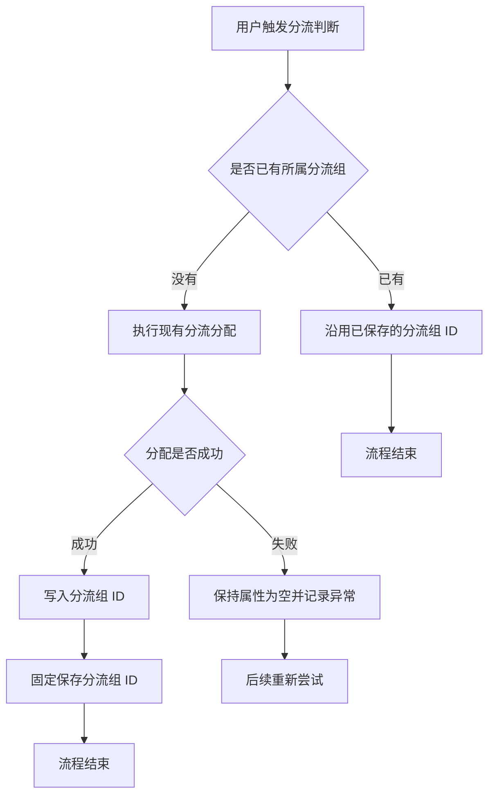

# PRD-企微机器人分流组会话属性

## 一、修订记录

| 版本号 | 修改日期 | 修改原因 | 修订人 |
|---|---|---|---|
| v1.0 | 2026-09-01 | 初稿 | AI PRD Writer |
| v2.0 | 2026-09-01 | 收敛为仅新增分流组 ID 会话属性 | AI PRD Writer |
| v2.1 | 2026-09-01 | 恢复完整文档结构与可交互原型 | AI PRD Writer |

## 二、需求概述

- **背景/现状**：当用户完成分流组分配后，现有基础信息中没有记录其固定归属的分流组 ID。
- **需求目标**：当用户首次分配成功时，系统应在「所属分流组」会话属性中保存分流组 ID，并确保后续不被覆盖。
- **核心逻辑简述**：系统在用户分配前保持属性为空，首次分配成功后写入分流组 ID；属性已有值时直接沿用原值。

## 三、术语表

| 术语 | 定义 |
|---|---|
| 所属分流组 | 新增在基础信息中的系统会话属性，内容为用户所属分流组的 ID |
| 固定归属 | 分流组 ID 首次写入成功后永久沿用，不再重新分配或修改 |

## 四、调整范围

| 序号 | 功能模块 | 调整类型 | 说明 |
|---|---|---|---|
| 1 | 会话属性-基础信息 | 新增 | 新增系统默认属性「所属分流组」 |
| 2 | 用户分流结果写入 | 新增 | 用户首次分配成功后写入分流组 ID |
| 3 | 用户属性值展示 | 新增 | 已分配时展示分流组 ID，未分配时展示空值 |

## 五、业务流程图

**主流程：分流组 ID 写入与固定**

## 六、可交互原型

可交互原型（公网，点击可直接操作）：https://leo-ai05.github.io/prototypes/%E4%BC%81%E5%BE%AE%E6%9C%BA%E5%99%A8%E4%BA%BA%E5%88%86%E6%B5%81%E7%BB%84%E4%BC%9A%E8%AF%9D%E5%B1%9E%E6%80%A7/

原型模式：html-wireframe（单文件可交互原型，无需登录、无需本地启动）

涉及页面：企业微信机器人 → 会话属性 → 基础信息

可操作路径：

1. 查看「所属分流组」在用户未分配时的空值状态。
2. 点击「模拟首次分配」，查看分流组 ID 写入并变为「已固定」。
3. 点击「模拟再次触发分配」，查看系统沿用原 ID 且不覆盖。
4. 点击「复制 ID」，体验已保存值的复制操作。
5. 点击「重置演示」，返回未分配状态。

关键态截图：`需求汇总/企微机器人分流组会话属性/proto-shots/`，共 3 张。

GitHub 需求目录（公网）：https://github.com/Leo-ai05/prototypes/tree/main/%E4%BC%81%E5%BE%AE%E6%9C%BA%E5%99%A8%E4%BA%BA%E5%88%86%E6%B5%81%E7%BB%84%E4%BC%9A%E8%AF%9D%E5%B1%9E%E6%80%A7

## 七、功能需求详细描述

### 7.1 基础信息新增「所属分流组」

**所在位置**：企业微信机器人 → 会话属性 → 基础信息

**功能说明**：在现有基础信息分类中新增系统默认会话属性，用于保存和展示用户所属分流组的 ID。

| 字段名称 | 字段说明 | 字段来源 | 备注 |
|---|---|---|---|
| 属性名称 | 固定展示「所属分流组」 | 系统默认 | 不允许修改或删除 |
| 字段类型 | 展示为「字符串」 | 系统默认 | 直接保存分流组 ID，不转换为分流组名称 |
| 属性值 | 展示用户首次分配成功的分流组 ID | 系统分流结果 | 未分配时展示「—」 |
| 属性状态 | 展示「未分配」或「已固定」 | 属性值状态 | 已固定后不可修改 |

展示规则：

1. 「所属分流组」沿用现有会话属性页面的分类、搜索和列表展示方式。
2. 属性归入「基础信息」，并展示「系统默认」标记。
3. 用户未分配时，属性值展示「—」，状态展示「未分配」。
4. 用户分配成功后，属性值展示实际分流组 ID，状态展示「已固定」。
5. 属性值仅供查看，不提供人工编辑、批量修改或删除入口。
6. 分流组名称变化不影响已保存的分流组 ID。

### 7.2 分流组 ID 写入

**所在位置**：用户分流判断过程，无独立操作页面

| 触发条件 | 系统行为 | 结果 |
|---|---|---|
| 用户尚无所属分流组且分配成功 | 写入本次分配得到的分流组 ID | 属性变为「已固定」 |
| 用户已有所属分流组 | 跳过重新分配并读取原值 | 原分流组 ID 保持不变 |
| 分配失败或写入失败 | 不保存错误值并记录异常 | 属性保持为空，后续可重试 |
| 同一用户并发触发分配 | 仅首次成功写入生效 | 后续写入不得覆盖首次结果 |

写入规则：

1. 系统仅在用户没有所属分流组时执行首次写入。
2. 写入内容必须与本次实际分配成功的分流组 ID 一致。
3. 分流组 ID 写入成功后永久固定，后续分流判断直接沿用。
4. 人工操作、规则动作及其他外部流程均不得修改属性值。
5. 如果写入失败，系统不得把未确认或错误的分流组 ID 保存为用户归属。

### 7.3 属性值查看

**所在位置**：会话属性详情或用户会话属性展示区域

| 功能按钮 | 功能说明 | 是否必填 | 功能类型 | 交互说明 | 备注 |
|---|---|---|---|---|---|
| 查看示例 | 定位到属性值模拟区域 | 否 | 按钮 | 点击后展示当前用户的属性状态 | 沿用现有页面反馈样式 |
| 复制 ID | 复制当前分流组 ID | 否 | 按钮 | 有值时可点击，复制成功提示「分流组 ID 已复制」 | 无值时置灰 |

状态规则：

1. 当属性为空时，「复制 ID」按钮置灰。
2. 当属性已有值时，「复制 ID」按钮可点击。
3. 当再次触发分流判断时，页面提示「已存在固定归属，系统沿用原分流组 ID，不重新分配、不覆盖」。
4. 当属性读取失败时，页面展示「加载失败，请重试」，不得误展示为空值。

### 7.4 边界场景

1. 用户从未成功分配分流组时，属性始终为空。
2. 用户首次分配成功但属性写入失败时，不形成固定归属，后续允许重试。
3. 属性写入成功后，即使再次触发分配，也不得覆盖原分流组 ID。
4. 同一用户同时触发多次分配时，只保留首次成功写入的分流组 ID。
5. 分流组后续改名、调整或停止使用时，已保存的分流组 ID 保持不变。
6. 冒烟数据需包含未分配用户、首次分配成功用户、已有固定归属用户和并发触发用户。

## 八、埋点与数据需求

本需求不新增运营埋点和数据报表。

## 九、权限说明

- **系统分流逻辑**：仅在用户尚无所属分流组时写入分流组 ID。
- **会话属性管理员**：可查看属性定义和用户属性值，不可修改或删除该属性。
- **其他角色与流程**：不可修改已经保存的分流组 ID。
