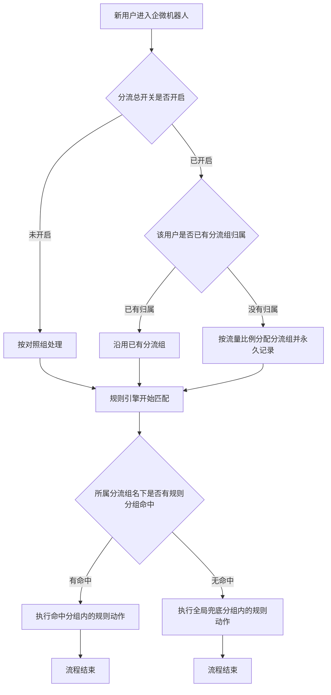
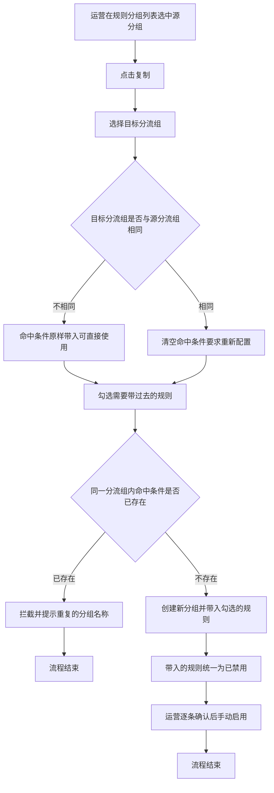

# PRD-企微机器人用户分流配置

## 一、修订记录

| 版本号 | 修改日期 | 修改原因 | 修订人 |
|--------|----------|----------|--------|
| v1.0 | 2026-08-24 | 初稿 | AI PRD Writer |

## 二、需求概述

- **背景/现状**：当企微机器人的规则引擎为用户匹配规则时，系统只按命中条件筛选，同一批用户只能执行同一套话术与动作，运营无法把用户拆成两拨做对照验证。
- **需求目标**：当运营开启用户分流后，系统应把新增用户按配置比例固定分配到各分流组，并使每个用户只执行所属分流组名下的规则；当运营需要搭建一套对照实验时，系统应通过复制规则与复制规则分组完成配置，不需要逐条重建。
- **核心逻辑简述**：当新用户进入企微机器人时，系统应按流量比例为其分配一个分流组并永久记录；当规则引擎为该用户匹配规则时，系统应只在该用户所属分流组名下的规则分组中比对命中条件，全部未命中时执行全局兜底分组。

### SCOPE（本次必做）

1. 新增「分流配置」页面：一份分流配置下可配置 2 至 5 个分流组，每个分流组自定义名称与流量比例（合计 100%），其中一个标记为对照组；页面提供分流总开关，并展示各分流组的已分配用户数与实际占比。
2. 用户分流以企微好友用户为单位：分流总开关开启后，新增用户按流量比例一次性分配分流组并永久固定；分流总开关开启前已存在的用户固定归入对照组。
3. 规则分组新增「所属分流组」：用户先确定自己的分流组，再只在该分流组名下的规则分组中比对命中条件；系统兜底分组保持全局唯一、不归属任何分流组。
4. 命中条件查重范围由全局收敛为同一分流组内；跨分流组允许命中条件完全相同。
5. 新增「复制规则」：单条规则可复制到任意规则分组（含其他分流组名下的分组），复制出的规则一律为已禁用。
6. 增强「复制分组」：可选择目标分流组、可勾选带哪几条规则、目标分流组与源分流组不同时命中条件原样带入、带过去的规则一律为已禁用。
7. 规则配置页顶部新增「所属分流组」筛选。

### NON-GOAL（明确不做）

1. 不做各分流组的转化率、回复率等业务指标对比分析。
2. 不做多份分流配置并行生效。
3. 不做已分配用户的重新分配与分流重置。
4. 不做规则或规则分组的移动与改归属操作，跨分流组迁移一律通过复制完成。
5. 不做按标签、渠道或年级等条件直接指定分流组。
6. 不做批量勾选复制多条规则。
7. 不改动现有私域分层配置的四层分层能力。

### ACCEPT（验收标准）

1. 分流总开关关闭时，只有对照组名下的规则分组参与匹配，同一用户不会同时收到对照组与实验组的消息。
2. 分流总开关开启后，新增用户按配置比例落入各分流组；同一用户多次触发规则时始终落在同一分流组。
3. 分流总开关开启前已存在的用户，全部按对照组名下的规则分组执行。
4. 在同一分流组内新建两个命中条件完全相同的规则分组时被拦截并提示重复的分组名称；在不同分流组内新建命中条件完全相同的规则分组时创建成功。
5. 把一条规则复制到其他分流组名下的分组后，新规则为已禁用状态；手动启用后只对该分流组的用户生效。
6. 复制规则分组时只勾选部分规则，创建出的新分组中只包含被勾选的规则，且全部为已禁用状态。
7. 分流配置页能查看每个分流组的已分配用户数与实际占比。

## 三、术语表

| 术语 | 定义 |
|------|------|
| 分流配置 | 一份描述用户如何被拆分到各分流组的配置，包含分流总开关与分流组清单 |
| 分流组 | 分流配置下的一个用户集合，由名称与流量比例定义，用户被分配后永久归属其中一个 |
| 对照组 | 分流组中被标记为基准的一组，承载现有话术与动作，分流总开关关闭时只有它生效 |
| 实验组 | 分流组中除对照组以外的组，承载待验证的话术与动作 |
| 流量比例 | 某个分流组预期分到的新增用户占比，所有分流组的流量比例合计为 100% |
| 已分配用户数 | 当前已经被分配到该分流组的用户数量 |
| 实际占比 | 该分流组已分配用户数占全部已分配用户数的比例 |
| 规则分组 | 企微机器人现有概念，带命中条件，用户命中后执行组内规则 |
| 命中条件 | 规则分组上配置的用户筛选条件，沿用现有多条件分组配置 |
| 兜底分组 | 企微机器人现有的系统分组，当全部普通规则分组均未命中时执行 |

## 四、调整范围

| 序号 | 功能模块 | 调整类型 | 说明 |
|---|---|---|---|
| 1 | 分流配置页 | 新增 | 企微机器人下新增一级菜单页，管理分流总开关与分流组清单 |
| 2 | 分流组编辑弹窗 | 新增 | 新建与编辑单个分流组的名称、类型、流量比例、描述 |
| 3 | 规则分组列表 | 调整 | 顶部新增所属分流组筛选，列表新增所属分流组列 |
| 4 | 新建与编辑规则分组弹窗 | 调整 | 新增所属分流组选择项，新建时必填、编辑时只读 |
| 5 | 复制规则分组弹窗 | 调整 | 新增目标分流组选择、规则勾选清单，命中条件按目标分流组决定是否原样带入 |
| 6 | 复制规则弹窗 | 新增 | 规则列表行操作新增复制入口，可选择目标分流组与目标规则分组 |
| 7 | 命中条件查重规则 | 调整 | 查重范围由全局收敛为同一分流组内 |
| 8 | 规则引擎匹配逻辑 | 调整 | 匹配规则分组前先确定用户所属分流组，只比对该分流组名下的规则分组 |
| 9 | 用户分流归属记录 | 新增 | 记录每个用户的分流组归属与分配时间，分配后不再变更 |

## 五、业务流程图

**主流程：用户分流与规则匹配**

**子流程：复制规则分组搭建对照实验**

## 六、可交互原型

在线预览：[点击查看可交互原型](https://minio.yc345.tv/onionext/prototypes/wework-bot-user-split/index.html)（内网，需飞连）

原型模式：html-wireframe（非最终 UI）

关键态截图：`需求汇总/企微机器人用户分流配置/screenshots/`

> 原型为可交互 HTML 页面，覆盖分流配置页、分流总开关二次确认、分流组编辑弹窗、规则配置页的分流组筛选、复制分组弹窗（跨分流组与同分流组两种命中条件表现）、规则分组详情页与复制规则弹窗。

## 七、功能需求详细描述

### 7.1 分流配置页

**所在位置**：企微机器人 → 分流配置（一级菜单页）

**功能说明**：管理分流总开关与分流组清单，并查看各分流组的实际分流情况。

页面自上而下分为三个区域：分流总开关区、分流组列表区、保存操作区。

#### 7.1.1 分流总开关区

| 功能按钮 | 功能说明 | 是否必填 | 功能类型 | 交互说明 | 备注 |
|---|---|---|---|---|---|
| 分流总开关 | 控制分流是否生效 | 是 | 开关 | 开启后新增用户按流量比例分配分流组；关闭后所有用户按对照组处理 | 默认关闭；开关下方常驻说明文案「关闭时所有用户按对照组名下的规则分组执行，兜底分组照常生效」 |
| 生效状态说明 | 说明当前开关状态对应的执行口径 | 否 | 文字提示 | 开启时展示「分流生效中，新增用户按下方比例分配」；关闭时展示「分流未生效，所有用户按对照组执行」 | 随开关状态实时切换 |

开关切换交互规则：

1. 当运营把分流总开关从关闭切到开启时，先弹二次确认弹窗，标题「开启用户分流」，正文「开启后新增用户将按流量比例分配分流组，分配结果不可修改。开启前已存在的用户固定按对照组执行。」，按钮为「确认开启」与「取消」。
2. 当运营把分流总开关从开启切到关闭时，先弹二次确认弹窗，标题「关闭用户分流」，正文「关闭后所有用户按对照组名下的规则分组执行，实验组的规则不再触发。已分配的分流组归属保留不变。」，按钮为「确认关闭」与「取消」。
3. 当分流组的流量比例合计不等于 100% 时，分流总开关置灰不可开启，鼠标悬浮提示「流量比例合计需等于 100% 才能开启分流」。
4. 当分流组数量少于 2 个时，分流总开关置灰不可开启，鼠标悬浮提示「至少配置 2 个分流组才能开启分流」。

#### 7.1.2 分流组列表

| 字段名称 | 字段说明 | 字段来源 | 备注 |
|---|---|---|---|
| 分流组名称 | 该分流组的中文名称 | 分流组编辑弹窗填写 | 对照组名称后展示「对照组」标签 |
| 分流组类型 | 区分对照组与实验组 | 分流组编辑弹窗选择 | 取值为对照组、实验组；有且仅有一个对照组 |
| 流量比例 | 该分流组预期分到的新增用户占比 | 分流组编辑弹窗填写 | 以百分数展示；所有分流组合计需等于 100% |
| 已分配用户数 | 当前已被分配到该分流组的用户数量 | 用户分流归属记录统计 | 无数据时展示 0 |
| 实际占比 | 已分配用户数占全部已分配用户数的比例 | 用户分流归属记录统计 | 保留一位小数；全部已分配用户数为 0 时展示「—」 |
| 关联规则分组数 | 归属该分流组的规则分组数量 | 规则分组的所属分流组统计 | 无数据时展示 0 |
| 更新时间 | 该分流组最近一次被修改的时间 | 系统记录 | 精确到分钟 |

列表操作规则：

1. 列表按流量比例从高到低排序，对照组固定排在首行。
2. 列表不分页，最多展示 5 行。
3. 每行末尾提供「编辑」与「删除」两个操作。
4. 点击「关联规则分组数」的数值，跳转到规则配置页，并把所属分流组筛选预置为该分流组。
5. 当运营无编辑权限时，列表只读，「新增分流组」「编辑」「删除」「保存配置」全部隐藏，分流总开关置灰不可操作。

#### 7.1.3 新增分流组按钮

| 功能按钮 | 功能说明 | 功能类型 | 交互说明 | 备注 |
|---|---|---|---|---|
| 新增分流组 | 打开分流组编辑弹窗新建一个分流组 | 按钮 | 点击后打开空白的分流组编辑弹窗 | 当分流组数量已达 5 个时置灰，鼠标悬浮提示「最多配置 5 个分流组」 |

#### 7.1.4 保存配置按钮

| 功能按钮 | 功能说明 | 功能类型 | 交互说明 | 备注 |
|---|---|---|---|---|
| 保存配置 | 提交分流组清单与流量比例 | 按钮 | 校验通过后提交，提交过程中按钮变为加载态并禁用 | 保存成功后顶部提示「保存成功」并刷新列表；保存失败时提示「保存失败，请重试」，已填内容保留 |

保存前校验顺序与拦截文案：

1. 分流组数量少于 2 个时拦截，提示「至少配置 2 个分流组」。
2. 分流组中没有对照组或存在多个对照组时拦截，提示「有且仅有一个分流组可标记为对照组」。
3. 流量比例合计不等于 100% 时拦截，提示「流量比例合计需等于 100%，当前为 X%」。
4. 分流组名称重复时拦截，提示「分流组名称不可重复」。

流量比例调整的生效口径：

1. 修改流量比例并保存后，只影响此后新增用户的分配结果。
2. 已分配用户的分流组归属保持不变，页面在流量比例列下方常驻说明「修改比例只影响后续新增用户，已分配用户归属不变」。

#### 7.1.5 异常与兜底

1. 页面加载失败时展示「分流配置加载失败」与「重新加载」按钮。
2. 尚未配置任何分流组时，列表展示空态文案「暂无分流组，请先新增对照组与实验组」与「新增分流组」按钮。
3. 已分配用户数与实际占比读取失败时，两列展示「—」，页面顶部提示「分流数据加载失败，配置项仍可正常编辑」。

### 7.2 分流组编辑弹窗

**所在位置**：分流配置页点击「新增分流组」或某行「编辑」时打开

**功能说明**：填写单个分流组的名称、类型、流量比例与描述。

| 功能按钮 | 功能说明 | 是否必填 | 功能类型 | 交互说明 | 备注 |
|---|---|---|---|---|---|
| 分流组名称 | 该分流组的中文名称 | 是 | 输入框 | 失焦校验，与其他分流组重名时提示「分流组名称不可重复」 | 不超过 20 个字符，展示字数统计 |
| 分流组类型 | 标记为对照组或实验组 | 是 | 单选 | 选择对照组时，若已有其他分流组为对照组，提示「已存在对照组，请先把原对照组改为实验组」并保持原选中项 | 默认选中实验组；第一个创建的分流组默认选中对照组 |
| 流量比例 | 该分流组预期分到的新增用户占比 | 是 | 数字输入框 | 输入时实时在弹窗底部展示「当前所有分流组比例合计 X%」 | 取值为 1 到 100 的整数；输入非整数或超出范围时提示「请输入 1 到 100 的整数」 |
| 分流组描述 | 说明该分流组要验证什么 | 否 | 多行输入框 | 无 | 不超过 100 个字符，展示字数统计 |

弹窗操作规则：

1. 「确定」按钮的启用条件为分流组名称已填写且流量比例已填写；任一未满足时置灰，鼠标悬浮提示「请先填写分流组名称与流量比例」。
2. 点击「确定」后关闭弹窗，把该分流组写入分流配置页的列表，此时尚未提交，需再点击页面的「保存配置」才生效，弹窗关闭后页面顶部提示「已添加到列表，请点击保存配置生效」。
3. 编辑已有分流组时，分流组名称、流量比例、描述均可修改；分流组类型在该分流组已有已分配用户时置灰不可修改，鼠标悬浮提示「该分流组已有用户分配，类型不可修改」。
4. 弹窗内已有未保存修改时，点击「取消」或关闭图标需二次确认「当前修改尚未保存，确认放弃？」，确认后丢弃修改并关闭。

### 7.3 删除分流组

**所在位置**：分流配置页 → 分流组列表行操作

| 功能按钮 | 功能说明 | 功能类型 | 交互说明 | 备注 |
|---|---|---|---|---|
| 删除 | 从分流配置中移除该分流组 | 按钮 | 点击后弹二次确认弹窗，标题「删除分流组」，正文「删除后该分流组不再参与分流，确认删除？」 | 删除后需点击「保存配置」才生效 |

删除的置灰条件与提示文案：

1. 该分流组为对照组时置灰，鼠标悬浮提示「对照组不可删除」。
2. 该分流组的已分配用户数大于 0 时置灰，鼠标悬浮提示「该分流组已有 X 个用户分配，不可删除」。
3. 该分流组的关联规则分组数大于 0 时置灰，鼠标悬浮提示「请先处理该分流组下的 X 个规则分组」。
4. 删除后剩余分流组少于 2 个时，删除仍可执行，但分流总开关随即置灰，页面顶部提示「分流组不足 2 个，分流已不可开启」。

### 7.4 规则分组列表（调整）

**所在位置**：企微机器人 → 规则配置（沿用现有页面）

本次在现有规则分组列表上叠加两项内容，其余筛选、排序、启停、编辑、查看规则等能力沿用现有配置。

新增筛选项：

| 功能按钮 | 功能说明 | 是否必填 | 功能类型 | 交互说明 | 备注 |
|---|---|---|---|---|---|
| 所属分流组筛选 | 按分流组过滤规则分组 | 否 | 下拉单选 | 选择某个分流组后，列表只展示归属该分流组的规则分组；全局兜底分组在任意筛选值下都展示 | 默认选中「全部分流组」；下拉项为「全部分流组」加各分流组名称 |

新增列表字段：

| 字段名称 | 字段说明 | 字段来源 | 备注 |
|---|---|---|---|
| 所属分流组 | 该规则分组归属哪个分流组 | 新建规则分组时选择 | 对照组名称后展示「对照组」标签；系统兜底分组该列展示「全局兜底」 |

新增行操作：

| 功能按钮 | 功能说明 | 功能类型 | 交互说明 | 备注 |
|---|---|---|---|---|
| 复制 | 沿用现有复制入口，打开增强后的复制分组弹窗 | 按钮 | 详见 7.6 | 系统兜底分组该操作隐藏，沿用现有配置 |

异常与兜底：

1. 当所属分流组筛选选中某个分流组且该分流组下没有规则分组时，列表只展示全局兜底分组，并在列表上方提示「该分流组下暂无规则分组，可从其他分流组复制一份」。
2. 分流组清单读取失败时，所属分流组筛选置灰，鼠标悬浮提示「分流组加载失败，请刷新页面」，列表其余能力不受影响。

### 7.5 新建与编辑规则分组弹窗（调整）

**所在位置**：规则配置页点击「新建分组」或某行「编辑」时打开

在现有分组名称、分组描述、命中条件之上新增一项：

| 功能按钮 | 功能说明 | 是否必填 | 功能类型 | 交互说明 | 备注 |
|---|---|---|---|---|---|
| 所属分流组 | 指定该规则分组归属哪个分流组 | 是 | 下拉单选 | 新建时可选择任一分流组，切换选项后命中条件的查重范围随之切换 | 默认选中对照组；编辑已有分组时该项置灰不可修改，鼠标悬浮提示「所属分流组创建后不可修改，如需换组请使用复制」 |

命中条件查重规则调整：

1. 提交时只在「所属分流组」相同的规则分组之间比对命中条件。
2. 同一分流组内已存在命中条件完全相同的分组时拦截，提示「命中条件与本分流组的分组「X」重复，请修改」。
3. 其他分流组存在命中条件完全相同的分组时不拦截，正常创建。
4. 命中条件的条件项配置、组内逻辑、组间逻辑、条数上限均沿用现有配置。

### 7.6 复制规则分组弹窗（增强）

**所在位置**：规则配置页 → 规则分组列表行操作「复制」

**功能说明**：把一个已有规则分组连同选定的规则复制到目标分流组，用于快速搭建对照实验。

弹窗顶部展示来源信息：「复制自分组「X」，所属分流组「Y」，共 N 条规则」。

| 功能按钮 | 功能说明 | 是否必填 | 功能类型 | 交互说明 | 备注 |
|---|---|---|---|---|---|
| 目标分流组 | 新分组归属哪个分流组 | 是 | 下拉单选 | 切换选项时联动刷新命中条件区域的默认值与提示文案 | 默认选中源分组的所属分流组 |
| 分组名称 | 新分组的名称 | 是 | 输入框 | 无 | 默认填入「源分组名称-副本」；不超过 30 个字符 |
| 分组描述 | 新分组的描述 | 否 | 多行输入框 | 无 | 默认带入源分组描述；不超过 200 个字符 |
| 命中条件 | 新分组的用户筛选条件 | 是 | 条件配置区域 | 目标分流组与源分流组不同时，默认原样带入源分组的命中条件，可直接使用也可修改；目标分流组与源分流组相同时，默认清空并展示提示「同一分流组内命中条件不可重复，请重新配置」 | 条件项配置沿用现有配置 |
| 包含规则 | 勾选要一起带过去的规则 | 否 | 多选清单 | 清单逐条展示源分组内的规则名称、触发类型、动作类型、当前启用状态，顶部提供「全选」；默认全部勾选 | 可全部取消勾选，此时只创建一个空分组；清单上方常驻说明「带过去的规则统一为已禁用，需逐条确认后手动启用」 |

提交行为：

1. 「确认」按钮的启用条件为分组名称已填写且命中条件校验通过；任一未满足时置灰，鼠标悬浮提示「请先填写分组名称并完成命中条件配置」。
2. 提交校验顺序为：先校验分组名称与命中条件的完整性，再校验目标分流组内的命中条件是否重复。
3. 目标分流组内已存在命中条件完全相同的分组时拦截，提示「命中条件与目标分流组的分组「X」重复，请修改」。
4. 提交成功后关闭弹窗，顶部提示「复制成功，已带入 N 条规则，均为禁用状态」，并刷新规则分组列表；列表的所属分流组筛选自动切到目标分流组。
5. 提交失败时保留弹窗与已填内容，提示「复制失败，请重试」。

异常与兜底：

1. 源分组内没有任何规则时，包含规则清单展示空态文案「该分组下暂无规则」，其余项照常填写。
2. 分流组清单读取失败时，目标分流组下拉展示「加载失败」，「确认」按钮置灰，鼠标悬浮提示「分流组加载失败，请关闭弹窗后重试」。

### 7.7 复制规则弹窗（新增）

**所在位置**：规则配置页 → 分组详情页 → 规则列表行操作「复制」

**功能说明**：把单条规则复制到任意规则分组，用于把已验证的规则快速搬到其他分流组。

弹窗顶部展示来源信息：「复制自规则「X」，来源分组「Y」」。

| 功能按钮 | 功能说明 | 是否必填 | 功能类型 | 交互说明 | 备注 |
|---|---|---|---|---|---|
| 目标分流组 | 新规则所在分组归属哪个分流组 | 是 | 下拉单选 | 切换后联动刷新目标规则分组的可选项 | 默认选中当前分组的所属分流组 |
| 目标规则分组 | 新规则要放进哪个规则分组 | 是 | 下拉单选 | 可选项为目标分流组名下的全部规则分组，另含全局兜底分组 | 默认选中当前所在分组；下拉项展示分组名称与该组现有规则数 |
| 规则名称 | 新规则的名称 | 是 | 输入框 | 无 | 默认填入「源规则名称-副本」；长度限制沿用现有配置 |
| 启用状态说明 | 说明复制出的规则状态 | 否 | 文字提示 | 常驻展示「复制出的规则为已禁用状态，确认无误后请手动启用」 | 不可修改 |

复制内容范围：

1. 复制的内容包含规则描述、触发类型、触发条件、时间配置、全部动作及动作配置、官方群发标记，均沿用源规则的配置。
2. 复制出的规则启用状态固定为已禁用，不跟随源规则。
3. 复制出的规则创建时间为本次复制时间，最后更新人为当前操作人。

提交行为：

1. 「确认」按钮的启用条件为目标规则分组已选择且规则名称已填写；任一未满足时置灰，鼠标悬浮提示「请先选择目标规则分组并填写规则名称」。
2. 提交成功后关闭弹窗，顶部提示「复制成功，新规则为禁用状态」。目标规则分组与当前分组相同时刷新当前规则列表；不同时提示中附带「查看目标分组」文字链，点击后跳转到目标分组详情页。
3. 提交失败时保留弹窗与已填内容，提示「复制失败，请重试」。

异常与兜底：

1. 目标分流组名下没有任何规则分组时，目标规则分组下拉只展示全局兜底分组，并在下方提示「该分流组下暂无规则分组，可先复制一个分组」。
2. 源规则的动作中引用的素材、课包或话术模版已失效时，复制照常执行，提交成功后追加提示「部分动作引用的内容已失效，请进入新规则确认」。

### 7.8 规则引擎匹配逻辑（调整）

**所在位置**：企微机器人后台执行逻辑，无页面

匹配顺序规则：

1. 当规则引擎为某个用户匹配规则时，先确定该用户的分流组归属：分流总开关开启且用户已有归属时取已有归属；分流总开关开启且用户没有归属时按流量比例分配并永久记录；分流总开关关闭时按对照组处理。
2. 确定分流组后，只在该分流组名下的规则分组中比对命中条件，其他分流组名下的规则分组一律不参与本次比对。
3. 该分流组名下的规则分组全部未命中时，执行全局兜底分组内的规则，沿用现有兜底逻辑。
4. 已禁用的规则分组与已禁用的规则不参与比对与执行，沿用现有配置。

用户分流归属记录：

| 字段名称 | 字段说明 | 字段来源 | 备注 |
|---|---|---|---|
| 所属分流组 | 该用户被分配到的分流组 | 首次分配时写入 | 写入后不再变更 |
| 分配时间 | 该用户被分配分流组的时间 | 首次分配时写入 | 精确到秒 |

存量用户口径：

1. 分流总开关首次开启前已经存在的用户，不写入分流归属记录，规则引擎为其匹配时固定按对照组处理。
2. 分流总开关开启后新增的用户，才写入分流归属记录。

### 7.9 横切规则

**状态判定**：

1. 分流总开关存在两个状态：分流未生效、分流生效中。当流量比例合计等于 100% 且分流组数量不少于 2 个时，开关可被开启，状态从分流未生效流转到分流生效中；运营手动关闭时反向流转。
2. 规则分组的启用状态沿用现有的已启用与已禁用两种状态。复制产生的规则分组沿用源分组的启用状态，复制产生的规则固定为已禁用。
3. 分流组存在两种类型状态：对照组、实验组。同一份分流配置中有且仅有一个对照组。

**跳转闭环**：

1. 从分流配置页点击某行的关联规则分组数后，跳转到规则配置页，并把所属分流组筛选预置为该分流组；从规则配置页返回时不保留该预置筛选。
2. 从复制规则弹窗提交成功且目标分组与当前分组不同时，通过提示中的文字链跳转到目标分组详情页；返回时回到原分组详情页并保留原有筛选与分页。
3. 从规则配置页的所属分流组筛选切换分流组时，列表分页重置为第一页。

**权限分支**：

1. 具备规则配置编辑权限的运营，可查看与编辑分流配置、新建与复制规则分组、复制规则。
2. 不具备该权限的运营，分流配置页与规则配置页均为只读：新增、编辑、删除、复制、保存、启停等操作全部隐藏，分流总开关置灰不可操作。

## 八、埋点与数据需求

**核心数据指标**：

| 指标名称 | 业务定义 |
|---|---|
| 分流组已分配用户数 | 某个分流组当前累计被分配到的用户数量 |
| 分流组实际占比 | 某个分流组已分配用户数占全部已分配用户数的比例 |

上述两项指标在分流配置页的分流组列表中展示，不做额外报表。

**测试数据说明**：需在测试环境准备至少 20 个开关开启后新增的企微好友用户，用于验证比例分配与归属固定；冒烟数据待产品提供。

## 九、权限说明

- **具备规则配置编辑权限的运营**：可以查看与编辑分流配置、开关分流、新建与复制规则分组、复制规则；不能修改已有规则分组的所属分流组，不能修改已分配用户的分流组归属。
- **不具备规则配置编辑权限的运营**：可以查看分流配置与规则配置的全部内容；不能执行任何编辑、复制、启停与保存操作。
