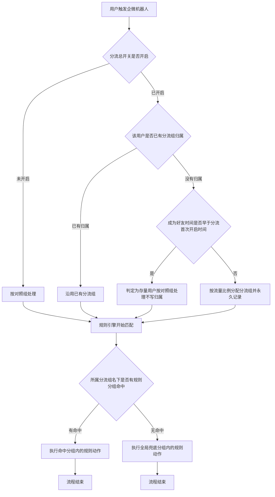
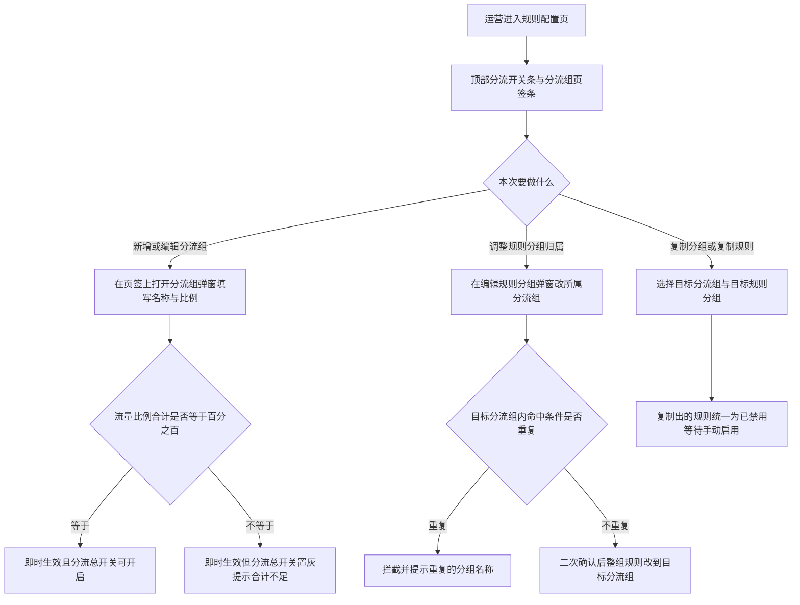
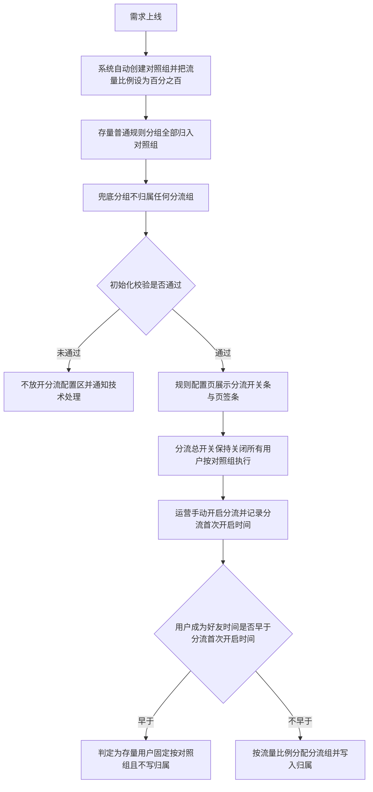

# PRD-企微机器人用户分流配置

## 一、修订记录

| 版本号 | 修改日期 | 修改原因 | 修订人 |
|--------|----------|----------|--------|
| v1.0 | 2026-08-24 | 初稿 | AI PRD Writer |
| v1.1 | 2026-08-24 | 规则分组的所属分流组改为可随时修改，不再要求通过复制换组 | AI PRD Writer |
| v2.0 | 2026-08-25 | 取消独立的分流配置页，分流配置整体收进规则配置页并以分流组页签承载；分流组改为即时生效；补充异常与边界场景、历史数据与上线处理方案 | AI PRD Writer |

## 二、需求概述

- **背景/现状**：当企微机器人的规则引擎为用户匹配规则时，系统只按命中条件筛选，同一批用户只能执行同一套话术与动作，运营无法把用户拆成两拨做对照验证。
- **需求目标**：当运营在规则配置页开启用户分流后，系统应把新增用户按配置比例固定分配到各分流组，并使每个用户只执行所属分流组名下的规则。
- **核心逻辑简述**：当新用户进入企微机器人时，系统应按流量比例为其分配一个分流组并永久记录；当规则引擎为该用户匹配规则时，系统应只在该用户所属分流组名下的规则分组中比对命中条件，全部未命中时执行全局兜底分组。

### SCOPE（本次必做）

1. 在现有规则配置页顶部新增分流总开关条，展示分流生效状态与流量比例合计，不新开一级菜单页。
2. 在规则分组列表上方新增分流组页签条：一份分流配置下可配置 2 至 5 个分流组，每个分流组自定义名称与流量比例（合计 100%），其中一个标记为对照组；页签上直接展示各分流组的流量比例、已分配用户数与实际占比，并提供新增、编辑、删除分流组的就地入口。
3. 分流组的新增、编辑、删除即时生效，不设批量保存环节。
4. 用户分流以企微好友用户为单位：分流总开关开启后，新增用户按流量比例一次性分配分流组并永久固定；分流首次开启前已存在的用户固定归入对照组。
5. 规则分组新增「所属分流组」：用户先确定自己的分流组，再只在该分流组名下的规则分组中比对命中条件；系统兜底分组保持全局唯一、不归属任何分流组。
6. 命中条件查重范围由全局收敛为同一分流组内；跨分流组允许命中条件完全相同。
7. 规则分组的所属分流组可在编辑弹窗中随时调整，调整前校验目标分流组内的命中条件并二次确认。
8. 新增「复制规则」：单条规则可复制到任意规则分组（含其他分流组名下的分组），复制出的规则一律为已禁用。
9. 增强「复制分组」：可选择目标分流组、可勾选带哪几条规则、目标分流组与源分流组不同时命中条件原样带入、带过去的规则一律为已禁用。
10. 提供历史数据初始化方案：上线时自动建立对照组并把存量规则分组归入对照组，存量用户固定按对照组执行。

### NON-GOAL（明确不做）

1. 不新增独立的分流配置一级菜单页，分流配置只作为规则配置页内的一层承载。
2. 不做各分流组的转化率、回复率等业务指标对比分析。
3. 不做多份分流配置并行生效。
4. 不做已分配用户的重新分配与分流重置，不为存量用户回溯分配分流组。
5. 不做单条规则的跨分组移动，单条规则的跨分流组迁移一律通过复制完成。
6. 不做按标签、渠道或年级等条件直接指定分流组。
7. 不做批量勾选复制多条规则。
8. 不改动现有私域分层配置的四层分层能力。
9. 不保留分流组配置的批量保存与草稿态。

### ACCEPT（验收标准）

1. 规则配置页顶部能看到分流总开关与流量比例合计，左侧菜单不出现独立的分流配置入口。
2. 分流组页签上能看到每个分流组的流量比例、已分配用户数与实际占比。
3. 点击某个分流组页签后，列表只展示该分流组名下的规则分组，全局兜底分组固定展示在列表末行。
4. 停留在「全部」页签时，列表展示全部分流组的规则分组，并展示所属分流组信息。
5. 在分流组页签上新增、改名、调整比例、删除分流组后立即生效，页面不出现待保存状态。
6. 流量比例合计不等于 100% 时分流总开关不可开启，悬浮提示说明原因。
7. 分流总开关关闭时，只有对照组名下的规则分组参与匹配，同一用户不会同时收到对照组与实验组的消息。
8. 分流总开关开启后，新增用户按配置比例落入各分流组；同一用户多次触发规则时始终落在同一分流组。
9. 分流首次开启前已存在的用户，全部按对照组名下的规则分组执行。
10. 在同一分流组内新建两个命中条件完全相同的规则分组时被拦截并提示重复的分组名称；在不同分流组内新建命中条件完全相同的规则分组时创建成功。
11. 编辑已有规则分组时可直接把所属分流组改到其他分流组，确认后该分组及名下规则只对目标分流组的用户生效，原分流组的用户不再执行这些规则。
12. 把规则分组的所属分流组改到已存在相同命中条件的分流组时被拦截并提示重复的分组名称。
13. 把一条规则复制到其他分流组名下的分组后，新规则为已禁用状态；手动启用后只对该分流组的用户生效。
14. 复制规则分组时只勾选部分规则，创建出的新分组中只包含被勾选的规则，且全部为已禁用状态。
15. 上线初始化完成后，存量普通规则分组全部归属对照组，对照组流量比例为 100%，兜底分组不归属任何分流组。

## 三、术语表

| 术语 | 定义 |
|------|------|
| 分流配置 | 一份描述用户如何被拆分到各分流组的配置，包含分流总开关与分流组清单，承载在规则配置页顶部 |
| 分流组 | 分流配置下的一个用户集合，由名称与流量比例定义，用户被分配后永久归属其中一个 |
| 对照组 | 分流组中被标记为基准的一组，承载现有话术与动作，分流总开关关闭时只有它生效 |
| 实验组 | 分流组中除对照组以外的组，承载待验证的话术与动作 |
| 分流组页签 | 规则分组列表上方的一排页签，每个页签对应一个分流组，用于切换列表展示范围并就地管理分流组 |
| 流量比例 | 某个分流组预期分到的新增用户占比，所有分流组的流量比例合计为 100% |
| 已分配用户数 | 当前已经被分配到该分流组的用户数量 |
| 实际占比 | 该分流组已分配用户数占全部已分配用户数的比例 |
| 分流首次开启时间 | 分流总开关第一次被开启的时间，用于区分存量用户与新增用户，后续关闭再开启不更新该时间 |
| 存量用户 | 成为企微好友的时间早于分流首次开启时间的用户，固定按对照组执行 |
| 规则分组 | 企微机器人现有概念，带命中条件，用户命中后执行组内规则 |
| 命中条件 | 规则分组上配置的用户筛选条件，沿用现有多条件分组配置 |
| 兜底分组 | 企微机器人现有的系统分组，当全部普通规则分组均未命中时执行 |

## 四、调整范围

| 序号 | 功能模块 | 调整类型 | 说明 |
|---|---|---|---|
| 1 | 规则配置页顶部分流总开关条 | 新增 | 在现有规则配置页顶部新增一行，承载分流总开关、分流生效状态、流量比例合计与口径说明 |
| 2 | 分流组页签条 | 新增 | 规则分组列表上方新增页签条，展示各分流组的比例与分流数据，提供新增、编辑、删除分流组的就地入口 |
| 3 | 分流配置一级菜单页 | 删除 | 取消独立的分流配置页面与菜单入口，能力全部收进规则配置页 |
| 4 | 分流组编辑弹窗 | 新增 | 新建与编辑单个分流组的名称、类型、流量比例、描述，提交后即时生效 |
| 5 | 分流组批量保存 | 删除 | 取消保存配置按钮与待保存态，分流组变更即时生效 |
| 6 | 规则分组列表 | 调整 | 取消所属分流组筛选下拉，改由页签切换；所属分流组列仅在「全部」页签展示 |
| 7 | 新建与编辑规则分组弹窗 | 调整 | 新增所属分流组选择项，新建与编辑均可选择，改归属时校验命中条件并二次确认 |
| 8 | 复制规则分组弹窗 | 调整 | 新增目标分流组选择、规则勾选清单，命中条件按目标分流组决定是否原样带入 |
| 9 | 复制规则弹窗 | 新增 | 规则列表行操作新增复制入口，可选择目标分流组与目标规则分组 |
| 10 | 命中条件查重规则 | 调整 | 查重范围由全局收敛为同一分流组内 |
| 11 | 规则引擎匹配逻辑 | 调整 | 匹配规则分组前先确定用户所属分流组，只比对该分流组名下的规则分组 |
| 12 | 用户分流归属记录 | 新增 | 记录每个用户的分流组归属与分配时间，分配后不再变更 |
| 13 | 分流配置状态记录 | 新增 | 记录分流总开关状态与分流首次开启时间 |
| 14 | 历史数据初始化 | 新增 | 上线时自动创建对照组并把存量普通规则分组归入对照组 |

## 五、业务流程图

**主流程：用户分流与规则匹配**

**子流程：在规则配置页内维护分流组与规则分组归属**

**子流程：上线初始化与存量数据处理**

## 六、可交互原型

在线预览：[点击查看可交互原型](https://minio.yc345.tv/onionext/prototypes/wework-bot-split-plan-a/index-20260825031846054824.html)（内网，需飞连）

GitHub 预览（公网）：[点击查看](https://leo-ai05.github.io/prototypes/%E4%BC%81%E5%BE%AE%E6%9C%BA%E5%99%A8%E4%BA%BA%E7%94%A8%E6%88%B7%E5%88%86%E6%B5%81%E9%85%8D%E7%BD%AE/)

原型模式：html-wireframe（非最终 UI）

关键态截图：`需求汇总/企微机器人用户分流配置/screenshots/方案A/`

> 原型为可交互 HTML 页面，覆盖规则配置页的分流总开关条、分流组页签切换、页签上的分流组新增与编辑、分流总开关二次确认、规则分组列表在不同页签下的字段差异、新建与编辑规则分组弹窗的所属分流组调整、复制分组弹窗、规则分组详情页与复制规则弹窗。

## 七、功能需求详细描述

### 7.1 规则配置页整体结构（调整）

**所在位置**：企业微信机器人 → 规则配置（沿用现有一级菜单页）

**功能说明**：把分流配置作为规则分组之上的一层收进现有规则配置页，页面自上而下呈现「分流总开关条 → 分流组页签条 → 规则分组列表」三层结构，不新增一级菜单页。

层级关系与展示规则：

1. 分流总开关条固定在页面顶部，展示分流是否生效与流量比例合计。
2. 分流组页签条位于规则分组列表上方，每个页签对应一个分流组，另有一个固定的「全部」页签。
3. 规则分组列表位于页签条下方，展示当前页签对应分流组名下的规则分组。
4. 规则分组详情页沿用现有二级页面，从列表行的「查看规则」进入。
5. 左侧菜单不再出现独立的分流配置入口，原分流配置页的全部能力由本页承载。

### 7.2 分流总开关条

**所在位置**：规则配置页 → 页面顶部

| 功能按钮 | 功能说明 | 是否必填 | 功能类型 | 交互说明 | 备注 |
|---|---|---|---|---|---|
| 分流总开关 | 控制分流是否生效 | 是 | 开关 | 开启后新增用户按流量比例分配分流组；关闭后所有用户按对照组处理 | 默认关闭 |
| 分流生效状态 | 展示当前分流状态 | 否 | 标签 | 开关开启时展示「分流生效中」，关闭时展示「分流未生效」 | 随开关状态实时切换 |
| 流量比例合计 | 展示全部分流组的流量比例之和 | 否 | 标签 | 合计等于 100% 时为常规样式，不等于 100% 时为警示样式 | 数值随分流组变更实时刷新 |
| 口径说明 | 说明当前状态下用户如何被处理 | 否 | 文字提示 | 开关开启时展示「新增用户按各分流组比例分配，分配后固定不变」；关闭时展示「所有用户按对照组名下的规则分组执行，兜底分组照常生效」 | 随开关状态实时切换 |

开关切换交互规则：

1. 当运营把分流总开关从关闭切到开启时，先弹二次确认弹窗，标题「开启用户分流」，正文「开启后新增用户将按流量比例分配分流组，分配结果不可修改。开启前已存在的用户固定按对照组执行。」，按钮为「确认开启」与「取消」。
2. 当运营把分流总开关从开启切到关闭时，先弹二次确认弹窗，标题「关闭用户分流」，正文「关闭后所有用户按对照组名下的规则分组执行，实验组的规则不再触发。已分配的分流组归属保留不变。」，按钮为「确认关闭」与「取消」。
3. 当分流组的流量比例合计不等于 100% 时，分流总开关置灰不可开启，鼠标悬浮提示「流量比例合计需等于 100% 才能开启分流」。
4. 当分流组数量少于 2 个时，分流总开关置灰不可开启，鼠标悬浮提示「至少配置 2 个分流组才能开启分流」。
5. 首次开启成功时记录分流首次开启时间；后续关闭再开启不更新该时间。
6. 开关状态变更即时生效，无需其他保存动作。

### 7.3 分流组页签条

**所在位置**：规则配置页 → 规则分组列表上方

**功能说明**：以页签形态承载分流组清单，既用于切换下方列表的展示范围，也提供分流组的就地管理入口。

页签构成与展示内容：

| 字段名称 | 字段说明 | 字段来源 | 备注 |
|---|---|---|---|
| 全部页签 | 固定的第一个页签，展示全部分流组的规则分组 | 系统固定 | 副标题展示普通规则分组总数，如「6 个规则分组」 |
| 分流组名称 | 该分流组的中文名称 | 分流组编辑弹窗填写 | 对照组名称后展示「对照」标签 |
| 流量比例 | 该分流组预期分到的新增用户占比 | 分流组编辑弹窗填写 | 展示在页签副标题第一段 |
| 已分配用户数 | 当前已被分配到该分流组的用户数量 | 用户分流归属记录统计 | 展示在页签副标题第二段；无数据时展示 0 |
| 实际占比 | 已分配用户数占全部已分配用户数的比例 | 用户分流归属记录统计 | 展示在页签副标题第三段；保留一位小数；全部已分配用户数为 0 时展示「—」 |

页签排列与切换规则：

1. 页签自左向右依次为「全部」、对照组、各实验组；实验组之间按流量比例从高到低排列。
2. 点击某个页签后，下方列表只展示该分流组名下的规则分组，全局兜底分组固定展示在列表末行。
3. 切换页签时列表分页重置为第一页，其余筛选条件沿用现有配置。
4. 当前页签用底部色条与文字高亮标识。
5. 页签数量最多为「全部」加 5 个分流组，页签条不折叠、不滚动。

页签上的就地操作：

| 功能按钮 | 功能说明 | 功能类型 | 交互说明 | 备注 |
|---|---|---|---|---|
| 编辑分流组 | 修改该分流组的名称、类型、流量比例、描述 | 悬浮图标按钮 | 鼠标移入分流组页签时在页签右上角浮出，点击后打开分流组编辑弹窗；点击该图标不触发页签切换 | 「全部」页签无此操作 |
| 删除分流组 | 从分流配置中移除该分流组 | 悬浮图标按钮 | 鼠标移入分流组页签时在页签右上角浮出，点击后弹二次确认；不可删除时置灰并悬浮提示原因 | 「全部」页签无此操作，详见 7.5 |
| 新增分流组 | 新建一个分流组 | 文字按钮 | 固定在页签条最右侧，点击后打开空白的分流组编辑弹窗 | 分流组数量已达 5 个时置灰，鼠标悬浮提示「最多配置 5 个分流组」 |

### 7.4 分流组编辑弹窗

**所在位置**：分流组页签上点击「编辑分流组」，或页签条最右侧点击「新增分流组」时打开

**功能说明**：填写单个分流组的名称、类型、流量比例与描述，提交后即时生效。

| 功能按钮 | 功能说明 | 是否必填 | 功能类型 | 交互说明 | 备注 |
|---|---|---|---|---|---|
| 分流组名称 | 该分流组的中文名称 | 是 | 输入框 | 失焦校验，与其他分流组重名时提示「分流组名称不可重复」 | 不超过 20 个字符，展示字数统计 |
| 分流组类型 | 标记为对照组或实验组 | 是 | 单选 | 详见下方对照组唯一性规则 | 默认选中实验组；第一个创建的分流组默认选中对照组 |
| 流量比例 | 该分流组预期分到的新增用户占比 | 是 | 数字输入框 | 输入时实时在弹窗底部展示「当前所有分流组比例合计 X%」 | 取值为 1 到 100 的整数；输入非整数或超出范围时提示「请输入 1 到 100 的整数」 |
| 分流组描述 | 说明该分流组要验证什么 | 否 | 多行输入框 | 无 | 不超过 100 个字符，展示字数统计 |

对照组唯一性规则：

1. 同一份分流配置中有且仅有一个对照组。
2. 当运营把某个实验组的类型改为对照组时，若原对照组的已分配用户数为 0，则提交后原对照组自动改为实验组，提交前在弹窗内提示「确定后「原对照组名称」将自动改为实验组」。
3. 当运营把某个实验组的类型改为对照组时，若原对照组的已分配用户数大于 0，则拦截提交，提示「原对照组已有 X 个用户分配，类型不可修改，无法把本组设为对照组」。
4. 编辑某个分流组时，若该分流组自身的已分配用户数大于 0，分流组类型置灰不可修改，鼠标悬浮提示「该分流组已有用户分配，类型不可修改」。

弹窗操作规则：

1. 「确定」按钮的启用条件为分流组名称已填写且流量比例已填写；任一未满足时置灰，鼠标悬浮提示「请先填写分流组名称与流量比例」。
2. 点击「确定」后校验通过即提交并即时生效，弹窗关闭，页面顶部提示「分流组已创建」或「保存成功」，页签条与流量比例合计同步刷新。
3. 提交后流量比例合计不等于 100% 时，追加提示「流量比例合计为 X%，需调整到 100% 才能开启分流」，分流总开关随即置灰。
4. 新增成功后自动切换到该分流组的页签。
5. 编辑已有分流组时，分流组名称、流量比例、描述均可修改。
6. 弹窗内已有未保存修改时，点击「取消」或关闭图标需二次确认「当前修改尚未保存，确认放弃？」，确认后丢弃修改并关闭。
7. 提交失败时保留弹窗与已填内容，提示「保存失败，请重试」。

流量比例调整的生效口径：

1. 修改流量比例并提交后，只影响此后新增用户的分配结果。
2. 已分配用户的分流组归属保持不变，弹窗内流量比例下方常驻说明「修改比例只影响后续新增用户，已分配用户归属不变」。

### 7.5 删除分流组

**所在位置**：规则配置页 → 分流组页签上的删除图标

| 功能按钮 | 功能说明 | 功能类型 | 交互说明 | 备注 |
|---|---|---|---|---|
| 删除分流组 | 从分流配置中移除该分流组 | 悬浮图标按钮 | 点击后弹二次确认弹窗，标题「删除分流组」，正文「删除后该分流组不再参与分流，确认删除？」 | 确认后即时生效 |

删除的置灰条件与提示文案：

1. 该分流组为对照组时置灰，鼠标悬浮提示「对照组不可删除」。
2. 该分流组的已分配用户数大于 0 时置灰，鼠标悬浮提示「该分流组已有 X 个用户分配，不可删除」。
3. 该分流组名下的规则分组数大于 0 时置灰，鼠标悬浮提示「请先把该分流组下的 X 个规则分组改到其他分流组」。

删除后的连带处理：

1. 删除成功后页面顶部提示「分流组已删除」，页签条与流量比例合计同步刷新。
2. 当前停留的页签正是被删除的分流组时，自动切回「全部」页签。
3. 删除后剩余分流组少于 2 个且分流总开关处于开启状态时，系统自动关闭分流总开关，顶部提示「分流组不足 2 个，分流已自动关闭」。
4. 删除后流量比例合计不等于 100% 时，追加提示「流量比例合计为 X%，需调整到 100% 才能开启分流」。

### 7.6 规则分组列表（调整）

**所在位置**：规则配置页 → 分流组页签条下方（沿用现有列表）

本次在现有规则分组列表上做两项调整，其余排序、启停、编辑、查看规则等能力沿用现有配置。

调整一：取消所属分流组筛选下拉，展示范围改由页签控制。

调整二：所属分流组信息随页签动态展示。

| 字段名称 | 字段说明 | 字段来源 | 备注 |
|---|---|---|---|
| 所属分流组 | 该规则分组归属哪个分流组 | 新建或编辑规则分组时选择 | 仅在「全部」页签展示该列；对照组名称后展示「对照组」标签；系统兜底分组该列展示「全局兜底」 |

列表展示规则：

1. 停留在「全部」页签时，列表展示全部分流组的规则分组，并展示「所属分流组」列。
2. 停留在某个分流组页签时，列表只展示该分流组名下的规则分组，隐藏「所属分流组」列，并在列表上方展示当前范围说明「当前展示「分流组名称」名下的规则分组，兜底分组固定在末行」。
3. 全局兜底分组在任意页签下都展示，固定在列表末行，行内以醒目样式标识。
4. 行操作沿用现有的「查看规则」「编辑」，并新增「复制」；系统兜底分组不提供「复制」，沿用现有配置。

### 7.7 新建与编辑规则分组弹窗（调整）

**所在位置**：规则配置页点击「新建分组」或某行「编辑」时打开

在现有分组名称、分组描述、命中条件之上新增一项：

| 功能按钮 | 功能说明 | 是否必填 | 功能类型 | 交互说明 | 备注 |
|---|---|---|---|---|---|
| 所属分流组 | 指定该规则分组归属哪个分流组 | 是 | 下拉单选 | 新建与编辑时都可选择任一分流组，切换选项后命中条件的查重范围随之切换 | 默认值：从某个分流组页签点击「新建分组」时预置为该分流组，从「全部」页签点击时预置为对照组；编辑时预置为该分组当前的分流组 |

命中条件查重规则调整：

1. 提交时只在「所属分流组」相同的规则分组之间比对命中条件。
2. 同一分流组内已存在命中条件完全相同的分组时拦截，提示「命中条件与本分流组的分组「X」重复，请修改」。
3. 其他分流组存在命中条件完全相同的分组时不拦截，正常创建。
4. 命中条件的条件项配置、组内逻辑、组间逻辑、条数上限均沿用现有配置。

编辑时调整所属分流组的规则：

1. 编辑已有规则分组时，所属分流组可随时改到任意分流组，不需要通过复制换组。
2. 切换所属分流组后，弹窗内的命中条件保持不变，查重范围改为按目标分流组比对，选项下方提示「将从「原分流组」改到「目标分流组」，该分组及名下 N 条规则改为只对新分流组的用户生效」。
3. 目标分流组内已存在命中条件完全相同的分组时拦截提交，提示「命中条件与目标分流组的分组「X」重复，请修改后再调整归属」，弹窗保留以便直接修改条件。
4. 校验通过后弹二次确认弹窗，标题「调整所属分流组」，正文「该分组及其名下 N 条规则将改为只对「目标分流组」的用户生效，原分流组的用户不再执行这些规则。确认调整？」，按钮为「确认调整」与「取消」。
5. 确认后立即生效，分组下的全部规则随分组一起转到目标分流组，规则的启用状态、命中条件、动作配置均保持不变。
6. 调整归属不改变任何用户的分流组归属，只改变该分组对哪一批用户生效。
7. 提交成功后顶部提示「已调整所属分流组」，列表对应行同步更新；当前停留在原分流组页签时，该行从列表中移除。
8. 系统兜底分组不提供所属分流组选择项，编辑时该项展示为「全局兜底（不归属分流组）」且不可操作。

### 7.8 复制规则分组弹窗（增强）

**所在位置**：规则配置页 → 规则分组列表行操作「复制」

**功能说明**：把一个已有规则分组连同选定的规则复制到目标分流组，用于快速搭建对照实验。

弹窗顶部展示来源信息：「复制自分组「X」，所属分流组「Y」，共 N 条规则」。

| 功能按钮 | 功能说明 | 是否必填 | 功能类型 | 交互说明 | 备注 |
|---|---|---|---|---|---|
| 目标分流组 | 新分组归属哪个分流组 | 是 | 下拉单选 | 切换选项时联动刷新命中条件区域的默认值与提示文案 | 默认选中源分组的所属分流组 |
| 分组名称 | 新分组的名称 | 是 | 输入框 | 无 | 默认填入「源分组名称-副本」；不超过 30 个字符 |
| 分组描述 | 新分组的描述 | 否 | 多行输入框 | 无 | 默认带入源分组描述；不超过 200 个字符 |
| 命中条件 | 新分组的用户筛选条件 | 是 | 条件配置区域 | 目标分流组与源分流组不同时，默认原样带入源分组的命中条件，可直接使用也可修改；目标分流组与源分流组相同时，默认清空并展示提示「同一分流组内命中条件不可重复，请重新配置」 | 条件项配置沿用现有配置 |
| 包含规则 | 勾选要一起带过去的规则 | 否 | 多选清单 | 清单逐条展示源分组内的规则名称、触发类型、动作类型、当前启用状态，顶部提供「全选」；默认全部勾选 | 可全部取消勾选，此时只创建一个空分组；清单上方常驻说明「带过去的规则统一为已禁用，需逐条确认后手动启用」 |

提交行为：

1. 「确认」按钮的启用条件为分组名称已填写且命中条件校验通过；任一未满足时置灰，鼠标悬浮提示「请先填写分组名称并完成命中条件配置」。
2. 提交校验顺序为：先校验分组名称与命中条件的完整性，再校验目标分流组内的命中条件是否重复。
3. 目标分流组内已存在命中条件完全相同的分组时拦截，提示「命中条件与目标分流组的分组「X」重复，请修改」。
4. 提交成功后关闭弹窗，顶部提示「复制成功，已带入 N 条规则，均为禁用状态」，并自动切换到目标分流组的页签。
5. 提交失败时保留弹窗与已填内容，提示「复制失败，请重试」。

异常与兜底：

1. 源分组内没有任何规则时，包含规则清单展示空态文案「该分组下暂无规则」，其余项照常填写。
2. 分流组清单读取失败时，目标分流组下拉展示「加载失败」，「确认」按钮置灰，鼠标悬浮提示「分流组加载失败，请关闭弹窗后重试」。

### 7.9 复制规则弹窗（新增）

**所在位置**：规则配置页 → 规则分组详情页 → 规则列表行操作「复制」

**功能说明**：把单条规则复制到任意规则分组，用于把已验证的规则快速搬到其他分流组。

弹窗顶部展示来源信息：「复制自规则「X」，来源分组「Y」」。

| 功能按钮 | 功能说明 | 是否必填 | 功能类型 | 交互说明 | 备注 |
|---|---|---|---|---|---|
| 目标分流组 | 新规则所在分组归属哪个分流组 | 是 | 下拉单选 | 切换后联动刷新目标规则分组的可选项 | 默认选中当前分组的所属分流组 |
| 目标规则分组 | 新规则要放进哪个规则分组 | 是 | 下拉单选 | 可选项为目标分流组名下的全部规则分组，另含全局兜底分组 | 默认选中当前所在分组；下拉项展示分组名称与该组现有规则数 |
| 规则名称 | 新规则的名称 | 是 | 输入框 | 无 | 默认填入「源规则名称-副本」；长度限制沿用现有配置 |
| 启用状态说明 | 说明复制出的规则状态 | 否 | 文字提示 | 常驻展示「复制出的规则为已禁用状态，确认无误后请手动启用」 | 不可修改 |

复制内容范围：

1. 复制的内容包含规则描述、触发类型、触发条件、时间配置、全部动作及动作配置、官方群发标记，均沿用源规则的配置。
2. 复制出的规则启用状态固定为已禁用，不跟随源规则。
3. 复制出的规则创建时间为本次复制时间，最后更新人为当前操作人。

提交行为：

1. 「确认」按钮的启用条件为目标规则分组已选择且规则名称已填写；任一未满足时置灰，鼠标悬浮提示「请先选择目标规则分组并填写规则名称」。
2. 提交成功后关闭弹窗，顶部提示「复制成功，新规则为禁用状态」。目标规则分组与当前分组相同时刷新当前规则列表；不同时提示中附带「查看目标分组」文字链，点击后跳转到目标分组详情页。
3. 提交失败时保留弹窗与已填内容，提示「复制失败，请重试」。

异常与兜底：

1. 目标分流组名下没有任何规则分组时，目标规则分组下拉只展示全局兜底分组，并在下方提示「该分流组下暂无规则分组，可先复制一个分组」。
2. 源规则的动作中引用的素材、课包或话术模版已失效时，复制照常执行，提交成功后追加提示「部分动作引用的内容已失效，请进入新规则确认」。

### 7.10 规则引擎匹配逻辑（调整）

**所在位置**：企微机器人后台执行逻辑，无页面

匹配顺序规则：

1. 当规则引擎为某个用户匹配规则时，先确定该用户的分流组归属：分流总开关关闭时按对照组处理；分流总开关开启且用户已有归属时取已有归属；分流总开关开启且用户没有归属时，先判断该用户成为企微好友的时间是否早于分流首次开启时间，早于则按对照组处理且不写入归属，不早于则按流量比例分配并永久记录。
2. 确定分流组后，只在该分流组名下的规则分组中比对命中条件，其他分流组名下的规则分组一律不参与本次比对。
3. 该分流组名下的规则分组全部未命中时，执行全局兜底分组内的规则，沿用现有兜底逻辑。
4. 已禁用的规则分组与已禁用的规则不参与比对与执行，沿用现有配置。
5. 每次触发都按当次读取到的分流配置与规则配置执行，运营在执行过程中的配置变更不回溯影响已经开始执行的动作。

分流组分配规则：

1. 按各分流组的流量比例分配，分配结果在全部新增用户上整体逼近配置比例，不保证任意连续若干个用户严格按比例落位。
2. 分配以企微好友用户为单位；同一自然人在不同企微员工号下的多个好友关系各自独立分配，互不影响。
3. 用户的分流组归属一经写入不再变更，运营调整流量比例、改名分流组、开关分流均不改变已有归属。

用户分流归属记录：

| 字段名称 | 字段说明 | 字段来源 | 备注 |
|---|---|---|---|
| 所属分流组 | 该用户被分配到的分流组 | 首次分配时写入 | 写入后不再变更 |
| 分配时间 | 该用户被分配分流组的时间 | 首次分配时写入 | 精确到秒 |

分流配置状态记录：

| 字段名称 | 字段说明 | 字段来源 | 备注 |
|---|---|---|---|
| 分流总开关状态 | 分流是否生效 | 运营操作分流总开关 | 取值为分流生效中、分流未生效 |
| 分流首次开启时间 | 分流总开关第一次被开启的时间 | 首次开启时写入 | 写入后不再变更，用于区分存量用户与新增用户 |

### 7.11 异常与边界场景

**所在位置**：贯穿规则配置页、各弹窗与后台执行逻辑

**功能说明**：集中约定本次需求涉及的异常、边界与并发场景的系统表现，未在此列出的场景沿用现有配置。

#### 7.11.1 数据加载与空态

| 序号 | 场景 | 系统表现 |
|---|---|---|
| 1 | 分流组清单读取失败 | 页签条只保留「全部」页签，页签条位置展示「分流组加载失败」与「重新加载」按钮；分流总开关置灰，悬浮提示「分流组加载失败，请刷新页面」；规则分组列表照常展示与操作 |
| 2 | 已分配用户数与实际占比读取失败 | 页签副标题的人数与实际占比展示「—」，流量比例照常展示；页面顶部提示「分流数据加载失败，配置项仍可正常编辑」 |
| 3 | 规则分组列表读取失败 | 列表区展示「规则分组加载失败」与「重新加载」按钮；顶部开关条与页签条照常可用 |
| 4 | 尚未配置任何分流组 | 页签条只展示「全部」页签与「+ 新增分流组」，页面顶部提示「暂无分流组，请先新增对照组与实验组」；分流总开关置灰 |
| 5 | 某个分流组名下没有规则分组 | 该页签下列表只展示全局兜底分组，列表上方提示「该分流组下暂无规则分组，可从其他分流组复制一份，或把已有分组的所属分流组改到该分流组」 |
| 6 | 规则分组详情页中该分组没有规则 | 规则列表展示空态文案「该分组下暂无规则」，沿用现有配置 |

#### 7.11.2 比例与数量边界

| 序号 | 场景 | 系统表现 |
|---|---|---|
| 1 | 流量比例合计小于 100% 且分流未开启 | 流量比例合计以警示样式展示当前数值；分流总开关置灰，悬浮提示「流量比例合计需等于 100% 才能开启分流」 |
| 2 | 流量比例合计大于 100% | 与合计小于 100% 的表现一致，均以警示样式展示并阻止开启分流 |
| 3 | 分流已开启后因删除分流组导致合计不足 100% | 分流总开关保持开启，页面顶部常驻警示条「流量比例合计为 X%，未覆盖的流量按对照组分配，请尽快调整比例」；后台按对照组承接未覆盖的流量 |
| 4 | 分流组数量少于 2 个且分流未开启 | 分流总开关置灰，悬浮提示「至少配置 2 个分流组才能开启分流」 |
| 5 | 分流已开启后被删到少于 2 个分流组 | 系统自动关闭分流总开关，顶部提示「分流组不足 2 个，分流已自动关闭」 |
| 6 | 单个分流组的流量比例填 0、负数、小数或大于 100 | 拦截提交，提示「请输入 1 到 100 的整数」 |
| 7 | 分流组数量已达 5 个 | 「新增分流组」置灰，悬浮提示「最多配置 5 个分流组」 |
| 8 | 分流组名称与已有分流组重复 | 拦截提交，提示「分流组名称不可重复」 |
| 9 | 分流组名称超过 20 个字符 | 输入框停止继续输入，字数统计以警示样式展示 |

#### 7.11.3 对照组与分流组归属边界

| 序号 | 场景 | 系统表现 |
|---|---|---|
| 1 | 把实验组改为对照组且原对照组无已分配用户 | 提交后原对照组自动改为实验组，提交前弹窗内提示「确定后「原对照组名称」将自动改为实验组」 |
| 2 | 把实验组改为对照组且原对照组已有已分配用户 | 拦截提交，提示「原对照组已有 X 个用户分配，类型不可修改，无法把本组设为对照组」 |
| 3 | 编辑自身已有已分配用户的分流组 | 分流组类型置灰，悬浮提示「该分流组已有用户分配，类型不可修改」；名称、比例、描述照常可改 |
| 4 | 删除对照组 | 删除置灰，悬浮提示「对照组不可删除」 |
| 5 | 删除已有已分配用户的分流组 | 删除置灰，悬浮提示「该分流组已有 X 个用户分配，不可删除」 |
| 6 | 删除名下仍有规则分组的分流组 | 删除置灰，悬浮提示「请先把该分流组下的 X 个规则分组改到其他分流组」 |
| 7 | 调整规则分组归属后原分流组变空 | 允许调整，原分流组页签下按空态提示处理 |
| 8 | 调整规则分组归属时目标分流组内命中条件重复 | 拦截提交，提示「命中条件与目标分流组的分组「X」重复，请修改后再调整归属」，弹窗保留 |
| 9 | 试图调整系统兜底分组的所属分流组 | 该项展示为「全局兜底（不归属分流组）」且不可操作 |

#### 7.11.4 用户分配与执行边界

| 序号 | 场景 | 系统表现 |
|---|---|---|
| 1 | 同一用户在极短时间内并发触发多次 | 分流组分配只写入一次，后续触发沿用首次写入的归属，不产生重复归属 |
| 2 | 分流组归属写入失败 | 本次触发按对照组处理，不写入残缺归属；下次触发时重新尝试分配 |
| 3 | 用户已有归属但该分流组已不存在 | 本次触发按对照组处理，并记录异常供技术排查；不修改用户已有的归属记录 |
| 4 | 分流关闭期间新增的用户 | 不写入分流组归属，按对照组执行；分流重新开启后其首次触发时按当时的流量比例分配归属 |
| 5 | 分流关闭再重新开启 | 已有归属的用户沿用原归属，不重新分配；分流首次开启时间保持首次值不变 |
| 6 | 好友关系删除后重新添加 | 该好友用户的归属记录保留并沿用，不重新分配 |
| 7 | 同一自然人在多个企微员工号下 | 每个好友关系各自独立分配分流组，互不影响 |
| 8 | 用户所属分流组名下的规则分组全部未命中 | 执行全局兜底分组内的规则 |
| 9 | 用户所属分流组名下没有任何启用的规则分组 | 直接执行全局兜底分组内的规则 |
| 10 | 全局兜底分组本身已被禁用 | 本次不执行任何动作，沿用现有配置 |
| 11 | 运营在用户触发过程中调整了规则分组归属 | 已经开始执行的动作不回滚，后续触发按调整后的配置执行 |

#### 7.11.5 并发与重复提交

| 序号 | 场景 | 系统表现 |
|---|---|---|
| 1 | 两名运营同时修改同一份分流配置 | 后提交的一方被拦截，提示「分流配置已被他人更新，请刷新页面后重试」，已填内容保留 |
| 2 | 一名运营正在往某分流组新建规则分组，另一名运营已删除该分流组 | 提交时拦截，提示「所选分流组已不存在，请刷新页面后重新选择」 |
| 3 | 重复点击弹窗的「确定」或「确认」 | 提交过程中按钮变为加载态并禁用，避免重复提交 |
| 4 | 重复点击分流总开关 | 二次确认执行过程中开关禁用，直至本次操作返回结果 |
| 5 | 提交请求超时或网络中断 | 提示「操作失败，请重试」，弹窗与已填内容保留，页面数据保持提交前状态 |

#### 7.11.6 权限边界

| 序号 | 场景 | 系统表现 |
|---|---|---|
| 1 | 无规则配置编辑权限的运营进入本页 | 分流总开关置灰不可操作，悬浮提示「无编辑权限」；页签上的编辑与删除图标、「新增分流组」、「新建分组」、「编辑」、「复制」全部隐藏；页签切换与列表查看照常 |
| 2 | 运营在页面停留期间权限被回收 | 下一次提交时拦截，提示「无编辑权限，请刷新页面」 |

### 7.12 历史数据与上线处理方案

**所在位置**：上线阶段的一次性处理与上线后的口径约定，无页面

**功能说明**：约定存量规则分组、存量用户与历史配置在本次需求上线时如何处理，保证上线后现网行为与上线前一致。

#### 7.12.1 存量规则分组初始化

1. 上线时系统自动创建一个分流组，名称为「对照组」，类型为对照组，流量比例为 100%。
2. 现网全部存量普通规则分组的所属分流组统一初始化为该对照组，分组名称、命中条件、启用状态、名下规则及规则的启用状态全部保持不变。
3. 系统兜底分组不归属任何分流组，保持全局唯一。
4. 初始化不新增、不删除、不合并任何规则分组与规则。

#### 7.12.2 存量用户处理

1. 存量用户不写入分流组归属记录。
2. 分流首次开启后，规则引擎为某个用户匹配时，若该用户没有分流组归属且成为企微好友的时间早于分流首次开启时间，则判定为存量用户，固定按对照组执行且不写入归属。
3. 不为存量用户回溯分配分流组，不提供把存量用户批量导入某个实验组的能力。
4. 存量用户的历史触发记录、历史动作执行记录不做任何改写。

#### 7.12.3 历史命中条件数据

1. 上线前命中条件在全网范围内不重复，上线后存量规则分组全部归属对照组，同一分流组内的查重结果与上线前一致，不会新增冲突。
2. 上线不做命中条件的数据清洗与合并。
3. 上线后运营把某个存量分组改到其他分流组时，才按新的同分流组查重口径校验。

#### 7.12.4 上线顺序与校验

1. 上线顺序为：先完成存量规则分组的对照组初始化，再放开规则配置页的分流开关条与页签条，最后由运营手动开启分流总开关。
2. 初始化完成后校验三项：全部存量普通规则分组的所属分流组均为对照组且无空值；对照组的流量比例为 100%；系统兜底分组不归属任何分流组。
3. 任一校验不通过时不放开分流开关条与页签条，页面维持上线前形态，并通知技术处理。
4. 分流总开关初始状态为关闭，上线当天不自动开启。

#### 7.12.5 回退方案

1. 需要回退时，先由运营关闭分流总开关，所有用户随即回到按对照组执行的口径，实验组名下的规则分组不再参与匹配。
2. 关闭分流总开关后再隐藏页面上的分流开关条与页签条，规则配置页恢复为上线前的单层列表形态。
3. 回退不删除用户的分流组归属记录，不删除已创建的分流组，不改动规则分组的所属分流组信息。
4. 回退期间新增用户不写入分流组归属，按对照组执行。
5. 重新放开时沿用回退前的分流组与归属数据，已有归属的用户不重新分配。

### 7.13 横切规则

**状态判定**：

1. 分流总开关存在两个状态：分流未生效、分流生效中。当流量比例合计等于 100% 且分流组数量不少于 2 个时，开关可被开启，状态从分流未生效流转到分流生效中；运营手动关闭或分流组被删到少于 2 个时反向流转。
2. 分流组存在两种类型状态：对照组、实验组。同一份分流配置中有且仅有一个对照组。
3. 规则分组的启用状态沿用现有的已启用与已禁用两种状态。复制产生的规则分组沿用源分组的启用状态，复制产生的规则固定为已禁用。
4. 每一个不可用状态都有对应的悬浮提示说明原因，不出现无提示的置灰。

**跳转闭环**：

1. 在分流组页签之间切换时，列表分页重置为第一页，页面不发生跳转。
2. 新增分流组成功后自动切换到该分流组的页签；复制规则分组成功后自动切换到目标分流组的页签。
3. 从规则分组列表点击「查看规则」进入规则分组详情页，返回时回到规则配置页并保留原页签与分页。
4. 从复制规则弹窗提交成功且目标分组与当前分组不同时，通过提示中的文字链跳转到目标分组详情页；返回时回到原分组详情页并保留原有筛选与分页。

**权限分支**：

1. 具备规则配置编辑权限的运营，可开关分流、新增与编辑与删除分流组、新建与复制规则分组、调整规则分组的所属分流组、复制规则。
2. 不具备该权限的运营，规则配置页为只读：新增、编辑、删除、复制、启停等操作全部隐藏，分流总开关置灰不可操作。
3. 任何角色都不能修改已分配用户的分流组归属。

## 八、埋点与数据需求

**核心数据指标**：

| 指标名称 | 业务定义 |
|---|---|
| 分流组已分配用户数 | 某个分流组当前累计被分配到的用户数量 |
| 分流组实际占比 | 某个分流组已分配用户数占全部已分配用户数的比例 |
| 按对照组承接的未覆盖流量用户数 | 流量比例合计不足 100% 期间，因未覆盖而按对照组承接的用户数量 |

前两项指标在分流组页签的副标题中展示，第三项在流量比例合计不足 100% 的警示条中展示，均不做额外报表。

**测试数据说明**：需在测试环境准备两批数据——一批在分流首次开启前已存在的企微好友用户，用于验证存量用户固定走对照组；另一批至少 20 个开关开启后新增的企微好友用户，用于验证比例分配与归属固定。冒烟数据待产品提供。

## 九、权限说明

- **具备规则配置编辑权限的运营**：可以查看与编辑分流配置、开关分流、新增与编辑与删除分流组、新建与复制规则分组、调整规则分组的所属分流组、复制规则；不能修改已分配用户的分流组归属。
- **不具备规则配置编辑权限的运营**：可以查看规则配置页的全部内容，包括分流开关状态、分流组页签与各分流组的分流数据；不能执行任何编辑、复制、启停与开关操作。
