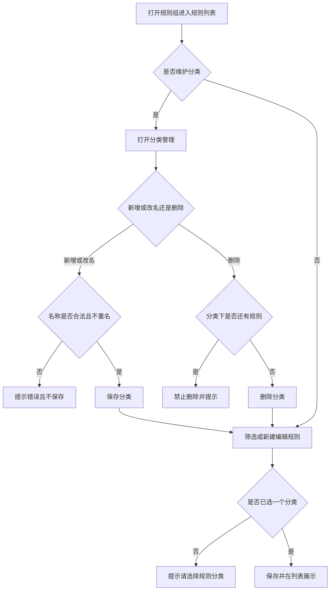

# 企微机器人规则分类管理

## 一、修订记录

| 版本号 | 修改日期 | 修改原因 | 修订人 |
|---|---|---|---|
| v1.0 | 2026-09-22 | 初稿 | AI PRD Writer |
| v1.1 | 2026-09-22 | 分类改为组内左侧边栏切换 | AI PRD Writer |

## 二、需求概述

- **背景/现状**：当运营在规则配置中维护大量规则时，组内规则列表无法按业务用途归类查看，查找和改规则成本高。
- **需求目标**：当运营进入某个规则组的规则列表时，系统应通过左侧分类侧边栏一键切换查看规则，且每条规则有且仅有一个分类。
- **核心逻辑简述**：当运营打开组内规则列表时，系统应在左侧展示「全部」与各分类，点击即可切换右侧列表；当运营新建或编辑规则时，系统应要求选择一个分类后才能保存。

## 三、术语表

| 术语 | 定义 |
|---|---|
| 规则组 | 现有规则配置中的分组，按命中条件组织多条规则。本次不改组结构。 |
| 规则分类 | 给单条规则打的业务归类标签，只用于维护和筛选，不改变规则是否触发。 |
| 未分类 | 系统内置分类，承接尚未改过分类的存量规则，不可改名、不可删除。 |

## 四、调整范围

| 功能模块 | 调整内容 |
|---|---|
| 组内规则列表 | 左侧增加分类侧边栏（全部 + 各分类，显示规则数）；右侧列表增加分类列；可编辑时侧边栏提供分类管理入口。 |
| 分类管理 | 新增、改名、删除分类；名称全局唯一，最长 20 个字。 |
| 新建/编辑规则 | 增加必选分类。 |
| 复制规则/复制分组 | 副本保留原分类。 |
| 存量规则 | 上线后尚未指定分类的规则归入未分类。 |

## 五、业务流程图

**主流程：组内规则分类维护**

## 六、可交互原型

可交互原型（公网，点击可直接操作）：https://leo-ai05.github.io/prototypes/%E4%BC%81%E5%BE%AE%E6%9C%BA%E5%99%A8%E4%BA%BA%E8%A7%84%E5%88%99%E5%88%86%E7%B1%BB%E7%AE%A1%E7%90%86/

内网预览（需飞连 · GitLab SDD实践）：https://pages.yc345.tv/prototypes-720e80/SDD%E5%AE%9E%E8%B7%B5/%E4%BC%81%E5%BE%AE%E6%9C%BA%E5%99%A8%E4%BA%BA%E8%A7%84%E5%88%99%E5%88%86%E7%B1%BB%E7%AE%A1%E7%90%86/prototype.html

GitHub 预览（公网）：[点击查看](https://leo-ai05.github.io/prototypes/%E4%BC%81%E5%BE%AE%E6%9C%BA%E5%99%A8%E4%BA%BA%E8%A7%84%E5%88%99%E5%88%86%E7%B1%BB%E7%AE%A1%E7%90%86/)

原型模式：html-wireframe（单文件可交互原型，无需登录、无需本地启动）

涉及页面：规则配置-分组列表（本次不改）、规则配置-组内规则列表、分类管理弹窗、新建/编辑规则弹窗

可操作路径：

1. 点击分组进入规则列表，查看左侧分类侧边栏与右侧规则表。
2. 点击侧边栏「课包转化」，确认右侧只显示该分类规则。
3. 点击侧边栏「管理」，新增、改名；对仍有规则的分类尝试删除，查看阻断提示。
4. 点击新建规则，不选分类点保存，查看必填提示；选择分类后保存。
5. 点击复制，确认副本分类与原规则相同。
6. 点击切换只读权限，确认仍可点侧边栏切换，但管理/新建/行内写操作不再展示。

关键态截图：`需求汇总/企微机器人规则分类管理/proto-shots/`，共 6 张

## 七、功能需求详细描述

### 7.1 组内规则列表分类展示与筛选

| 功能名称 | 功能说明 | 功能类型 | 是否必填 | 交互说明 | 备注 |
|---|---|---|---|---|---|
| 分类侧边栏 | 左侧固定展示「全部」与各分类，点击切换右侧列表。 | 导航 | 是 | 每项显示当前组内该分类的规则数；默认选中「全部」。 | 只读权限同样可切换。 |
| 分类列 | 展示该规则当前所属分类。 | 列表字段 | 是 | 显示在规则名称旁；未改过分类的存量规则显示未分类。 | 只读权限同样可见。 |
| 分类管理入口 | 打开分类管理弹窗。 | 按钮 | 否 | 仅可编辑权限展示，放在侧边栏标题旁「管理」。 | 只读不展示。 |

异常与兜底：

1. 当前侧边栏选中分类下没有规则时，展示空列表提示「当前分类下没有规则」。
2. 分组列表页不增加分类列、不增加分类侧边栏。
3. 新建规则时，若侧边栏已选中某个具体分类，分类下拉默认带上该分类，仍可改选。

### 7.2 分类管理

| 功能名称 | 功能说明 | 功能类型 | 是否必填 | 交互说明 | 备注 |
|---|---|---|---|---|---|
| 分类名称 | 分类的显示名称。 | 文本 | 是 | 新增和改名时即时校验。 | 最长 20 个字，全局不可重名。 |
| 新增分类 | 增加一条自定义分类。 | 按钮 | 否 | 输入名称后新增，成功后出现在筛选和规则分类选项中。 |  |
| 改名 | 修改自定义分类名称。 | 操作 | 否 | 保存后，已使用该分类的规则展示新名称。 | 未分类不可改名。 |
| 删除 | 删除没有规则占用的自定义分类。 | 操作 | 否 | 分类下仍有任意组规则时禁止删除。 | 未分类不可删除。 |

校验与报错：

| 校验项 | 规则 | 是否必填 | 报错反馈文案 |
|---|---|---|---|
| 名称为空 | 不能为空 | 必填 | 请输入分类名称 |
| 超长 | 最多 20 个字 | 必填 | 分类名称最多 20 个字 |
| 重名 | 不得与已有分类同名 | 必填 | 该分类名称已存在 |
| 删除占用中分类 | 分类下还有规则时不可删 | 不适用 | 该分类下仍有规则，请先将规则改到其他分类后再删除 |
| 系统分类 | 未分类不可改名、不可删除 | 不适用 | 系统分类不可修改 |

### 7.3 规则选择分类

| 功能名称 | 功能说明 | 功能类型 | 是否必填 | 交互说明 | 备注 |
|---|---|---|---|---|---|
| 规则分类 | 规则所属的唯一分类。 | 下拉单选 | 是 | 新建、编辑保存前必须选中一个分类，选项含未分类。 | 不可多选。 |
| 复制规则 | 复制后的规则沿用原分类。 | 操作 | 否 | 组内复制立即带上原分类。 |  |
| 复制分组 | 新分组内规则沿用原分类。 | 操作 | 否 | 不要求运营重新选择分类。 |  |

异常与兜底：

1. 未选择分类点击保存时，阻断保存并提示「请选择规则分类」。
2. 分类不影响规则启用、触发和执行结果；不提供按分类批量启用或停用。

### 7.4 权限与存量

| 功能名称 | 功能说明 | 功能类型 | 是否必填 | 交互说明 | 备注 |
|---|---|---|---|---|---|
| 编辑权限 | 沿用现有规则配置编辑权限。 | 权限 | 是 | 无编辑权限时仍可切换侧边栏并看分类列，不可管理分类、不可改规则分类。 | 不新增权限点。 |
| 存量归类 | 上线前已有规则进入未分类。 | 默认处理 | 是 | 运营可随后改到其他分类。 | 不追溯改执行结果。 |

### 7.5 测试数据说明

冒烟数据待产品提供，至少包含：一个含多条规则的规则组、一条未分类存量规则、一条已分类规则、一个无规则占用的空分类。

## 八、埋点与数据需求

本次不新增埋点。

## 九、权限说明

沿用现有规则配置查看/编辑权限，不新增角色。
