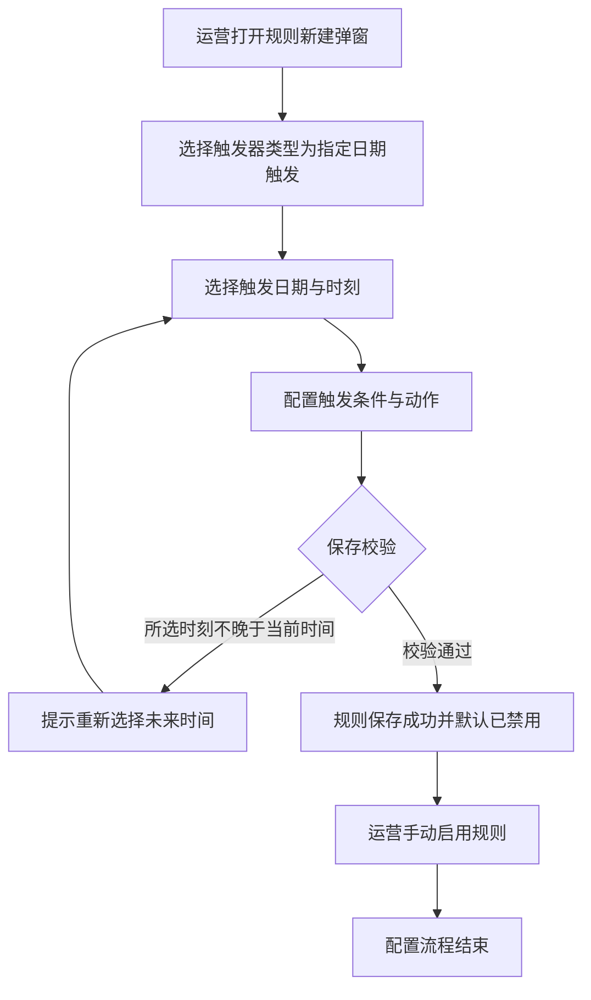
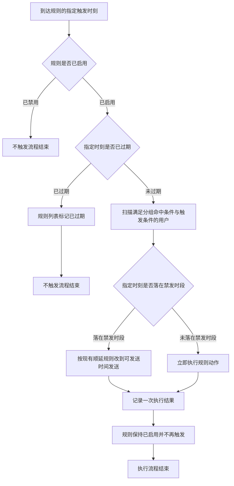

# PRD-企微机器人规则引擎指定日期触发

## 一、修订记录

| 版本号 | 修改日期 | 修改原因 | 修订人 |
|--------|----------|----------|--------|
| v1.0 | 2026-09-01 | 初稿 | AI PRD Writer |

## 二、需求概述

- **背景/现状**：当规则引擎的触发时间只能配置为每日、次日、每周、每月、间隔、当日六种周期或相对时间时，运营无法把消息投放到某个具体日历日期，遇到节日、考试、大促等一次性节点只能临时改配置再改回来。
- **需求目标**：当运营需要在未来某一个确定时刻投放一次消息时，系统应提供「指定日期触发」触发器类型，运营选定日期与时刻后由系统到点自动执行一次，无需人工守点。
- **核心逻辑简述**：运营在规则弹窗选择「指定日期触发」并选定一个未来的日期与时刻、配置触发条件与动作，规则启用后系统在该时刻扫描满足条件的用户并执行一次动作，执行完成后该规则不再触发。

## 三、术语表

| 术语 | 定义 |
|------|------|
| 指定日期触发 | 本次新增的触发器类型，按运营选定的一个具体日期与时刻一次性触发规则 |
| 触发条件 | 规则命中用户的判断条件，沿用现有多条件分组配置 |
| 分组命中条件 | 规则所属分组的进入条件，先判断分组命中再判断规则触发条件，沿用现有逻辑 |
| 禁发时段 | 全局配置的不允许向用户发送消息的时间区间 |
| 顺延发送 | 触发时刻落在禁发时段内时，改到全局配置的可发送时间再发送，沿用现有逻辑 |
| 已过期 | 规则的指定触发时刻早于当前时间的状态，处于该状态的规则不再触发 |

## 四、调整范围

| 序号 | 功能模块 | 调整内容 |
|------|----------|----------|
| 1 | 规则新建/编辑弹窗 - 触发器配置 | 触发器类型下拉新增「指定日期触发」选项 |
| 2 | 规则新建/编辑弹窗 - 触发时间 | 选择「指定日期触发」时展示日期时间选择器，精确到分钟，只能选未来时刻 |
| 3 | 规则新建/编辑弹窗 - 官方群发 | 触发器类型为「指定日期触发」时，官方群发勾选框置灰并提示不支持 |
| 4 | 规则新建/编辑弹窗 - 保存校验 | 新增触发时间必填校验与未来时间校验 |
| 5 | 规则新建/编辑弹窗 - 编辑锁定 | 指定触发时刻已过期时，日期时间选择器只读不可修改 |
| 6 | 规则配置页 - 分组详情规则列表 | 「触发类型」列在类型名称下方展示指定触发时刻，已过期时追加「已过期」标识 |
| 7 | 规则触发调度 | 新增按指定时刻到点触发一次的调度能力，含过期判定与执行去重 |

## 五、业务流程图

**流程一：运营配置指定日期触发规则**

**流程二：到点触发与执行**

## 六、可交互原型

可交互原型：生成中（步骤 5 发布后回填链接）

## 七、功能需求详细描述

### 7.1 触发器类型下拉新增「指定日期触发」

**所在位置**：规则配置页 → 分组详情 → 规则新建/编辑弹窗 → 触发器配置区域

| 功能按钮 | 功能说明 | 是否必填 | 功能类型 | 交互说明 | 备注 |
|----------|----------|----------|----------|----------|------|
| 触发器类型 | 选择规则以何种方式被触发 | 必填 | 下拉单选 | 下拉选项在现有「用户信息变更」「定时任务」之后新增第三项「指定日期触发」；选中后下方展示「触发时间」选择器 | 新建时默认选中「用户信息变更」，沿用现有默认值；编辑模式下该项置灰不可修改，沿用现有规则 |

### 7.2 触发时间选择器

**所在位置**：规则新建/编辑弹窗 → 触发器配置区域 → 「触发器类型」下方

| 功能按钮 | 功能说明 | 是否必填 | 功能类型 | 交互说明 | 备注 |
|----------|----------|----------|----------|----------|------|
| 触发时间 | 选择规则唯一一次触发的日期与时刻 | 必填 | 日期时间选择器 | 仅当触发器类型选择「指定日期触发」时显示，切换到其他触发器类型时隐藏并清空已选值；点击后展开日历面板，可选年月日与时分 | 精确到分钟；当前日期之前的日期在日历中置灰不可点选；未选择时输入框展示占位文案「请选择触发日期与时间」 |
| 触发时间说明文案 | 说明该触发器类型的执行语义 | 不适用 | 文本提示 | 在选择器右侧常驻展示灰色小字「到达该时刻后触发一次，触发后不再重复执行」 | 无 |

**取值限制**：

1. 所选时刻必须晚于当前时间，最小可选粒度为 1 分钟。
2. 未选择触发时间时不允许保存。
3. 无最晚可选日期限制，可选择任意未来日期。

### 7.3 触发条件

**所在位置**：规则新建/编辑弹窗 → 触发器配置区域 → 「触发时间」下方

| 功能按钮 | 功能说明 | 是否必填 | 功能类型 | 交互说明 | 备注 |
|----------|----------|----------|----------|----------|------|
| 触发条件 | 限定到点后向哪些用户执行动作 | 必填 | 多条件分组配置 | 沿用现有条件配置能力与「当满足」引导文案，条件字段、判断方式、条件组数量上限、组间逻辑关系均沿用现有配置 | 触发条件为空时不允许保存，提示沿用现有条件校验文案 |

### 7.4 官方群发勾选框

**所在位置**：规则新建/编辑弹窗 → 触发器配置区域 → 「触发条件」下方

| 功能按钮 | 功能说明 | 是否必填 | 功能类型 | 交互说明 | 备注 |
|----------|----------|----------|----------|----------|------|
| 启用企业微信官方群发 | 选择消息是否走企业微信官方群发通道 | 选填 | 勾选框 | 触发器类型为「指定日期触发」时该勾选框置灰不可点，鼠标悬浮提示「指定日期触发暂不支持官方群发」 | 从其他触发器类型切换为「指定日期触发」且原本已勾选时，系统自动取消勾选并在页面顶部提示「已自动取消官方群发，指定日期触发不支持」 |

### 7.5 保存校验与提交行为

**所在位置**：规则新建/编辑弹窗 → 底部操作区

| 功能按钮 | 功能说明 | 是否必填 | 功能类型 | 交互说明 | 备注 |
|----------|----------|----------|----------|----------|------|
| 确认 | 提交规则配置 | 不适用 | 按钮 | 点击后按「规则名称与描述 → 触发时间 → 触发条件 → 动作配置」顺序校验；全部通过后提交并关闭弹窗，刷新规则列表，顶部提示「创建成功」或「更新成功」 | 提交过程中按钮进入加载态并不可重复点击，沿用现有交互 |
| 取消 | 放弃本次编辑 | 不适用 | 按钮 | 点击后直接关闭弹窗，不保存任何修改，沿用现有交互 | 无 |

**校验规则与提示文案**：

| 序号 | 校验场景 | 提示文案 |
|------|----------|----------|
| 1 | 触发器类型为「指定日期触发」且未选择触发时间 | 请选择触发日期与时间 |
| 2 | 所选触发时刻不晚于当前时间 | 触发时间必须晚于当前时间，请重新选择 |
| 3 | 触发条件为空或存在未填完整的条件 | 沿用现有触发条件校验文案 |
| 4 | 未添加任何动作 | 请至少添加一个动作 |
| 5 | 提交请求失败 | 操作失败 |

**保存后状态**：新建成功的规则默认为「已禁用」，需运营在规则列表手动启用后才会到点触发，沿用现有规则创建行为。

### 7.6 编辑规则时的触发时间锁定

**所在位置**：规则配置页 → 分组详情 → 规则列表「编辑」按钮 → 规则编辑弹窗

| 功能按钮 | 功能说明 | 是否必填 | 功能类型 | 交互说明 | 备注 |
|----------|----------|----------|----------|----------|------|
| 触发时间（编辑态） | 查看或修改已有规则的触发时刻 | 必填 | 日期时间选择器 | 指定触发时刻仍晚于当前时间时可修改为另一个未来时刻，保存后按新时刻触发；指定触发时刻已早于当前时间时该选择器置灰只读，鼠标悬浮提示「该规则的触发时间已过，如需重新发送请新建规则」 | 已过期规则的其他配置项（名称、描述、触发条件、动作）仍可正常修改并保存，保存后不会重新触发 |

### 7.7 规则列表「触发类型」列展示

**所在位置**：规则配置页 → 分组详情 → 组内规则列表

| 字段名称 | 字段说明 | 字段来源 | 备注 |
|----------|----------|----------|------|
| 触发类型 | 展示规则的触发器类型名称；触发器类型为「指定日期触发」时，在类型名称下方以灰色小字展示指定触发时刻，格式为年-月-日 时:分 | 规则新建/编辑弹窗的「触发器类型」与「触发时间」 | 触发器类型为「用户信息变更」或「定时任务」时该列展示内容不变；指定触发时刻早于当前时间时，在时刻右侧追加灰色标识「已过期」 |

**列表其他部分**：规则ID、规则名称、规则描述、动作类型、创建时间、更新时间、最后更新人、启用状态、操作列的展示与交互均不变，沿用现有配置。

### 7.8 到点触发与执行

**所在位置**：系统后台，无页面

**执行规则**：

| 序号 | 触发条件 | 执行行为 |
|------|----------|----------|
| 1 | 到达规则的指定触发时刻且规则处于「已启用」 | 扫描同时满足分组命中条件与规则触发条件的用户，对每个命中用户执行一次规则配置的动作 |
| 2 | 到达规则的指定触发时刻但规则处于「已禁用」 | 不执行任何动作，不记录执行结果 |
| 3 | 规则被启用时指定触发时刻已早于当前时间 | 不执行任何动作，不补发；规则列表在触发类型列展示「已过期」标识 |
| 4 | 指定触发时刻落在禁发时段内 | 按现有顺延配置改到可发送时间发送，沿用现有顺延逻辑 |
| 5 | 同一条规则的同一个用户 | 只执行一次，重复扫描不重复发送 |
| 6 | 到点扫描后无任何用户满足条件 | 不执行任何动作，记录一次无匹配用户的执行结果 |
| 7 | 动作执行失败 | 沿用现有失败重试与失败结果记录逻辑 |
| 8 | 执行完成后 | 规则保持「已启用」不变，不再触发；由于指定时刻已过，规则列表展示「已过期」标识 |

**时间精度**：系统按分钟级扫描待触发规则，实际执行时刻与所选触发时刻的偏差不超过 1 分钟。

### 7.9 横切规则

**状态判定**：

| 序号 | 状态 | 判定条件 | 页面表现 |
|------|------|----------|----------|
| 1 | 未过期 | 指定触发时刻晚于当前时间 | 规则列表触发类型列展示触发时刻，无额外标识；编辑弹窗触发时间可修改 |
| 2 | 已过期 | 指定触发时刻早于当前时间（含已执行完成与从未启用两种情况） | 规则列表触发类型列在触发时刻右侧展示「已过期」标识；编辑弹窗触发时间置灰只读并提示重新发送需新建规则 |

**跳转闭环**：规则保存成功后关闭弹窗，回到分组详情的规则列表并刷新列表数据，保留当前所在分组，沿用现有跳转行为。

**权限**：新建规则、编辑规则、启用与禁用规则均沿用规则配置页现有的编辑权限，无编辑权限时相关按钮与开关不展示，启用状态以只读标签展示。

**测试数据说明**：需要端到端冒烟时，需准备一条归属于任意普通分组的规则、一个满足该规则触发条件的企业微信外部联系人，以及一个距当前时间 5 分钟以内的触发时刻用于快速验证到点执行；冒烟账号与测试联系人待产品提供。

## 八、埋点与数据需求

无。

## 九、权限说明

沿用规则配置页现有编辑权限，本次不新增角色与权限项。
