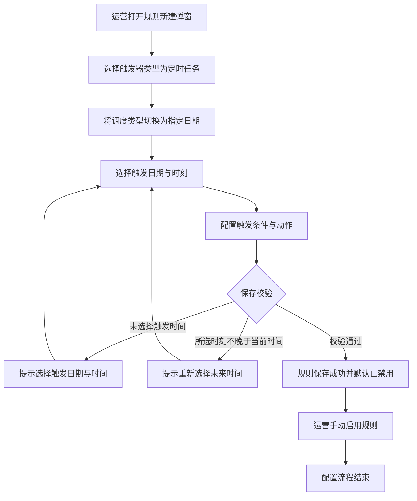
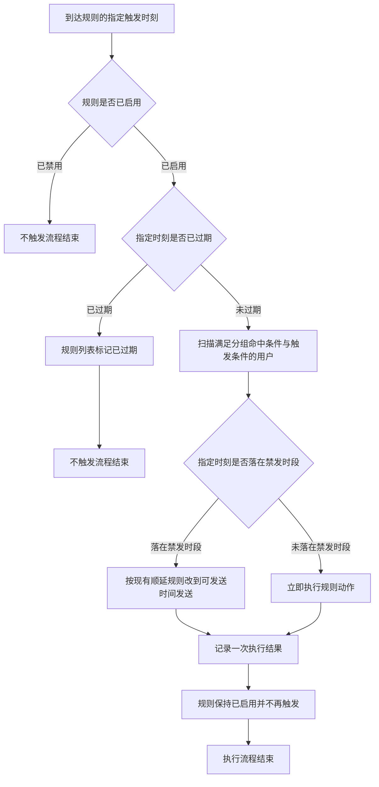

# PRD-企微机器人规则引擎指定日期触发

## 一、修订记录

| 版本号 | 修改日期 | 修改原因 | 修订人 |
|--------|----------|----------|--------|
| v1.0 | 2026-09-01 | 初稿 | AI PRD Writer |
| v1.1 | 2026-09-01 | 方案调整：指定日期不再作为独立触发器类型，改为并入「定时任务」的补充触发时间，新增第七种调度类型「指定日期」 | AI PRD Writer |

## 二、需求概述

- **背景/现状**：定时任务的补充触发时间目前只有每日、次日、每周、每月、间隔、当日六种调度类型，全部是周期或相对时间。运营无法把消息投放到某个具体日历日期，遇到节日、考试、大促等一次性节点只能临时改配置再改回来。
- **需求目标**：当运营需要在未来某一个确定时刻投放一次消息时，系统应在定时任务的调度类型中提供「指定日期」，运营选定日期与时刻后由系统到点自动执行一次，无需人工守点。
- **核心逻辑简述**：运营在规则弹窗选择触发器类型「定时任务」，把补充触发时间的调度类型切换为「指定日期」并选定一个未来的日期与时刻，配置触发条件与动作；规则启用后系统在该时刻扫描满足条件的用户并执行一次动作，执行完成后该规则不再触发。

## 三、术语表

| 术语 | 定义 |
|------|------|
| 触发器类型 | 规则被触发的方式，现有「用户信息变更」「定时任务」两种，本次不新增 |
| 调度类型 | 触发器类型为「定时任务」时补充触发时间的时间规律，现有每日、次日、每周、每月、间隔、当日六种 |
| 指定日期 | 本次新增的第七种调度类型，按运营选定的一个具体日期与时刻一次性触发规则 |
| 一次性规则 | 调度类型为「指定日期」的规则，只在选定时刻触发一次，不重复 |
| 触发条件 | 规则命中用户的判断条件，沿用现有多条件分组配置 |
| 分组命中条件 | 规则所属分组的进入条件，先判断分组命中再判断规则触发条件，沿用现有逻辑 |
| 禁发时段 | 全局配置的不允许向用户发送消息的时间区间 |
| 顺延发送 | 触发时刻落在禁发时段内时，改到全局配置的可发送时间再发送，沿用现有逻辑 |
| 已过期 | 调度类型为「指定日期」且所选时刻早于当前时间的状态，处于该状态的规则不再触发 |

## 四、调整范围

| 序号 | 功能模块 | 调整内容 |
|------|----------|----------|
| 1 | 规则新建/编辑弹窗 - 触发器类型 | 无调整，仍为「用户信息变更」「定时任务」两项 |
| 2 | 规则新建/编辑弹窗 - 补充触发时间 | 调度类型下拉新增第七项「指定日期」 |
| 3 | 规则新建/编辑弹窗 - 补充触发时间 | 调度类型选中「指定日期」时，右侧时刻下拉替换为日期时间选择器，精确到分钟，只能选未来时刻 |
| 4 | 规则新建/编辑弹窗 - 官方群发 | 调度类型为「指定日期」时，官方群发勾选框置灰并提示不支持 |
| 5 | 规则新建/编辑弹窗 - 保存校验 | 新增指定日期的触发时间必填校验与未来时间校验 |
| 6 | 规则新建/编辑弹窗 - 编辑锁定 | 指定日期已过期时，整个补充触发时间区域（含调度类型下拉与日期时间选择器）置灰只读 |
| 7 | 规则配置页 - 分组详情规则列表 | 「触发类型」列在调度类型为「指定日期」时，于「定时任务」下方展示指定触发时刻，已过期时追加「已过期」标识 |
| 8 | 规则触发调度 | 新增按指定时刻到点触发一次的调度能力，含过期判定与执行去重 |

## 五、业务流程图

**流程一：运营配置指定日期的定时任务规则**

**流程二：到点触发与执行**

## 六、可交互原型

可交互原型（公网，点击可直接操作）：https://leo-ai05.github.io/prototypes/%E4%BC%81%E5%BE%AE%E6%9C%BA%E5%99%A8%E4%BA%BA%E8%A7%84%E5%88%99%E5%BC%95%E6%93%8E%E6%8C%87%E5%AE%9A%E6%97%A5%E6%9C%9F%E8%A7%A6%E5%8F%91/

洋葱静态网站（内网，需飞连）：https://minio.yc345.tv/onionext/prototypes/robot-rule-date-trigger/index.html

原型模式：html-wireframe（单文件可交互原型，无需登录、无需本地启动）

涉及页面：规则配置页 → 分组详情（组内规则列表）→ 规则新建/编辑弹窗

可操作路径：

1. 打开链接即为分组详情的规则列表默认态，可看到「国庆班课名额开放通知」「暑期结课日专属课包发放」的触发类型均为「定时任务」，下方展示「指定日期 + 时刻」，后者带「已过期」标识；「学情报告日报推送」同为定时任务但调度类型是每日，该列展示保持不变。
2. 点击「＋ 新建规则」打开规则弹窗，默认触发器类型为「用户信息变更」。
3. 把「触发器类型」选为「定时任务」，再点开「补充触发时间」的调度类型下拉，可看到在现有六项之后新增的第七项「指定日期」。
4. 选中「指定日期」，右侧的时刻下拉被日期时间选择器替换，标签出现必填标识，「官方群发」勾选框同时置灰；鼠标悬浮该勾选框可看到「指定日期类型不支持官方群发」提示。
5. 点击日期时间输入框展开日历面板，当天之前的日期为置灰不可点选态，可在面板顶部修改时刻后点「确定」。
6. 填好规则名称与描述后直接点「确认」，可看到「请选择触发日期与时间」校验阻断。
7. 在日历中选择当天并把时刻改到已过去的时间点后点「确认」，可看到「触发时间必须晚于当前时间，请重新选择」校验阻断。
8. 选择一个未来时刻后点「确认」，弹窗关闭，列表新增一条规则且启用状态为关闭（默认已禁用）。
9. 新建规则时先保持调度类型为「每日」并勾选官方群发，再切换为「指定日期」，可看到勾选被自动取消并出现「已自动取消官方群发，指定日期类型不支持」提示。
10. 点击「暑期结课日专属课包发放」行的「编辑」，可看到调度类型下拉与日期时间选择器一并置灰只读，悬浮提示「该规则的触发时间已过，如需重新发送请新建规则」。
11. 点击「国庆班课名额开放通知」行的「编辑」，可看到调度类型与触发时间仍可修改。
12. 点击「学情报告日报推送」行的「编辑」，可看到每日调度类型下的时刻下拉与官方群发勾选框展示与交互均未变化。

关键态截图：`需求汇总/企微机器人规则引擎指定日期触发/proto-shots/`，共 14 张

GitHub 预览（公网）：[点击查看](https://leo-ai05.github.io/prototypes/%E4%BC%81%E5%BE%AE%E6%9C%BA%E5%99%A8%E4%BA%BA%E8%A7%84%E5%88%99%E5%BC%95%E6%93%8E%E6%8C%87%E5%AE%9A%E6%97%A5%E6%9C%9F%E8%A7%A6%E5%8F%91/)

## 七、功能需求详细描述

### 7.1 调度类型下拉新增「指定日期」

**所在位置**：规则配置页 → 分组详情 → 规则新建/编辑弹窗 → 触发器配置区域 → 「补充触发时间」

| 功能按钮 | 功能说明 | 是否必填 | 功能类型 | 交互说明 | 备注 |
|----------|----------|----------|----------|----------|------|
| 触发器类型 | 选择规则以何种方式被触发 | 必填 | 下拉单选 | 选项与交互不变，仍为「用户信息变更」「定时任务」两项；选择「定时任务」时下方展示「补充触发时间」 | 本次不新增触发器类型；新建时默认选中「用户信息变更」，编辑模式下该项置灰不可修改，均沿用现有规则 |
| 调度类型 | 选择定时任务的时间规律 | 必填 | 下拉单选 | 下拉选项在现有「每日」「次日」「每周」「每月」「间隔」「当日」之后新增第七项「指定日期」；选中「指定日期」时右侧的时刻下拉替换为日期时间选择器，「补充触发时间」标签出现必填标识 | 新建时默认选中「每日」，沿用现有默认值；从「指定日期」切换到其他调度类型时清空已选的日期与时刻 |

### 7.2 指定日期的日期时间选择器

**所在位置**：规则新建/编辑弹窗 → 触发器配置区域 → 「补充触发时间」 → 调度类型下拉右侧

| 功能按钮 | 功能说明 | 是否必填 | 功能类型 | 交互说明 | 备注 |
|----------|----------|----------|----------|----------|------|
| 触发日期与时间 | 选择规则唯一一次触发的日期与时刻 | 必填 | 日期时间选择器 | 仅当调度类型为「指定日期」时显示，替换该位置原有的时刻下拉；点击后展开日历面板，可选年月日与时分 | 精确到分钟；当前日期之前的日期在日历中置灰不可点选；未选择时输入框展示占位文案「请选择触发日期与时间」 |
| 触发时间说明文案 | 说明该调度类型的执行语义 | 不适用 | 文本提示 | 在选择器右侧常驻展示灰色小字「到达该时刻后触发一次，触发后不再重复执行」，替换其他调度类型在该位置的说明文案 | 其他调度类型的说明文案不变，沿用现有配置 |

**取值限制**：

1. 所选时刻必须晚于当前时间，最小可选粒度为 1 分钟。
2. 未选择日期与时刻时不允许保存。
3. 无最晚可选日期限制，可选择任意未来日期。

### 7.3 触发条件

**所在位置**：规则新建/编辑弹窗 → 触发器配置区域 → 「补充触发时间」下方

| 功能按钮 | 功能说明 | 是否必填 | 功能类型 | 交互说明 | 备注 |
|----------|----------|----------|----------|----------|------|
| 触发条件 | 限定到点后向哪些用户执行动作 | 必填 | 多条件分组配置 | 沿用现有条件配置能力与「当满足」引导文案，条件字段、判断方式、条件组数量上限、组间逻辑关系均沿用现有配置 | 调度类型为「指定日期」时该项的必填要求与校验文案与其他调度类型一致，不做区分 |

### 7.4 官方群发勾选框

**所在位置**：规则新建/编辑弹窗 → 触发器配置区域 → 「触发条件」下方

| 功能按钮 | 功能说明 | 是否必填 | 功能类型 | 交互说明 | 备注 |
|----------|----------|----------|----------|----------|------|
| 启用企业微信官方群发 | 选择消息是否走企业微信官方群发通道 | 选填 | 勾选框 | 调度类型为「指定日期」时该勾选框置灰不可点，鼠标悬浮提示「指定日期类型不支持官方群发」 | 与现有「间隔类型不支持官方群发」的处理方式保持一致；其他调度类型下该项的可用条件与提示文案不变 |

**自动取消规则**：从其他调度类型切换为「指定日期」且原本已勾选官方群发时，系统自动取消勾选并在页面顶部提示「已自动取消官方群发，指定日期类型不支持」，与现有切换到「间隔」时的处理方式一致。

### 7.5 保存校验与提交行为

**所在位置**：规则新建/编辑弹窗 → 底部操作区

| 功能按钮 | 功能说明 | 是否必填 | 功能类型 | 交互说明 | 备注 |
|----------|----------|----------|----------|----------|------|
| 确认 | 提交规则配置 | 不适用 | 按钮 | 点击后按「规则名称与描述 → 补充触发时间 → 触发条件 → 动作配置」顺序校验；全部通过后提交并关闭弹窗，刷新规则列表，顶部提示「创建成功」或「更新成功」 | 提交过程中按钮进入加载态并不可重复点击，沿用现有交互 |
| 取消 | 放弃本次编辑 | 不适用 | 按钮 | 点击后直接关闭弹窗，不保存任何修改，沿用现有交互 | 无 |

**校验规则与提示文案**：

| 序号 | 校验场景 | 提示文案 |
|------|----------|----------|
| 1 | 调度类型为「指定日期」且未选择日期与时刻 | 请选择触发日期与时间 |
| 2 | 所选触发时刻不晚于当前时间 | 触发时间必须晚于当前时间，请重新选择 |
| 3 | 触发条件为空或存在未填完整的条件 | 沿用现有触发条件校验文案 |
| 4 | 未添加任何动作 | 请至少添加一个动作 |
| 5 | 提交请求失败 | 操作失败 |

**保存后状态**：新建成功的规则默认为「已禁用」，需运营在规则列表手动启用后才会到点触发，沿用现有规则创建行为。

### 7.6 编辑规则时的过期锁定

**所在位置**：规则配置页 → 分组详情 → 规则列表「编辑」按钮 → 规则编辑弹窗

| 功能按钮 | 功能说明 | 是否必填 | 功能类型 | 交互说明 | 备注 |
|----------|----------|----------|----------|----------|------|
| 补充触发时间（编辑态） | 查看或修改已有规则的调度类型与触发时刻 | 必填 | 下拉单选 + 日期时间选择器 | 调度类型为「指定日期」且所选时刻仍晚于当前时间时，调度类型与触发时刻均可修改，保存后按新配置触发；调度类型为「指定日期」且所选时刻已早于当前时间时，调度类型下拉与日期时间选择器一并置灰只读，鼠标悬浮均提示「该规则的触发时间已过，如需重新发送请新建规则」 | 已过期规则不允许把调度类型改为每日、每周等其他类型来复用该规则，需重新发送时只能新建规则 |

**已过期规则的其他配置**：名称、描述、触发条件、动作、官方群发仍可正常修改并保存，保存后不会重新触发。

### 7.7 规则列表「触发类型」列展示

**所在位置**：规则配置页 → 分组详情 → 组内规则列表

| 字段名称 | 字段说明 | 字段来源 | 备注 |
|----------|----------|----------|------|
| 触发类型 | 展示规则的触发器类型名称；调度类型为「指定日期」时，在「定时任务」下方以灰色小字展示「指定日期」与所选时刻，格式为「指定日期 年-月-日 时:分」 | 规则新建/编辑弹窗的「触发器类型」与「补充触发时间」 | 调度类型为每日、次日、每周、每月、间隔、当日时，该列展示内容不变，仍只展示「定时任务」；触发器类型为「用户信息变更」时该列展示内容不变；所选时刻早于当前时间时，在时刻后追加灰色标识「已过期」 |

**列表其他部分**：规则ID、规则名称、规则描述、动作类型、创建时间、更新时间、最后更新人、启用状态、操作列的展示与交互均不变，沿用现有配置。

### 7.8 到点触发与执行

**所在位置**：系统后台，无页面

**执行规则**：

| 序号 | 触发条件 | 执行行为 |
|------|----------|----------|
| 1 | 到达规则的指定触发时刻且规则处于「已启用」 | 扫描同时满足分组命中条件与规则触发条件的用户，对每个命中用户执行一次规则配置的动作 |
| 2 | 到达规则的指定触发时刻但规则处于「已禁用」 | 不执行任何动作，不记录执行结果 |
| 3 | 规则被启用时指定触发时刻已早于当前时间 | 不执行任何动作，不补发；规则列表在触发类型列展示「已过期」标识 |
| 4 | 指定触发时刻落在禁发时段内 | 按现有顺延配置改到可发送时间发送，沿用现有顺延逻辑 |
| 5 | 同一条规则的同一个用户 | 只执行一次，重复扫描不重复发送 |
| 6 | 到点扫描后无任何用户满足条件 | 不执行任何动作，记录一次无匹配用户的执行结果 |
| 7 | 动作执行失败 | 沿用现有失败重试与失败结果记录逻辑 |
| 8 | 执行完成后 | 规则保持「已启用」不变，不再触发；由于指定时刻已过，规则列表展示「已过期」标识 |
| 9 | 其他调度类型的规则 | 执行逻辑不变，沿用现有周期与相对时间调度 |

**时间精度**：系统按分钟级扫描待触发规则，实际执行时刻与所选触发时刻的偏差不超过 1 分钟。

### 7.9 横切规则

**状态判定**：

| 序号 | 状态 | 判定条件 | 页面表现 |
|------|------|----------|----------|
| 1 | 未过期 | 调度类型为「指定日期」且所选时刻晚于当前时间 | 规则列表触发类型列展示「指定日期 + 时刻」，无额外标识；编辑弹窗的调度类型与触发时间可修改 |
| 2 | 已过期 | 调度类型为「指定日期」且所选时刻早于当前时间（含已执行完成与从未启用两种情况） | 规则列表触发类型列在时刻后展示「已过期」标识；编辑弹窗的调度类型与触发时间一并置灰只读，并提示重新发送需新建规则 |

**跳转闭环**：规则保存成功后关闭弹窗，回到分组详情的规则列表并刷新列表数据，保留当前所在分组，沿用现有跳转行为。

**权限**：新建规则、编辑规则、启用与禁用规则均沿用规则配置页现有的编辑权限，无编辑权限时相关按钮与开关不展示，启用状态以只读标签展示。

**测试数据说明**：需要端到端冒烟时，需准备一条归属于任意普通分组的规则、一个满足该规则触发条件的企业微信外部联系人，以及一个距当前时间 5 分钟以内的触发时刻用于快速验证到点执行；冒烟账号与测试联系人待产品提供。

## 八、埋点与数据需求

无。

## 九、权限说明

沿用规则配置页现有编辑权限，本次不新增角色与权限项。
