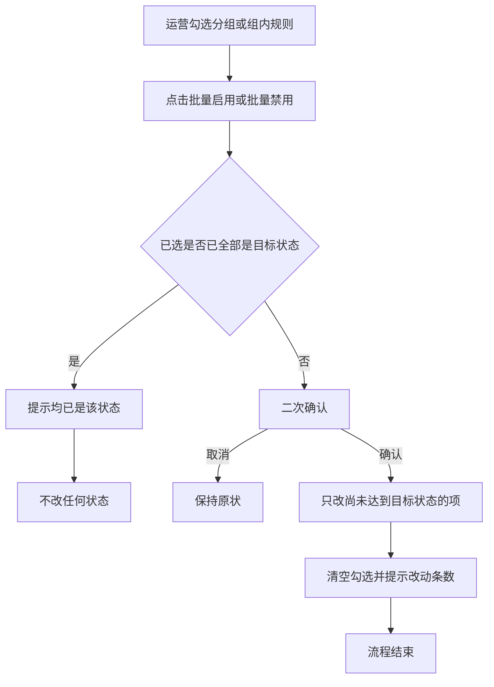
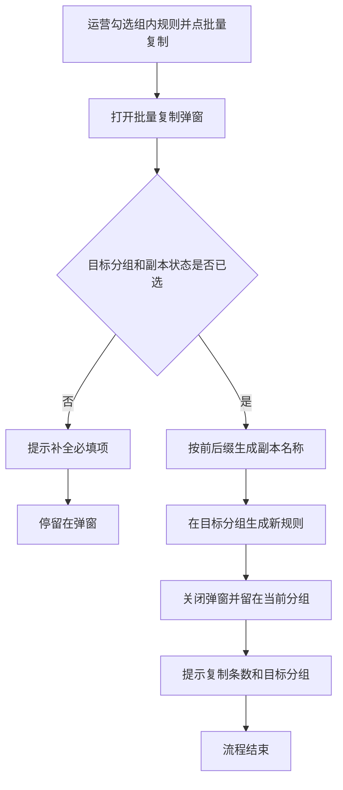
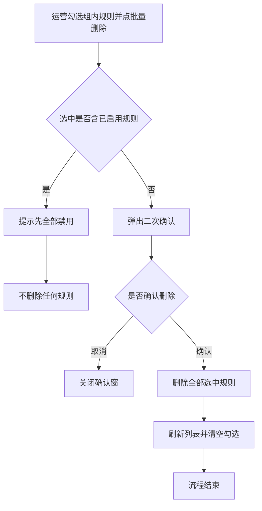

# PRD-企微机器人规则批量复制删除

## 一、修订记录

| 版本号 | 修改日期 | 修改原因 | 修订人 |
|--------|----------|----------|--------|
| v1.0   | 2026-09-22 | 初稿     | AI PRD Writer |
| v1.1   | 2026-09-22 | 分组多选与批量启停；组内规则批量启停；保留单条规则复制 | AI PRD Writer |

## 二、需求概述

**背景**：当运营需要调整多条规则或多组规则时，系统应仅能逐条启停、组内逐条删除，且规则行没有复制，导致改配置和临时关停成本高。

**目标**：当运营在规则配置中勾选分组或组内规则后，系统应允许批量启用或禁用；组内应允许批量复制、批量删除，且每条规则仍可单独复制。

**核心逻辑简述**：当运营在分组列表勾选普通分组并点批量启用或禁用时，系统应将已选分组改为对应状态并留在列表；当运营在组内勾选规则时，系统应按批量复制、批量启停、批量删除处理，行内复制打开与批量复制相同的配置窗且只作用于该条。

## 三、术语表

| 术语 | 定义 |
|------|------|
| 规则分组 | 规则配置第一层：一组共用命中条件的规则集合，含普通分组与兜底分组 |
| 组内规则 | 进入某个分组后看到的规则列表，每条规则含触发类型、条件、动作与启用状态 |
| 副本 | 批量复制生成的新规则，配置内容来自源规则，编号与时间重新生成 |
| 目标分组 | 批量复制时运营指定的落入分组，可为当前分组或其他分组 |

## 四、调整范围

1. 分组列表：增加勾选列、全选（不含兜底）、批量启用、批量禁用；保留行内查看规则、编辑、复制分组
2. 组内规则列表：勾选、全选、批量复制、批量启用、批量禁用、批量删除；行内保留复制、编辑、删除
3. 复制规则弹窗（单条与批量共用）
4. 批量删除二次确认弹窗
5. 无编辑权限时不展示勾选与批量入口（沿用现有规则配置编辑权限）

不调整：新建/编辑分组与规则的表单内容、分组行内单条复制的现有弹窗、兜底分组的单条启停限制（仍不可用开关切换）。

## 五、业务流程图

**主流程：批量启用或禁用**

**主流程：批量复制规则**

**主流程：批量删除规则**

## 六、可交互原型

可交互原型（公网，点击可直接操作）：https://leo-ai05.github.io/prototypes/%E4%BC%81%E5%BE%AE%E6%9C%BA%E5%99%A8%E4%BA%BA%E8%A7%84%E5%88%99%E6%89%B9%E9%87%8F%E5%A4%8D%E5%88%B6%E5%88%A0%E9%99%A4/

GitHub 预览（公网）：[点击查看](https://leo-ai05.github.io/prototypes/%E4%BC%81%E5%BE%AE%E6%9C%BA%E5%99%A8%E4%BA%BA%E8%A7%84%E5%88%99%E6%89%B9%E9%87%8F%E5%A4%8D%E5%88%B6%E5%88%A0%E9%99%A4/)

原型模式：html-wireframe（单文件可交互原型，无需登录、无需本地启动）

涉及页面：企微机器人 → 规则配置 → 分组列表 / 组内规则列表 / 复制规则弹窗 / 批量删除确认

可操作路径：
1. 分组列表勾选「初中转化」「周末静默」（兜底分组勾选框不可点），点「批量禁用」确认后开关变为关闭。
2. 点「初中转化」进入组内。勾选规则后可批量复制、批量启用、批量禁用、批量删除。
3. 行内点「复制」打开复制弹窗（标题为复制规则），配置与批量复制相同，只作用于该条。
4. 勾选已启用规则点「批量删除」被拦截；仅禁用规则可确认删除。
5. 关掉编辑权限后，分组与规则均无勾选和批量按钮，规则行无复制。

关键态截图：`需求汇总/企微机器人规则批量复制删除/proto-shots/`，共 7 张

代码侧验证（辅助材料，非交付原型）：本地工作区 `code/telesale-web_v2-rule-batch`、分支 `feat/wework-rule-batch-copy-delete`，仅本地验证，未推送远程、未发测试环境。洋葱内网发布因未连飞连失败，公网以 GitHub Pages 为准。

## 七、功能需求详细描述

### 7.1 组内规则列表勾选

| 功能名称 | 功能说明 | 是否必填 | 功能类型 | 交互说明 | 备注 |
|----------|----------|----------|----------|----------|------|
| 行勾选 | 选择要批量处理的规则 | 否 | 复选框 | 位于规则表格最左侧，每行一个。勾选后计入已选集合 | 无编辑权限时不展示 |
| 全选 | 选中或取消当前分组下全部规则 | 否 | 复选框 | 位于表头。勾选则当前分组全部规则进入已选；取消则清空 | 组内规则不分页，全选等于该分组全部规则 |
| 已选提示 | 展示已选条数 | 否 | 文案 | 有勾选时显示「已选 N 条」；无勾选时显示「请先勾选规则」 | 切换分组或返回列表后清空勾选 |

列表字段沿用现网：规则编号、规则名称（含官方群发标记）、规则描述、触发类型、动作类型、创建时间、更新时间、最后更新人、启用状态、操作（复制、编辑、删除）。最左侧叠加勾选列。

### 7.1.1 分组列表勾选与批量启停

| 功能名称 | 功能说明 | 是否必填 | 功能类型 | 交互说明 | 备注 |
|----------|----------|----------|----------|----------|------|
| 分组勾选 | 选择要批量启停的普通分组 | 否 | 复选框 | 表格最左侧。兜底分组勾选框置灰，悬浮说明「兜底分组不支持批量启停」 | 无编辑权限不展示 |
| 分组全选 | 选中全部普通分组 | 否 | 复选框 | 表头全选不含兜底分组 | — |
| 批量启用 | 将已选分组改为已启用 | 否 | 按钮 | 未勾选置灰。若已选均已启用，提示「所选分组均已启用」。否则二次确认后只改尚未启用的分组，已启用的保持不变 | 成功提示「已启用 N 个分组」，清空勾选 |
| 批量禁用 | 将已选分组改为已禁用 | 否 | 按钮 | 对称于批量启用。确认文案「确定禁用已选的 N 个分组吗？」 | 禁用后该分组不再参与命中，组内规则不会因本分组被执行 |
| 复制分组 | 沿用现网单条复制分组 | 否 | 行内按钮 | 兜底分组不展示。本次不改该弹窗 | — |

### 7.2 批量复制按钮

| 功能名称 | 功能说明 | 是否必填 | 功能类型 | 交互说明 | 备注 |
|----------|----------|----------|----------|----------|------|
| 批量复制 | 打开批量复制弹窗 | 否 | 按钮 | 位于「新建规则」右侧。未勾选任何规则时置灰，不可点。至少勾选 1 条后可点 | 无编辑权限不展示。不设条数上限 |

点击后打开「批量复制规则」弹窗，不离开当前分组页。

行内「复制」打开同一弹窗，标题改为「复制规则」，预填当前这一条，不改变表格勾选。

### 7.3 批量复制规则弹窗

| 功能名称 | 功能说明 | 是否必填 | 功能类型 | 交互说明 | 备注 |
|----------|----------|----------|----------|----------|------|
| 说明文案 | 告知将复制的条数与拷贝范围 | 否 | 文本 | 打开时展示「将复制 N 条规则」及拷贝说明 | 见下方拷贝范围 |
| 目标分组 | 指定副本落入哪个分组 | 是 | 下拉单选 | 选项为全部规则分组，含当前分组、其他普通分组、已禁用分组、兜底分组。选项旁用括号标明「当前」「已禁用」「兜底」。默认选中当前分组 | 未选时点确定提示「请选择目标分组」 |
| 副本启用状态 | 指定全部副本生成后的启用或禁用 | 是 | 单选 | 两项：禁用、启用。打开时均不预选，必须由运营点选 | 未选时点确定提示「请选择副本启用状态」。一次操作内全部副本同一状态 |
| 名称前缀 | 拼在原规则名称前面 | 否 | 单行输入 | 默认为空 | 与后缀同时为空时，副本名称与源规则名称相同 |
| 名称后缀 | 拼在原规则名称后面 | 否 | 单行输入 | 默认为空 | 同上 |
| 名称预览 | 展示生成后的规则名称 | 否 | 只读列表 | 随前缀、后缀即时变化，按已选规则逐条列出「前缀 + 原名称 + 后缀」 | 若拼接结果为空（源名称为空且前后缀皆空），确定时提示「规则名称不能为空」 |
| 确定复制 | 提交复制 | 否 | 按钮 | 校验通过后生成副本 | 处理中防重复点击 |
| 取消 | 关闭弹窗 | 否 | 按钮 | 不生成任何副本，保留列表勾选 | 点遮罩或关闭图标同取消 |

**拷贝范围（每条副本）**

一并带入：规则描述、触发类型、触发条件、时间配置、动作列表、是否走官方群发。

不带入、重新生成：规则编号、创建时间、更新时间、最后更新人（记为当前操作人）。

启用状态不跟随源规则，以弹窗中「副本启用状态」为准。

所属分组以「目标分组」为准，不改源规则所在分组，源规则保留。

规则名称不要求组内唯一，允许与目标分组已有规则同名。

复制成功：关闭弹窗；留在当前分组；清空勾选；顶部提示「已复制 N 条规则到「目标分组名称」」。若目标即当前分组，新规则出现在当前列表末尾（或按现网列表默认顺序刷新后可见）。若目标为其他分组，当前列表不出现新规则，运营需自行进入目标分组查看。

复制失败：弹窗不关、已填内容保留，提示「复制失败，请重试」。任一条失败则整批不生效，不出现部分成功。

### 7.4 批量删除按钮与确认

| 功能名称 | 功能说明 | 是否必填 | 功能类型 | 交互说明 | 备注 |
|----------|----------|----------|----------|----------|------|
| 批量删除 | 删除已选规则 | 否 | 按钮 | 位于批量复制右侧。未勾选时置灰 | 无编辑权限不展示 |
| 启用拦截 | 含已启用则整批不删 | — | 校验 | 点击后若已选中存在任意已启用规则，不打开确认窗，提示「选中规则含 N 条已启用，请先全部禁用后再批量删除」 | N 为已选中且已启用的条数。列表与勾选不变 |
| 二次确认 | 确认删除禁用规则 | 是 | 弹窗 | 仅当已选全部为禁用时出现。标题「提示」，正文「确定删除已选的 N 条规则吗？删除后不可恢复。」并列出规则名称。按钮：取消、确定删除 | 取消关闭弹窗且不删除 |
| 确定删除 | 执行删除 | 否 | 按钮 | 确认后删除已选全部规则 | 成功提示「删除成功」，刷新列表，清空勾选。失败提示「删除失败」，已选与列表保持点击前状态，整批不部分删除 |

单条行内「删除」沿用现网：不区分启用状态，确认后即可删除。与批量删除的启用拦截不一致，属有意差异。

### 7.4.1 组内规则批量启用与批量禁用

| 功能名称 | 功能说明 | 是否必填 | 功能类型 | 交互说明 | 备注 |
|----------|----------|----------|----------|----------|------|
| 批量启用 | 将已选规则改为已启用 | 否 | 按钮 | 未勾选置灰。均已启用则提示「所选规则均已启用」。否则确认后只改尚未启用的规则 | 成功提示「已启用 N 条规则」，清空勾选 |
| 批量禁用 | 将已选规则改为已禁用 | 否 | 按钮 | 对称于批量启用 | 禁用后该规则不再触发 |

行内开关启停沿用现网，不要求二次确认。

### 7.5 权限、空态与边界

1. 无规则配置编辑权限：不展示勾选列、全选、任何批量按钮、新建及行内编辑/复制/删除/启停开关；状态以标签展示。
2. 分组下无规则：表格空态沿用现网；批量按钮因无法勾选而保持置灰。
3. 加载失败：沿用现网失败表现。
4. 返回分组列表或进入另一分组：清空规则勾选；离开组内不影响分组列表勾选，进入组内时分组勾选保持到返回后仍可见。
5. 目标分组在复制过程中不可用：提示失败，不生成副本。
6. 批量启停失败：提示失败，已改与未改保持点击前状态，整批不部分生效。
7. 冒烟数据：具备编辑权限的账号；含启用与禁用的普通分组；至少一个其他分组；兜底分组用于验证不可勾选。账号待业务提供。

## 八、埋点与数据需求

无。

## 九、权限说明

沿用现有「规则配置编辑权限」。具备该权限可使用分组与规则的勾选、批量启停、组内批量复制删除及行内复制；不具备则仅可查看。
