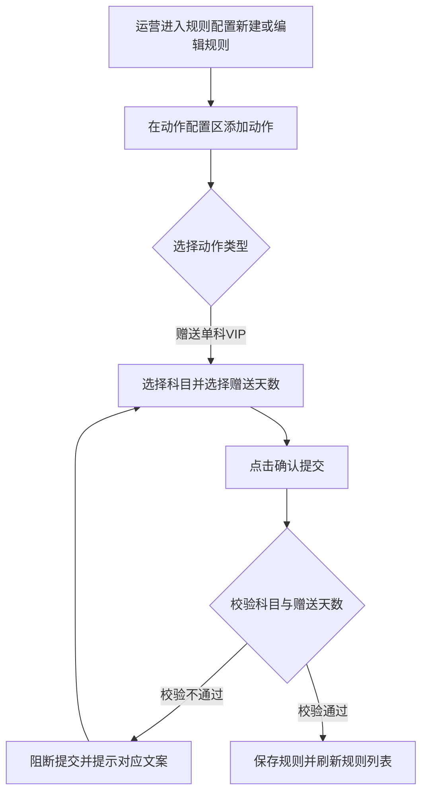
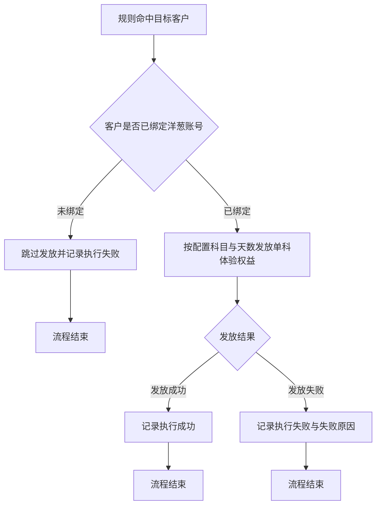

# PRD-企微机器人赠送单科VIP动作

## 一、修订记录

| 版本号 | 修改日期 | 修改原因 | 修订人 |
|--------|----------|----------|--------|
| v1.0 | 2026-08-24 | 初稿 | AI PRD Writer |

## 二、需求概述

- **背景/现状**：企业微信机器人「规则配置」的动作配置只能赠送体验版大会员，不能赠送单科体验权益，运营要送单科时只能到客户详情逐个人工赠送。
- **需求目标**：当运营在规则中配置「赠送单科VIP」动作并选定科目与赠送天数时，系统应在规则命中后自动向客户发放对应科目的单科体验权益。
- **核心逻辑简述**：运营在新建或编辑规则的动作配置中选择「赠送单科VIP」，选好科目与赠送天数后保存；规则命中目标客户后，系统按该配置向客户的洋葱账号发放单科体验权益，发放能力与客户详情「体验赠送」的体验课赠送保持一致。

**SCOPE（本次必做）**：

1. 规则配置的动作类型新增「赠送单科VIP」，与现有「发送会员」并列。
2. 该动作提供「科目」多选配置项，科目清单与客户详情「体验赠送」的体验课科目清单一致，单个动作最多选 4 科。
3. 该动作提供「赠送天数」配置项，可选 1 天至 7 天。
4. 编辑已有规则时回显该动作已配置的科目与赠送天数。
5. 提交规则时校验科目与赠送天数的必填、科目数量上限、官方群发互斥。
6. 启用企业微信官方群发的规则不允许配置该动作，该动作在动作类型下拉中置灰不可选。
7. 规则列表的「动作类型」列展示「赠送单科VIP」标签。
8. 规则命中后按配置的科目与赠送天数向客户洋葱账号发放单科体验权益。

**NON-GOAL（本次明确不做）**：

1. 不做客户购买资格判定，不按客户是否已购课调整可选科目数量与可选天数。
2. 不按客户所在省份过滤科目，省份限定科目由运营在配置时自行把控。
3. 不做单科体验权益发放明细报表与对账页面。
4. 不做发放额度上限管控与审批流。
5. 不做同一客户同一规则的发放去重与频次限制。
6. 不做到账通知文案，运营需要通知客户时自行在同一条规则里追加发送企业微信消息动作。
7. 不改动现有「发送会员」动作的配置项与执行逻辑。
8. 不做客户已有单科权益剩余时长的查询与展示，权益叠加行为沿用现有发放能力。

**ACCEPT（业务可观察验收）**：

1. 新建规则时动作类型下拉可见并可选中「赠送单科VIP」，选好科目与赠送天数后规则保存成功。
2. 编辑该规则重新打开时，科目与赠送天数与保存前一致。
3. 科目未选、赠送天数未选、科目数超过 4 科时，点击确认被阻断并给出对应提示文案。
4. 勾选企业微信官方群发后该动作在下拉中置灰不可选；已配置该动作的规则勾选官方群发并提交时被阻断。
5. 规则命中客户后，客户洋葱账号获得与配置一致的科目权益，有效期与配置天数一致。
6. 同一客户重复命中同一条规则时，每次命中都赠送一次。
7. 客户未绑定洋葱账号时不发放权益，该次执行在规则执行明细中记为失败并写明失败原因。
8. 规则列表的「动作类型」列展示「赠送单科VIP」标签。

**测试与验收数据**：需要一个已绑定洋葱账号的企业微信客户，以及一个未绑定洋葱账号的企业微信客户，用于分别验证发放成功与发放失败两条路径。冒烟数据待产品提供。

## 三、术语表

| 术语 | 定义 |
|------|------|
| 单科VIP | 洋葱学园按单个学科售卖的会员权益，等同于客户详情「体验赠送」中赠送类型为体验课时按科目发放的权益 |
| 赠送单科VIP动作 | 规则命中后由系统自动向客户洋葱账号发放指定科目、指定天数单科体验权益的动作类型 |
| 洋葱账号 | 客户在洋葱学园的账号，是单科体验权益的发放对象，来自客户会话属性中记录的洋葱账号信息 |
| 官方群发 | 规则走企业微信官方群发通道下发消息的模式，该模式下部分动作类型不可用 |
| 体验赠送 | 客户详情页中由坐席人工向单个客户赠送体验权益的功能，本次动作的发放能力与其体验课赠送保持一致 |

## 四、调整范围

| 序号 | 功能模块 | 调整说明 |
|------|----------|----------|
| 1 | 企业微信机器人 / 规则配置 / 新建规则弹窗 / 动作配置区 | 动作类型下拉新增「赠送单科VIP」选项 |
| 2 | 企业微信机器人 / 规则配置 / 新建规则弹窗 / 动作配置区 | 新增「赠送单科VIP」动作的科目多选与赠送天数配置项 |
| 3 | 企业微信机器人 / 规则配置 / 编辑规则弹窗 / 动作配置区 | 编辑已有规则时回显「赠送单科VIP」动作的科目与赠送天数 |
| 4 | 企业微信机器人 / 规则配置 / 新建编辑弹窗 / 提交校验 | 新增「赠送单科VIP」动作的必填校验、科目数量上限校验、官方群发互斥校验 |
| 5 | 企业微信机器人 / 规则配置 / 新建编辑弹窗 / 官方群发 | 启用官方群发时「赠送单科VIP」在动作类型下拉中置灰不可选 |
| 6 | 企业微信机器人 / 规则配置 / 规则列表 | 「动作类型」列新增「赠送单科VIP」彩色标签 |
| 7 | 企业微信机器人 / 规则引擎执行 | 规则命中后按配置的科目与赠送天数向客户洋葱账号发放单科体验权益 |

> 单科体验权益的发放能力在电销系统客户详情「体验赠送」中已有实现，本次由后端复用同一套发放能力，不新增发放通道。

## 五、业务流程图

**流程一：配置赠送单科VIP动作**

**流程二：规则命中后发放单科体验权益**

## 六、可交互原型

可交互原型（公网，点击可直接操作）：https://leo-ai05.github.io/prototypes/%E4%BC%81%E5%BE%AE%E6%9C%BA%E5%99%A8%E4%BA%BA%E8%B5%A0%E9%80%81%E5%8D%95%E7%A7%91VIP%E5%8A%A8%E4%BD%9C/

原型模式：html-wireframe（单文件可交互原型，无需登录、无需本地启动）

涉及页面：企业微信机器人 · 规则配置（规则列表的动作类型列、新建规则弹窗、编辑规则弹窗的动作配置区）

可操作路径：

1. 点击「新建规则」打开弹窗，动作配置区展开「动作类型」下拉，可见新增的「赠送单科VIP」，排在「发送会员」之后
2. 选中「赠送单科VIP」后出现「科目」（多选，最多 4 科，支持搜索、单个移除、一键清空）与「赠送天数」（1-7 天）两个配置项
3. 已选满 4 科时其余科目置灰，鼠标悬浮提示「单次最多选择 4 个科目」
4. 不选科目或不选天数直接点「确认」，提交被阻断并给出对应校验提示
5. 勾选「启用企业微信官方群发」后，「赠送单科VIP」在动作类型下拉中置灰并标注「（不支持）」；若该动作已配置，点「确认」提交被阻断
6. 校验通过后弹窗关闭，规则列表新增一行，动作类型列出现「赠送单科VIP」标签；点「编辑」可看到科目与天数原样回显

关键态截图：`需求汇总/企微机器人赠送单科VIP动作/proto-shots/`，共 10 张，覆盖规则列表、弹窗默认态、动作类型下拉含新选项、科目下拉清单、已选四科后其余置灰、赠送天数下拉、校验阻断、官方群发阻断、官方群发下选项置灰、保存后列表新增行

代码侧验证（辅助材料，非交付原型）：本地工作区 `.worktrees/subject-vip`、分支 `feat/rule-action-subject-vip`，已在真实代码中最小叠加动作类型枚举、科目与天数配置、官方群发置灰三处改动，仅本地验证可行性，未推送远程、未发测试环境

## 七、功能需求详细描述

### 7.1 动作类型选择（新增「赠送单科VIP」选项）

功能、弹窗、按钮类型：

| 功能按钮 | 功能说明 | 是否必填 | 功能类型 | 交互说明 | 备注 |
|----------|----------|----------|----------|----------|------|
| 动作类型下拉 | 选择当前动作的类型 | 是 | 下拉选择 | 在现有动作类型基础上新增「赠送单科VIP」选项，排在「发送会员」之后；选中后动作卡片下方展示科目与赠送天数两个配置项 | 切换动作类型时清空原类型的专属配置，仅保留新类型的默认配置，沿用现有交互 |
| 添加动作 | 在动作列表追加一个新动作 | 否 | 按钮 | 沿用现有「添加动作」按钮交互 | 一条规则可添加多个动作，其中「赠送单科VIP」不限制数量 |
| 删除动作 | 删除当前动作 | 否 | 按钮 | 沿用现有删除动作交互 | — |

### 7.2 科目配置

功能、弹窗、按钮类型：

| 功能按钮 | 功能说明 | 是否必填 | 功能类型 | 交互说明 | 备注 |
|----------|----------|----------|----------|----------|------|
| 科目 | 配置本次动作向客户赠送的单科体验权益对应科目 | 是 | 多选下拉 | 运营从科目清单中勾选，已选科目在选择框内以标签展示并可单独移除；下拉支持按科目名称搜索，提供清空入口一次性清除全部已选 | 单个动作最多选 4 科，已选满 4 科时其余选项置灰不可选；默认为空并展示占位文案「请选择科目」；科目清单与客户详情「体验赠送」的体验课科目清单一致 |

**科目清单**（与客户详情「体验赠送」体验课科目清单及顺序一致）：

| 序号 | 科目名称 | 备注 |
|------|----------|------|
| 1 | 小学数学 | — |
| 2 | 小学思维培优 | — |
| 3 | 小学实验 | — |
| 4 | 小学语文 | — |
| 5 | 小学英语 | — |
| 6 | 初中数学 | — |
| 7 | 初中物理 | — |
| 8 | 初中化学 | — |
| 9 | 初中语文 | — |
| 10 | 初中英语 | — |
| 11 | 初中生物 | — |
| 12 | 初中地理 | — |
| 13 | 初中科学 | 仅浙江地区客户适用，选项旁标注「仅浙江地区」，由运营自行把控 |
| 14 | 初中道德与法治 | — |
| 15 | 初中历史 | — |
| 16 | 高中数学 | — |
| 17 | 高中物理 | — |
| 18 | 高中语文 | — |
| 19 | 高中化学 | — |
| 20 | 高中生物 | — |
| 21 | 高中英语 | — |
| 22 | 高中地理 | — |
| 23 | 高中历史 | — |
| 24 | 高中思想政治 | — |
| 25 | 从小学物理 | — |
| 26 | 从小学生物 | — |
| 27 | 从小学地理 | — |
| 28 | 试卷库VIP | 发放全学段试卷库权益 |

### 7.3 赠送天数配置

功能、弹窗、按钮类型：

| 功能按钮 | 功能说明 | 是否必填 | 功能类型 | 交互说明 | 备注 |
|----------|----------|----------|----------|----------|------|
| 赠送天数 | 配置本次动作赠送的单科体验权益有效天数 | 是 | 下拉选择 | 运营从 1 天至 7 天中选择一项，仅可单选 | 可选项为 1 天、2 天、3 天、4 天、5 天、6 天、7 天；默认为空并展示占位文案「请选择赠送天数」；与现有「发送会员」动作的会员天数可选范围一致 |

**字段清单**：

| 字段中文名 | 含义 | 是否必填 | 取值与默认值 | 来源 |
|------------|------|----------|--------------|------|
| 科目 | 规则命中后向客户发放的单科体验权益对应科目 | 是 | 取自 7.2 科目清单，多选，1 至 4 项，默认为空 | 运营在动作配置区手动勾选 |
| 赠送天数 | 单科体验权益的有效天数 | 是 | 1 天至 7 天中的一项，默认为空 | 运营在动作配置区手动选择 |

### 7.4 提交校验

功能、弹窗、按钮类型：

| 功能按钮 | 功能说明 | 是否必填 | 功能类型 | 交互说明 | 备注 |
|----------|----------|----------|----------|----------|------|
| 确认 | 提交规则配置 | 是 | 按钮 | 点击后依次校验各动作的必填项，校验不通过时阻断提交并顶部提示对应文案，校验通过后保存规则并关闭弹窗、刷新规则列表 | 沿用现有确认按钮的提交与刷新逻辑 |

**校验规则清单**：

| 序号 | 校验场景 | 提示文案 |
|------|----------|----------|
| 1 | 某个「赠送单科VIP」动作未选择科目 | 动作 X：请至少选择一个科目 |
| 2 | 某个「赠送单科VIP」动作选择的科目超过 4 科 | 动作 X：单次最多选择 4 个科目 |
| 3 | 某个「赠送单科VIP」动作未选择赠送天数 | 动作 X：请选择赠送天数 |
| 4 | 已勾选官方群发且规则中含「赠送单科VIP」动作 | 启用官方群发后不允许包含赠送单科VIP动作 |

> 提示文案中的「动作 X」沿用现有动作定位方式，X 为该动作在动作列表中的序号。

### 7.5 官方群发模式下的限制

功能、弹窗、按钮类型：

| 功能按钮 | 功能说明 | 是否必填 | 功能类型 | 交互说明 | 备注 |
|----------|----------|----------|----------|----------|------|
| 启用企业微信官方群发 | 勾选后规则走官方群发通道 | 否 | 勾选框 | 勾选后动作类型下拉中「赠送单科VIP」置灰不可选，鼠标悬浮提示「官方群发不支持该动作」 | 沿用现有学情类动作的置灰与提示范式 |

**状态判定**：

| 序号 | 场景 | 界面表现 |
|------|------|----------|
| 1 | 未勾选官方群发 | 「赠送单科VIP」在下拉中可正常选择 |
| 2 | 已勾选官方群发，新增动作 | 「赠送单科VIP」在下拉中置灰，悬浮展示不支持提示，无法选中 |
| 3 | 已配置「赠送单科VIP」动作后再勾选官方群发 | 已有动作保持展示，点击确认时阻断提交并提示「启用官方群发后不允许包含赠送单科VIP动作」 |

### 7.6 规则列表动作类型展示

生成列表：

| 字段名称 | 字段说明 | 字段来源 | 备注 |
|----------|----------|----------|------|
| 动作类型 | 展示该规则配置的全部动作类型标签 | 规则配置中的动作列表 | 「赠送单科VIP」使用绿色标签，与现有动作类型共用同一套业务色卡；一条规则含多个动作时按配置顺序横向排列全部标签 |

### 7.7 命中执行与发放规则

**执行规则**：

| 序号 | 规则 | 说明 |
|------|------|------|
| 1 | 发放时机 | 规则命中后立即发放，不受销售回复延迟与禁发时段影响，与现有「发送会员」动作保持一致 |
| 2 | 发放对象 | 客户会话属性中记录的洋葱账号 |
| 3 | 发放内容 | 与动作中配置的科目一致，一次动作内配置多个科目时同时发放全部科目权益 |
| 4 | 发放有效期 | 自发放成功时刻起算，持续时长与配置的赠送天数一致 |
| 5 | 购买资格 | 不判定客户是否已购课，一律按运营配置的科目与天数发放 |
| 6 | 省份限制 | 不判定客户所在省份，省份限定科目由运营在配置时自行把控 |
| 7 | 重复命中 | 同一客户每次命中该规则都赠送一次，不做去重与频次限制，发放频次由规则命中条件本身控制 |
| 8 | 多动作并存 | 同一条规则配置多个「赠送单科VIP」动作时，各动作按配置顺序分别独立发放 |
| 9 | 权益叠加 | 客户已有同科目权益时的叠加行为沿用客户详情「体验赠送」现有发放能力，本次不额外定义 |
| 10 | 到账通知 | 本动作不向客户发送任何消息，需要通知客户时由运营在同一条规则中另行配置发送企业微信消息动作 |

**异常与兜底**：

| 序号 | 异常场景 | 处理方式 |
|------|----------|----------|
| 1 | 客户未绑定洋葱账号 | 跳过本次发放，该次执行在规则执行明细中记为执行失败并记录失败原因 |
| 2 | 单科体验权益发放失败 | 不重复发放，该次执行在规则执行明细中记为执行失败并记录失败原因 |
| 3 | 一次动作内部分科目发放失败 | 已成功的科目保持生效，该次执行记为执行失败并记录失败科目 |
| 4 | 同一条规则中其他动作执行失败 | 各动作互不阻断，赠送单科VIP按自身结果单独记录 |

**执行明细展示**：沿用现有规则执行明细的成功与失败状态展示，本次不新增科目与天数展示列。

## 八、埋点与数据需求

无。

## 九、权限说明

沿用规则配置页面现有的查看与编辑权限，不新增角色与权限项。
