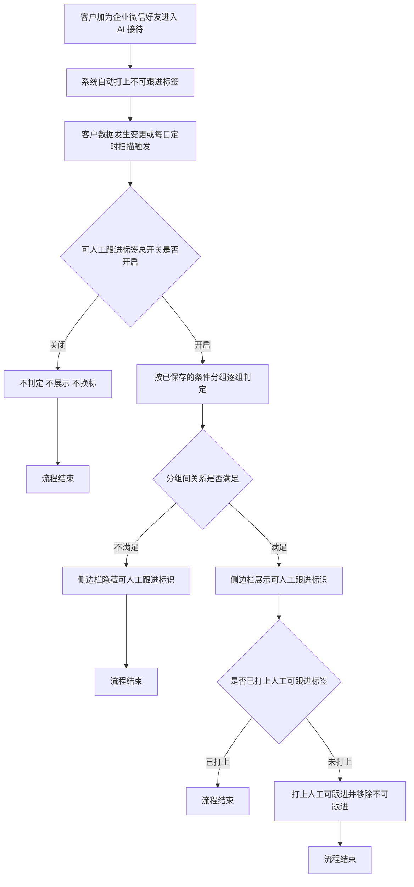
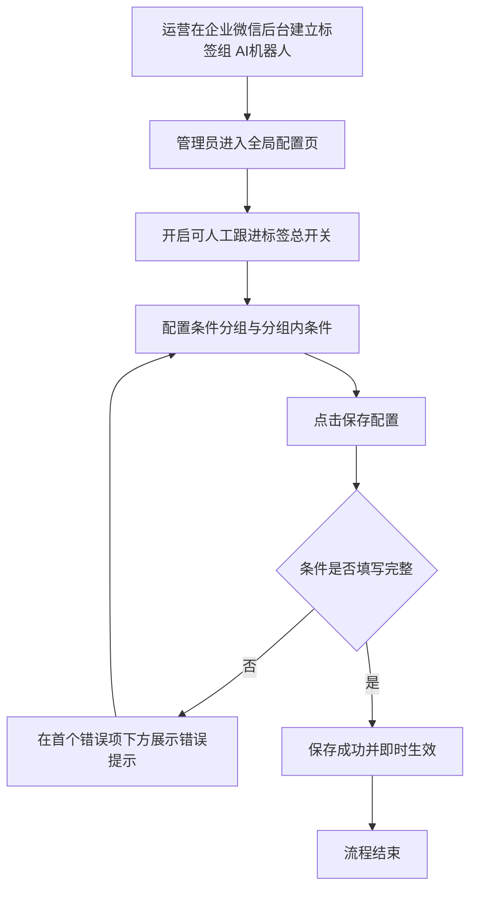

# PRD - 可人工跟进标签条件自定义配置

## 一、修订记录

| 版本号 | 修改日期 | 修改原因 | 修订人 |
|--------|----------|----------|--------|
| v1.0 | 2026-09-01 | 初稿：可人工跟进标签的命中条件改为条件分组自定义配置，并新增命中后打企业微信标签 | AI PRD Writer |
| v1.1 | 2026-09-02 | 命中后打标改为全自动：取消配置页的标签选择，改用企业微信后台预建的固定标签组「AI机器人」，命中时打「人工可跟进」并移除同组「不可跟进」 | AI PRD Writer |

## 二、需求概述

- **背景/现状**：可人工跟进标签的命中条件写死为「加微满 N 天」，运营无法按转人工情况、学习时长等其它维度调整口径，改一次口径就要提一次需求。
- **需求目标**：当管理员在企微机器人全局配置中用条件分组自定义命中条件后，系统应对命中的客户在企业微信侧边栏展示「可人工跟进」标识，并自动把企业微信标签从「不可跟进」换成「人工可跟进」。
- **核心逻辑简述**：管理员在全局配置中按「会话属性 + 判断条件 + 比较值」配置若干条件分组，系统在客户数据变更时与每日定时扫描时逐组判定，命中即展示侧边栏标识并自动完成换标，全程无需人工操作。

## 三、术语表

| 术语 | 定义 |
|------|------|
| 可人工跟进 | 客户满足管理员配置的命中条件时，允许销售识别为可进入人工跟进窗口的状态标识 |
| 会话属性 | 企微机器人中登记的客户业务属性，是规则条件与本次命中条件的取值来源，沿用现有能力 |
| 条件分组 | 由若干条条件组成的判定单元，分组内条件按分组内关系判定，分组之间按分组间关系判定，沿用规则配置现有形态 |
| 分组内关系 | 同一分组内多条条件之间的关系，取值为「且」或「或」 |
| 分组间关系 | 多个分组之间的关系，取值为「且」或「或」 |
| 历史转人工触发类型 | 本次新增的会话属性，记录客户历史上发生过的全部转人工触发类型，去重后保留 |
| 可选项形态属性 | 会话属性中取值范围固定、可枚举的属性，例如好友关系状态、历史转人工触发类型、转人工原因分类、私域线索分层 |
| 企业微信标签组「AI机器人」 | 上线前由运营在企业微信管理后台建立的客户标签组，组内含「人工可跟进」「不可跟进」两个标签，系统按该固定名称识别并自动维护 |
| 人工可跟进 | 「AI机器人」标签组下的标签，客户命中命中条件后由系统自动打上 |
| 不可跟进 | 「AI机器人」标签组下的标签，客户加为企业微信好友进入 AI 接待时由系统自动打上，作为默认状态 |

## 四、调整范围

1. 企微机器人 · 全局配置页 —— 「可人工跟进标签」板块整体改造：总开关、命中条件（条件分组）、命中后动作（固定说明，无配置项）。
2. 企微机器人 · 全局配置页 —— 会话属性选择面板：在本板块内提供按分类浏览与关键词搜索的属性选择能力。
3. 企微机器人 · 全局配置页 —— 可选项多选面板：可选项形态属性的比较值由手工输入改为下拉多选。
4. 企微机器人 · 规则配置页 —— 条件的判断条件列表补充「大于等于」「小于等于」；可选项形态属性的比较值同步改为下拉多选。
5. 企微机器人 · 会话属性 —— 新增「历史转人工触发类型」属性。
6. 企业微信侧边栏 · AI 私域画像 · 画像 —— 「关键信息」标题旁展示「可人工跟进」标识。
7. 企业微信客户标签 —— 客户加好友进入 AI 接待时自动打上「不可跟进」，命中后自动换成「人工可跟进」。
8. 上线前置准备 —— 运营在企业微信管理后台建立客户标签组「AI机器人」，组内建立「人工可跟进」「不可跟进」两个标签。

## 五、业务流程图

**主流程：命中判定、侧边栏展示与企业微信标签自动切换**

**子流程：命中条件配置与保存**

## 六、可交互原型

可交互原型（公网，点击可直接操作）：https://leo-ai05.github.io/prototypes/%E5%8F%AF%E4%BA%BA%E5%B7%A5%E8%B7%9F%E8%BF%9B%E6%A0%87%E7%AD%BE%E6%9D%A1%E4%BB%B6%E8%87%AA%E5%AE%9A%E4%B9%89%E9%85%8D%E7%BD%AE/

原型模式：html-wireframe（单文件可交互原型，无需登录、无需本地启动）

涉及页面：企微机器人 · 全局配置页「可人工跟进标签」板块，企业微信侧边栏 AI 私域画像 · 画像，企业微信客户标签展示区

可操作路径：

1. 打开原型，左侧即为「可人工跟进标签」板块的默认配置：分组一为「好友关系状态 属于任一 正常」，分组二为「历史转人工触发类型 属于任一 用户被动、规则引擎、标签回调、无法识别消息」或「累计看课时长 大于等于 120」或「企业微信添加时间至今 大于等于 3」，分组间关系为「且」。
2. 点击任意条件行中间的属性框，弹出会话属性选择面板，左侧切换分类、上方输入关键词搜索，点击任一属性即可替换该条件的属性。
3. 点击「好友关系状态」条件下方的取值框，弹出可选项多选面板，勾选或取消可选项，面板底部实时展示已选数量。
4. 查看「命中后动作」区：三条固定说明加一条上线前置提示，说明标签组「AI机器人」需在企业微信后台预先建立，该区无任何可配置项。
5. 点击左侧分组内的「且 / 或」按钮切换分组内关系，点击分组左侧竖线上的「且 / 或」按钮切换分组间关系。
6. 观察右侧企业微信客户标签区的初始状态为「AI机器人 · 不可跟进」，这是客户加好友进入 AI 接待后的默认标签。
7. 在右侧「模拟客户数据」中勾选历史转人工触发类型「规则引擎」，侧边栏「关键信息」标题旁出现「可人工跟进」，同时企业微信客户标签变为「AI机器人 · 人工可跟进」。
8. 取消勾选「规则引擎」，侧边栏标识消失，企业微信客户标签仍为「人工可跟进」，判定结论区提示标签不回退。
9. 点击「新增条件分组」后直接点击「保存配置」，空条件行下方出现「请选择会话属性」错误提示并弹出错误提示条。
10. 连续点击「新增条件分组」至 5 个分组，新增按钮置灰并展示「最多 5 个条件分组」。
11. 右上角身份切换为「普通用户（仅查看）」，所有开关、选择器、新增与删除按钮置灰，保存按钮隐藏。

关键态截图：`需求汇总/可人工跟进标签条件自定义配置/proto-shots/`，共 9 张

## 七、功能需求详细描述

### 7.1 可人工跟进标签板块

功能、弹窗、按钮类型：

生成列表：

| 功能按钮 | 功能说明 | 是否必填 | 功能类型 | 交互说明 | 备注 |
|----------|----------|----------|----------|----------|------|
| 可人工跟进标签总开关 | 控制本板块能力整体启停 | 是 | 开关控件 | 默认开启；开启后展示命中条件与命中后动作两个区域；关闭后隐藏两个区域并清除其错误提示 | 无编辑权限时置灰不可操作 |
| 板块说明文案 | 说明开启与关闭后的系统行为 | 否 | 文本 | 固定展示两行：开启后命中客户在侧边栏展示标识并自动打上「AI机器人 · 人工可跟进」；关闭后不再展示标识、不再换标，已打上的企业微信标签保留不变 | 不随配置变化 |

### 7.2 命中条件（条件分组）

功能、弹窗、按钮类型：

生成列表：

| 功能按钮 | 功能说明 | 是否必填 | 功能类型 | 交互说明 | 备注 |
|----------|----------|----------|----------|----------|------|
| 分组间关系切换 | 切换多个分组之间是「且」还是「或」 | 是 | 文字按钮 | 仅在分组数大于 1 时展示，位于分组列表左侧竖线中点；点击在「且」「或」之间切换 | 默认「且」；无编辑权限时置灰 |
| 分组内关系切换 | 切换同一分组内多条条件之间是「且」还是「或」 | 是 | 文字按钮 | 仅在该分组条件数大于 1 时展示，位于该分组条件列表左侧竖线中点；点击在「且」「或」之间切换 | 默认「且」；无编辑权限时置灰 |
| 新增条件分组按钮 | 在末尾追加一个条件分组 | 否 | 按钮 | 点击后追加一个仅含一条空条件的分组；分组数达到 5 时按钮置灰并在右侧展示「最多 5 个条件分组」 | 无编辑权限时置灰 |
| 删除分组按钮 | 删除当前分组 | 否 | 按钮 | 位于分组卡片右上角；仅剩 1 个分组时置灰不可点击 | 无编辑权限时置灰；删除无二次确认 |
| 新增条件按钮 | 在当前分组内追加一条条件 | 否 | 按钮 | 点击后在该分组末尾追加一条空条件；该分组条件数达到 10 时置灰并展示「单个分组最多 10 条」 | 无编辑权限时置灰 |
| 删除条件按钮 | 删除当前条件行 | 否 | 按钮 | 位于条件行右侧；该分组仅剩 1 条条件时置灰不可点击 | 无编辑权限时置灰；删除无二次确认 |
| 分组命中状态标识 | 展示该分组在当前判定下是否成立 | 否 | 标签 | 位于分组卡片标题右侧，取值为「成立」或「不成立」 | 仅为配置态提示，不影响保存 |

**配置结构规则**：

1. 命中条件由 1 至 5 个条件分组组成，单个分组包含 1 至 10 条条件。
2. 同一分组内的条件按该分组的分组内关系判定；分组之间按分组间关系判定。
3. 分组内关系与分组间关系各自独立，取值均为「且」或「或」。
4. 总开关开启时，命中条件至少保留一个分组、每个分组至少保留一条条件。

### 7.3 条件行

功能、弹窗、按钮类型：

生成列表：

| 功能按钮 | 功能说明 | 是否必填 | 功能类型 | 交互说明 | 备注 |
|----------|----------|----------|----------|----------|------|
| 判断条件选择 | 选择该条件的比较方式 | 是 | 下拉选择 | 位于条件行左侧；可选项随所选会话属性的数据形态变化；未选会话属性时展示「请选」且无可选项 | 切换为「为空」「不为空」时清空比较值并置灰比较值控件 |
| 会话属性选择 | 选择该条件判定的客户属性 | 是 | 弹出面板选择 | 位于条件行右侧上方；点击弹出会话属性选择面板；选定后展示属性中文名 | 更换属性时，判断条件重置为该属性的第一个可选项，比较值清空 |
| 比较值输入 | 填写或选择该条件的比较值 | 是（判断条件为「为空」「不为空」时不需要） | 输入框或弹出面板选择 | 位于条件行右侧下方；数值形态与文本形态属性展示输入框；可选项形态属性展示多选框，点击弹出可选项多选面板 | 数值形态属性的输入框占位文案带单位说明；判断条件为「为空」「不为空」时置灰并展示「该判断条件无需填写值」 |

**判断条件可选项**（随会话属性的数据形态变化）：

| 属性数据形态 | 可选的判断条件 |
|--------------|----------------|
| 数值 | 大于等于、大于、小于等于、小于、等于、不等于、为空、不为空 |
| 文本 | 等于、不等于、包含、不包含、为空、不为空 |
| 可选项 | 属于任一、不属于任一、为空、不为空 |

**判断条件语义**：

1. 「大于等于」「小于等于」为本次新增，在本板块与规则配置页的条件中同时提供。
2. 「属于任一」表示客户该属性的取值命中所选任意一项即成立；「不属于任一」表示客户该属性的取值未命中所选任何一项才成立。
3. 「为空」表示客户该属性无取值；「不为空」表示客户该属性有取值。

**条件行校验**：

| 校验场景 | 提示文案 |
|----------|----------|
| 未选择会话属性 | 请选择会话属性 |
| 未选择判断条件 | 请选择判断条件 |
| 可选项形态属性未勾选任何可选项 | 请选择至少一个可选项 |
| 数值或文本形态属性未填写比较值 | 请填写比较值 |
| 数值形态属性填写了非数值内容 | 请填写数值 |

### 7.4 会话属性选择面板

功能、弹窗、按钮类型：

生成列表：

| 功能按钮 | 功能说明 | 是否必填 | 功能类型 | 交互说明 | 备注 |
|----------|----------|----------|----------|----------|------|
| 属性搜索框 | 按名称搜索会话属性 | 否 | 输入框 | 输入关键词后右侧列表展示全部分类下名称匹配的属性；清空关键词后回到当前分类列表 | 占位文案「搜索会话属性名称」；无匹配时展示「没有匹配的会话属性」 |
| 分类导航 | 按分类浏览会话属性 | 否 | 列表 | 位于面板左侧，点击切换分类并清空搜索关键词；当前分类高亮 | 分类沿用会话属性现有分类 |
| 属性列表项 | 选定该条件使用的会话属性 | 否 | 列表项 | 每项展示属性中文名、数据形态标识与一句话说明；点击后写入条件行并关闭面板 | 当前条件已选属性高亮；本次新增属性额外展示「本次新增」标识 |

**属性可选范围**：面板中展示会话属性中处于启用状态的全部属性，沿用规则配置页现有的取数口径，不额外设置白名单。

### 7.5 可选项多选面板

功能、弹窗、按钮类型：

生成列表：

| 功能按钮 | 功能说明 | 是否必填 | 功能类型 | 交互说明 | 备注 |
|----------|----------|----------|----------|----------|------|
| 可选项复选列表 | 勾选该条件的比较值 | 是 | 多选 | 面板标题展示当前属性中文名；点击任一行切换勾选状态；勾选结果实时回填条件行 | 可选项来自该会话属性登记的取值范围 |
| 已选数量提示 | 展示当前已勾选数量 | 否 | 文本 | 面板底部展示「已选 N 项」 | 未勾选时展示「已选 0 项」 |
| 完成按钮 | 关闭面板 | 否 | 按钮 | 点击关闭面板，已勾选内容保留 | 关闭面板不触发保存 |

**回填展示**：条件行的比较值框以标签形式展示已勾选的可选项中文名；未勾选时展示占位文案「请选择可选项，可多选」。

### 7.6 命中后动作

命中后动作全部由系统自动执行，本区域**无任何可配置项**，运营与销售不需要手动选择标签，也不需要手动更新客户身上的标签。

功能、弹窗、按钮类型：

生成列表：

| 功能按钮 | 功能说明 | 是否必填 | 功能类型 | 交互说明 | 备注 |
|----------|----------|----------|----------|----------|------|
| 动作说明文案 | 说明命中后系统自动执行的三项动作 | 否 | 文本 | 固定展示三条：一是在企业微信侧边栏关键信息标题旁展示「可人工跟进」，不再命中时自动隐藏；二是为客户打上企业微信标签「AI机器人 · 人工可跟进」并移除同组的「不可跟进」；三是标签由系统自动维护，一经打上不再自动移除，客户后续不再命中也保持「人工可跟进」 | 不随配置变化，无可编辑控件 |
| 上线前置提示 | 提示需在企业微信后台预先建立标签组 | 否 | 提示块 | 固定展示：需在企业微信管理后台新建客户标签组「AI机器人」，组内包含「人工可跟进」「不可跟进」两个标签；系统按该固定名称识别标签组，未建立时不执行打标 | 提示块内以标签样式展示标签组与两个标签名称，便于运营照此建立 |

**标签组约定**：

| 项目 | 约定内容 |
|------|----------|
| 标签组名称 | AI机器人 |
| 组内标签 | 人工可跟进、不可跟进 |
| 建立方式 | 上线前由运营在企业微信管理后台手工建立，系统不自动创建标签组 |
| 系统识别方式 | 按标签组名称与标签名称精确匹配，名称被修改后系统无法识别 |
| 名称可配置性 | 名称固定，不在管理后台提供修改入口 |

### 7.7 保存配置按钮

功能、弹窗、按钮类型：

生成列表：

| 功能按钮 | 功能说明 | 是否必填 | 功能类型 | 交互说明 | 备注 |
|----------|----------|----------|----------|----------|------|
| 保存配置按钮 | 提交本板块及全局配置页其它板块的配置变更 | 否 | 按钮 | 沿用全局配置页现有保存按钮；点击先做校验，全部通过后提交，成功后顶部提示「保存成功」 | 仅有编辑权限时展示 |
| 未保存提示 | 提示存在未保存的修改 | 否 | 文本 | 板块标题右侧展示「有未保存的修改」，保存成功后消失 | 仅有编辑权限时展示 |

**校验与反馈规则**：

1. 校验范围为全部条件行；存在多个错误时，各错误项下方同时展示各自的错误提示，顶部提示条展示第一个错误文案。
2. 校验未通过时不提交，已填写内容全部保留。
3. 保存成功后配置即时生效，后续的数据变更判定与定时扫描按最新配置执行。
4. 总开关关闭时不校验命中条件，直接保存。

### 7.8 新增会话属性「历史转人工触发类型」

列表类型：

生成列表：

| 字段名称 | 字段说明 | 字段来源 | 备注 |
|----------|----------|----------|------|
| 历史转人工触发类型 | 记录客户历史上发生过的全部转人工触发类型，去重后保留 | 本次新增 | 数据形态为可选项，可同时存在多个取值；客户从未发生过转人工时为空 |
| 取值范围 | 用户被动、销售主动、规则引擎、标签回调、无法识别消息 | 沿用现有转人工触发类型 | 空闲自动转回属于转回机器人托管，不计入本属性 |
| 写入时机 | 每发生一次转人工，将本次触发类型并入该客户的已有取值 | 本次新增 | 已存在的取值不被覆盖、不被移除 |
| 历史数据 | 上线时按转人工记录一次性回刷客户历史取值 | 本次新增 | 回刷范围与执行方式由后端确定 |

**使用说明**：该属性在会话属性列表中可查看，取值由系统写入，运营不可手工编辑；在条件配置中与其它可选项形态属性用法一致。

### 7.9 判定与打标时机

功能、弹窗、按钮类型：

生成列表：

| 功能按钮 | 功能说明 | 是否必填 | 功能类型 | 交互说明 | 备注 |
|----------|----------|----------|----------|----------|------|
| 好友建立自动打标 | 客户加为企业微信好友、进入 AI 接待时自动打上默认标签 | 否 | 规则 | 为客户打上「AI机器人 · 不可跟进」，使销售在会话列表中不出现无标签的空白态 | 客户已有「人工可跟进」时不再回打「不可跟进」 |
| 数据变更实时判定 | 客户被配置引用的会话属性发生变更时立即重新判定 | 否 | 规则 | 判定命中且尚未打上「人工可跟进」时，打上「人工可跟进」并移除「不可跟进」 | 沿用规则引擎现有的数据变更触发能力 |
| 每日定时全量扫描 | 每日定时对全量客户重新判定一次 | 否 | 规则 | 用于覆盖按自然日推进才会满足的条件，例如加微天数、学习时长 | 执行时段由后端确定 |
| 侧边栏实时判定 | 销售打开或刷新侧边栏时按最新配置与最新数据判定标识是否展示 | 否 | 规则 | 不依赖打标结果，独立判定 | 不要求向销售端主动推送刷新 |

**打标规则**：

| 场景 | 系统动作 |
|------|----------|
| 客户加为企业微信好友、进入 AI 接待 | 打上「不可跟进」 |
| 客户首次判定命中 | 打上「人工可跟进」，同时移除「不可跟进」 |
| 客户已打上「人工可跟进」后再次命中 | 不重复打标，不产生变化 |
| 客户从命中变为不再命中 | 标签保持「人工可跟进」，不回退为「不可跟进」 |
| 总开关关闭 | 不再执行任何换标，客户已有标签保持不变 |
| 客户被销售或运营手工改动了标签 | 系统不做纠正，下一次判定命中且客户没有「人工可跟进」时按首次命中处理 |

**补充规则**：

1. 全流程无需人工干预，运营与销售不需要手动打标或手动更新标签。
2. 打标失败时不阻断侧边栏标识展示，由系统在下一次判定时重试。
3. 同一客户在同一时刻只应存在「人工可跟进」与「不可跟进」中的一个，打标与移除作为一次操作完成，不出现两个标签同时存在的中间态。

### 7.10 侧边栏「可人工跟进」标识

功能、弹窗、按钮类型：

生成列表：

| 功能按钮 | 功能说明 | 是否必填 | 功能类型 | 交互说明 | 备注 |
|----------|----------|----------|----------|----------|------|
| 可人工跟进标识 | 标识当前客户已进入可人工跟进窗口 | 否 | 标签 | 展示于企业微信侧边栏 AI 私域画像 · 画像的「关键信息」标题旁；文案固定为「可人工跟进」；只读不可点击 | 命中时展示，未命中时整块隐藏，不展示反向文案，不展示命中了哪条条件 |

列表类型：

生成列表：

| 字段名称 | 字段说明 | 字段来源 | 备注 |
|----------|----------|----------|------|
| 展示判定结果 | 是否展示「可人工跟进」标识 | 本次新增 | 需同时满足总开关开启且按已保存配置判定命中 |
| 命中条件配置 | 管理员配置的条件分组与分组关系 | 全局配置 | 保存后即时生效 |
| 客户会话属性取值 | 参与判定的客户属性数据 | 沿用现有会话属性 | 属性无取值时，该条件按不成立处理，「为空」判断条件除外 |

**隐藏条件**（满足任一即隐藏）：

1. 可人工跟进标签总开关关闭；
2. 未配置任何条件分组；
3. 按已保存配置判定未命中。

**归属说明**：客户是否在当前销售名下，不影响该标识的展示判定。

**交互说明**：标识只读，无点击、无气泡说明、无二次确认；画像 Tab 其它板块与交互沿用现有，不因本次需求改动。

### 7.11 边界场景

| 场景 | 系统表现 |
|------|----------|
| 会话属性列表加载失败 | 属性选择面板展示「没有匹配的会话属性」，条件行保留已选内容，可重新打开面板重试 |
| 企业微信后台未建立标签组「AI机器人」 | 不执行任何打标，侧边栏标识照常按判定结果展示；配置页「命中后动作」的前置提示常驻可见 |
| 标签组或标签在企业微信后台被改名 | 系统无法识别，等同于未建立，处理方式同上 |
| 条件引用的会话属性被停用 | 该条件按不成立处理；管理员再次打开配置页时该条件保留展示，可手动更换属性 |
| 同一客户被并发判定多次 | 打标动作按客户当前标签去重，不产生重复标签，也不出现两个互斥标签同时存在 |
| 无编辑权限用户进入页面 | 可查看全部配置内容，所有开关、选择器、新增与删除按钮置灰，保存按钮隐藏 |
| 客户会话属性数据缺失 | 涉及该属性的条件按不成立处理，判断条件为「为空」时按成立处理 |

**测试数据说明**：需准备两类客户用于冒烟，一类历史上发生过非销售主动的转人工，一类加微天数与累计看课时长跨过配置阈值；同时需在测试环境的企业微信后台预先建立标签组「AI机器人」及其两个标签。冒烟数据待产品提供。

## 八、埋点与数据需求

（本次无新增埋点）

## 九、权限说明

沿用企微机器人「全局配置」现有查看与编辑权限。无编辑权限用户可查看「可人工跟进标签」板块的全部配置内容，但不可修改总开关与命中条件、不可保存。企业微信侧边栏「可人工跟进」标识对已打开该页面的销售可见，不新增独立权限点。企业微信标签由系统自动维护，不向运营与销售开放手工打标入口。
