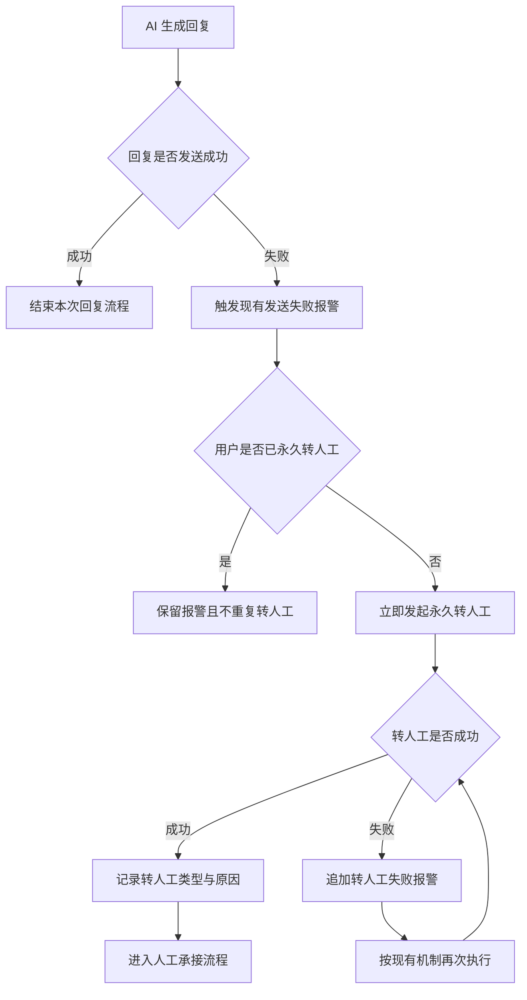

# 异常消息回复失败直接转人工

## 一、修订记录

| 版本号 | 修改日期 | 修改原因 | 修订人 |
|---|---|---|---|
| v1.0 | 2026-09-15 | 初稿 | AI PRD Writer |

## 二、需求概述

- **背景/现状**：当 AI 回复发送失败时，用户无法收到答复，现有流程仅触发报警，仍可能停留在机器人服务状态。
- **需求目标**：当上线后新发生的 AI 回复发送失败报警触发时，系统应立即将对应用户永久转人工，避免用户继续停留在异常机器人会话中。
- **核心逻辑简述**：当任一 AI 回复发送失败报警触发时，系统应保留原报警并发起永久转人工，类型为“用户被动”，原因为“异常协助-消息发送失败”；已永久转人工的用户不重复执行。

## 三、术语表

| 术语 | 定义 |
|---|---|
| 永久转人工 | 用户进入人工服务状态后，不再自动返回机器人服务。 |
| 用户被动 | 非用户主动申请、由异常处置规则触发的转人工类型。 |

## 四、调整范围

| 功能模块 | 调整内容 |
|---|---|
| AI 回复发送失败处置 | 所有 AI 回复发送失败报警触发后，立即发起永久转人工。 |
| 转人工结果记录 | 转人工类型固定为“用户被动”，原因固定为“异常协助-消息发送失败”。 |
| 重复异常处理 | 用户已永久转人工时，后续发送失败报警不重复执行转人工。 |
| 转人工失败兜底 | 转人工执行失败时，按现有机制再次执行并追加失败报警。 |

## 五、业务流程图

**主流程：AI 回复发送失败后的异常处置**

## 六、可交互原型

可交互原型（公网，点击可直接操作）：https://leo-ai05.github.io/prototypes/%E5%BC%82%E5%B8%B8%E6%B6%88%E6%81%AF%E5%9B%9E%E5%A4%8D%E5%A4%B1%E8%B4%A5%E7%9B%B4%E6%8E%A5%E8%BD%AC%E4%BA%BA%E5%B7%A5/

洋葱内网预览（需飞连）：https://minio.yc345.tv/onionext/prototypes/ai-reply-failure-handoff/index.html

GitHub 预览（公网）：[点击查看](https://leo-ai05.github.io/prototypes/%E5%BC%82%E5%B8%B8%E6%B6%88%E6%81%AF%E5%9B%9E%E5%A4%8D%E5%A4%B1%E8%B4%A5%E7%9B%B4%E6%8E%A5%E8%BD%AC%E4%BA%BA%E5%B7%A5/)

原型模式：html-wireframe（单文件可交互原型，无需登录、无需本地启动）

涉及页面：异常处置流程演示页（仅用于展示业务状态，不新增后台页面）

可操作路径：

1. 点击“模拟发送失败报警”，查看保留原报警并立即永久转人工。
2. 点击“重置演示”，再点击“模拟转人工首次失败”，查看追加报警、再次执行及成功结果。
3. 点击“模拟重复失败报警”，查看已永久转人工用户不重复执行。
4. 点击“模拟发送成功”，查看正常回复不触发转人工。

关键态截图：`需求汇总/异常消息回复失败直接转人工/proto-shots/`，共 4 张

## 七、功能需求详细描述

### 7.1 AI 回复发送失败识别

| 功能名称 | 功能说明 | 功能类型 | 是否必填 | 交互说明 | 备注 |
|---|---|---|---|---|---|
| 发送结果 | 表示本次 AI 回复是否成功送达用户。 | 状态 | 是 | 当回复成功发送时，本次流程结束；当回复发送失败且触发现有报警时，进入永久转人工判断。 | 适用于全部 AI 回复类型与发送渠道。 |
| 触发时间 | 表示发送失败报警发生的时间。 | 时间信息 | 是 | 仅处理功能上线后新触发的报警。 | 不追溯历史失败记录。 |
| 用户身份 | 表示本次异常回复对应的用户。 | 用户信息 | 是 | 以发生发送失败的当前会话用户作为转人工对象。 | 无法确认用户时，保留原报警且不发起错误对象的转人工。 |

异常与兜底：

1. AI 回复发送成功时，不触发本需求的永久转人工。
2. 仅发送失败但未达到现有报警触发条件时，沿用现有处置规则。
3. 失败的 AI 回复不自动补发，由人工承接后继续处理用户诉求。

### 7.2 永久转人工

| 功能名称 | 功能说明 | 功能类型 | 是否必填 | 交互说明 | 备注 |
|---|---|---|---|---|---|
| 转人工动作 | 将发生发送失败报警的用户永久转入人工服务。 | 自动处置 | 是 | 报警触发后立即执行，不再额外等待。 | 转人工后的承接流程沿用现有规则。 |
| 转人工类型 | 标识本次转人工由异常被动触发。 | 固定选项 | 是 | 固定记录为“用户被动”。 | 不允许改为其他类型。 |
| 转人工原因 | 标识触发永久转人工的业务原因。 | 固定文本 | 是 | 固定记录为“异常协助-消息发送失败”。 | 不允许留空或使用其他原因。 |
| 用户提示 | 表示转人工后是否向用户展示提示。 | 现有规则 | 否 | 沿用现有转人工提示规则，本次不新增提示消息。 | 若现有规则不发送提示，则保持静默。 |

状态切换：

1. 用户原处于“机器人服务中”时，转人工成功后切换为“已永久转人工”。
2. 用户已处于“已永久转人工”时，不重复执行转人工，用户状态保持不变。
3. 转人工成功后进入现有人工承接流程，本次异常处置流程结束。

### 7.3 原报警保留与重复触发处理

| 功能名称 | 功能说明 | 功能类型 | 是否必填 | 交互说明 | 备注 |
|---|---|---|---|---|---|
| 原报警 | 保留现有 AI 回复发送失败报警。 | 报警 | 是 | 永久转人工不替代、不关闭原报警。 | 报警内容与接收范围沿用现有配置。 |
| 重复触发判断 | 避免已永久转人工用户重复执行转人工。 | 状态判断 | 是 | 每次报警触发时判断用户当前服务状态；已永久转人工时只保留报警。 | 同一用户仅首次满足条件时执行转人工。 |

异常与兜底：

1. 同一用户连续发生多条发送失败报警时，首次转人工成功后，后续报警不重复转人工。
2. 多个不同用户分别发生发送失败报警时，各自独立判断并执行。

### 7.4 转人工失败处理

| 功能名称 | 功能说明 | 功能类型 | 是否必填 | 交互说明 | 备注 |
|---|---|---|---|---|---|
| 失败报警 | 记录永久转人工动作执行失败。 | 报警 | 是 | 转人工失败时，在原发送失败报警之外追加转人工失败报警。 | 便于及时发现用户仍未进入人工服务。 |
| 再次执行 | 转人工首次失败后再次发起永久转人工。 | 自动处置 | 是 | 按现有机制再次执行；成功后记录转人工结果并结束流程。 | 再次执行期间不补发失败的 AI 回复。 |

异常与兜底：

1. 转人工动作失败时，用户状态不得展示为“已永久转人工”。
2. 再次执行成功时，转人工类型与原因仍使用本需求规定的固定内容。
3. 再次执行仍未成功时，保持失败报警，等待现有异常协助流程处理。

### 7.5 测试数据说明

冒烟数据待产品提供，至少包含：一名机器人服务中的用户、一名已永久转人工的用户、一条可触发发送失败报警的 AI 回复，以及一条可模拟转人工首次失败的数据。

## 八、埋点与数据需求

本次不新增埋点，沿用现有发送失败报警与转人工结果记录。

## 九、权限说明

本次不新增角色权限，异常处置由系统自动执行。
