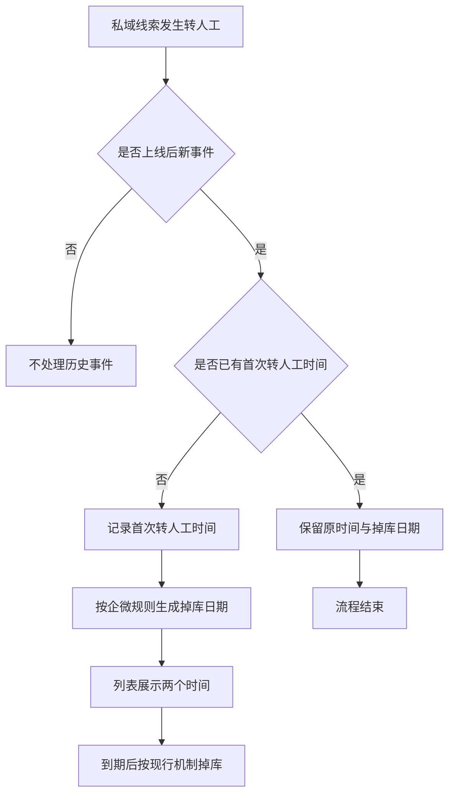

# 私域线索企业微信掉库逻辑调整

## 一、修订记录

| 版本号 | 修改日期 | 修改原因 | 修订人 |
|---|---|---|---|
| v1.0 | 2026-09-04 | 初稿 | AI PRD Writer |
| v1.1 | 2026-09-07 | 调整为所有转人工类型均触发掉库计算 | AI PRD Writer |

## 二、需求概述

- **背景/现状**：私域线索当前掉库起算点未与首次转人工阶段准确对齐。
- **需求目标**：当上线后首次发生任意类型转人工时，系统应按企业微信现行掉库规则生成掉库日期，并在私域线索池展示计算结果。
- **核心逻辑简述**：所有转人工类型均可作为起算事件；首次转人工之前不计算、不掉库，首次发生后沿用企业微信掉库机制。

## 三、术语表

| 术语 | 定义 |
|---|---|
| 私域线索 | 已进入私域线索池并按意向等级分层管理的用户线索 |
| 首次转人工 | 同一条私域线索在需求上线后第一次发生的任意类型转人工 |
| 掉库日期 | 以首次转人工时间为起点，按当时生效的企业微信掉库规则计算的线索到期时间 |

## 四、调整范围

| 功能模块 | 调整内容 |
|---|---|
| 私域线索掉库计算 | 改为在上线后首次转人工发生时开始计算掉库日期 |
| 转人工类型判定 | 销售、规则、扣子及其他转人工类型均可触发 |
| 重复事件处理 | 首次转人工生成结果后，后续转人工与数据重置不重复计算 |
| 私域线索池列表 | 新增“首次转人工时间”“掉库日期”两列，仅展示，不新增筛选和排序 |
| 企业微信掉库联动 | 掉库周期及后续改期沿用现有企业微信掉库机制 |

## 五、业务流程图

**主流程：首次转人工触发掉库计算**

## 六、可交互原型

可交互原型（公网，点击可直接操作）：https://leo-ai05.github.io/prototypes/%E7%A7%81%E5%9F%9F%E7%BA%BF%E7%B4%A2%E4%BC%81%E4%B8%9A%E5%BE%AE%E4%BF%A1%E6%8E%89%E5%BA%93%E9%80%BB%E8%BE%91%E8%B0%83%E6%95%B4/

可交互原型（内网，需飞连）：https://minio.yc345.tv/onionext/prototypes/private-lead-wecom-expiry/index-20260907071706106341.html

GitHub 预览（公网）：[点击查看](https://leo-ai05.github.io/prototypes/%E7%A7%81%E5%9F%9F%E7%BA%BF%E7%B4%A2%E4%BC%81%E4%B8%9A%E5%BE%AE%E4%BF%A1%E6%8E%89%E5%BA%93%E9%80%BB%E8%BE%91%E8%B0%83%E6%95%B4/)

原型模式：html-wireframe（单文件可交互原型，无需登录、无需本地启动）

涉及页面：客户管理 → 付费线索池 → 私域线索池

可操作路径：
1. 点击“从未转人工”，查看两个新增字段均为“--”的状态。
2. 点击“销售首次转人工”“规则首次转人工”或“扣子首次转人工”，查看任意类型首次发生后均生成掉库日期。
3. 点击“其他类型首次转人工”，查看其他转人工类型同样触发计算。
4. 点击“后续再次转人工”，查看后续转人工及数据重置不重算。
5. 点击意向分层页签、搜索按钮和查看线索详情，查看现有页面交互保持不变。

关键态截图：`需求汇总/私域线索企业微信掉库逻辑调整/proto-shots/`，共 6 张。

代码侧验证：业务仓库仅只读核对，未修改、未推送、未发测试环境。

## 七、功能需求详细描述

### 7.1 首次转人工判定

| 功能名称 | 功能说明 | 功能类型 | 是否必填 | 交互说明 | 备注 |
|---|---|---|---|---|---|
| 适用线索判定 | 仅对私域线索执行本次掉库起算逻辑 | 后台规则 | 是 | 转人工事件发生时先确认线索当前属于私域线索 | 非私域线索沿用原有规则 |
| 生效时间判定 | 仅处理需求上线后新发生的转人工事件 | 后台规则 | 是 | 上线前历史已转人工线索不补算、不改写现有结果 | 冒烟数据待产品提供 |
| 转人工类型判定 | 所有转人工类型均可触发掉库计算 | 后台规则 | 是 | 销售、规则、扣子及其他类型均参与首次事件判定 | 不设类型排除条件 |
| 首次事件判定 | 取上线后第一次转人工作为起算事件 | 后台规则 | 是 | 最先发生的转人工即为首次转人工，后续类型不再影响起算结果 | 不区分转人工类型 |

### 7.2 掉库日期计算

| 功能名称 | 功能说明 | 功能类型 | 是否必填 | 交互说明 | 备注 |
|---|---|---|---|---|---|
| 首次转人工时间记录 | 记录首次转人工开始时间 | 后台规则 | 是 | 首次事件确认后立即记录，后续事件不得覆盖 | 以转人工实际开始时间为准 |
| 掉库日期生成 | 以首次转人工时间为起点生成掉库日期 | 后台规则 | 是 | 计算周期沿用事件发生时生效的企业微信掉库规则 | 不在本需求固定掉库天数 |
| 规则改期联动 | 企业微信掉库规则调整时同步处理未掉库线索 | 后台规则 | 是 | 是否改期及改期方式完全沿用现有企业微信处理机制 | 不新增独立改期规则 |
| 到期掉库 | 到达掉库日期后执行线索掉库 | 后台规则 | 是 | 掉库行为、掉库去向和掉库原因沿用现有企业微信掉库机制 | 首次有效事件前不执行掉库 |

### 7.3 重复事件与异常处理

| 场景 | 系统行为 | 可观察结果 |
|---|---|---|
| 同一线索多次收到相同有效事件 | 仅首次成功记录，重复事件不得覆盖 | 首次转人工时间和掉库日期保持不变 |
| 首次转人工后再次转人工 | 忽略重新计算请求 | 列表继续展示原时间 |
| 首次转人工后执行数据重置 | 数据重置不得改变掉库起算结果 | 列表继续展示原时间 |
| 销售类型首次转人工 | 立即记录并计算掉库日期 | 两列展示销售转人工对应结果 |
| 规则、扣子或其他类型首次转人工 | 立即记录并计算掉库日期 | 两列展示首次转人工对应结果 |
| 首次事件信息不完整或计算失败 | 不写入不完整结果，并记录失败以便排查 | 两列保持“--”，线索不得因此提前掉库 |
| 并发收到多个转人工事件 | 只允许最早成功确认的一次成为首次转人工 | 两列只展示一组稳定结果 |
| 列表加载失败 | 沿用现有列表失败处理 | 不单独展示错误时间 |

### 7.4 私域线索池列表

| 字段名称 | 字段说明 | 字段来源 | 展示与交互 | 备注 |
|---|---|---|---|---|
| 首次转人工时间 | 展示上线后第一次任意类型转人工的开始时间 | 首次转人工判定结果 | 位于“企业微信添加时间”之后；仅展示，不可编辑，不提供筛选和排序 | 未转人工、历史不补算或取值异常时显示“--” |
| 掉库日期 | 展示根据首次转人工时间及企业微信规则生成的掉库时间 | 企业微信掉库计算结果 | 位于“首次转人工时间”之后；仅展示，不可编辑，不提供筛选和排序 | 未生成、计算失败或取值异常时显示“--” |

列表其余字段、意向分层页签、统计卡片、搜索、分页、行操作及详情跳转均沿用现有交互。新增两列对当前具备私域线索池查看权限的用户可见，不新增权限。

### 7.5 上线兼容与测试数据

1. 上线前已发生转人工的历史私域线索不回溯、不补算；若上线后再发生转人工，则按上线后的第一次事件开始计算。
2. 上线前未转人工且上线后仍未发生转人工的线索不计算掉库日期。
3. 需要准备至少六类冒烟数据：从未转人工、销售首次转人工、规则首次转人工、扣子首次转人工、其他类型首次转人工、首次转人工后再次转人工。
4. 冒烟账号与具体线索数据待产品提供。

## 八、埋点与数据需求

本次不新增前端操作埋点。上线后应能按业务口径核对首次转人工识别量、掉库日期生成成功量与失败量。

## 九、权限说明

沿用私域线索池现有查看权限；本次不新增角色与权限。
