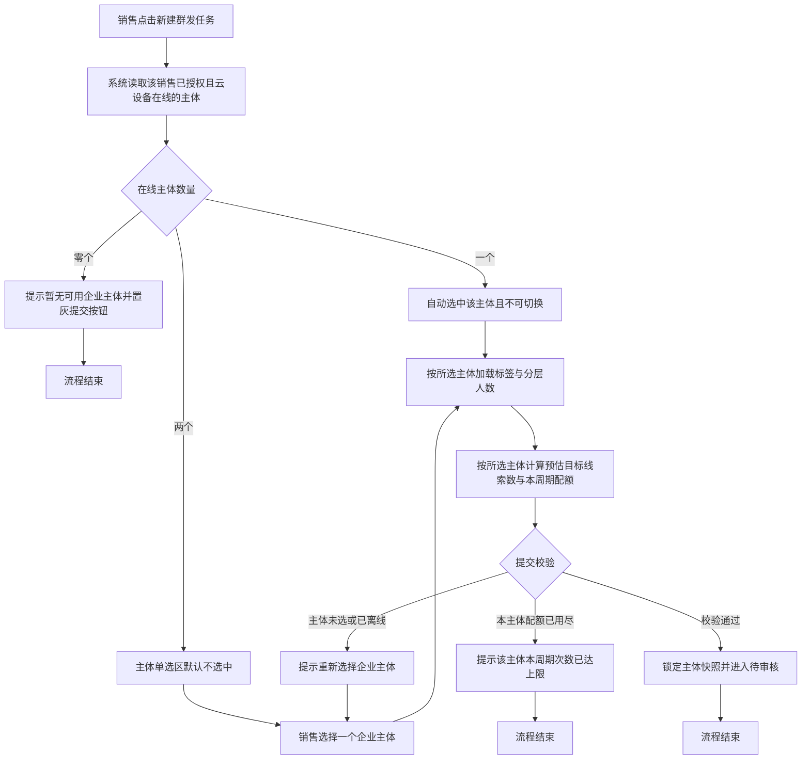
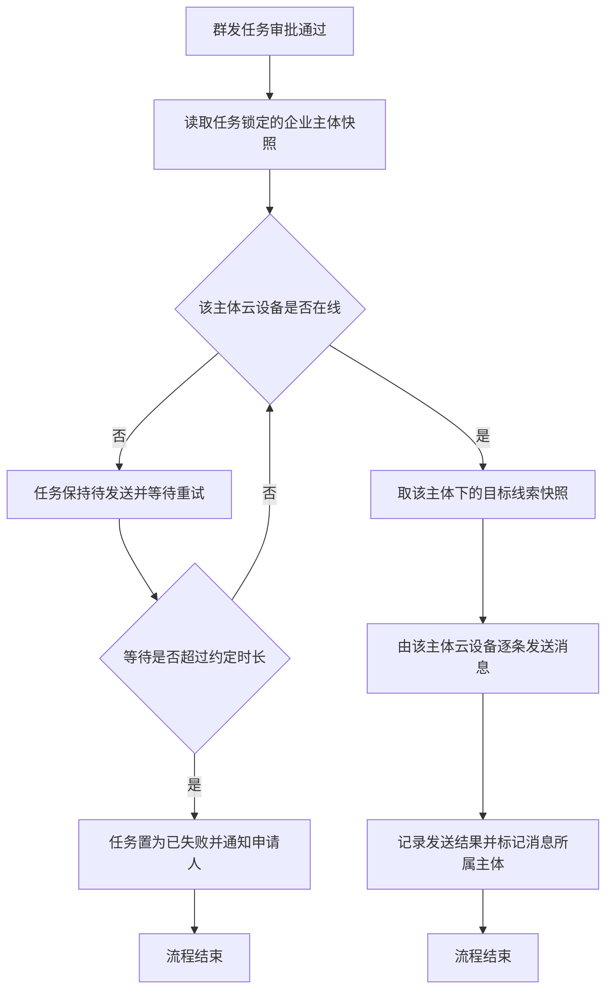

# PRD-私域线索池群发区分企业主体

## 一、修订记录

| 版本号 | 修改日期 | 修改原因 | 修订人 |
|--------|----------|----------|--------|
| v1.0 | 2026-08-21 | 初稿 | AI PRD Writer |

## 二、需求概述

- **背景/现状**：企业微信新增第二个主体后，销售可同时托管两个主体的账号，但私域线索池群发仍按单主体运行——标签只能选到第一个主体、目标人数把两个主体的好友混在一起、发送时用哪个主体的云设备不确定。
- **需求目标**：当销售在私域线索池新建群发任务时，系统应要求先选定一个云设备在线的企业主体，并使标签筛选、目标人数、发送执行、任务记录与审批全部按该主体隔离。
- **核心逻辑简述**：销售在新建群发任务弹窗先选企业主体 → 标签区与分层人数按该主体重新加载 → 提交时锁定主体快照并按该主体独立计算发起次数配额 → 审批通过后由该主体的云设备向该主体下的好友发送。

### 测试数据说明

需要准备一个同时授权绑定两个企业主体、且两个主体云设备均可登录在线的销售账号，两个主体下各自有不少于三条正常好友关系的私域线索。冒烟数据待产品提供。

## 三、术语表

| 术语 | 定义 |
|------|------|
| 企业主体 | 企业微信所属企业，本期涉及葱粉园与洋葱学园两套主体 |
| 云设备 | 销售企业微信账号登录的云端托管设备，群发消息由该设备发出 |
| 在线主体 | 当前销售已授权绑定、且对应云设备处于在线状态的企业主体 |
| 主体快照 | 群发任务提交成功时锁定的所属企业主体，任务后续按该主体执行与展示 |
| 主体配额 | 同一销售账号在同一企业主体下，一个群发周期内还可发起的群发任务次数 |
| 主体线索 | 在某一企业主体下与当前销售建立好友关系的私域线索 |

## 四、调整范围

1. **新建群发任务弹窗**：顶部新增「企业主体」单选区；标签选择区由固定读取单一主体改为按所选主体加载；分层人数、预估目标线索数、抽样预览、本周期配额提示均随所选主体联动刷新；提交校验新增主体必选与主体在线校验。
2. **企业微信标签选择区**：取消只展示固定一个主体标签的限制，按当前所选主体展示该主体的标签组与标签；切换主体时清空已选标签。
3. **目标线索预估**：预估口径由「当前销售名下全部私域线索」收窄为「当前销售在所选主体下的私域线索」；抽样预览同口径。
4. **群发发起次数校验**：由按销售账号统计改为按销售账号与企业主体的组合统计，两个主体各自独立计数与释放。
5. **群发发送执行**：按任务锁定的主体快照选择对应主体的云设备发送；发送前校验该主体云设备在线状态。
6. **群发任务记录弹窗**：列表新增企业主体列；筛选区新增企业主体下拉筛选。
7. **群发任务详情弹窗**：基础信息区新增企业主体展示。
8. **群发审核页与审批弹窗**：列表新增企业主体列；审批弹窗基础信息区展示企业主体。

## 五、业务流程图

**主流程一：新建群发任务时的主体选择与提交**

**主流程二：审批通过后按主体发送**

## 六、可交互原型

可交互原型（公网，点击可直接操作）：https://leo-ai05.github.io/prototypes/%E7%A7%81%E5%9F%9F%E7%BA%BF%E7%B4%A2%E6%B1%A0%E7%BE%A4%E5%8F%91%E5%8C%BA%E5%88%86%E4%BC%81%E4%B8%9A%E4%B8%BB%E4%BD%93/

洋葱内网备用链接（需飞连）：https://minio.yc345.tv/onionext/prototypes/private-lead-bulk-corp-split/index.html

原型模式：html-wireframe（单文件可交互原型，无需登录、无需本地启动）

涉及页面：私域线索分层客户池页 → 新建群发任务弹窗、群发任务记录弹窗、群发任务详情弹窗；群发审核页 → 群发审批弹窗

可操作路径：

1. 打开链接默认进入「新建群发任务弹窗」，场景为「双主体云设备均在线」：此时两个主体均不选中，线索分层人数为占位符，标签区提示先选主体，预估区为占位符，提交审批按钮置灰（悬浮提示「请先选择企业主体」）。
2. 点击「葱粉园」：标签区加载葱粉园的意向阶段与年级标签，分层人数、预估目标线索数、抽样预览（含所属企业主体列）与本周期配额行按葱粉园刷新。
3. 勾选任意标签后点击「洋葱学园」：标签组整体更换为课程偏好与活跃度，已勾选标签被清空，分层人数与预估重新计算。
4. 点击「模拟：所选主体云设备中途离线」：该主体选项置灰并标注「云设备已离线」，选中状态取消，弹窗顶部出现红色提示，提交审批按钮置灰。
5. 同时勾选四个线索分层：预估数变红并提示超出单次上限 200 人，提交审批按钮置灰。
6. 右上角「场景」下拉切换「仅葱粉园云设备在线」：该主体自动选中且不可切换，右侧标注「仅此主体云设备在线」。
7. 切换「无在线主体」：主体区替换为橙色提示，「个人信息」为可点击入口，提交审批按钮置灰。
8. 切换「葱粉园配额已用尽」并选中葱粉园：配额行转为红底告警并展示预计释放时刻，提交审批按钮置灰。
9. 切换「洋葱学园暂无标签」「标签读取失败」：分别查看标签空态与失败重试入口，两者均不阻断提交。
10. 回到默认场景，选中葱粉园与 C 类分层后点击「提交审批」：二次确认弹窗展示企业主体、目标线索、消息条数，确认后提示「已提交，等待审批」并自动跳转到群发任务记录弹窗。
11. 在「群发任务记录弹窗」查看企业主体列（历史任务兜底为葱粉园），用主体下拉筛选葱粉园 / 洋葱学园，筛到空结果时可点「清空筛选」。
12. 点任务名称进入「群发任务详情弹窗」，点「去审批」进入「群发任务审批弹窗」，两处的基础信息区与目标筛选条件区均展示企业主体。

关键态截图：`需求汇总/私域线索池群发区分企业主体/proto-shots/`，共 16 张

代码侧验证（辅助材料，非交付原型）：本地工作区 `code/telesale-web_v2`、分支 `feat/private-lead-bulk-corp-split`，仅本地验证，未推送远程、未发测试环境；对应界面截图留档在 `需求汇总/私域线索池群发区分企业主体/screenshots/`。

GitHub 预览（公网）：[点击查看](https://github.com/Leo-ai05/prototypes/tree/main/%E7%A7%81%E5%9F%9F%E7%BA%BF%E7%B4%A2%E6%B1%A0%E7%BE%A4%E5%8F%91%E5%8C%BA%E5%88%86%E4%BC%81%E4%B8%9A%E4%B8%BB%E4%BD%93)

## 七、功能需求详细描述

### 7.1 新建群发任务弹窗 · 企业主体选择区

**所在位置**：私域线索分层客户池页 → 新建群发任务弹窗 → 顶部提示条之下、基础信息之上。

**功能说明**：让销售在填写任务前先选定本次群发使用的企业主体，后续所有筛选、计数与发送都锁定在该主体范围内。

**功能项清单**：

| 功能按钮 | 功能说明 | 是否必填 | 功能类型 | 交互说明 | 备注 |
|---|---|---|---|---|---|
| 企业主体 | 选择本次群发使用的企业主体 | 是 | 单选 | 以横向选项形式展示当前销售的在线主体，每个选项展示主体名称与在线标识；点击切换后触发标签区、分层人数、预估区、配额区整体刷新 | 可选范围仅为已授权绑定且云设备在线的主体；离线主体不出现在选项中 |
| 主体说明文案 | 解释主体选择的作用范围 | 否 | 只读文本 | 固定展示「本次群发仅触达所选企业主体下的好友，标签、目标人数与发起次数均按该主体单独计算。」 | 不可编辑 |
| 无可用主体提示 | 无在线主体时的兜底说明 | 否 | 只读提示 | 当在线主体数量为零时，主体选项区替换为橙色提示「当前没有云设备在线的企业主体，请先在个人信息中登录云设备后再发起群发。」 | 该状态下提交审批按钮置灰 |

**默认值与状态切换**：

| 条件 | 主体选项区表现 | 提交审批按钮 |
|---|---|---|
| 在线主体数量为零 | 展示无可用主体提示，无可选项 | 置灰不可点击 |
| 在线主体数量为一 | 该主体自动选中并高亮，选项不可切换，右侧展示「仅此主体云设备在线」说明 | 按其余校验规则判定 |
| 在线主体数量为二 | 两个选项均可点击，默认均不选中 | 未选中主体时置灰不可点击 |
| 已选主体在填写过程中变为离线 | 该选项置灰并标注「云设备已离线」，选中状态被取消 | 置灰不可点击，弹窗顶部提示「所选企业主体的云设备已离线，请重新选择」 |

**联动规则**：

1. 切换企业主体时，已勾选的企业微信标签全部清空，标签区按新主体重新加载。
2. 切换企业主体时，线索分层选项后的人数、预估目标线索数、抽样预览、本周期配额提示全部按新主体重新计算。
3. 未选中企业主体时，线索分层人数展示为占位符，标签区展示「请先选择企业主体」，预估区展示占位符且不发起计算。
4. 已填写的任务名称、任务说明、消息内容、发送时机不因切换主体而清空。

**异常兜底**：在线主体读取失败时，主体选项区展示「企业主体信息读取失败，请重新打开弹窗重试」，提交审批按钮置灰，弹窗其余内容保持可见。

### 7.2 新建群发任务弹窗 · 企业微信标签选择区

**所在位置**：私域线索分层客户池页 → 新建群发任务弹窗 → 目标筛选条件区。

**功能说明**：把只读取固定单一主体标签的限制改为按当前所选主体加载标签，让另一主体的好友也能按标签筛选。

**功能项清单**：

| 功能按钮 | 功能说明 | 是否必填 | 功能类型 | 交互说明 | 备注 |
|---|---|---|---|---|---|
| 标签组与标签 | 按所选主体展示该主体的标签组与组内标签 | 否 | 多选 | 按标签组分组平铺展示，可跨组多选；不勾选视为不限制 | 只展示所选主体的标签，不混入另一主体的同名标签 |
| 标签区待选态 | 未选主体时的占位表现 | 否 | 只读提示 | 展示「请先选择企业主体后再选择标签」 | 该状态下不发起标签加载 |
| 标签区空态 | 所选主体下无标签时的兜底 | 否 | 只读提示 | 展示「当前企业主体下暂无可选标签，可不按标签筛选直接提交」 | 不阻断提交 |

**规则**：

1. 标签的筛选口径沿用现有规则：同一标签组内多选为「或」关系，跨标签组为「且」关系。
2. 两个主体存在同名标签时按各自主体独立处理，不做跨主体合并或映射。
3. 标签加载失败时展示「标签读取失败，请重试」并提供重新加载入口，不阻断按分层与添加时间筛选后提交。

### 7.3 新建群发任务弹窗 · 目标筛选与人数预估

**所在位置**：私域线索分层客户池页 → 新建群发任务弹窗 → 目标筛选条件区与预估区。

**功能说明**：把目标线索的计算口径从「当前销售名下全部私域线索」收窄为「当前销售在所选主体下的私域线索」。

**展示内容清单**：

| 字段名称 | 字段说明 | 字段来源 | 备注 |
|---|---|---|---|
| 线索分层人数 | 每个分层选项后展示该分层在所选主体下的线索数 | 私域线索分层结果按所选主体过滤 | 未选主体时展示占位符 |
| 预估目标线索数 | 按所选主体、线索分层、企业微信标签、企业微信添加时间范围组合计算的去重人数 | 目标线索预估结果 | 计算口径新增所选主体条件，其余沿用现有规则 |
| 抽样预览 | 展示满足条件的前若干条线索概要 | 目标线索预估结果 | 新增所属企业主体一列，取值为所选主体名称 |
| 单次上限提示 | 预估人数超过单次上限时的红色提示 | 沿用现有规则 | 上限按所选主体独立判定，不合并两个主体的人数 |

**规则**：

1. 目标线索仅取在所选主体下与当前销售存在正常好友关系的线索；好友关系为已删除时不纳入。
2. 同一个用户在两个主体下都与当前销售是好友时，按两条独立线索处理，各自归属自己的主体，不做跨主体去重合并。
3. 近七天已群发排除策略按所选主体独立判定：该用户在另一主体下近七天被群发过，不影响本主体下的本次触达。
4. 未选中企业主体时不发起预估计算，预估区展示占位符与「请先选择企业主体」说明。

### 7.4 新建群发任务弹窗 · 本周期配额与提交审批按钮

**所在位置**：私域线索分层客户池页 → 新建群发任务弹窗 → 规则说明区与底部操作区。

**功能说明**：把群发发起次数的配额与拦截由「按销售账号」改为「按销售账号与企业主体的组合」判定。

**配额展示规则**：

1. 配额文案改为「本周期在葱粉园已发起 1 次 / 上限 1 次，剩余 0 次」，其中主体名称取当前所选主体。
2. 未选中企业主体时，配额行展示「请先选择企业主体后查看本周期可发起次数」。
3. 切换企业主体后，配额行按新主体重新读取并刷新。
4. 配额用尽时整行切换为红底告警样式，并展示预计释放时刻。

**提交审批按钮启用条件**：

1. 已选中一个企业主体，且该主体云设备当前在线。
2. 当前销售在该主体下的本周期已发起次数小于次数上限。
3. 其余启用条件沿用现有规则：任务名称已填、至少选择一个线索分层、消息内容非空且未超字数、预估目标线索数大于零且未超单次上限、定时发送时已选择合法时间。

**禁用表现**：

| 未满足条件 | 悬浮提示文案 |
|---|---|
| 未选中企业主体 | 请先选择企业主体 |
| 无在线主体 | 当前没有云设备在线的企业主体，暂不可发起群发 |
| 所选主体云设备已离线 | 所选企业主体的云设备已离线，请重新选择 |
| 该主体本周期配额用尽 | 该企业主体本周期群发次数已达上限，暂不可提交 |

**点击后流程**：

1. 二次确认弹窗正文增加主体信息，文案为「确认提交本次群发任务给直属上级审批？企业主体：葱粉园，目标线索：168 人，消息条数：2 条。提交后无法直接发送，且该主体本周期剩余可发起次数将变为 0 次。」
2. 确认后按钮进入加载态并禁用，提交成功后提示「已提交，等待审批」，关闭新建弹窗并打开群发任务记录弹窗。
3. 后台二次校验未通过时，提示后台返回的原因文案，弹窗保持打开且已填内容不丢失，主体选项区与配额行同步刷新为最新状态。

### 7.5 群发任务记录弹窗 · 主体展示与筛选

**所在位置**：私域线索分层客户池页 → 群发任务记录弹窗。

**功能说明**：让销售与上级在任务列表中直接分辨每条任务属于哪个企业主体，并可按主体筛选。

**列表新增字段**：

| 字段名称 | 字段说明 | 字段来源 | 备注 |
|---|---|---|---|
| 企业主体 | 展示任务提交时锁定的主体名称 | 任务的主体快照 | 位于创建人之后、目标线索数之前；历史任务无主体信息时展示「葱粉园」 |

**筛选区新增项**：

| 功能按钮 | 功能说明 | 是否必填 | 功能类型 | 交互说明 | 备注 |
|---|---|---|---|---|---|
| 企业主体 | 按任务所属主体筛选任务 | 否 | 下拉单选 | 可选「全部 / 葱粉园 / 洋葱学园」，默认「全部」；切换后重新查询列表并刷新分页 | 与现有任务名称、任务状态、创建时间、创建人筛选为「且」关系 |

**异常兜底**：按主体筛选后无结果时，列表展示「当前企业主体下暂无群发任务，可调整筛选条件」，并提供清空筛选入口。

### 7.6 群发任务详情弹窗与群发审核页 · 主体展示

**所在位置**：群发任务详情弹窗基础信息区；群发审核页任务列表与群发审批弹窗基础信息区。

**功能说明**：让审批人在审批前明确本次群发的主体范围，避免跨主体误判。

**展示内容清单**：

| 字段名称 | 字段说明 | 字段来源 | 备注 |
|---|---|---|---|
| 企业主体（详情弹窗） | 展示任务锁定的主体名称 | 任务的主体快照 | 位于基础信息区创建人之后 |
| 企业主体（审核页列表） | 展示任务锁定的主体名称 | 任务的主体快照 | 位于提交人之后、目标线索数之前 |
| 企业主体（审批弹窗） | 展示任务锁定的主体名称 | 任务的主体快照 | 与目标人数、消息条数同区展示 |
| 目标筛选还原（详情与审批弹窗） | 还原提交时的主体、线索分层、企业微信标签、企业微信添加时间范围 | 任务快照 | 标签只读展示为所属主体下的标签，不做跨主体映射 |

**规则**：审批人只读展示主体信息，不可在审批环节修改任务所属主体；需要更换主体时只能驳回后由申请人重新发起。

### 7.7 群发发送执行与配额计数规则

**发送执行**：

1. 任务提交成功时锁定所选企业主体作为任务快照，管理员或销售后续变更云设备登录状态不改变已锁定的主体。
2. 审批通过后进入发送环节前，先校验该主体云设备是否在线；在线则由该主体云设备逐条发送。
3. 该主体云设备离线时，任务保持待发送状态并按固定间隔重试；持续离线超过约定时长后置为已失败并通知申请人。**约定时长取值待确认**。
4. 发送时只触达任务快照中属于该主体的目标线索，不因销售在另一主体下也有好友而扩大范围。
5. 发送节奏、允许发送时段、相邻消息间隔沿用现有规则，按主体分别执行、互不排队等待。
6. 每条发出的消息在会话流中带上所属企业主体信息，供后续在员工会话明细中区分。

**配额计数规则**：

1. 计数键为「销售账号 + 企业主体」，两个主体各自独立计数。
2. 一次提交成功在对应主体下计一次占用，占用时刻为提交成功时刻。
3. 周期为滚动窗口，判定时统计当前时刻向前推配置天数内、该主体下的占用次数。
4. 任务被驳回时释放该主体下的这次占用；待审核、审核通过、发送中、已完成状态保留占用。
5. 销售解除某一主体授权或该主体云设备下线，不清空该主体已产生的占用记录。

### 7.8 横切规则

**身份校验**：

1. 主体选项区只展示当前登录销售本人已授权绑定的主体，不展示他人主体。
2. 提交时后台二次校验所选主体确实属于当前销售且云设备在线；校验未过时拦截提交并提示原因。

**状态判定**：

1. 群发任务状态沿用现有的待审核、审核通过、审核驳回、发送中、已完成、已失败六种，本次不新增状态。
2. 主体在线状态取值为在线与离线两种，离线主体不可被选择。

**跳转闭环**：

1. 提交成功后关闭新建群发任务弹窗并打开群发任务记录弹窗，携带刚提交的任务作为默认定位对象，主体筛选保持为「全部」。
2. 无可用主体时，提示文案中的「个人信息」为可点击入口，点击后跳转到个人信息页的关联企业微信列表。
3. 关闭新建群发任务弹窗时的二次确认沿用现有交互。

**兼容处理**：本次上线前已存在的群发任务统一按葱粉园展示主体，不做数据回溯补齐，也不影响其历史发送结果。

## 八、埋点与数据需求

本次需求不涉及新增埋点。

## 九、权限说明

- **私域线索池群发发起角色**：可在新建群发任务弹窗中选择本人已授权且在线的企业主体，并按主体发起群发任务。
- **群发审批角色**：可在群发审核页与审批弹窗中查看任务所属企业主体，不可修改主体。
- **云设备登录权限**：决定销售能否让某一主体云设备在线，进而决定该主体是否出现在主体选项中；权限本身沿用现有规则，本次不调整。
