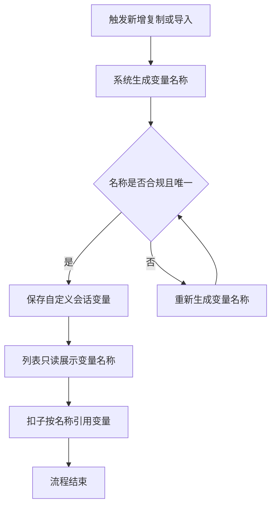
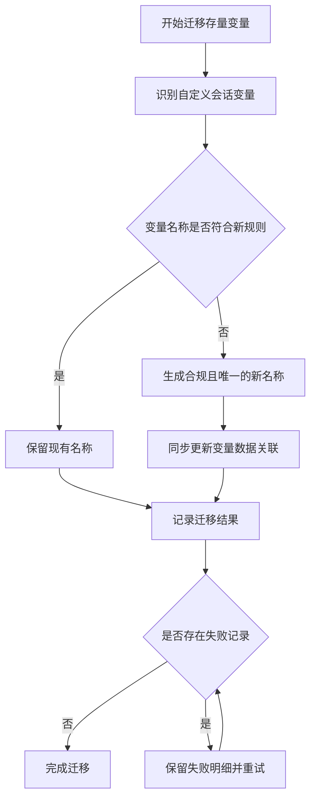

# 自定义会话变量名称支持扣子引用

## 一、修订记录

| 版本号 | 修改日期 | 修改原因 | 修订人 |
|---|---|---|---|
| v1.0 | 2026-09-15 | 初稿 | AI PRD Writer |

## 二、需求概述

- **背景/现状**：当前自定义会话变量的系统名称以数字开头，无法被扣子正确引用。
- **需求目标**：当系统生成或迁移自定义会话变量名称时，名称应符合扣子引用规则且在全系统内唯一。
- **核心逻辑简述**：系统为新建、复制和导入的自定义会话变量生成合规名称，并一次性更新存量自定义会话变量名称；页面只读展示生成结果。

## 三、术语表

| 术语 | 定义 |
|---|---|
| 自定义会话变量 | 由运营人员创建、用于记录会话业务信息的变量。 |
| 变量名称 | 系统为变量生成的唯一引用名称，在会话属性列表中以“字段标识”展示。 |
| 扣子引用 | 扣子在对话或工作流中按变量名称读取或更新会话变量。 |

## 四、调整范围

| 功能模块 | 调整内容 |
|---|---|
| 自定义会话变量创建 | 系统生成符合扣子引用规则且全局唯一的变量名称。 |
| 自定义会话变量复制与导入 | 新增的自定义变量统一由系统生成名称，外部内容不得覆盖生成结果。 |
| 会话属性列表 | 继续只读展示变量名称，不提供修改和复制操作。 |
| 存量自定义会话变量 | 上线时强制更新不合规名称，不保留旧名称引用；变量定义与已有变量值的关联保持不变。 |
| 统一入口约束 | 页面操作及系统间写入均不得产生不合规或重复名称。 |

## 五、业务流程图

**自定义会话变量名称生成与展示流程**

**存量自定义会话变量迁移流程**

## 六、可交互原型

可交互原型：生成中（发布后回填链接）

## 七、功能需求详细描述

### 7.1 自定义会话变量名称生成

| 功能按钮 | 功能说明 | 是否必填 | 功能类型 | 交互说明 | 备注 |
|---|---|---|---|---|---|
| 系统生成变量名称 | 为每个自定义会话变量生成扣子可引用的名称 | 是 | 系统处理 | 当用户新建、复制或导入自定义会话变量时，系统在保存前生成名称；用户无需填写且不能修改 | 变量名称在全系统内唯一 |

**变量名称规则：**

1. 名称只能包含英文字母、数字或下划线。
2. 名称的首个字符必须是英文字母或下划线。
3. 名称总长度不得超过 32 个字符。
4. 名称必须在全系统范围内唯一。
5. 具体生成方式由技术方案确定，但不得改变以上可观察结果。
6. 同一变量创建成功后，编辑属性名称、描述、分类、是否对接扣子或扣子是否更新时，变量名称保持不变。
7. 复制自定义变量时，副本获得新的全局唯一名称。
8. 导入或系统间写入自定义变量时，外部传入内容不得绕过系统生成规则。

**异常与兜底：**

1. 当系统无法生成合规且唯一的名称时，本次新增、复制或导入操作失败，不创建不完整变量，并提示“变量名称生成失败，请稍后重试”。
2. 重复提交不得产生两个同名变量；每次成功创建的变量均获得独立名称。
3. 系统间写入出现不合规名称时，应拒绝写入并返回明确失败原因。

### 7.2 会话属性列表只读展示

| 字段名称 | 字段说明 | 字段来源 | 备注 |
|---|---|---|---|
| 属性名称 | 展示运营人员填写的业务名称 | 来自自定义会话变量配置 | 沿用现有展示与编辑规则 |
| 字段类型 | 展示变量承载的信息类型 | 来自变量定义 | 沿用现有展示 |
| 字段标识 | 展示系统生成的变量名称 | 来自系统生成结果 | 只读展示，不提供编辑或复制操作；无值时显示“—” |
| 描述 | 展示变量的业务用途 | 来自自定义会话变量配置 | 沿用现有展示与编辑规则 |
| 是否对接扣子 | 展示变量是否提供给扣子使用 | 来自自定义会话变量配置 | 沿用现有“是/否”状态 |
| 扣子是否更新 | 展示扣子是否可以更新该变量 | 来自自定义会话变量配置 | 沿用现有“是/否”状态 |

**展示与搜索规则：**

1. 当列表加载成功时，字段标识列展示完整变量名称；内容超过列宽时沿用现有悬浮查看方式。
2. 搜索继续覆盖属性名称、描述和字段标识。
3. 当变量名称暂时无值时，字段标识列显示“—”，不得展示空白。
4. 当列表加载失败时，沿用现有加载失败提示，用户可重新进入页面重试。
5. 本次不新增变量名称编辑入口，也不新增复制按钮。

### 7.3 存量自定义会话变量名称迁移

| 功能按钮 | 功能说明 | 是否必填 | 功能类型 | 交互说明 | 备注 |
|---|---|---|---|---|---|
| 存量名称迁移 | 将不符合规则的存量自定义会话变量名称更新为合规且唯一的名称 | 是 | 系统处理 | 上线时统一执行；符合规则且全局唯一的名称可保留，不合规或重复的名称必须更新 | 不保留旧名称引用 |

**迁移规则：**

1. 迁移对象仅为自定义会话变量，系统预置会话变量不在本次调整范围内。
2. 每个迁移后的名称均须满足字符、首字符、长度和全局唯一规则。
3. 变量名称更新后，原变量的属性名称、描述、分类、启用状态、扣子配置及已有变量值保持不变。
4. 变量名称更新后，所有依赖该变量的数据关联应同步指向新名称，避免出现变量定义存在但历史值无法读取的情况。
5. 旧名称不再作为扣子引用入口，也不保留兼容映射。
6. 迁移应记录处理总数、成功数、失败数及失败原因，失败记录可单独重试。
7. 存在未处理完成的失败记录时，不得将整体迁移标记为完成。

**边界场景：**

1. 多个存量名称转换后发生冲突时，系统应为每条变量生成不同的合规名称。
2. 迁移重复执行时，已成功迁移的变量不得再次更名。
3. 单条变量迁移失败时，不得破坏其原有定义和变量值关联；系统记录失败原因并等待重试。
4. 迁移期间用户读取变量时，应得到完整且一致的变量名称与变量值，不得出现新旧名称交叉展示。

### 7.4 扣子引用结果

1. 当自定义会话变量已开启“是否对接扣子”时，扣子可按新变量名称读取该变量。
2. 当自定义会话变量同时开启“扣子是否更新”时，扣子可按新变量名称更新该变量；未开启时沿用现有限制。
3. 当扣子提交不存在或已废弃的旧名称时，系统不匹配任何变量，并按现有未知变量规则处理。
4. 本次名称规则不改变变量是否对接扣子、扣子是否更新及变量值格式的现有业务含义。

### 7.5 测试数据说明

冒烟数据待产品提供。测试数据至少应包含新建自定义变量、复制自定义变量、导入自定义变量、合规存量名称、不合规存量名称、迁移后名称冲突及迁移失败重试场景。

## 八、埋点与数据需求

本次不新增用户行为埋点。存量迁移结果按第七章要求记录。

## 九、权限说明

沿用现有会话属性查看与编辑权限，不新增角色或权限。
