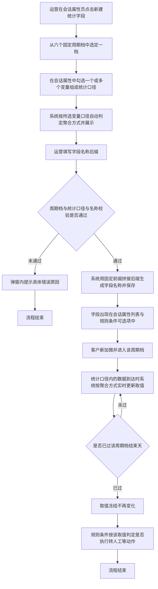
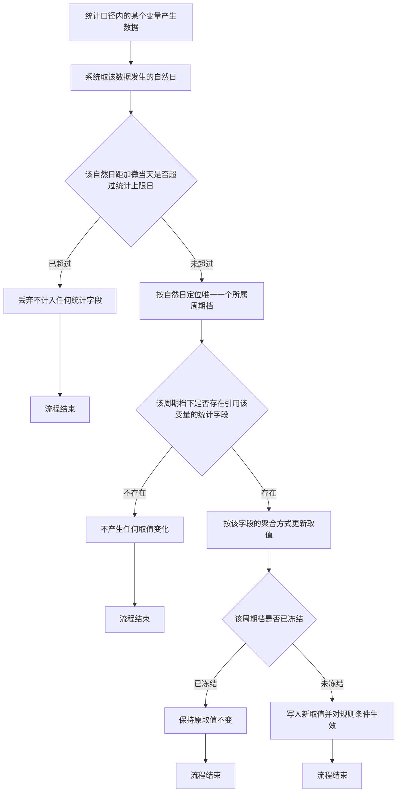

# PRD-自定义统计周期学习时长字段

## 一、修订记录

| 版本号 | 修改日期 | 修改原因 | 修订人 |
|-|-|-|-|
| v1.0 | 2026-09-01 | 初稿 | AI PRD Writer |
| v1.1 | 2026-09-07 | 统计口径从固定的「全部学习时长」改为可勾选组合：新增「统计字段」多选项，支持观看视频时长、答题时长、看题型时长任意组合求和 | AI PRD Writer |
| v1.2 | 2026-09-07 | 统计对象改为直接从会话属性中选取：统计字段由三项时长的勾选组合，改为在会话属性中单选一个属性，可选范围为全部数值型属性与「当日」口径的是否标记，窗口聚合方式由该属性口径自动判定 | AI PRD Writer |
| v1.3 | 2026-09-15 | 按性能压力收敛口径：统计窗口从运营任意填写起止天数改为六个固定周期档单选；统计对象从单选一个会话属性改为多选若干变量组合求和；字段名称改为系统固定前缀加运营自填后缀；取消编辑能力，改为删除重建；统计上限日收敛为第 60 天 | AI PRD Writer |

## 二、需求概述

- **背景/现状**：当运营可以任意填写统计窗口的起止天数、并任意选取一个会话属性作为统计对象时，每个客户需要维护的统计坐标随配置数量无上限膨胀，数据到达时的实时重算量已超出系统承受范围。
- **需求目标**：当运营创建统计字段时，系统应只允许从六个固定周期档中选定一档，使每条数据按其发生的自然日只落入唯一一个周期档，把单个客户的统计坐标封顶在六档以内。
- **核心逻辑简述**：运营在会话属性页新建统计字段，选定一个固定周期档、勾选若干会话属性变量组成统计口径、填写字段名称后缀；客户加微后数据到达时系统按数据发生的自然日把它归入所属周期档并实时累加，该周期档走完后次日零点取值冻结，规则条件按该取值判定是否执行转人工等动作。

## 三、术语表

| 术语 | 定义 |
|-|-|
| 加微时间 | 客户与坐席建立企微好友关系的时刻 |
| 周期档 | 以加微当天为第 0 天起算的一段固定自然日区间，本次共六档，两端都包含在内，各档互不重叠也无间隙 |
| 统计口径 | 运营为一个统计字段勾选的那一组会话属性变量，多选时把各变量在周期档内的结果相加 |
| 名称后缀 | 运营为统计字段自行填写的名称尾部，与系统固定前缀拼成完整字段名称 |
| 统计字段 | 本次新增的一类会话属性，取值由系统按「周期档 + 统计口径」自动计算得出，运营不能手工填写 |
| 当日增量型 | 每日零点重置、只反映当天新增量的会话属性，如「学情报告-观看视频时长（当日·分钟）」 |
| 累计快照型 | 只增不减的历史累计会话属性，如「学情报告-观看视频时长（上线后累计·分钟）」 |
| 当日标记型 | 每日零点重置、取值为是或否的会话属性，如「当日是否打开APP（实时）」 |
| 聚合方式 | 把统计口径在周期档内的表现折算成一个数的算法，由所选变量的口径决定，分累计、新增、天数三种，运营不参与配置 |
| 冻结 | 周期档的结束天已过去后，该字段取值不再随新数据变化 |
| 统计上限日 | 加微后第 60 天，超过该天的数据一律不再计入任何统计字段 |

## 四、调整范围

| 序号 | 功能模块 | 调整说明 |
|-|-|-|
| 1 | 会话属性页 — 新建入口 | 在页面操作区新增「新建统计字段」入口 |
| 2 | 会话属性页 — 新建统计字段弹窗 | 新增弹窗，先单选周期档，再勾选统计口径，再填写名称后缀，并实时预览聚合方式与完整字段名称 |
| 3 | 会话属性页 — 统计口径选择面板 | 新增面板，按会话属性分类展示可作为统计口径的变量，支持搜索与多选，每项标注该变量将采用的聚合方式 |
| 4 | 会话属性页 — 属性列表 | 统计字段归入「自定义字段」分类展示，字段类型显示为数字，描述中体现周期档、统计口径与聚合方式 |
| 5 | 会话属性页 — 删除统计字段 | 沿用现有自定义字段删除交互；本次不提供编辑入口，口径调整通过删除重建完成 |
| 6 | 规则配置页 — 条件变量选择 | 统计字段在条件变量选择面板中可选，操作符沿用现有配置 |
| 7 | 取值计算 | 新增按「周期档 + 统计口径」计算取值的逻辑，含数据的周期档归属判定、累计与新增与天数三种聚合算法、周期档冻结与统计上限日 |

## 五、业务流程图

**主流程：创建统计字段到规则判定**

**子流程：数据到达后的周期档归属判定**

## 六、可交互原型

可交互原型：生成中（发布后回填链接）

## 七、功能需求详细描述

### 7.1 会话属性页 — 新建统计字段入口

| 功能按钮 | 功能说明 | 是否必填 | 功能类型 | 交互说明 | 备注 |
|-|-|-|-|-|-|
| 新建统计字段 | 打开新建统计字段弹窗，创建一个把若干会话属性变量按加微后固定周期档聚合的新会话属性 | — | 按钮 | 位于会话属性页右上角操作区，与现有「新增属性」按钮并列。任何时候均可点击，点击后打开新建统计字段弹窗 | 该入口创建出的字段固定归入「自定义字段」分类，不提供分类选择 |

### 7.2 会话属性页 — 新建统计字段弹窗

表单按「先定周期、再定口径、最后命名」的顺序排列：周期档在上，统计口径在中，名称后缀在下，聚合方式说明与完整名称预览实时刷新。

| 功能按钮 | 功能说明 | 是否必填 | 功能类型 | 交互说明 | 备注 |
|-|-|-|-|-|-|
| 统计周期 | 选定本字段统计哪一段加微后的自然日区间 | 是 | 单选按钮组 | 横向排列六个固定周期档：首日、1-3日、4-7日、8-14日、15-30日、30日以后。默认选中「首日」。各档下方以浅灰小字标注对应的自然日区间。任何时候必有一档处于选中态，不能取消选中 | 六档由系统固定，运营不能新增、删除或修改区间。区间定义见 7.7 |
| 统计口径 | 勾选哪些会话属性变量作为本字段的统计内容 | 是 | 多选选择框 | 默认为空，占位文案「请选择会话属性变量」。点击后在下方展开统计口径选择面板（见 7.3）。选中后选择框内以标签形式展示各变量的完整名称，每个标签可单独点叉移除。未选择时下方红字提示「请选择统计口径」 | 多选时把各变量在周期档内的结果相加，只做求和，不提供减、乘、除与取最大值 |
| 聚合方式说明 | 告知运营本字段将以何种算法把统计口径折算成一个数 | — | 只读提示块 | 勾选至少一个变量后在其下方展示蓝色提示块，内容为「本字段将按{聚合词}统计：{算法说明}，单位{单位}。聚合方式由所选变量的口径决定（{判定依据}），不可手工更改」。未勾选时不展示 | 聚合方式由系统按所选变量口径自动判定，运营既不需要也不能配置。三种聚合方式见 7.8 |
| 字段名称后缀 | 运营为本字段自行命名的名称尾部 | 是 | 输入框 | 默认为空，占位文案「如：看课时长」。限制 1 到 20 个字，允许中文、数字与英文，不允许输入空格与标点符号。输入超长时停止接收后续字符并在下方灰字展示「已输入 20/20 字」；输入不允许的字符时红字提示「名称后缀只能填写中文、数字或英文」 | 前缀由周期档决定、运营不能修改，避免名称里的周期与实际统计的周期档不一致 |
| 字段名称预览 | 展示系统前缀与运营后缀拼成的完整字段名称 | — | 只读文本 | 周期档或名称后缀变化时实时刷新，形如「加微后4-7日看课时长」。后缀为空时只展示前缀与占位提示「加微后4-7日｛请填写名称后缀｝」 | 前缀生成规则见 7.2 下方「字段名称生成规则」 |
| 字段说明预览 | 展示系统自动生成的字段说明 | — | 只读文本 | 内容为「统计客户加微后{周期档名称}（第{起始天}天至第{结束天}天，含两端）的{统计口径变量名称清单}，聚合方式为{算法说明}，单位{单位}」；多个变量以「加」连接 | 与字段名称同步刷新，保存后写入列表的描述列 |
| 确定 | 提交创建 | — | 按钮 | 已选周期档、已勾选至少一个统计口径变量、名称后缀填写合法且全部校验通过时按钮可点击；否则**置灰**，鼠标悬浮提示「请先选择统计口径并填写名称后缀」。点击后按钮进入加载中并禁用，创建成功后弹窗关闭、属性列表刷新并定位到「自定义字段」分类、顶部提示「统计字段创建成功」 | 创建失败时弹窗保持打开、已填内容保留，顶部提示「创建失败，请重试」 |
| 取消 | 放弃创建 | — | 按钮 | 已改动过周期档、统计口径或名称后缀时点击需二次确认「填写内容尚未保存，确认关闭？」；未改动时直接关闭 | 点击遮罩层与右上角关闭按钮的行为与「取消」一致 |

**字段名称生成规则：**

| 序号 | 周期档 | 系统固定前缀 | 完整名称示例 |
|-|-|-|-|
| 1 | 首日 | 加微后首日 | 加微后首日学习时长 |
| 2 | 1-3日 | 加微后1-3日 | 加微后1-3日看课时长 |
| 3 | 4-7日 | 加微后4-7日 | 加微后4-7日学习时长 |
| 4 | 8-14日 | 加微后8-14日 | 加微后8-14日APP活跃天数 |
| 5 | 15-30日 | 加微后15-30日 | 加微后15-30日看课时长 |
| 6 | 30日以后 | 加微后30日以后 | 加微后30日以后学习时长 |

名称由系统前缀与运营后缀两段拼成，中间不加分隔符。前缀只由周期档决定，运营无法编辑；后缀由运营填写，用来表达这个字段统计的是什么。改为后缀自填而不是全自动生成，是因为统计口径已经允许多选组合，系统无法从一组变量里推出一个既准确又简短的名称——「学情报告-观看视频时长加学情报告-答题时长加学情报告-看题型时长」不是运营在规则里想看到的名字，而「学习时长」才是。

**创建校验规则：**

| 序号 | 校验项 | 不通过时的提示文案 |
|-|-|-|
| 1 | 已选定一个周期档 | 请选择统计周期 |
| 2 | 已勾选至少一个统计口径变量 | 请选择统计口径 |
| 3 | 所选变量的类型一致（数值型与是否型不可混选） | 数值型变量与是否型变量不能选在同一个字段里，两者的统计结果无法相加 |
| 4 | 所选数值型变量的单位一致 | 所选变量的单位不一致（分钟与次），不能相加，请分开创建字段 |
| 5 | 所选数值型变量的口径一致（当日增量型与累计快照型不可混选） | 当日口径变量与累计口径变量不能选在同一个字段里，两者的聚合方式不同 |
| 6 | 名称后缀已填写且长度在 1 到 20 个字之间 | 请填写字段名称后缀 |
| 7 | 名称后缀只含中文、数字或英文 | 名称后缀只能填写中文、数字或英文 |
| 8 | 不存在「周期档 + 统计口径」完全相同的统计字段 | 该统计周期与统计口径的组合已存在字段「加微后4-7日看课时长」，请勿重复创建 |
| 9 | 生成的完整字段名称未被占用 | 字段名称「加微后4-7日看课时长」已存在，请修改名称后缀 |

第 8 条只在周期档与统计口径**同时**相同时才判定重复；勾选的变量集合只要不完全一致就属于两个不同字段。周期档相同但口径不同（如同为 4-7 日，一个统计看课时长、一个统计学习时长）允许各自创建。

第 9 条是第 8 条之外的独立校验：口径不同但运营填了同一个后缀时，会生成两个同名字段，规则配置里无法分辨，因此单独拦截。

### 7.3 会话属性页 — 统计口径选择面板

在新建统计字段弹窗中点击「统计口径」选择框后，在其下方展开的浮层面板。交互形态沿用规则配置页的条件变量选择面板，区别是本面板为多选且只展示可作为统计口径的变量。

| 功能按钮 | 功能说明 | 是否必填 | 功能类型 | 交互说明 | 备注 |
|-|-|-|-|-|-|
| 搜索框 | 按名称检索会话属性变量 | 否 | 输入框 | 位于面板顶部，占位文案「搜索会话属性名称」。输入时右侧列表实时过滤，匹配方式为名称包含关键词 | 搜索范围为当前选中分类下的变量 |
| 分类栏 | 按会话属性分类切换 | — | 列表 | 位于面板左侧，分类清单与会话属性页左侧分类栏保持一致，不展示没有可选变量的分类。默认选中第一个有可选变量的分类 | 沿用现有分类，本次不新增分类 |
| 变量列表 | 展示并勾选统计口径变量 | 是 | 多选列表 | 位于面板右侧。每项主行为变量完整名称与勾选框，副行以浅灰小字展示该变量的口径说明与「按周期档{聚合词}」。点击某项即勾选，可继续勾选其他项，面板不自动收起；已勾选项在再次打开时保持勾选态 | 与已勾选项冲突的变量（类型、单位或口径不一致）在列表中置灰不可勾选，鼠标悬浮提示「与已选变量的{类型或单位或口径}不一致，不能选在同一个字段里」 |
| 完成 | 收起面板 | — | 按钮 | 位于面板右下角，点击后收起面板并把已勾选变量回填到选择框。点击面板外任意区域的行为与「完成」一致 | 已勾选数量实时展示在按钮左侧，形如「已选 3 个」 |
| 空态 | 分类下无可选变量时的兜底 | — | 文案 | 「自定义字段」分类下展示「自定义字段中暂无可作为统计口径的变量。统计字段本身不能再作为统计口径」；其余分类搜索无结果时展示「没有匹配的会话属性」 | — |

**可选变量范围：**

| 序号 | 规则 |
|-|-|
| 1 | **「当日」口径的数值型变量**可选，如「学情报告-观看视频时长（当日·分钟）」「打开APP次数（当日·含前后台切换）」，按周期档内各自然日的值相加统计 |
| 2 | **「上线后累计」口径的数值型变量**可选，如「学情报告-观看视频时长（上线后累计·分钟）」，按周期档结束日的值减去起始日前一日的值统计 |
| 3 | **「当日」口径的是否标记变量**可选，如「当日是否打开APP（实时）」「当日是否有学习（实时）」，按周期档内标记为「是」的自然日天数统计 |
| 4 | **「当周」「当月」口径的变量不可选**，不在面板中展示。它们在自然周或自然月边界会被重置，落进一个跨周跨月的周期档后既不能逐日相加也不能期末减期初，任何聚合方式都会算出错值 |
| 5 | **比率型变量不可选**，如「答题正确率（当日·%）」。本次统计口径只做相加求和，百分数相加没有业务含义 |
| 6 | 滚动窗口口径的是否型变量不可选，如「近7日是否活跃」。它在某天为真只表示过去 7 天内活跃过，不是当天独立的标记，数天数会把同一次活跃重复计入 |
| 7 | 字符串型、日期型会话属性不可选，不在面板中展示 |
| 8 | 统计字段本身虽然是数值型，但不可被再次选作统计口径，避免嵌套定义 |
| 9 | 可选范围随会话属性的增减自动变化，新增符合上述规则的变量后无需额外配置即可被勾选 |

### 7.4 会话属性页 — 属性列表中的统计字段

| 字段名称 | 字段说明 | 字段来源 | 备注 |
|-|-|-|-|
| 属性名称 | 展示系统前缀与运营后缀拼成的完整名称，如「加微后4-7日看课时长」，名称右侧带「统计字段」标记 | 新建统计字段弹窗生成 | 名称不可编辑 |
| 字段类型 | 固定展示「数字」 | 统计字段固定为数字类型 | 单位继承统计口径，列表中不展示单位 |
| 字段标识 | 沿用现有自定义字段的标识展示方式 | 系统创建时自动分配 | — |
| 描述 | 展示自动生成的字段说明，含周期档及其自然日区间、统计口径的全部变量名称、聚合方式与单位 | 新建统计字段弹窗生成 | 描述不可编辑。列表不单独增加「周期档」与「统计口径」列，两者通过描述体现 |
| 是否对接扣子 | 固定展示「否」 | 统计字段本期不对接扣子 | 该列对统计字段不可编辑 |
| 扣子是否更新 | 固定展示「否」 | 统计字段取值由系统计算，不接受外部回写 | 该列对统计字段不可编辑 |
| 操作 | 只提供「删除」一个操作 | 沿用现有自定义字段删除 | 统计字段不提供「编辑」与「修改分类」操作，口径需要调整时删除后重建 |

**列表展示规则：**

| 序号 | 规则 |
|-|-|
| 1 | 统计字段统一展示在「自定义字段」分类下，与普通自定义字段混排，按创建时间倒序排列 |
| 2 | 「全部属性」视图中同样可见统计字段 |
| 3 | 统计字段数量不设上限。周期档六档与可勾选变量共同决定了组合总量有限，相同「周期档 + 统计口径」的组合已被创建校验拦截，不会无限膨胀 |
| 4 | 分类下没有任何字段时，展示现有空态文案，不做调整 |

本次不提供编辑入口，是因为周期档与统计口径任一变化都会让取值含义完全改变（如从「4-7日看课时长」改成「8-14日学习时长」），已统计出的取值一律作废，与删除重建没有实质差别；保留编辑入口只会让运营误以为历史取值能沿用。

### 7.5 会话属性页 — 删除统计字段

| 功能按钮 | 功能说明 | 是否必填 | 功能类型 | 交互说明 | 备注 |
|-|-|-|-|-|-|
| 删除 | 删除该统计字段及其全部取值 | — | 按钮 | 点击后弹出二次确认「删除后该字段的全部取值将一并清除，且引用该字段的规则条件会失效，确认删除？」。确认后列表刷新并提示「删除成功」 | 该字段正被启用中的规则条件引用时，二次确认弹窗正文追加一行「当前有 {数量} 条规则正在使用该字段」 |

### 7.6 规则配置页 — 条件中引用统计字段

| 功能按钮 | 功能说明 | 是否必填 | 功能类型 | 交互说明 | 备注 |
|-|-|-|-|-|-|
| 条件变量选择 | 在规则条件中选择统计字段作为判定依据 | 是 | 下拉选择 | 统计字段展示在变量选择面板的「自定义字段」分类下，名称即完整字段名称，可通过搜索框按名称检索。每项下方以浅灰小字注明该字段的周期档与聚合方式 | 分组命中条件与规则触发条件两处均可选用 |
| 条件操作符 | 选择比较方式 | 是 | 下拉选择 | 沿用现有操作符配置，不新增操作符。需要判定区间时由运营配置两条条件并置于同一条件组内 | — |
| 条件比较值 | 填写用于比较的数值 | 是 | 输入框 | 输入整数。选中统计字段后，输入框下方提示比较值单位与该字段的统计口径一致，如分钟、次、天。输入非整数时提示「请输入整数」 | 单位随所选统计字段变化，不固定为分钟 |

**条件判定规则：**

| 序号 | 客户取值状态 | 判定结果 |
|-|-|-|
| 1 | 已有取值（周期档进行中的部分值或已冻结的最终值） | 按填写的操作符与比较值正常判定 |
| 2 | 取值为空（客户加微时间早于字段创建时间，或客户尚未加微） | 数值比较类条件一律判定为不成立；「为空」类条件判定为成立 |
| 3 | 客户尚未进入该周期档（如字段统计 8-14 日，客户才加微第 3 天） | 取值为空，按第 2 条处理 |
| 4 | 字段已被删除 | 该条件所在规则不再执行，规则列表中该规则标记为「条件失效」并停止触发 |

### 7.7 固定周期档定义

六个周期档以加微当天为第 0 天起算，互不重叠也无间隙，按自然日划分，每日零点分界，以北京时间为准。

| 周期档 | 对应自然日区间 | 区间天数 | 冻结时点 |
|-|-|-|-|
| 首日 | 第 0 天（即加微当天） | 1 天 | 第 1 天零点 |
| 1-3日 | 第 1 天至第 3 天 | 3 天 | 第 4 天零点 |
| 4-7日 | 第 4 天至第 7 天 | 4 天 | 第 8 天零点 |
| 8-14日 | 第 8 天至第 14 天 | 7 天 | 第 15 天零点 |
| 15-30日 | 第 15 天至第 30 天 | 16 天 | 第 31 天零点 |
| 30日以后 | 第 31 天至第 60 天 | 30 天 | 第 61 天零点 |

**周期档规则：**

| 序号 | 规则 |
|-|-|
| 1 | 每条数据按其发生的自然日只落入唯一一个周期档，不会被两个档同时计入 |
| 2 | 六档拼起来正好覆盖加微后第 0 天到第 60 天，中间没有不被任何档覆盖的自然日 |
| 3 | 「30日以后」档有明确终点即统计上限日第 60 天，第 61 天起产生的数据一律不再计入。若不设终点，长尾客户的该档取值会随好友关系存续无限累加，是本次要消除的性能压力的一部分 |
| 4 | 六档由系统固定，运营不能新增周期档、不能修改区间、不能自定义起止天数 |
| 5 | 一个统计字段只对应一个周期档；需要分阶段对比时由运营按不同周期档各建一个字段 |

改为固定周期档而不是任意起止天数，是本次性能收敛的核心：运营任意填写起止天数时，同一个变量在同一天产生的数据可能同时属于几十种不同窗口，每来一条数据都要为该客户重算全部窗口；收敛成六个互不重叠的固定档后，一条数据按自然日只需定位一个档并做一次累加。

### 7.8 聚合方式

聚合方式解决的是「把统计口径在周期档内每一天的表现折算成一个数」这件事。算法由所选变量的口径决定，由系统自动判定，运营不参与配置也无法修改。

| 聚合方式 | 适用的变量口径 | 算法 | 判定依据 | 单位 |
|-|-|-|-|-|
| 累计 | 当日增量型：每日零点重置、只反映当天新增量的数值型变量 | 周期档内各自然日的值相加；勾选了多个变量时先各自逐日相加再把结果相加 | 该变量是每日零点重置的当日增量值，逐日相加即周期档内总量 | 继承所选变量 |
| 新增 | 累计快照型：只增不减的历史累计数值型变量 | 周期档结束当日的值，减去周期档起始天前一日的值；勾选了多个变量时各自算出新增再相加 | 该变量是只增不减的累计快照值，直接相加会把同一份历史量重复计算多次 | 继承所选变量 |
| 天数 | 当日标记型：每日零点重置、取值为是或否的变量 | 周期档内该标记为「是」的自然日天数；勾选了多个是否型变量时，某一天内任一变量为「是」即该天计一天，不重复计 | 该变量是每日重置的是否标记，数天数才有意义 | 天 |

天数聚合方式让运营可以直接拿到「加微后 4-7 日活跃了几天」这类指标。分阶段转人工判定客户是否持续投入时，活跃天数往往比时长更能反映粘性：一个客户在第 4 天集中学了 120 分钟然后再没打开过，和第 4 到第 7 天每天学 30 分钟，累计时长相同但意义完全不同。

为什么不让运营自选聚合方式：同一个变量只有一种算法能得出有意义的结果。对累计快照型变量做逐日求和，会把历史存量在周期档内的每一天重复计入，得到一个远大于真实值的数；对是否型变量做求和，得到的是一个没有物理含义的布尔之和。把选择权交给运营只会引入错误配置，因此由系统按口径直接确定。

### 7.9 五种统计动作的推荐配法

本次需求要覆盖的五种统计动作，均由运营在弹窗中勾选现有会话属性变量组合得出，系统不为它们预置专门的选项。下表给出推荐配法，供运营照配。

| 序号 | 统计动作 | 统计口径（勾选的变量） | 聚合方式 | 建议名称后缀 | 以 4-7日档为例的完整名称 |
|-|-|-|-|-|-|
| 1 | 学习时长（同学情报告口径） | 学情报告-观看视频时长（当日·分钟）、学情报告-答题时长（当日·分钟）、学情报告-看题型时长（当日·分钟）三项全选 | 累计 | 学习时长 | 加微后4-7日学习时长 |
| 2 | 看课时长（限制看视频课） | 只勾选学情报告-观看视频时长（当日·分钟） | 累计 | 看课时长 | 加微后4-7日看课时长 |
| 3 | APP活跃天数 | 只勾选当日是否打开APP（实时） | 天数 | APP活跃天数 | 加微后4-7日APP活跃天数 |
| 4 | 学习场景进入次数 | 勾选当日口径的学习场景进入次数变量 | 累计 | 学习场景进入次数 | 加微后4-7日学习场景进入次数 |
| 5 | 学习场景完成次数 | 勾选当日口径的学习场景完成次数变量 | 累计 | 学习场景完成次数 | 加微后4-7日学习场景完成次数 |

第 1 项与第 2 项的区别在于勾选范围：学习时长取学情报告的三项时长之和，看课时长只取其中的观看视频时长，因此看课时长一定小于或等于同周期档的学习时长。

第 4 项与第 5 项所需的当日口径变量目前尚未接入会话属性，接入后按 7.3 的可选范围规则自动出现在选择面板中，无需额外配置。这两个变量的接入不在本次交付范围内，本次交付的是统计字段的配置与计算能力。

### 7.10 取值计算规则

| 序号 | 规则项 | 说明 |
|-|-|-|
| 1 | 统计起算点 | 客户与坐席建立企微好友关系的时刻所在的自然日，记为第 0 天 |
| 2 | 天的划分 | 按自然日划分，每日零点分界，以北京时间为准 |
| 3 | 区间闭合 | 周期档的起始天与结束天两端都计入统计范围 |
| 4 | 可选统计口径 | 当日口径数值型变量、上线后累计口径数值型变量、当日口径是否型变量；当周与当月口径变量、比率型变量、统计字段本身均不可选 |
| 5 | 统计内容 | 统计口径内的变量在该周期档内按 7.8 对应聚合方式折算出的数值；多选时按该聚合方式的规则汇总 |
| 6 | 单位 | 继承所选变量的单位，如分钟、次；天数聚合方式的单位固定为天 |
| 7 | 取整 | 三种聚合方式的结果均取整数 |
| 8 | 更新时机 | 统计口径内的数据到达时实时更新，无需等待次日结算。统计口径外的变量产生数据时该字段取值不变 |
| 9 | 周期档进行中的取值 | 展示截至当前的部分值，随客户后续行为变化，规则条件可按该部分值提前命中 |
| 10 | 周期档结束后的取值 | 按 7.7 的冻结时点冻结，不再随新数据变化 |
| 11 | 生效范围 | 仅对字段创建时间之后新建立好友关系的客户生效 |
| 12 | 存量客户 | 字段创建前已加微的客户，该字段取值为空，系统不做历史回溯 |
| 13 | 统计上限日 | 加微后第 60 天。第 61 天起产生的数据不计入任何统计字段 |
| 14 | 多次加微 | 同一客户与同一坐席重复建立好友关系时，以最近一次建立好友关系的时间作为第 0 天，全部周期档的取值重新起算 |
| 15 | 未加微客户 | 尚未建立好友关系的客户，该字段取值为空 |
| 16 | 字段之间相互独立 | 多个统计字段各自按自己的周期档与统计口径独立计算，互不影响。同一份数据可同时被引用同一变量的多个统计字段计入，但每个字段内只计入一次 |

### 7.11 边界场景

| 序号 | 场景 | 系统行为 |
|-|-|-|
| 1 | 客户在该周期档内没有产生统计口径的任何数据 | 取值为 0，不是空值，数值比较类条件按 0 参与判定 |
| 2 | 统计口径为累计快照型，且客户在周期档起始天前一日没有该变量的取值 | 起始基准按 0 处理，取值即周期档结束当日的值 |
| 3 | 「首日」档勾选是否型变量 | 允许创建，取值只能是 0 或 1，即加微当天有没有那个行为 |
| 4 | 客户在周期档开始前已经产生数据 | 该数据归入它实际所属的那个周期档，不计入本档 |
| 5 | 客户在周期档结束后继续产生数据 | 本档不再计入，该数据归入它实际所属的后续周期档 |
| 6 | 数据延迟到达且对应自然日所属周期档尚未冻结 | 正常计入该周期档 |
| 7 | 数据延迟到达但对应自然日所属周期档已冻结 | 不计入，该档取值保持冻结 |
| 8 | 数据对应自然日已超过统计上限日 | 一律不计入任何统计字段 |
| 9 | 两个统计字段周期档相同但统计口径不同 | 视为两个独立字段，均可创建，各自独立计算 |
| 10 | 两个统计字段统计口径相同但周期档不同 | 视为两个独立字段，均可创建，各自独立计算 |
| 11 | 统计口径中的某个变量被下线或删除 | 引用它的统计字段停止更新、保留已有取值，属性列表中该统计字段标记为「统计口径已失效」，引用它的规则条件按取值为空处理 |
| 12 | 属性列表加载失败 | 展示现有加载失败兜底文案与「重新加载」按钮，不做调整 |
| 13 | 创建时网络异常 | 弹窗保持打开、已填内容保留，顶部提示「操作失败，请重试」 |

## 八、埋点与数据需求

本次需求不涉及新增埋点。

## 九、权限说明

会话属性页与规则配置页的访问与编辑权限沿用现有配置，本次不新增角色与权限项。
