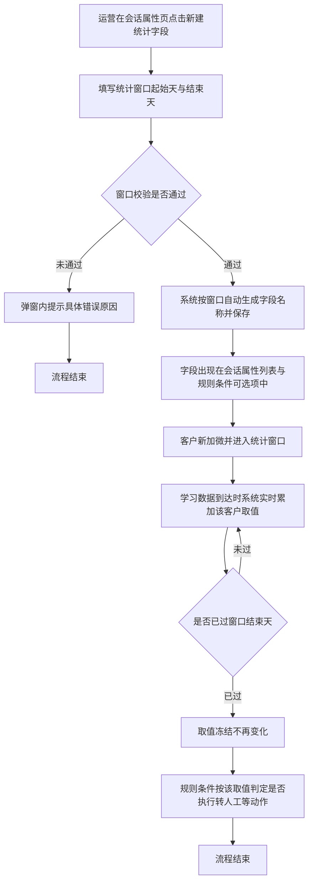
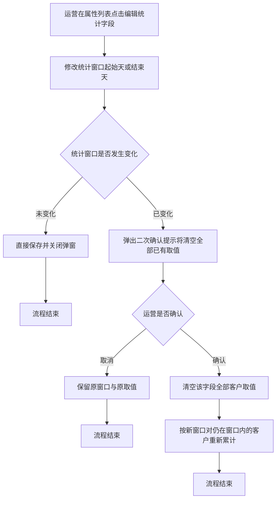

# PRD-自定义统计周期学习时长字段

## 一、修订记录

| 版本号 | 修改日期 | 修改原因 | 修订人 |
|--------|----------|----------|--------|
| v1.0 | 2026-09-01 | 初稿 | AI PRD Writer |

## 二、需求概述

- **背景/现状**：当客服运营需要按「加微后第几天到第几天」这样的自定义周期衡量客户学习投入时，系统当前只提供昨日、当周、当月、累计四种固定周期的学习时长，无法满足分阶段判定的取数需要。
- **需求目标**：当运营在会话属性页创建一个统计字段并指定加微后的起止天数时，系统应自动统计该客户在这段自然日区间内的累计学习时长，并允许该字段被规则条件直接引用。
- **核心逻辑简述**：运营在会话属性页新建统计字段并选定统计窗口，系统按窗口自动命名并生效；客户加微后进入窗口期间，学习数据到达时系统实时累加取值，窗口走完后取值冻结，规则条件按该取值判定是否执行转人工等动作。

## 三、术语表

| 术语 | 定义 |
|------|------|
| 加微时间 | 客户与坐席建立企微好友关系的时刻 |
| 统计窗口 | 以加微当天为第 0 天起算的一段自然日区间，由起始天与结束天两个数字确定，两端都包含在内 |
| 统计字段 | 本次新增的一类会话属性，取值由系统按统计窗口自动累计得出，运营不能手工填写 |
| 累计学习时长 | 客户在指定自然日区间内产生的学习时长合计，单位为分钟 |
| 冻结 | 统计窗口的结束天已过去后，该字段取值不再随新的学习数据变化 |

## 四、调整范围

| 序号 | 功能模块 | 调整说明 |
|------|----------|----------|
| 1 | 会话属性页 — 新建入口 | 在页面操作区新增「新建统计字段」入口 |
| 2 | 会话属性页 — 新建统计字段弹窗 | 新增弹窗，提供统计窗口起始天、结束天配置与名称预览 |
| 3 | 会话属性页 — 属性列表 | 统计字段归入「自定义字段」分类展示，字段类型显示为数字 |
| 4 | 会话属性页 — 编辑统计字段弹窗 | 新增弹窗，允许修改统计窗口，修改前二次确认 |
| 5 | 会话属性页 — 删除统计字段 | 沿用现有自定义字段删除交互 |
| 6 | 规则配置页 — 条件变量选择 | 统计字段在条件变量选择面板中可选，操作符沿用现有配置 |
| 7 | 取值计算 | 新增按统计窗口实时累计学习时长的取值逻辑 |

## 五、业务流程图

**主流程：创建统计字段到规则判定**

**子流程：修改统计窗口**

## 六、可交互原型

可交互原型（公网，点击可直接操作）：https://leo-ai05.github.io/prototypes/%E8%87%AA%E5%AE%9A%E4%B9%89%E7%BB%9F%E8%AE%A1%E5%91%A8%E6%9C%9F%E5%AD%A6%E4%B9%A0%E6%97%B6%E9%95%BF%E5%AD%97%E6%AE%B5/

原型模式：html-wireframe（单文件可交互原型，无需登录、无需本地启动）

涉及页面：会话属性、规则配置

可操作路径：

1. 打开原型即为会话属性页默认态，左侧分类栏点击「自定义字段」，可看到已有的两个统计字段与一个普通自定义字段。
2. 点击右上角「新建统计字段」，弹窗默认统计窗口为第 0 天至第 7 天，字段名称预览为「加微后0-7天累计学习时长」。
3. 把起始天改为 3、结束天改为 10，观察字段名称与字段说明实时刷新。
4. 把起始天改为 10、结束天改为 3，出现红字「结束天不能早于起始天」，「确定」按钮置灰。
5. 把结束天改为 45，出现红字「结束天需为 0 到 30 之间的整数」。
6. 把窗口改回 0 至 7，出现红字「该统计窗口已存在字段「加微后0-7天累计学习时长」，请勿重复创建」，提交被拦截。
7. 把窗口改为 8 至 14，点击「确定」，弹窗关闭并提示创建成功，列表定位到「自定义字段」分类并回显新字段。
8. 在列表中点击「加微后0-7天累计学习时长」行的「编辑」，把结束天改为 14，弹窗顶部出现橙色影响提示。
9. 点击「确定」弹出二次确认弹窗，点「确认修改」后列表中的字段名称更新为「加微后0-14天累计学习时长」。
10. 点击任一统计字段的「删除」，二次确认弹窗中展示「当前有 2 条规则正在使用该字段」。
11. 再次打开新建弹窗并修改任一输入项后点「取消」，弹出「填写内容尚未保存，确认关闭？」。
12. 顶部切到「规则配置」，点击触发条件行的变量选择框，「自定义字段」分类下可看到刚创建的统计字段。
13. 选中一个统计字段，比较值输入 30.5，出现红字「请输入整数分钟数」。
14. 把操作符切换为「为空」，比较值输入框自动置灰不可填。

关键态截图：`需求汇总/自定义统计周期学习时长字段/proto-shots/`，共 18 张

洋葱内网链接：本次未取得（内网上传网关不可达，未连飞连），公网链接不受影响

## 七、功能需求详细描述

### 7.1 会话属性页 — 新建统计字段入口

| 功能按钮 | 功能说明 | 是否必填 | 功能类型 | 交互说明 | 备注 |
|---|---|---|---|---|---|
| 新建统计字段 | 打开新建统计字段弹窗，创建一个按加微后自定义周期统计学习时长的会话属性 | — | 按钮 | 位于会话属性页右上角操作区，与现有「新增属性」按钮并列。任何时候均可点击，点击后打开新建统计字段弹窗 | 该入口创建出的字段固定归入「自定义字段」分类，不提供分类选择 |

### 7.2 会话属性页 — 新建统计字段弹窗

| 功能按钮 | 功能说明 | 是否必填 | 功能类型 | 交互说明 | 备注 |
|---|---|---|---|---|---|
| 统计内容 | 说明本字段统计的业务口径 | 否 | 只读文本 | 固定展示「加微后指定区间内的累计学习时长（分钟）」，不可修改 | 本期仅提供这一种统计内容 |
| 统计窗口起始天 | 统计区间的第一天，以加微当天为第 0 天 | 是 | 数字输入框 | 默认值为 0。仅允许输入 0 到 30 之间的整数。输入非整数或超出范围时，输入框下方红字提示「起始天需为 0 到 30 之间的整数」 | 加微当天记为第 0 天，区间包含起始天当天 |
| 统计窗口结束天 | 统计区间的最后一天，以加微当天为第 0 天 | 是 | 数字输入框 | 默认值为 7。仅允许输入 0 到 30 之间的整数。小于起始天时，输入框下方红字提示「结束天不能早于起始天」 | 区间包含结束天当天，即起始天到结束天两端都算 |
| 字段名称预览 | 展示系统根据统计窗口自动生成的字段名称 | — | 只读文本 | 起始天或结束天变化时实时刷新，格式固定为「加微后{起始天}-{结束天}天累计学习时长」。运营不能手工修改 | 名称由窗口唯一决定，避免出现名称与实际口径不一致 |
| 字段说明预览 | 展示系统自动生成的字段说明 | — | 只读文本 | 内容固定为「统计客户加微当天起第{起始天}天至第{结束天}天（含两端）的累计学习时长，单位分钟」 | 与字段名称同步刷新 |
| 确定 | 提交创建 | — | 按钮 | 起始天与结束天均已填写且校验通过时按钮可点击；存在未填项或校验未过时**置灰**，鼠标悬浮提示「请先填写正确的统计窗口」。点击后按钮进入加载中并禁用，创建成功后弹窗关闭、属性列表刷新并定位到「自定义字段」分类、顶部提示「统计字段创建成功」 | 创建失败时弹窗保持打开、已填内容保留，顶部提示「创建失败，请重试」 |
| 取消 | 放弃创建 | — | 按钮 | 已修改过任一输入项时点击需二次确认「填写内容尚未保存，确认关闭？」；未修改时直接关闭 | 点击遮罩层与右上角关闭按钮的行为与「取消」一致 |

**创建校验规则：**

| 序号 | 校验项 | 不通过时的提示文案 |
|---|---|---|
| 1 | 起始天与结束天均为必填 | 请填写统计窗口起始天 / 请填写统计窗口结束天 |
| 2 | 起始天与结束天均为 0 到 30 之间的整数 | 起始天需为 0 到 30 之间的整数 / 结束天需为 0 到 30 之间的整数 |
| 3 | 结束天不早于起始天 | 结束天不能早于起始天 |
| 4 | 不存在统计窗口完全相同的统计字段 | 该统计窗口已存在字段「加微后0-7天累计学习时长」，请勿重复创建 |

### 7.3 会话属性页 — 属性列表中的统计字段

| 字段名称 | 字段说明 | 字段来源 | 备注 |
|---|---|---|---|
| 属性名称 | 展示自动生成的字段名称，如「加微后0-7天累计学习时长」，名称右侧带「统计字段」标记 | 新建统计字段弹窗自动生成 | 名称不可编辑 |
| 字段类型 | 固定展示「数字」 | 统计字段固定为数字类型 | 单位为分钟，列表中不展示单位 |
| 字段标识 | 沿用现有自定义字段的标识展示方式 | 系统创建时自动分配 | — |
| 描述 | 展示自动生成的字段说明，含统计窗口起止天与单位 | 新建统计字段弹窗自动生成 | 描述不可编辑 |
| 是否对接扣子 | 固定展示「否」 | 统计字段本期不对接扣子 | 该列对统计字段不可编辑 |
| 扣子是否更新 | 固定展示「否」 | 统计字段取值由系统计算，不接受外部回写 | 该列对统计字段不可编辑 |
| 操作 | 提供「编辑」与「删除」两个操作 | 本次新增编辑入口，删除沿用现有自定义字段删除 | 统计字段不提供「修改分类」操作 |

**列表展示规则：**

| 序号 | 规则 |
|---|---|
| 1 | 统计字段统一展示在「自定义字段」分类下，与普通自定义字段混排，按创建时间倒序排列 |
| 2 | 「全部属性」视图中同样可见统计字段 |
| 3 | 统计字段数量不设上限 |
| 4 | 分类下没有任何字段时，展示现有空态文案，不做调整 |

### 7.4 会话属性页 — 编辑统计字段弹窗

| 功能按钮 | 功能说明 | 是否必填 | 功能类型 | 交互说明 | 备注 |
|---|---|---|---|---|---|
| 统计窗口起始天 | 修改统计区间的第一天 | 是 | 数字输入框 | 默认回填当前值，校验规则与新建一致 | — |
| 统计窗口结束天 | 修改统计区间的最后一天 | 是 | 数字输入框 | 默认回填当前值，校验规则与新建一致 | — |
| 字段名称预览 | 展示修改后的字段名称 | — | 只读文本 | 随起止天变化实时刷新，保存后字段名称同步更新 | 已被规则引用的字段改名后，规则条件中显示的名称同步变化，规则本身不失效 |
| 影响提示 | 提示修改统计窗口的后果 | — | 提示文案 | 起止天与原值不同时，弹窗内固定展示橙色提示「修改统计窗口会清空该字段已统计出的全部取值」 | 起止天与原值相同时不展示该提示 |
| 确定 | 提交修改 | — | 按钮 | 校验通过时可点击，校验未过时**置灰**并悬浮提示「请先填写正确的统计窗口」。统计窗口发生变化时，点击后弹出二次确认弹窗；未发生变化时直接保存 | 二次确认弹窗标题「确认修改统计窗口？」，正文「该字段已统计出的全部取值将被清空，并按新窗口重新统计。此操作不可撤销。」，按钮为「确认修改」与「取消」 |
| 取消 | 放弃修改 | — | 按钮 | 已修改过任一输入项时点击需二次确认「填写内容尚未保存，确认关闭？」；未修改时直接关闭 | — |

**修改生效规则：**

| 序号 | 场景 | 系统行为 |
|---|---|---|
| 1 | 统计窗口未发生变化 | 直接保存，已有取值保持不变 |
| 2 | 统计窗口发生变化且运营确认 | 清空该字段下全部客户的取值；对加微时间仍落在新窗口内的客户，从此刻起按新窗口继续累计后续到达的学习数据；已经过去的天数不补算 |
| 3 | 统计窗口发生变化但运营取消 | 保留原窗口与原取值，弹窗保持打开 |
| 4 | 修改后与其他统计字段窗口重复 | 提交拦截，提示「该统计窗口已存在字段「{已有字段名称}」，请勿重复创建」 |

### 7.5 会话属性页 — 删除统计字段

| 功能按钮 | 功能说明 | 是否必填 | 功能类型 | 交互说明 | 备注 |
|---|---|---|---|---|---|
| 删除 | 删除该统计字段及其全部取值 | — | 按钮 | 点击后弹出二次确认「删除后该字段的全部取值将一并清除，且引用该字段的规则条件会失效，确认删除？」。确认后列表刷新并提示「删除成功」 | 该字段正被启用中的规则条件引用时，二次确认弹窗正文追加一行「当前有 {数量} 条规则正在使用该字段」 |

### 7.6 规则配置页 — 条件中引用统计字段

| 功能按钮 | 功能说明 | 是否必填 | 功能类型 | 交互说明 | 备注 |
|---|---|---|---|---|---|
| 条件变量选择 | 在规则条件中选择统计字段作为判定依据 | 是 | 下拉选择 | 统计字段展示在变量选择面板的「自定义字段」分类下，名称即字段名称，可通过搜索框按名称检索 | 分组命中条件与规则触发条件两处均可选用 |
| 条件操作符 | 选择比较方式 | 是 | 下拉选择 | 沿用现有操作符配置，不新增操作符。需要判定区间时由运营配置两条条件并置于同一条件组内 | — |
| 条件比较值 | 填写用于比较的时长数值 | 是 | 输入框 | 输入单位为分钟的整数。输入非整数时提示「请输入整数分钟数」 | — |

**条件判定规则：**

| 序号 | 客户取值状态 | 判定结果 |
|---|---|---|
| 1 | 已有取值（窗口进行中的部分值或窗口结束后的冻结值） | 按填写的操作符与比较值正常判定 |
| 2 | 取值为空（客户加微时间早于字段创建时间，或客户尚未加微） | 数值比较类条件一律判定为不成立；「为空」类条件判定为成立 |
| 3 | 字段已被删除 | 该条件所在规则不再执行，规则列表中该规则标记为「条件失效」并停止触发 |

### 7.7 取值计算规则

| 序号 | 规则项 | 说明 |
|---|---|---|
| 1 | 统计起算点 | 客户与坐席建立企微好友关系的时刻所在的自然日，记为第 0 天 |
| 2 | 天的划分 | 按自然日划分，每日零点分界，以北京时间为准 |
| 3 | 区间闭合 | 起始天与结束天两端都计入统计范围 |
| 4 | 统计内容 | 客户在统计区间内产生的学习时长合计，与现有学习时长口径保持一致，单位为分钟，取整数 |
| 5 | 更新时机 | 客户学习数据到达时实时累加，无需等待次日结算 |
| 6 | 窗口进行中的取值 | 展示截至当前已累计的部分值，随客户继续学习而增长 |
| 7 | 窗口结束后的取值 | 结束天次日零点之后取值冻结，不再随新的学习数据变化 |
| 8 | 生效范围 | 仅对字段创建时间之后新建立好友关系的客户生效 |
| 9 | 存量客户 | 字段创建前已加微的客户，该字段取值为空，系统不做历史回溯 |
| 10 | 窗口上限 | 结束天最大为第 30 天，超过部分不予统计 |
| 11 | 多次加微 | 同一客户与同一坐席重复建立好友关系时，以最近一次建立好友关系的时间作为第 0 天，取值重新起算 |
| 12 | 未加微客户 | 尚未建立好友关系的客户，该字段取值为空 |

### 7.8 边界场景

| 序号 | 场景 | 系统行为 |
|---|---|---|
| 1 | 起始天与结束天填写为同一个数字 | 允许保存，统计该单日的学习时长，名称形如「加微后3-3天累计学习时长」 |
| 2 | 客户在统计窗口内没有任何学习行为 | 取值为 0 分钟，不是空值，数值比较类条件按 0 参与判定 |
| 3 | 客户在窗口开始前已经学习 | 窗口开始前的学习时长不计入该字段 |
| 4 | 客户在窗口结束后继续学习 | 不再计入该字段 |
| 5 | 学习数据延迟到达且对应日期仍在窗口内 | 正常累加进该字段 |
| 6 | 学习数据延迟到达但对应日期已超出窗口 | 不累加，取值保持冻结 |
| 7 | 属性列表加载失败 | 展示现有加载失败兜底文案与「重新加载」按钮，不做调整 |
| 8 | 创建或修改时网络异常 | 弹窗保持打开、已填内容保留，顶部提示「操作失败，请重试」 |

## 八、埋点与数据需求

本次需求不涉及新增埋点。

## 九、权限说明

会话属性页与规则配置页的访问与编辑权限沿用现有配置，本次不新增角色与权限项。
