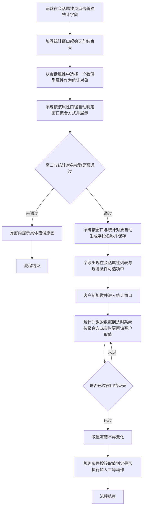

# PRD-自定义统计周期学习时长字段

## 一、修订记录

| 版本号 | 修改日期 | 修改原因 | 修订人 |
|--------|----------|----------|--------|
| v1.0 | 2026-09-01 | 初稿 | AI PRD Writer |
| v1.1 | 2026-09-07 | 统计口径从固定的「全部学习时长」改为可勾选组合：新增「统计字段」多选项，支持观看视频时长、答题时长、看题型时长任意组合求和 | AI PRD Writer |
| v1.2 | 2026-09-07 | 统计对象改为直接从会话属性中选取：统计字段由三项时长的勾选组合，改为在会话属性中单选一个数值型属性，窗口聚合方式由该属性口径自动判定 | AI PRD Writer |

## 二、需求概述

- **背景/现状**：当客服运营需要按「加微后第几天到第几天」这样的自定义周期衡量客户表现时，系统当前的会话属性只提供当日、当周、当月、累计几种固定周期，无法满足分阶段判定的取数需要。这个问题不只出现在学习时长上，答题数、错题数、打开 APP 次数等指标同样如此。
- **需求目标**：当运营在会话属性页创建一个统计字段、指定加微后的起止天数并选定一个会话属性作为统计对象时，系统应自动按该属性的口径把它在这段自然日区间内的表现聚合成一个新的数值属性，并允许该字段被规则条件直接引用。
- **核心逻辑简述**：运营在会话属性页新建统计字段，先选定统计窗口，再从会话属性中选择统计对象，系统按该属性的口径自动确定窗口聚合方式并生成名称；客户加微后进入窗口期间，该属性的数据到达时系统实时更新取值，窗口走完后取值冻结，规则条件按该取值判定是否执行转人工等动作。

## 三、术语表

| 术语 | 定义 |
|------|------|
| 加微时间 | 客户与坐席建立企微好友关系的时刻 |
| 统计窗口 | 以加微当天为第 0 天起算的一段自然日区间，由起始天与结束天两个数字确定，两端都包含在内 |
| 统计对象 | 运营为一个统计字段选定的那个会话属性，取值范围为全部数值型会话属性 |
| 窗口聚合方式 | 把统计对象在窗口内的表现折算成一个数的算法，由统计对象自身的口径决定，分累计、新增、日均三种，运营不参与配置 |
| 当日增量型 | 每日零点重置、只反映当天新增量的会话属性，如「观看视频时长（当日·分钟）」，窗口聚合方式为累计 |
| 累计快照型 | 只增不减的历史累计会话属性，如「观看视频时长（上线后累计·分钟）」，窗口聚合方式为新增 |
| 比率型 | 取值为百分比的会话属性，如「答题正确率（当日·%）」，窗口聚合方式为日均 |
| 统计字段 | 本次新增的一类会话属性，取值由系统按「统计窗口 + 统计对象」自动计算得出，运营不能手工填写 |
| 冻结 | 统计窗口的结束天已过去后，该字段取值不再随新数据变化 |

## 四、调整范围

| 序号 | 功能模块 | 调整说明 |
|------|----------|----------|
| 1 | 会话属性页 — 新建入口 | 在页面操作区新增「新建统计字段」入口 |
| 2 | 会话属性页 — 新建统计字段弹窗 | 新增弹窗，先配统计窗口起止天，再从会话属性中选择统计对象，并实时预览聚合方式、名称与说明 |
| 3 | 会话属性页 — 统计对象选择面板 | 新增面板，按会话属性分类展示全部数值型属性，支持搜索与单选，每项标注该属性将采用的窗口聚合方式 |
| 4 | 会话属性页 — 属性列表 | 统计字段归入「自定义字段」分类展示，字段类型显示为数字，描述中体现统计对象与聚合方式 |
| 5 | 会话属性页 — 编辑统计字段弹窗 | 新增弹窗，允许修改统计窗口与统计对象，修改前二次确认 |
| 6 | 会话属性页 — 删除统计字段 | 沿用现有自定义字段删除交互 |
| 7 | 规则配置页 — 条件变量选择 | 统计字段在条件变量选择面板中可选，操作符沿用现有配置 |
| 8 | 取值计算 | 新增按「统计窗口 + 统计对象」计算取值的逻辑，含累计、新增、日均三种聚合算法 |

## 五、业务流程图

**主流程：创建统计字段到规则判定**

**子流程：修改统计口径**

## 六、可交互原型

可交互原型（公网，点击可直接操作）：https://leo-ai05.github.io/prototypes/%E8%87%AA%E5%AE%9A%E4%B9%89%E7%BB%9F%E8%AE%A1%E5%91%A8%E6%9C%9F%E5%AD%A6%E4%B9%A0%E6%97%B6%E9%95%BF%E5%AD%97%E6%AE%B5/

原型模式：html-wireframe（单文件可交互原型，无需登录、无需本地启动）

涉及页面：会话属性、规则配置

可操作路径：

1. 打开原型即为会话属性页默认态，左侧分类栏点击「自定义字段」，可看到已有的两个统计字段与一个普通自定义字段，描述列里能看出各自的统计对象与聚合方式。
2. 点击右上角「新建统计字段」，弹窗先是统计窗口（默认第 0 天至第 7 天），下面是统计字段，默认为空且提示「请选择会话属性」。
3. 点击统计字段选择框，弹出会话属性选择面板，左侧按分类切换，右侧每项属性下方注明该属性将采用的窗口聚合方式。
4. 在面板搜索框输入「时长」，列表实时过滤出各类时长属性。
5. 选中「答题时长（当日·分钟）」，弹窗内出现蓝色说明「本字段将按累计统计：窗口内各自然日的值相加」，名称预览为「加微后0-7天累计答题时长」。
6. 改选「观看视频时长（上线后累计·分钟）」，说明变为「按新增统计：窗口结束时的值减去窗口开始前一日的值」，名称变为「加微后0-7天新增观看视频时长」。
7. 再改选「答题正确率（当日·%）」，说明变为「按日均统计：窗口内有数据的各自然日取平均」，名称变为「加微后0-7天日均答题正确率」。
8. 重新打开面板并切到「活跃数据」分类，可看到统计对象不限于学情数据，「打开 APP 次数」「累计活跃天数」同样可选。
9. 选中「打开 APP 次数（当日·次）」后把起始天改为 3、结束天改为 10，观察名称与说明实时刷新。
10. 把起始天改为 10、结束天改为 3，出现红字「结束天不能早于起始天」，「确定」按钮置灰。
11. 把结束天改为 45，出现红字「结束天需为 0 到 30 之间的整数」。
12. 把窗口改为 0 至 7 并选中「观看视频时长（当日·分钟）」，出现红字「该统计窗口与统计字段的组合已存在字段「加微后0-7天累计观看视频时长」，请勿重复创建」。
13. 改选「错题数（离线·日·个）」，出现红字提示生成的名称「加微后0-7天累计错题数」已被占用、该字段统计的是「错题数（实时·当日·个）」，提交仍被拦截。
14. 改选「看题型时长（当日·分钟）」，两条提示均消失、「确定」恢复可点，说明窗口相同但统计对象不同时允许创建。
15. 把窗口改为 8 至 14 后点击「确定」，弹窗关闭并提示创建成功，列表定位到「自定义字段」分类并回显新字段。
16. 在列表中点击「加微后0-7天累计观看视频时长」行的「编辑」，把结束天改为 14 并改选「错题数（实时·当日·个）」，弹窗顶部出现橙色影响提示。
17. 点击「确定」弹出二次确认弹窗，点「确认修改」后列表中的字段名称与描述同步更新。
18. 点击任一统计字段的「删除」，二次确认弹窗中展示「当前有 2 条规则正在使用该字段」。
19. 再次打开新建弹窗并修改任一输入项后点「取消」，弹出「填写内容尚未保存，确认关闭？」。
20. 顶部切到「规则配置」，点击触发条件行的变量选择框，「自定义字段」分类下可看到刚创建的统计字段，每项下方注明各自的统计口径。
21. 选中一个统计字段，条件行下方提示比较值单位与该字段统计对象一致；比较值输入 30.5，出现红字「请输入整数」。
22. 把操作符切换为「为空」，比较值输入框自动置灰不可填。

关键态截图：`需求汇总/自定义统计周期学习时长字段/proto-shots/`，共 26 张

洋葱内网链接（需飞连）：https://minio.yc345.tv/onionext/prototypes/custom-period-study-duration/index.html

## 七、功能需求详细描述

### 7.1 会话属性页 — 新建统计字段入口

| 功能按钮 | 功能说明 | 是否必填 | 功能类型 | 交互说明 | 备注 |
|---|---|---|---|---|---|
| 新建统计字段 | 打开新建统计字段弹窗，创建一个把某个会话属性按加微后自定义周期聚合的新会话属性 | — | 按钮 | 位于会话属性页右上角操作区，与现有「新增属性」按钮并列。任何时候均可点击，点击后打开新建统计字段弹窗 | 该入口创建出的字段固定归入「自定义字段」分类，不提供分类选择 |

### 7.2 会话属性页 — 新建统计字段弹窗

表单按「先定周期、再定对象」的顺序排列：统计窗口在上，统计字段选择在下，聚合方式说明、名称与说明依次在下方实时预览。

| 功能按钮 | 功能说明 | 是否必填 | 功能类型 | 交互说明 | 备注 |
|---|---|---|---|---|---|
| 统计窗口起始天 | 统计区间的第一天，以加微当天为第 0 天 | 是 | 数字输入框 | 默认值为 0。仅允许输入 0 到 30 之间的整数。输入非整数或超出范围时，输入框下方红字提示「起始天需为 0 到 30 之间的整数」 | 加微当天记为第 0 天，区间包含起始天当天 |
| 统计窗口结束天 | 统计区间的最后一天，以加微当天为第 0 天 | 是 | 数字输入框 | 默认值为 7。仅允许输入 0 到 30 之间的整数。小于起始天时，输入框下方红字提示「结束天不能早于起始天」 | 区间包含结束天当天，即起始天到结束天两端都算 |
| 统计字段 | 选择哪个会话属性作为本字段的统计对象 | 是 | 单选选择框 | 默认为空，占位文案「请选择会话属性」。点击后在下方展开会话属性选择面板（见 7.3）。选中后选择框展示该属性的完整名称。未选择时下方红字提示「请选择统计字段」 | 一个统计字段只对应一个会话属性，不做多选与组合运算。可选范围为全部数值型会话属性 |
| 聚合方式说明 | 告知运营本字段将以何种算法把统计对象折算成一个数 | — | 只读提示块 | 选中统计对象后在其下方展示蓝色提示块，内容为「本字段将按{聚合词}统计：{算法说明}，单位{单位}。聚合方式由该属性的口径决定（{判定依据}），不可手工更改」。未选中时不展示 | 聚合方式由系统按统计对象口径自动判定，运营既不需要也不能配置。三种聚合方式见 7.8 |
| 字段名称预览 | 展示系统根据统计窗口与统计对象自动生成的字段名称 | — | 只读文本 | 统计窗口或统计对象变化时实时刷新。运营不能手工修改 | 名称由「窗口 + 统计对象」决定，避免名称与实际口径不一致。生成规则见下方 |
| 字段说明预览 | 展示系统自动生成的字段说明 | — | 只读文本 | 内容为「统计客户加微当天起第{起始天}天至第{结束天}天（含两端）的「{统计对象完整名称}」，聚合方式为{算法说明}，单位{单位}」 | 与字段名称同步刷新 |
| 确定 | 提交创建 | — | 按钮 | 统计窗口填写完整、已选择统计字段且全部校验通过时按钮可点击；否则**置灰**，鼠标悬浮提示「请先填写正确的统计窗口并选择统计字段」。点击后按钮进入加载中并禁用，创建成功后弹窗关闭、属性列表刷新并定位到「自定义字段」分类、顶部提示「统计字段创建成功」 | 创建失败时弹窗保持打开、已填内容保留，顶部提示「创建失败，请重试」 |
| 取消 | 放弃创建 | — | 按钮 | 已修改过任一输入项或改动过统计对象时点击需二次确认「填写内容尚未保存，确认关闭？」；未修改时直接关闭 | 点击遮罩层与右上角关闭按钮的行为与「取消」一致 |

**字段名称生成规则：**

名称格式固定为「加微后{起始天}-{结束天}天{聚合词}{统计对象简名}」。

| 序号 | 统计对象口径 | 聚合词 | 示例 |
|---|---|---|---|
| 1 | 当日增量型 | 累计 | 观看视频时长（当日·分钟）→ 加微后0-7天累计观看视频时长 |
| 2 | 累计快照型 | 新增 | 观看视频时长（上线后累计·分钟）→ 加微后0-7天新增观看视频时长 |
| 3 | 比率型 | 日均 | 答题正确率（当日·%）→ 加微后0-7天日均答题正确率 |

统计对象简名为该会话属性名称去掉口径括注后的部分，如「观看视频时长（当日·分钟）」的简名为「观看视频时长」。括注只说明原属性自身的周期与单位，放进统计字段名称里会与统计窗口的周期相互矛盾，所以不带入。

**创建校验规则：**

| 序号 | 校验项 | 不通过时的提示文案 |
|---|---|---|
| 1 | 起始天与结束天均为必填 | 请填写统计窗口起始天 / 请填写统计窗口结束天 |
| 2 | 起始天与结束天均为 0 到 30 之间的整数 | 起始天需为 0 到 30 之间的整数 / 结束天需为 0 到 30 之间的整数 |
| 3 | 结束天不早于起始天 | 结束天不能早于起始天 |
| 4 | 已选择统计字段 | 请选择统计字段 |
| 5 | 不存在「统计窗口 + 统计对象」完全相同的统计字段 | 该统计窗口与统计字段的组合已存在字段「加微后0-7天累计观看视频时长」，请勿重复创建 |
| 6 | 生成的字段名称未被其他统计字段占用 | 生成的名称「加微后0-7天累计错题数」已被占用，该字段统计的是「错题数（实时·当日·个）」。请改选统计字段或调整统计窗口 |

第 5 条只在窗口与统计对象**同时**相同时才判定重复。窗口相同但统计对象不同（如同为 0 至 7 天，一个统计观看视频时长、一个统计错题数）属于两个不同字段，允许各自创建。

第 6 条是第 5 条之外的独立校验。由于名称取的是统计对象简名，不同属性可能生成同一个名称——典型例子是「错题数（实时·当日·个）」与「错题数（离线·日·个）」，两者简名与聚合词都相同。这种情况下窗口与统计对象的组合并不重复，但名称会冲突，需要单独拦截。

### 7.3 会话属性页 — 统计对象选择面板

在新建与编辑统计字段弹窗中点击「统计字段」选择框后，在其下方展开的浮层面板。交互形态沿用规则配置页的条件变量选择面板，区别是本面板为单选且只展示可作为统计对象的属性。

| 功能按钮 | 功能说明 | 是否必填 | 功能类型 | 交互说明 | 备注 |
|---|---|---|---|---|---|
| 搜索框 | 按名称检索会话属性 | 否 | 输入框 | 位于面板顶部，占位文案「搜索会话属性名称」。输入时右侧列表实时过滤，匹配方式为名称包含关键词 | 搜索范围为当前选中分类下的属性 |
| 分类栏 | 按会话属性分类切换 | — | 列表 | 位于面板左侧，展示「学情数据-累积」「活跃数据」「基础信息」「付费意向」「自定义字段」。默认选中「学情数据-累积」 | 分类与会话属性页左侧分类栏保持一致，不展示没有可选属性的分类 |
| 属性列表 | 展示并选择统计对象 | 是 | 单选列表 | 位于面板右侧。每项主行为属性完整名称，副行以浅灰小字展示该属性的口径说明与「按窗口{聚合词}」。点击某项即选中并收起面板，选中项在再次打开时高亮 | 单选，点击新的一项直接替换原选择 |
| 空态 | 分类下无可选属性时的兜底 | — | 文案 | 「自定义字段」分类下展示「自定义字段中暂无数值型属性可选。统计字段本身不能再作为统计对象」；其余分类搜索无结果时展示「没有匹配的会话属性」 | — |

**可选属性范围：**

| 序号 | 规则 |
|---|---|
| 1 | 全部**数值型**会话属性均可选，不限分类，也不限该属性自身是当日、当周还是累计口径 |
| 2 | 字符串型、布尔型、日期型会话属性不可选，不在面板中展示 |
| 3 | 统计字段本身虽然是数值型，但不可被再次选作统计对象，避免嵌套定义 |
| 4 | 可选范围随会话属性的增减自动变化，新增数值型属性后无需额外配置即可被选中 |

### 7.4 会话属性页 — 属性列表中的统计字段

| 字段名称 | 字段说明 | 字段来源 | 备注 |
|---|---|---|---|
| 属性名称 | 展示自动生成的字段名称，如「加微后0-7天累计观看视频时长」「加微后0-7天日均答题正确率」，名称右侧带「统计字段」标记 | 新建统计字段弹窗自动生成 | 名称不可编辑 |
| 字段类型 | 固定展示「数字」 | 统计字段固定为数字类型 | 单位继承自统计对象，列表中不展示单位 |
| 字段标识 | 沿用现有自定义字段的标识展示方式 | 系统创建时自动分配 | — |
| 描述 | 展示自动生成的字段说明，含统计窗口起止天、统计对象完整名称、聚合方式与单位 | 新建统计字段弹窗自动生成 | 描述不可编辑。列表不单独增加「统计对象」列，统计对象与聚合方式通过描述体现 |
| 是否对接扣子 | 固定展示「否」 | 统计字段本期不对接扣子 | 该列对统计字段不可编辑 |
| 扣子是否更新 | 固定展示「否」 | 统计字段取值由系统计算，不接受外部回写 | 该列对统计字段不可编辑 |
| 操作 | 提供「编辑」与「删除」两个操作 | 本次新增编辑入口，删除沿用现有自定义字段删除 | 统计字段不提供「修改分类」操作 |

**列表展示规则：**

| 序号 | 规则 |
|---|---|
| 1 | 统计字段统一展示在「自定义字段」分类下，与普通自定义字段混排，按创建时间倒序排列 |
| 2 | 「全部属性」视图中同样可见统计字段 |
| 3 | 统计字段数量不设上限 |
| 4 | 分类下没有任何字段时，展示现有空态文案，不做调整 |

### 7.5 会话属性页 — 编辑统计字段弹窗

| 功能按钮 | 功能说明 | 是否必填 | 功能类型 | 交互说明 | 备注 |
|---|---|---|---|---|---|
| 统计窗口起始天 | 修改统计区间的第一天 | 是 | 数字输入框 | 默认回填当前值，校验规则与新建一致 | — |
| 统计窗口结束天 | 修改统计区间的最后一天 | 是 | 数字输入框 | 默认回填当前值，校验规则与新建一致 | — |
| 统计字段 | 改选统计对象 | 是 | 单选选择框 | 默认回填该字段当前的统计对象，面板默认定位到该属性所在分类，选择方式与校验规则均与新建一致 | 改选后聚合方式说明随新属性口径同步刷新 |
| 字段名称预览 | 展示修改后的字段名称 | — | 只读文本 | 随起止天与统计对象变化实时刷新，保存后字段名称同步更新 | 已被规则引用的字段改名后，规则条件中显示的名称同步变化，规则本身不失效 |
| 影响提示 | 提示修改统计口径的后果 | — | 提示文案 | 起止天或统计对象与原值不同时，弹窗内固定展示橙色提示「修改统计窗口或统计字段会清空该字段已统计出的全部取值」 | 两者都与原值相同时不展示该提示 |
| 确定 | 提交修改 | — | 按钮 | 校验通过时可点击，校验未过时**置灰**并悬浮提示「请先填写正确的统计窗口并选择统计字段」。统计窗口或统计对象发生变化时，点击后弹出二次确认弹窗；均未发生变化时直接保存 | 二次确认弹窗标题「确认修改统计口径？」，正文「该字段已统计出的全部取值将被清空，并按新的统计窗口与统计字段重新统计。此操作不可撤销。」，按钮为「确认修改」与「取消」 |
| 取消 | 放弃修改 | — | 按钮 | 已修改过任一输入项或改动过统计对象时点击需二次确认「填写内容尚未保存，确认关闭？」；未修改时直接关闭 | — |

**修改生效规则：**

| 序号 | 场景 | 系统行为 |
|---|---|---|
| 1 | 统计窗口与统计对象均未发生变化 | 直接保存，已有取值保持不变 |
| 2 | 统计窗口或统计对象发生变化且运营确认 | 清空该字段下全部客户的取值；对加微时间仍落在新窗口内的客户，从此刻起按新窗口与新统计对象继续计算后续到达的数据；已经过去的天数不补算 |
| 3 | 发生变化但运营取消 | 保留原窗口、原统计对象与原取值，弹窗保持打开 |
| 4 | 修改后与其他统计字段的「窗口 + 统计对象」重复 | 提交拦截，提示「该统计窗口与统计字段的组合已存在字段「{已有字段名称}」，请勿重复创建」 |
| 5 | 修改后生成的名称与其他统计字段冲突 | 提交拦截，提示「生成的名称「{冲突名称}」已被占用，该字段统计的是「{对方统计对象}」。请改选统计字段或调整统计窗口」 |
| 6 | 只改选了统计对象、窗口未动 | 同第 2 条处理，取值同样清空重算，因为口径已变。改选后聚合方式可能一并变化（如从当日增量型改为比率型），取值含义完全不同，不存在沿用旧值的可能 |

### 7.6 会话属性页 — 删除统计字段

| 功能按钮 | 功能说明 | 是否必填 | 功能类型 | 交互说明 | 备注 |
|---|---|---|---|---|---|
| 删除 | 删除该统计字段及其全部取值 | — | 按钮 | 点击后弹出二次确认「删除后该字段的全部取值将一并清除，且引用该字段的规则条件会失效，确认删除？」。确认后列表刷新并提示「删除成功」 | 该字段正被启用中的规则条件引用时，二次确认弹窗正文追加一行「当前有 {数量} 条规则正在使用该字段」 |

### 7.7 规则配置页 — 条件中引用统计字段

| 功能按钮 | 功能说明 | 是否必填 | 功能类型 | 交互说明 | 备注 |
|---|---|---|---|---|---|
| 条件变量选择 | 在规则条件中选择统计字段作为判定依据 | 是 | 下拉选择 | 统计字段展示在变量选择面板的「自定义字段」分类下，名称即字段名称，可通过搜索框按名称检索 | 分组命中条件与规则触发条件两处均可选用 |
| 条件操作符 | 选择比较方式 | 是 | 下拉选择 | 沿用现有操作符配置，不新增操作符。需要判定区间时由运营配置两条条件并置于同一条件组内 | — |
| 条件比较值 | 填写用于比较的数值 | 是 | 输入框 | 输入整数。选中统计字段后，输入框下方提示比较值单位与该字段的统计对象一致，如分钟、个、次、%。输入非整数时提示「请输入整数」 | 单位随所选统计字段变化，不再固定为分钟 |

**条件判定规则：**

| 序号 | 客户取值状态 | 判定结果 |
|---|---|---|
| 1 | 已有取值（窗口进行中的部分值或窗口结束后的冻结值） | 按填写的操作符与比较值正常判定 |
| 2 | 取值为空（客户加微时间早于字段创建时间，或客户尚未加微） | 数值比较类条件一律判定为不成立；「为空」类条件判定为成立 |
| 3 | 字段已被删除 | 该条件所在规则不再执行，规则列表中该规则标记为「条件失效」并停止触发 |

### 7.8 窗口聚合方式

聚合方式解决的是「把统计对象在窗口内每一天的表现折算成一个数」这件事。不同口径的会话属性折算算法不同，由系统按统计对象自动判定，运营不参与配置也无法修改。

| 聚合方式 | 适用的统计对象口径 | 算法 | 判定依据 | 名称中的聚合词 |
|---|---|---|---|---|
| 累计 | 当日增量型：每日零点重置、只反映当天新增量的属性 | 窗口内各自然日的值相加 | 该属性是每日零点重置的当日增量值，逐日相加即窗口内总量 | 累计 |
| 新增 | 累计快照型：只增不减的历史累计属性 | 窗口结束当日的值，减去窗口起始天前一日的值 | 该属性是只增不减的累计快照值，直接相加会把同一份历史量重复计算多次 | 新增 |
| 日均 | 比率型：取值为百分比的属性 | 窗口内**有数据**的各自然日取平均，无数据的天不计入分母 | 该属性是比率值，跨天相加没有意义 | 日均 |

为什么不让运营自选聚合方式：同一个统计对象只有一种算法能得出有意义的结果。对「上线后累计答题数」这类快照值做求和，会把历史存量在窗口内的每一天重复计入，得到一个远大于真实值的数；对「答题正确率」做求和，得到的是一个没有物理含义的百分数之和。把选择权交给运营只会引入错误配置，因此由系统按口径直接确定。

### 7.9 取值计算规则

| 序号 | 规则项 | 说明 |
|---|---|---|
| 1 | 统计起算点 | 客户与坐席建立企微好友关系的时刻所在的自然日，记为第 0 天 |
| 2 | 天的划分 | 按自然日划分，每日零点分界，以北京时间为准 |
| 3 | 区间闭合 | 起始天与结束天两端都计入统计范围 |
| 4 | 可选统计对象 | 全部数值型会话属性，不限分类与口径。统计字段本身不可被选作统计对象 |
| 5 | 统计内容 | 统计对象在统计区间内按 7.8 对应聚合方式折算出的数值 |
| 6 | 单位 | 继承统计对象的单位，如分钟、个、次、% |
| 7 | 取整 | 累计与新增两种方式的结果取整数；日均方式的结果四舍五入到整数 |
| 8 | 更新时机 | 统计对象的数据到达时实时更新，无需等待次日结算。其他属性产生数据时该字段取值不变 |
| 9 | 窗口进行中的取值 | 展示截至当前的部分值，随客户后续行为变化 |
| 10 | 窗口结束后的取值 | 结束天次日零点之后取值冻结，不再随新数据变化 |
| 11 | 生效范围 | 仅对字段创建时间之后新建立好友关系的客户生效 |
| 12 | 存量客户 | 字段创建前已加微的客户，该字段取值为空，系统不做历史回溯 |
| 13 | 窗口上限 | 结束天最大为第 30 天，超过部分不予统计 |
| 14 | 多次加微 | 同一客户与同一坐席重复建立好友关系时，以最近一次建立好友关系的时间作为第 0 天，取值重新起算 |
| 15 | 未加微客户 | 尚未建立好友关系的客户，该字段取值为空 |
| 16 | 字段之间相互独立 | 多个统计字段各自按自己的窗口与统计对象独立计算，互不影响。同一份数据可同时被多个统计字段计入 |

### 7.10 边界场景

| 序号 | 场景 | 系统行为 |
|---|---|---|
| 1 | 起始天与结束天填写为同一个数字 | 允许保存，统计该单日的取值，名称形如「加微后3-3天累计观看视频时长」 |
| 2 | 客户在统计窗口内没有产生统计对象的任何数据（累计或新增方式） | 取值为 0，不是空值，数值比较类条件按 0 参与判定 |
| 3 | 客户在统计窗口内没有产生统计对象的任何数据（日均方式） | 取值为**空**而不是 0。比率型属性没有数据时算不出平均值，0% 会被误读为表现极差 |
| 4 | 统计对象为累计快照型，且客户在窗口起始天前一日没有该属性的取值 | 起始基准按 0 处理，取值即窗口结束当日的值 |
| 5 | 客户在窗口开始前已经产生数据 | 窗口开始前的数据不计入该字段 |
| 6 | 客户在窗口结束后继续产生数据 | 不再计入该字段 |
| 7 | 数据延迟到达且对应日期仍在窗口内 | 正常计入 |
| 8 | 数据延迟到达但对应日期已超出窗口 | 不计入，取值保持冻结 |
| 9 | 两个统计字段窗口相同但统计对象不同 | 视为两个独立字段，均可创建，各自独立计算 |
| 10 | 统计对象所对应的会话属性被下线或删除 | 引用它的统计字段停止更新、保留已有取值，属性列表中该统计字段标记为「统计对象已失效」，引用它的规则条件按取值为空处理 |
| 11 | 属性列表加载失败 | 展示现有加载失败兜底文案与「重新加载」按钮，不做调整 |
| 12 | 创建或修改时网络异常 | 弹窗保持打开、已填内容保留，顶部提示「操作失败，请重试」 |

## 八、埋点与数据需求

本次需求不涉及新增埋点。

## 九、权限说明

会话属性页与规则配置页的访问与编辑权限沿用现有配置，本次不新增角色与权限项。
