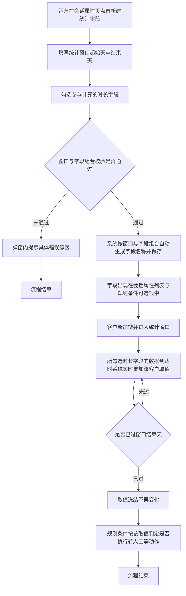
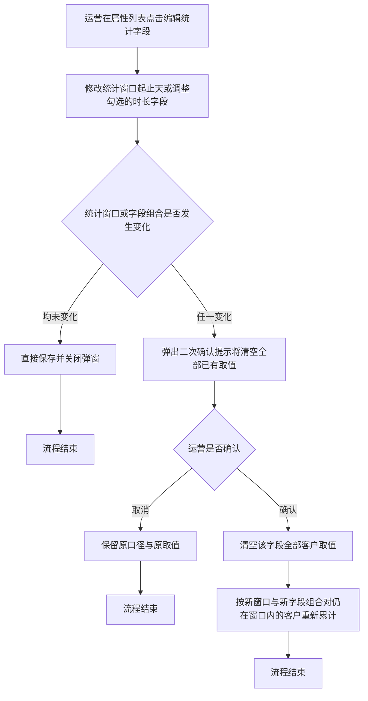

# PRD-自定义统计周期学习时长字段

## 一、修订记录

| 版本号 | 修改日期 | 修改原因 | 修订人 |
|--------|----------|----------|--------|
| v1.0 | 2026-09-01 | 初稿 | AI PRD Writer |
| v1.1 | 2026-09-07 | 统计口径从固定的「全部学习时长」改为可勾选组合：新增「统计字段」多选项，支持观看视频时长、答题时长、看题型时长任意组合求和 | AI PRD Writer |

## 二、需求概述

- **背景/现状**：当客服运营需要按「加微后第几天到第几天」这样的自定义周期衡量客户学习投入时，系统当前只提供昨日、当周、当月、累计四种固定周期的学习时长，无法满足分阶段判定的取数需要。同时现有学习时长只有「三类时长全加起来」这一种口径，运营想单看视频投入或只看做题投入时无从取数。
- **需求目标**：当运营在会话属性页创建一个统计字段、指定加微后的起止天数并勾选参与计算的时长字段时，系统应自动统计该客户在这段自然日区间内所勾选时长字段的合计值，并允许该字段被规则条件直接引用。
- **核心逻辑简述**：运营在会话属性页新建统计字段，先选定统计窗口，再勾选参与计算的时长字段，系统按「窗口 + 字段组合」自动命名并生效；客户加微后进入窗口期间，所勾选字段的学习数据到达时系统实时累加取值，窗口走完后取值冻结，规则条件按该取值判定是否执行转人工等动作。

## 三、术语表

| 术语 | 定义 |
|------|------|
| 加微时间 | 客户与坐席建立企微好友关系的时刻 |
| 统计窗口 | 以加微当天为第 0 天起算的一段自然日区间，由起始天与结束天两个数字确定，两端都包含在内 |
| 时长字段 | 可参与统计的学情时长明细项，本期为观看视频时长、答题时长、看题型时长三项，均按自然日产生、可跨天累加 |
| 字段组合 | 运营在一个统计字段中勾选的时长字段集合，取值为这些时长字段在窗口内的合计。三项全勾即等同现有完整学习时长口径 |
| 统计字段 | 本次新增的一类会话属性，取值由系统按「统计窗口 + 字段组合」自动累计得出，运营不能手工填写 |
| 冻结 | 统计窗口的结束天已过去后，该字段取值不再随新的学习数据变化 |

## 四、调整范围

| 序号 | 功能模块 | 调整说明 |
|------|----------|----------|
| 1 | 会话属性页 — 新建入口 | 在页面操作区新增「新建统计字段」入口 |
| 2 | 会话属性页 — 新建统计字段弹窗 | 新增弹窗，先配统计窗口起止天，再勾选参与计算的时长字段，并实时预览名称与说明 |
| 3 | 会话属性页 — 属性列表 | 统计字段归入「自定义字段」分类展示，字段类型显示为数字，描述中体现所选时长字段 |
| 4 | 会话属性页 — 编辑统计字段弹窗 | 新增弹窗，允许修改统计窗口与字段组合，修改前二次确认 |
| 5 | 会话属性页 — 删除统计字段 | 沿用现有自定义字段删除交互 |
| 6 | 规则配置页 — 条件变量选择 | 统计字段在条件变量选择面板中可选，操作符沿用现有配置 |
| 7 | 取值计算 | 新增按「统计窗口 + 字段组合」实时累计时长合计的取值逻辑 |

## 五、业务流程图

**主流程：创建统计字段到规则判定**

**子流程：修改统计口径**

## 六、可交互原型

可交互原型（公网，点击可直接操作）：https://leo-ai05.github.io/prototypes/%E8%87%AA%E5%AE%9A%E4%B9%89%E7%BB%9F%E8%AE%A1%E5%91%A8%E6%9C%9F%E5%AD%A6%E4%B9%A0%E6%97%B6%E9%95%BF%E5%AD%97%E6%AE%B5/

原型模式：html-wireframe（单文件可交互原型，无需登录、无需本地启动）

涉及页面：会话属性、规则配置

可操作路径：

1. 打开原型即为会话属性页默认态，左侧分类栏点击「自定义字段」，可看到已有的两个统计字段与一个普通自定义字段，描述列里能看出各自统计的是哪几项时长。
2. 点击右上角「新建统计字段」，弹窗先是统计窗口（默认第 0 天至第 7 天），下面是统计字段勾选区（默认三项全选），名称预览为「加微后0-7天累计学习时长」。
3. 把起始天改为 3、结束天改为 10，观察字段名称与字段说明实时刷新。
4. 取消勾选「答题时长」与「看题型时长」，只留「观看视频时长」，名称变为「加微后3-10天累计视频时长」。
5. 再勾上「看题型时长」，名称变为「加微后3-10天累计视频+题型时长」，字段说明同步变为两项相加。
6. 把三项全部取消勾选，出现红字「请至少勾选一个统计字段」，名称与说明变为占位符「—」，「确定」按钮置灰。
7. 恢复全选后把起始天改为 10、结束天改为 3，出现红字「结束天不能早于起始天」。
8. 把结束天改为 45，出现红字「结束天需为 0 到 30 之间的整数」。
9. 把窗口改为 0 至 7 并只勾「观看视频时长」，出现红字「该统计窗口与统计字段的组合已存在字段「加微后0-7天累计视频时长」，请勿重复创建」，提交被拦截。
10. 保持窗口 0 至 7 不变，改成只勾「答题时长」，重复提示消失、「确定」恢复可点，说明窗口相同但字段组合不同时允许创建。
11. 恢复三项全选并把窗口改为 8 至 14，点击「确定」，弹窗关闭并提示创建成功，列表定位到「自定义字段」分类并回显新字段。
12. 在列表中点击「加微后0-7天累计视频时长」行的「编辑」，把结束天改为 14 并勾上「答题时长」，弹窗顶部出现橙色影响提示。
13. 点击「确定」弹出二次确认弹窗，点「确认修改」后列表中的字段名称更新为「加微后0-14天累计视频+答题时长」，描述同步变为两项相加。
14. 点击任一统计字段的「删除」，二次确认弹窗中展示「当前有 2 条规则正在使用该字段」。
15. 再次打开新建弹窗并修改任一输入项后点「取消」，弹出「填写内容尚未保存，确认关闭？」。
16. 顶部切到「规则配置」，点击触发条件行的变量选择框，「自定义字段」分类下可看到刚创建的统计字段，每项下方注明各自的统计口径。
17. 选中一个统计字段，比较值输入 30.5，出现红字「请输入整数分钟数」。
18. 把操作符切换为「为空」，比较值输入框自动置灰不可填。

关键态截图：`需求汇总/自定义统计周期学习时长字段/proto-shots/`，共 22 张

洋葱内网链接：本次未取得（内网上传网关不可达，未连飞连），公网链接不受影响

## 七、功能需求详细描述

### 7.1 会话属性页 — 新建统计字段入口

| 功能按钮 | 功能说明 | 是否必填 | 功能类型 | 交互说明 | 备注 |
|---|---|---|---|---|---|
| 新建统计字段 | 打开新建统计字段弹窗，创建一个按加微后自定义周期统计指定时长字段合计的会话属性 | — | 按钮 | 位于会话属性页右上角操作区，与现有「新增属性」按钮并列。任何时候均可点击，点击后打开新建统计字段弹窗 | 该入口创建出的字段固定归入「自定义字段」分类，不提供分类选择 |

### 7.2 会话属性页 — 新建统计字段弹窗

表单按「先定周期、再定口径」的顺序排列：统计窗口在上，统计字段勾选在下，名称与说明在最下方实时预览。

| 功能按钮 | 功能说明 | 是否必填 | 功能类型 | 交互说明 | 备注 |
|---|---|---|---|---|---|
| 统计窗口起始天 | 统计区间的第一天，以加微当天为第 0 天 | 是 | 数字输入框 | 默认值为 0。仅允许输入 0 到 30 之间的整数。输入非整数或超出范围时，输入框下方红字提示「起始天需为 0 到 30 之间的整数」 | 加微当天记为第 0 天，区间包含起始天当天 |
| 统计窗口结束天 | 统计区间的最后一天，以加微当天为第 0 天 | 是 | 数字输入框 | 默认值为 7。仅允许输入 0 到 30 之间的整数。小于起始天时，输入框下方红字提示「结束天不能早于起始天」 | 区间包含结束天当天，即起始天到结束天两端都算 |
| 统计字段 | 选择哪几项时长参与本字段的累计 | 是 | 多选框组 | 候选项固定为三项，自上而下依次为「观看视频时长」「答题时长」「看题型时长」，每项下方以浅灰小字标注口径说明。默认三项全部勾选。上方额外提供一个「全选（等同完整学习时长口径）」总开关，三项都勾中时自动呈勾选态。全部取消勾选时下方红字提示「请至少勾选一个统计字段」 | 勾选多项时字段取值为这几项时长在窗口内的**合计**；三项全勾等同现有完整学习时长口径。三项均为按自然日产生的分钟数，单位一致，可直接相加 |
| 字段名称预览 | 展示系统根据统计窗口与字段组合自动生成的字段名称 | — | 只读文本 | 统计窗口或勾选项变化时实时刷新。运营不能手工修改 | 名称由「窗口 + 字段组合」唯一决定，避免名称与实际口径不一致。生成规则见下方 |
| 字段说明预览 | 展示系统自动生成的字段说明 | — | 只读文本 | 内容为「统计客户加微当天起第{起始天}天至第{结束天}天（含两端）的{所选时长字段全称，多项用「 + 」连接；三项全选时写作「观看视频时长、答题时长、看题型时长的合计」}，单位分钟」 | 与字段名称同步刷新 |
| 确定 | 提交创建 | — | 按钮 | 统计窗口填写完整、至少勾选一项统计字段且全部校验通过时按钮可点击；否则**置灰**，鼠标悬浮提示「请先填写正确的统计窗口并勾选统计字段」。点击后按钮进入加载中并禁用，创建成功后弹窗关闭、属性列表刷新并定位到「自定义字段」分类、顶部提示「统计字段创建成功」 | 创建失败时弹窗保持打开、已填内容保留，顶部提示「创建失败，请重试」 |
| 取消 | 放弃创建 | — | 按钮 | 已修改过任一输入项或勾选项时点击需二次确认「填写内容尚未保存，确认关闭？」；未修改时直接关闭 | 点击遮罩层与右上角关闭按钮的行为与「取消」一致 |

**字段名称生成规则：**

| 序号 | 勾选情况 | 名称格式 | 示例 |
|---|---|---|---|
| 1 | 三项全选 | 加微后{起始天}-{结束天}天累计学习时长 | 加微后0-7天累计学习时长 |
| 2 | 勾选其中一项或两项 | 加微后{起始天}-{结束天}天累计{短名，多项用「+」连接}时长 | 加微后0-7天累计视频时长；加微后3-10天累计视频+题型时长 |

各时长字段的短名固定为：观看视频时长→视频，答题时长→答题，看题型时长→题型。多项拼接时一律按「视频、答题、题型」的固定顺序排列，与运营的勾选先后无关，保证同一组合只会生成同一个名称。

**创建校验规则：**

| 序号 | 校验项 | 不通过时的提示文案 |
|---|---|---|
| 1 | 起始天与结束天均为必填 | 请填写统计窗口起始天 / 请填写统计窗口结束天 |
| 2 | 起始天与结束天均为 0 到 30 之间的整数 | 起始天需为 0 到 30 之间的整数 / 结束天需为 0 到 30 之间的整数 |
| 3 | 结束天不早于起始天 | 结束天不能早于起始天 |
| 4 | 统计字段至少勾选一项 | 请至少勾选一个统计字段 |
| 5 | 不存在「统计窗口 + 字段组合」完全相同的统计字段 | 该统计窗口与统计字段的组合已存在字段「加微后0-7天累计视频时长」，请勿重复创建 |

第 5 条只在窗口与字段组合**同时**相同时才判定重复。窗口相同但勾选项不同（如同为 0 至 7 天，一个只勾观看视频时长、一个只勾答题时长）属于两个不同字段，允许各自创建。

### 7.3 会话属性页 — 属性列表中的统计字段

| 字段名称 | 字段说明 | 字段来源 | 备注 |
|---|---|---|---|
| 属性名称 | 展示自动生成的字段名称，如「加微后0-7天累计学习时长」「加微后0-7天累计视频时长」，名称右侧带「统计字段」标记 | 新建统计字段弹窗自动生成 | 名称不可编辑 |
| 字段类型 | 固定展示「数字」 | 统计字段固定为数字类型 | 单位为分钟，列表中不展示单位 |
| 字段标识 | 沿用现有自定义字段的标识展示方式 | 系统创建时自动分配 | — |
| 描述 | 展示自动生成的字段说明，含统计窗口起止天、参与计算的时长字段与单位 | 新建统计字段弹窗自动生成 | 描述不可编辑。列表不单独增加「统计字段」列，所选时长字段通过描述体现 |
| 是否对接扣子 | 固定展示「否」 | 统计字段本期不对接扣子 | 该列对统计字段不可编辑 |
| 扣子是否更新 | 固定展示「否」 | 统计字段取值由系统计算，不接受外部回写 | 该列对统计字段不可编辑 |
| 操作 | 提供「编辑」与「删除」两个操作 | 本次新增编辑入口，删除沿用现有自定义字段删除 | 统计字段不提供「修改分类」操作 |

**列表展示规则：**

| 序号 | 规则 |
|---|---|
| 1 | 统计字段统一展示在「自定义字段」分类下，与普通自定义字段混排，按创建时间倒序排列 |
| 2 | 「全部属性」视图中同样可见统计字段 |
| 3 | 统计字段数量不设上限 |
| 4 | 分类下没有任何字段时，展示现有空态文案，不做调整 |

### 7.4 会话属性页 — 编辑统计字段弹窗

| 功能按钮 | 功能说明 | 是否必填 | 功能类型 | 交互说明 | 备注 |
|---|---|---|---|---|---|
| 统计窗口起始天 | 修改统计区间的第一天 | 是 | 数字输入框 | 默认回填当前值，校验规则与新建一致 | — |
| 统计窗口结束天 | 修改统计区间的最后一天 | 是 | 数字输入框 | 默认回填当前值，校验规则与新建一致 | — |
| 统计字段 | 调整参与计算的时长字段 | 是 | 多选框组 | 默认回填该字段当前的勾选项，候选项、全选开关与校验规则均与新建一致 | — |
| 字段名称预览 | 展示修改后的字段名称 | — | 只读文本 | 随起止天与勾选项变化实时刷新，保存后字段名称同步更新 | 已被规则引用的字段改名后，规则条件中显示的名称同步变化，规则本身不失效 |
| 影响提示 | 提示修改统计口径的后果 | — | 提示文案 | 起止天或勾选项与原值不同时，弹窗内固定展示橙色提示「修改统计窗口或统计字段会清空该字段已统计出的全部取值」 | 两者都与原值相同时不展示该提示 |
| 确定 | 提交修改 | — | 按钮 | 校验通过时可点击，校验未过时**置灰**并悬浮提示「请先填写正确的统计窗口并勾选统计字段」。统计窗口或字段组合发生变化时，点击后弹出二次确认弹窗；均未发生变化时直接保存 | 二次确认弹窗标题「确认修改统计口径？」，正文「该字段已统计出的全部取值将被清空，并按新的统计窗口与统计字段重新统计。此操作不可撤销。」，按钮为「确认修改」与「取消」 |
| 取消 | 放弃修改 | — | 按钮 | 已修改过任一输入项或勾选项时点击需二次确认「填写内容尚未保存，确认关闭？」；未修改时直接关闭 | — |

**修改生效规则：**

| 序号 | 场景 | 系统行为 |
|---|---|---|
| 1 | 统计窗口与字段组合均未发生变化 | 直接保存，已有取值保持不变 |
| 2 | 统计窗口或字段组合发生变化且运营确认 | 清空该字段下全部客户的取值；对加微时间仍落在新窗口内的客户，从此刻起按新窗口与新字段组合继续累计后续到达的学习数据；已经过去的天数不补算 |
| 3 | 发生变化但运营取消 | 保留原窗口、原字段组合与原取值，弹窗保持打开 |
| 4 | 修改后与其他统计字段的「窗口 + 字段组合」重复 | 提交拦截，提示「该统计窗口与统计字段的组合已存在字段「{已有字段名称}」，请勿重复创建」 |
| 5 | 只调整了勾选项、窗口未动 | 同第 2 条处理，取值同样清空重算，因为口径已变 |

### 7.5 会话属性页 — 删除统计字段

| 功能按钮 | 功能说明 | 是否必填 | 功能类型 | 交互说明 | 备注 |
|---|---|---|---|---|---|
| 删除 | 删除该统计字段及其全部取值 | — | 按钮 | 点击后弹出二次确认「删除后该字段的全部取值将一并清除，且引用该字段的规则条件会失效，确认删除？」。确认后列表刷新并提示「删除成功」 | 该字段正被启用中的规则条件引用时，二次确认弹窗正文追加一行「当前有 {数量} 条规则正在使用该字段」 |

### 7.6 规则配置页 — 条件中引用统计字段

| 功能按钮 | 功能说明 | 是否必填 | 功能类型 | 交互说明 | 备注 |
|---|---|---|---|---|---|
| 条件变量选择 | 在规则条件中选择统计字段作为判定依据 | 是 | 下拉选择 | 统计字段展示在变量选择面板的「自定义字段」分类下，名称即字段名称，可通过搜索框按名称检索 | 分组命中条件与规则触发条件两处均可选用 |
| 条件操作符 | 选择比较方式 | 是 | 下拉选择 | 沿用现有操作符配置，不新增操作符。需要判定区间时由运营配置两条条件并置于同一条件组内 | — |
| 条件比较值 | 填写用于比较的时长数值 | 是 | 输入框 | 输入单位为分钟的整数。输入非整数时提示「请输入整数分钟数」 | — |

**条件判定规则：**

| 序号 | 客户取值状态 | 判定结果 |
|---|---|---|
| 1 | 已有取值（窗口进行中的部分值或窗口结束后的冻结值） | 按填写的操作符与比较值正常判定 |
| 2 | 取值为空（客户加微时间早于字段创建时间，或客户尚未加微） | 数值比较类条件一律判定为不成立；「为空」类条件判定为成立 |
| 3 | 字段已被删除 | 该条件所在规则不再执行，规则列表中该规则标记为「条件失效」并停止触发 |

### 7.7 取值计算规则

| 序号 | 规则项 | 说明 |
|---|---|---|
| 1 | 统计起算点 | 客户与坐席建立企微好友关系的时刻所在的自然日，记为第 0 天 |
| 2 | 天的划分 | 按自然日划分，每日零点分界，以北京时间为准 |
| 3 | 区间闭合 | 起始天与结束天两端都计入统计范围 |
| 4 | 可选时长字段 | 观看视频时长、答题时长、看题型时长三项。三项均按自然日产生、单位统一为分钟，口径与现有同名会话属性保持一致 |
| 5 | 统计内容 | 客户在统计区间内所勾选的各项时长之和，单位为分钟，取整数。只勾一项时即该项在区间内的合计；三项全勾时等同现有完整学习时长口径 |
| 6 | 更新时机 | 客户学习数据到达时实时累加，无需等待次日结算。只有落在勾选范围内的时长字段会触发累加，未勾选的字段产生数据时该字段取值不变 |
| 7 | 窗口进行中的取值 | 展示截至当前已累计的部分值，随客户继续学习而增长 |
| 8 | 窗口结束后的取值 | 结束天次日零点之后取值冻结，不再随新的学习数据变化 |
| 9 | 生效范围 | 仅对字段创建时间之后新建立好友关系的客户生效 |
| 10 | 存量客户 | 字段创建前已加微的客户，该字段取值为空，系统不做历史回溯 |
| 11 | 窗口上限 | 结束天最大为第 30 天，超过部分不予统计 |
| 12 | 多次加微 | 同一客户与同一坐席重复建立好友关系时，以最近一次建立好友关系的时间作为第 0 天，取值重新起算 |
| 13 | 未加微客户 | 尚未建立好友关系的客户，该字段取值为空 |
| 14 | 字段之间相互独立 | 多个统计字段各自按自己的窗口与字段组合独立累计，互不影响。同一份学习数据可同时被多个统计字段计入 |

### 7.8 边界场景

| 序号 | 场景 | 系统行为 |
|---|---|---|
| 1 | 起始天与结束天填写为同一个数字 | 允许保存，统计该单日的时长合计，名称形如「加微后3-3天累计学习时长」 |
| 2 | 客户在统计窗口内没有任何学习行为 | 取值为 0 分钟，不是空值，数值比较类条件按 0 参与判定 |
| 3 | 客户在窗口内只产生了未勾选字段的时长 | 取值为 0 分钟，不是空值。例如字段只勾了「答题时长」，客户在窗口内只看了视频没做题，该字段取值为 0 |
| 4 | 客户在窗口开始前已经学习 | 窗口开始前的时长不计入该字段 |
| 5 | 客户在窗口结束后继续学习 | 不再计入该字段 |
| 6 | 学习数据延迟到达且对应日期仍在窗口内 | 正常累加进该字段 |
| 7 | 学习数据延迟到达但对应日期已超出窗口 | 不累加，取值保持冻结 |
| 8 | 两个统计字段窗口相同但勾选项不同 | 视为两个独立字段，均可创建，各自按自己的勾选项累计 |
| 9 | 属性列表加载失败 | 展示现有加载失败兜底文案与「重新加载」按钮，不做调整 |
| 10 | 创建或修改时网络异常 | 弹窗保持打开、已填内容保留，顶部提示「操作失败，请重试」 |

## 八、埋点与数据需求

本次需求不涉及新增埋点。

## 九、权限说明

会话属性页与规则配置页的访问与编辑权限沿用现有配置，本次不新增角色与权限项。
