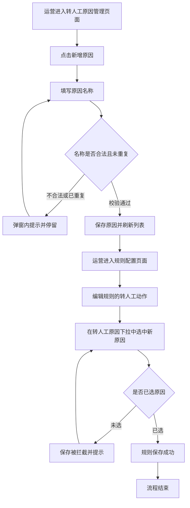
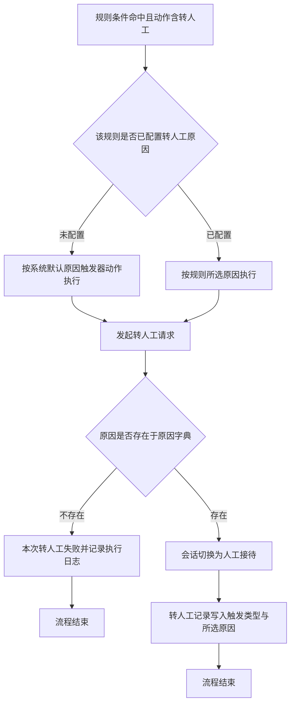

# PRD - 规则转人工触发原因细化

## 一、修订记录

| 版本号 | 修改日期 | 修改原因 | 修订人 |
|--------|----------|----------|--------|
| v1.0   | 2026-08-24 | 初稿：新增转人工原因管理页面，规则引擎转人工动作恢复原因选择，明确存量规则的默认原因处理 | AI PRD Writer |

## 二、需求概述

### 背景/现状

当规则引擎命中并执行转人工动作时，系统统一把转人工原因记为「触发器动作」，运营在配置界面看不到也选不了原因，导致所有规则引擎转人工记录的原因完全相同、无法区分来源。

### 需求目标

当运营在转人工原因管理页面新增一条原因后，系统应立即将该原因提供给规则引擎的转人工动作选择；当运营为规则配置转人工动作时，系统应要求其选定一条转人工原因才允许保存。

### 核心逻辑简述

运营先在「转人工原因管理」页面新增归属规则引擎的转人工原因，再回到规则配置页面为转人工动作选定原因；规则运行命中后，系统按该规则配置的原因发起转人工并写入转人工记录。

### SCOPE（本次必做）

1. 新增「转人工原因管理」一级页面：全量原因只读列表、规则引擎原因新增、规则引擎原因重命名
2. 规则引擎「转人工」动作新增「转人工原因」选择项，必选且不预设默认选中
3. 上线时一次性清理规则引擎下从未被任何规则引用的 6 条历史原因

### NON-GOAL（本次明确不做）

1. 不提供原因的删除能力与停用能力
2. 不预置任何初始原因，上线后由运营自行新增
3. 不批量修改存量规则已携带的转人工原因
4. 不新增、不修改规则引擎以外触发类型（用户被动、销售主动、标签回调、无法识别消息、空闲自动转回）下的原因
5. 不改造转人工转化率看板与 AI 员工明细的会话筛选

### ACCEPT（业务可观察验收）

1. 运营在管理页面新增一条原因并保存成功后，无需等待服务重启，返回规则配置页面即可在转人工原因下拉中选到该原因
2. 新建规则的转人工动作未选择原因时，点击保存被拦截并提示，规则不落库
3. 打开一条上线前已存在的转人工规则，原因位置显示「触发器动作」，不修改直接保存不报错
4. 管理页面全页无删除入口，无停用开关
5. 新增原因时填入与现有规则引擎原因重复的名称，保存被拦截并提示
6. 清理后，规则引擎原因下拉中不再出现「关键词命中、频次阈值命中、行为模式匹配、时间窗口命中、用户意向匹配、兜底规则」六项

### 测试数据说明

需要一条上线前已配置且动作包含转人工的存量规则用于验证第 3 条验收，冒烟数据待产品在测试环境提供。

## 三、术语表

| 术语 | 定义 |
|------|------|
| 触发类型 | 转人工动作的发起源头分类，现有六类：用户被动、销售主动、标签回调、无法识别消息、空闲自动转回、规则引擎 |
| 原因分类 | 触发类型下的二级业务分类，现有五类：用户意向、异常协助、销售主动、规则命中、系统自动 |
| 转人工原因 | 原因分类下的具体业务场景名称，是转人工记录中可被聚合分析的最小分析维度 |
| 规则引擎原因 | 归属「规则引擎」触发类型、「规则命中」原因分类的转人工原因，是本次唯一可被运营新增和重命名的原因 |
| 系统默认原因 | 名称为「触发器动作」的规则引擎原因，是上线前所有转人工规则携带的原因，不可重命名 |
| 转人工动作 | 规则引擎动作类型之一，规则命中后把会话从 AI 托管切换到人工接待 |

## 四、调整范围

1. **转人工原因管理页面（本次新增）**：企微机器人后台新增一级菜单页面，承载全量转人工原因的只读列表、规则引擎原因的新增与重命名
2. **新增转人工原因弹窗（本次新增）**：由管理页面顶部按钮打开，填写原因名称并保存
3. **重命名转人工原因弹窗（本次新增）**：由管理页面列表行操作打开，修改规则引擎原因的名称
4. **规则配置页面 - 规则弹窗 - 动作配置区域**：转人工动作在原有「目标接待状态」与「坐席通知」基础上，新增「转人工原因」选择项
5. **转人工原因数据维护方式**：由技术侧工单维护改为运营在管理页面自助维护，新增原因保存后立即对规则引擎生效
6. **历史原因数据清理**：上线时一次性移除规则引擎下 6 条从未被任何规则引用的原因，保留「触发器动作」

## 五、业务流程图

**运营配置流程：新增原因到规则生效**

**运行期流程：规则命中到转人工落库**

## 六、可交互原型

在线预览：[点击查看可交互原型](https://minio.yc345.tv/onionext/prototypes/rule-transfer-reason-refine/index.html)

原型模式：html-wireframe（非最终 UI）

> 原型为可交互 HTML 页面，左侧导航包含两个视图：
> 1. 转人工原因管理：全量原因列表、触发类型筛选与名称搜索、新增原因弹窗、重命名弹窗；顶部演示开关可切换「仅查看权限」「列表空态」「保存失败」三种状态
> 2. 规则配置：转人工规则列表、规则弹窗内的转人工原因选择器；顶部演示开关可切换「原因选项无可选」「选项加载失败」两种状态

## 七、功能需求详细描述

### 7.1 转人工原因管理页面 - 页面入口与整体布局

页面作为企微机器人后台的一级菜单，与「会话属性」平级，承载全量转人工原因的查看与规则引擎原因的维护。

**功能、弹窗、按钮类型**

| 功能按钮 | 功能说明 | 是否必填 | 功能类型 | 交互说明 | 备注 |
|---------|---------|---------|---------|---------|------|
| 菜单入口 | 从企微机器人后台左侧菜单进入本页面 | 不适用 | 菜单项 | 点击后进入转人工原因管理页面，默认展示全量原因列表第一页 | 与「会话属性」同级，非规则配置页的子页 |
| 页面说明 | 告知运营本页面的维护边界 | 不适用 | 文字说明 | 页面标题下固定展示一行说明文案「仅规则引擎触发的转人工原因可新增与重命名，其余原因由系统写入，仅供查看」 | 常驻展示，不可关闭 |
| 新增原因 | 打开新增转人工原因弹窗 | 不适用 | 按钮 | 位于列表右上方，常态可点击，点击后打开新增弹窗 | 无权限时按钮置灰，悬浮提示「暂无操作权限，请联系管理员」 |

### 7.2 转人工原因管理页面 - 原因列表

展示全部触发类型下的转人工原因，规则引擎以外的原因只读。

**列表类型**

| 字段名称 | 字段说明 | 字段来源 | 备注 |
|---------|---------|---------|------|
| 触发类型 | 该原因所属的发起源头中文名称 | 沿用现有原因字典 | 取值：用户被动 / 销售主动 / 标签回调 / 无法识别消息 / 空闲自动转回 / 规则引擎 |
| 原因分类 | 该原因所属的二级业务分类中文名称 | 沿用现有原因字典 | 取值：用户意向 / 异常协助 / 销售主动 / 规则命中 / 系统自动 |
| 原因名称 | 该原因的业务名称，是转人工记录展示与分析的最小维度 | 沿用现有原因字典，规则引擎原因由本次新增能力维护 | 最长 20 个字符 |
| 是否可维护 | 标识该行是否允许运营重命名 | 本次新增 | 触发类型为「规则引擎」且非系统默认原因时展示「可维护」，其余展示「系统内置」 |
| 创建时间 | 该原因加入字典的时间 | 沿用现有原因字典 | 精确到分钟；历史原因无记录时显示「—」 |
| 操作 | 行级操作区 | 本次新增 | 仅「可维护」行展示「重命名」文字按钮，其余行该列显示「—」 |

**列表操作**

| 功能按钮 | 功能说明 | 是否必填 | 功能类型 | 交互说明 | 备注 |
|---------|---------|---------|---------|---------|------|
| 触发类型筛选 | 按触发类型过滤列表 | 否 | 下拉单选 | 默认「全部」，选中后列表立即刷新到第一页 | 选项来自列表中实际存在的触发类型 |
| 原因名称搜索 | 按原因名称模糊查找 | 否 | 输入框 | 占位文案「请输入原因名称」，输入后点击搜索或回车触发查询 | 最长输入 20 个字符 |
| 默认排序 | 列表默认展示顺序 | 不适用 | 排序规则 | 先按触发类型分组展示，组内按创建时间正序，「规则引擎」分组排在最前 | 无 |
| 分页 | 翻页查看 | 不适用 | 分页器 | 每页 20 条，展示总条数 | 无 |
| 重命名 | 打开重命名弹窗 | 不适用 | 文字按钮 | 点击后打开重命名弹窗并回填当前名称 | 仅「可维护」行可见；系统默认原因「触发器动作」不展示本按钮 |

**异常与兜底**

| 场景 | 展示内容 |
|------|---------|
| 列表加载失败 | 展示「加载失败，请重试」与「重新加载」按钮 |
| 筛选或搜索无结果 | 展示「没有符合条件的转人工原因」与「清空筛选」按钮 |
| 列表为空 | 展示「暂无转人工原因，点击右上方新增」与「新增原因」按钮 |

### 7.3 新增转人工原因弹窗

运营通过本弹窗新增归属规则引擎的转人工原因。

**功能、弹窗、按钮类型**

| 功能按钮 | 功能说明 | 是否必填 | 功能类型 | 交互说明 | 备注 |
|---------|---------|---------|---------|---------|------|
| 触发类型 | 展示新增原因的归属触发类型 | 不适用 | 只读文本 | 固定展示「规则引擎」，不可修改 | 本次仅允许在规则引擎下新增 |
| 原因分类 | 展示新增原因的归属原因分类 | 不适用 | 只读文本 | 固定展示「规则命中」，不可修改 | 本次仅允许在规则命中下新增 |
| 原因名称 | 填写新原因的业务名称 | 是 | 输入框 | 占位文案「请输入原因名称，例如高意向信号」，右下角实时展示已输入字数 | 1 至 20 个字符；不允许全部为空格；不允许与现有规则引擎原因重名 |
| 确定 | 提交新增 | 不适用 | 按钮 | 原因名称为空时置灰，悬浮提示「请先填写原因名称」；填写后可点击，点击后进入提交中状态并禁用按钮 | 无 |
| 取消 | 放弃新增 | 不适用 | 按钮 | 已填写内容时点击需二次确认「填写的内容将不会保存，确认离开？」，确认后关闭弹窗；未填写时直接关闭 | 点击遮罩与右上角关闭按钮的行为与「取消」一致 |

**校验与结果反馈**

| 场景 | 系统行为 |
|------|---------|
| 名称为空或全为空格 | 输入框下方红字提示「请输入原因名称」，不提交 |
| 名称超过 20 个字符 | 输入框拒绝继续输入，右下角字数标红 |
| 名称与现有规则引擎原因重复 | 输入框下方红字提示「该原因名称已存在，请更换」，不提交，保留已填内容 |
| 保存成功 | 关闭弹窗，顶部提示「新增成功」，列表刷新并定位到「规则引擎」分组，新增行高亮 2 秒 |
| 保存失败 | 弹窗不关闭，保留已填内容，顶部提示「新增失败，请重试」 |
| 保存成功后的生效范围 | 该原因立即出现在规则引擎转人工动作的原因下拉中，无需等待或重启服务 |

### 7.4 重命名转人工原因弹窗

运营通过本弹窗修改规则引擎原因的展示名称，原因本身的历史记录归属关系不变。

**功能、弹窗、按钮类型**

| 功能按钮 | 功能说明 | 是否必填 | 功能类型 | 交互说明 | 备注 |
|---------|---------|---------|---------|---------|------|
| 原名称 | 展示修改前的原因名称 | 不适用 | 只读文本 | 打开弹窗时回填当前名称 | 无 |
| 新名称 | 填写修改后的原因名称 | 是 | 输入框 | 默认回填当前名称并全选，校验规则与新增一致 | 1 至 20 个字符；不允许与其他规则引擎原因重名；与原名称相同时确定按钮置灰 |
| 生效说明 | 告知运营重命名的影响范围 | 不适用 | 文字说明 | 弹窗底部固定展示「重命名后，已使用该原因的规则与历史转人工记录将同步显示新名称」 | 常驻展示 |
| 确定 | 提交重命名 | 不适用 | 按钮 | 新名称为空或与原名称相同时置灰，悬浮提示「请填写新的原因名称」 | 无 |
| 取消 | 放弃修改 | 不适用 | 按钮 | 名称有改动时点击需二次确认，确认后关闭；无改动时直接关闭 | 无 |

**校验与结果反馈**

| 场景 | 系统行为 |
|------|---------|
| 新名称与其他规则引擎原因重复 | 输入框下方红字提示「该原因名称已存在，请更换」，不提交 |
| 保存成功 | 关闭弹窗，顶部提示「修改成功」，列表刷新展示新名称 |
| 保存失败 | 弹窗不关闭，保留已填内容，顶部提示「修改失败，请重试」 |
| 系统默认原因 | 「触发器动作」行不提供重命名入口，运营无法修改其名称 |

### 7.5 规则配置页面 - 转人工动作的原因选择

在规则弹窗的动作配置区域，转人工动作在原有配置项基础上新增原因选择。

**功能、弹窗、按钮类型**

| 功能按钮 | 功能说明 | 是否必填 | 功能类型 | 交互说明 | 备注 |
|---------|---------|---------|---------|---------|------|
| 目标接待状态 | 展示本动作的目标状态 | 不适用 | 只读标签 | 固定展示「转人工接待」 | 沿用现有配置，本次不调整 |
| 转人工原因 | 选择本条规则命中后写入转人工记录的原因 | 是 | 下拉单选 | 新建动作时不预设选中项，占位文案「请选择转人工原因」；下拉选项为全部规则引擎原因，按创建时间正序排列 | 本次新增；每次展开下拉时重新拉取选项，保证刚新增的原因可被选到 |
| 坐席通知 | 是否向承接坐席发送提醒 | 否 | 开关 | 默认关闭 | 沿用现有配置，本次不调整 |
| 前往新增原因 | 跳转到转人工原因管理页面 | 不适用 | 文字链接 | 位于转人工原因下拉右侧，点击后在新标签页打开转人工原因管理页面，当前规则弹窗的已填内容保持不变 | 本次新增 |

**校验与状态规则**

| 场景 | 系统行为 |
|------|---------|
| 新建转人工动作 | 转人工原因为空，未选中任何选项 |
| 未选原因即保存规则 | 保存被拦截，转人工原因下方红字提示「请选择转人工原因」，页面滚动定位到该动作，规则不落库 |
| 打开上线前已存在的转人工规则 | 转人工原因显示为「触发器动作」，运营可保持不变直接保存，也可改选其他原因 |
| 规则所选原因已被重命名 | 下拉与规则详情展示重命名后的名称，规则本身无需重新保存 |
| 原因下拉无任何选项 | 下拉展开后展示「暂无可选原因，请先前往转人工原因管理页面新增」，并提供「前往新增」入口 |
| 原因选项加载失败 | 下拉展开后展示「加载失败，请重试」与「重新加载」入口，保存按钮保持可点击但校验仍要求已选原因 |
| 复制规则 | 复制出的新规则沿用被复制规则的转人工原因，运营可修改 |

### 7.6 存量规则与历史数据处理

**列表类型**

| 字段名称 | 字段说明 | 字段来源 | 备注 |
|---------|---------|---------|------|
| 存量规则的转人工原因 | 上线前已配置的转人工规则所携带的原因 | 沿用现有数据 | 统一为「触发器动作」，本次不做批量修改；运营编辑规则时可自行改选 |
| 系统默认原因 | 名称为「触发器动作」的规则引擎原因 | 沿用现有数据 | 保留在字典中且在下拉可选，不可重命名，不可删除 |
| 待清理的历史原因 | 规则引擎下从未被任何规则引用的 6 条原因 | 沿用现有数据 | 名称为关键词命中、频次阈值命中、行为模式匹配、时间窗口命中、用户意向匹配、兜底规则；上线时一次性移除，移除后不再出现在管理页面与规则下拉中 |
| 历史转人工记录 | 上线前已产生的转人工记录 | 沿用现有数据 | 原因保持不变，不做回填，不受本次清理影响 |

**清理前置校验**

| 场景 | 系统行为 |
|------|---------|
| 清理前发现待清理原因已被规则引用 | 该条原因不予清理并保留在字典中，由技术侧告知产品后再决定处理方式 |
| 清理前发现待清理原因已存在历史转人工记录 | 该条原因不予清理并保留在字典中，保证历史记录的原因名称可正常展示 |

### 7.7 横切规则

**权限**

| 场景 | 系统行为 |
|------|---------|
| 具备编辑权限的运营 | 可查看列表、新增原因、重命名原因 |
| 仅具备查看权限的运营 | 可查看列表；「新增原因」按钮与「重命名」按钮置灰，悬浮提示「暂无操作权限，请联系管理员」 |
| 无本页面权限的账号 | 左侧菜单不展示「转人工原因管理」入口 |

**跳转闭环**

| 场景 | 系统行为 |
|------|---------|
| 从规则弹窗前往新增原因 | 在新标签页打开转人工原因管理页面，原规则弹窗保留已填内容 |
| 新增原因后回到规则弹窗 | 重新展开转人工原因下拉即可看到新增原因，无需关闭并重新打开规则弹窗 |
| 管理页面新增或重命名完成 | 停留在管理页面，列表刷新并保持当前筛选条件与分页 |

**状态一致性**

| 场景 | 系统行为 |
|------|---------|
| 原因新增后 | 立即可被规则引擎转人工动作选择，无需等待服务重启 |
| 原因重命名后 | 规则配置页面、转人工记录明细展示的名称同步更新，规则与记录的归属关系不变 |

## 八、埋点与数据需求

本次不涉及新增埋点。

## 九、权限说明

- **企微机器人运营（编辑权限）**：可进入转人工原因管理页面，新增原因、重命名规则引擎原因，在规则配置中选择转人工原因
- **企微机器人运营（查看权限）**：可进入转人工原因管理页面查看列表；不能新增、不能重命名
- **无企微机器人后台权限的账号**：不展示转人工原因管理菜单入口
