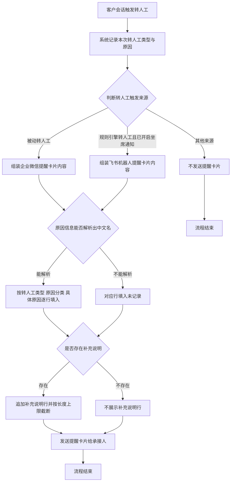

# PRD-转人工提醒卡片增加原因细分提示

## 一、修订记录

| 版本号 | 修改日期 | 修改原因 | 修订人 |
|--------|----------|----------|--------|
| v1.0 | 2026-09-01 | 初稿 | AI PRD Writer |

## 二、需求概述

- **背景/现状**：当前企微机器人板块的转人工提醒卡片只告知承接人「客户已由 AI 转为人工接待」，不说明本次转人工属于什么类型、因为什么原因，承接人必须打开会话逐条翻聊天记录才能判断该客户是高意向线索还是 AI 异常需要救火。

- **需求目标**：当系统发送转人工提醒卡片时，卡片应展示本次转人工的转人工类型、原因分类与具体原因，使承接人在不打开会话的情况下即可判断处理优先级。

- **核心逻辑简述**：当转人工完成并满足现有提醒发送条件时，系统应从本次转人工记录中读取转人工类型与原因信息、解析为中文名称后逐行填入提醒卡片，再按现有渠道发送给承接人。

**测试数据说明**：需覆盖被动转人工的「确认购买意向」「AI 服务异常」两条明细，以及规则引擎转人工的「关键词命中」一条明细；另需一条原因信息缺失的历史会话用于验证兜底文案。冒烟数据待产品提供。

## 三、术语表

| 术语 | 定义 |
|------|------|
| 转人工类型 | 本次转人工的触发来源，取值为「用户被动」「销售主动」「规则引擎」「防御性被动」「标签回调」「无法识别消息」之一，沿用现有转人工原因字典 |
| 原因分类 | 转人工原因的一级归类，取值为「用户意向」「异常协助」「销售主动」「规则命中」之一，沿用现有转人工原因字典 |
| 具体原因 | 转人工原因的二级明细，如「确认购买意向」「AI 服务异常」「关键词命中」，沿用现有转人工原因字典 |
| 补充说明 | 转人工时随本次转人工一并提交的额外文字备注，最长 200 个字，沿用现有配置 |
| 承接销售 | 被动转人工场景下接收企业微信提醒卡片的销售，即该客户当前的归属销售 |
| 承接坐席 | 规则引擎转人工场景下接收飞书机器人提醒卡片的坐席 |
| 被动转人工 | 由 AI 侧判定后把客户从 AI 接待切换为人工接待的转人工，转人工类型为「用户被动」 |
| 规则引擎转人工 | 由规则引擎命中规则后自动触发的转人工，转人工类型为「规则引擎」 |
| 转人工原因字典 | 系统已有的转人工原因三层对照关系，用于把转人工类型、原因分类、具体原因解析为中文展示名，沿用现有配置 |

## 四、调整范围

1. **企业微信转人工提醒卡片正文扩展**：在现有卡片正文中新增转人工类型、原因分类、具体原因三行，并在存在补充说明时新增补充说明行。
2. **飞书机器人转人工提醒卡片内容扩展**：在现有卡片内容中新增转人工类型、原因分类、具体原因三行，并在存在补充说明时新增补充说明行。
3. **转人工原因中文名解析**：组装卡片内容前，按本次转人工记录的转人工类型与原因信息，从现有转人工原因字典解析出三层中文展示名。
4. **提醒内容兜底规则**：任一层原因信息无法解析出中文名时，对应行填入「未记录」。
5. **企业微信卡片正文长度截断规则**：补充说明超过长度上限时截断展示，优先保证转人工类型、原因分类、具体原因三行完整。
6. **飞书卡片模板内容扩展（通知服务侧配合）**：飞书提醒卡片的正文排版由通知服务侧的卡片模板维护，本次需由通知服务侧在模板中新增上述四行的展示内容，与本侧发版顺序需对齐。

本次不调整两种提醒卡片的发送条件与发送时机，不调整转人工判定逻辑，不新增转人工原因取值，不涉及任何前端页面。

## 五、业务流程图

**主流程：转人工触发到提醒卡片展示**

## 六、可交互原型

可交互原型（公网，点击可直接操作）：https://leo-ai05.github.io/prototypes/%E8%BD%AC%E4%BA%BA%E5%B7%A5%E6%8F%90%E9%86%92%E5%8D%A1%E7%89%87%E5%A2%9E%E5%8A%A0%E5%8E%9F%E5%9B%A0%E7%BB%86%E5%88%86%E6%8F%90%E7%A4%BA/

洋葱静态网站（内网，需飞连）：https://minio.yc345.tv/onionext/prototypes/transfer-reason-card/index.html

原型模式：html-wireframe（单文件可交互原型，无需登录、无需本地启动）

涉及页面：企业微信应用消息中的转人工提醒卡片、飞书机器人会话中的转人工提醒卡片

可操作路径：

1. 打开原型，默认停留在「企业微信提醒卡片」页签，右侧卡片正文可见新增的转人工类型、原因分类、具体原因三行，黄色高亮的即为本次新增行。
2. 左侧「具体原因」下拉切换为「AI 服务异常」，卡片的原因分类同步变为「异常协助」，验证原因分类随具体原因联动。
3. 打开「一键填入超长补充说明」开关，卡片的补充说明行截取前 30 个字并以省略号结尾，输入框下方字数提示变红并标注「卡片内截取前 30 字」。
4. 关闭该开关并清空补充说明输入框，卡片的补充说明整行消失，正文中不出现空行。
5. 打开「模拟原因信息缺失」开关，转人工类型、原因分类、具体原因三行同时变为「未记录」，卡片仍正常展示。
6. 点击右上角「改造前」，卡片回到当前线上的单行话术，与「改造后」逐行对比。
7. 切换到「飞书机器人提醒卡片」页签，卡片在客户昵称、命中规则名与切换时间之间插入新增的三行与补充说明行。
8. 打开「模拟原因信息缺失」开关，飞书卡片的三行同时变为「未记录」。
9. 关闭上一个开关，打开「模拟卡片模板尚未扩展」开关，新增四行不展示，卡片按现有样式正常发送，下方出现降级说明。
10. 关闭上一个开关，打开「关闭该规则的坐席通知开关」，卡片区域变为不发送的空态。
11. 点击右上角「改造前」，飞书卡片回到当前的三行内容，与「改造后」对比。

关键态截图：`需求汇总/转人工提醒卡片增加原因细分提示/proto-shots/`，共 11 张

## 七、功能需求详细描述

### 7.1 企业微信转人工提醒卡片

**发送场景**：沿用现有配置，仅在被动转人工且方向为「转人工接待」时发送给承接销售。销售主动转人工、标签回调转人工、无法识别消息转人工、规则引擎转人工均不发送本卡片。

**卡片结构**：卡片由标题、正文、跳转链接三部分组成。标题与跳转链接沿用现有配置，本次只扩展正文。

**正文行清单**（按从上到下展示顺序）：

| 行序 | 行名称 | 展示内容 | 内容来源 | 是否新增 | 备注 |
|------|--------|----------|----------|----------|------|
| 1 | 转接说明 | 您的好友【客户昵称】由AI转为人工接待 | 客户昵称来自该客户在企业微信中的昵称 | 沿用现有 | 客户昵称为空时展示为空的括号内容，沿用现有配置 |
| 2 | 转人工类型 | 转人工类型：用户被动 | 由本次转人工记录的触发来源经转人工原因字典解析出的中文名 | 新增 | 解析不到时展示「转人工类型：未记录」 |
| 3 | 原因分类 | 原因分类：用户意向 | 由本次转人工记录的原因分类经转人工原因字典解析出的中文名 | 新增 | 解析不到时展示「原因分类：未记录」 |
| 4 | 具体原因 | 具体原因：确认购买意向 | 由本次转人工记录的具体原因经转人工原因字典解析出的中文名 | 新增 | 解析不到时展示「具体原因：未记录」 |
| 5 | 补充说明 | 补充说明：客户已询问优惠券使用方式 | 本次转人工提交的补充说明 | 新增 | 补充说明为空时整行不展示；超过 30 个字时截取前 30 个字并以省略号结尾 |
| 6 | 操作引导 | 请点击卡片跳转，接待完成后，请在"AI助理"中切换为Ai接待 | 固定话术 | 沿用现有 | — |

**交互说明**：

1. 当被动转人工执行成功且已完成转人工记录写入时，系统组装上述正文并发送卡片；提醒卡片发送与转人工主流程相互独立，卡片发送失败不影响转人工结果。
2. 承接销售点击卡片时，跳转到该客户的会话接待页面，携带该客户与承接销售的会话上下文，沿用现有配置。
3. 正文各行之间换行展示，所有行使用统一文字样式，不对任何原因做颜色区分或视觉强调。
4. 卡片正文整体长度受渠道上限约束，组装时按 7.4 的截断规则处理。

**异常与兜底**：

1. 转人工原因字典中不存在本次转人工对应的对照关系时（如历史会话、字典尚未配置的新增取值），转人工类型、原因分类、具体原因三行中解析失败的行填入「未记录」，其余能解析的行照常展示，卡片正常发送。
2. 三行全部解析失败时，三行均展示「未记录」，卡片仍然发送，不因原因缺失而放弃发送。
3. 卡片发送失败时，仅记录失败信息，不重发、不阻断转人工主流程，沿用现有配置。

### 7.2 飞书机器人转人工提醒卡片

**发送场景**：沿用现有配置，仅在规则引擎转人工、该规则已开启坐席通知、方向为「转人工接待」且客户此前不处于人工接待状态时，发送给承接坐席。客户已处于人工接待状态的重复转人工不发送。

**卡片内容行清单**（按从上到下展示顺序）：

| 行序 | 行名称 | 展示内容 | 内容来源 | 是否新增 | 备注 |
|------|--------|----------|----------|----------|------|
| 1 | 客户昵称 | 客户在企业微信中的昵称 | 客户档案 | 沿用现有 | 昵称为空时展示「—」 |
| 2 | 命中规则名 | 触发本次转人工的规则名称 | 规则引擎的规则配置 | 沿用现有 | — |
| 3 | 转人工类型 | 规则引擎 | 由本次转人工记录的触发来源经转人工原因字典解析出的中文名 | 新增 | 解析不到时展示「未记录」 |
| 4 | 原因分类 | 规则命中 | 由本次转人工记录的原因分类经转人工原因字典解析出的中文名 | 新增 | 解析不到时展示「未记录」 |
| 5 | 具体原因 | 关键词命中 | 由本次转人工记录的具体原因经转人工原因字典解析出的中文名 | 新增 | 解析不到时展示「未记录」 |
| 6 | 补充说明 | 本次转人工提交的补充说明 | 规则动作配置中填写的补充说明 | 新增 | 补充说明为空时整行不展示；有内容时完整展示，不截断 |
| 7 | 切换时间 | 本次转人工发生的日期与时间 | 转人工执行时间 | 沿用现有 | 精确到秒 |

**交互说明**：

1. 当规则引擎转人工执行成功且满足上述发送场景时，系统组装上述内容并向承接坐席发送飞书卡片。
2. 承接坐席无对应飞书账号信息时，不发送卡片并记录失败信息，沿用现有配置。
3. 卡片各行使用统一文字样式，不对任何原因做颜色区分或视觉强调。

**异常与兜底**：

1. 转人工原因字典中不存在本次转人工对应的对照关系时，转人工类型、原因分类、具体原因三行中解析失败的行展示「未记录」，卡片正常发送。
2. 卡片模板尚未完成内容扩展时，新增的四行不会在卡片上展示，卡片仍按现有样式正常发送，不报错、不阻断转人工主流程；上线时需先完成通知服务侧的卡片模板扩展，再发布本侧改动。
3. 卡片发送失败时，仅记录失败信息，不重发、不阻断转人工主流程，沿用现有配置。

### 7.3 转人工原因中文名解析规则

**功能目标**：把本次转人工记录中的转人工类型与原因信息解析为可直接展示的中文名称。

| 解析项 | 解析规则 | 解析失败时的展示 |
|--------|----------|------------------|
| 转人工类型 | 按本次转人工记录的触发来源，从转人工原因字典中取对应的转人工类型中文名 | 未记录 |
| 原因分类 | 按本次转人工记录的触发来源与原因分类，从转人工原因字典中取对应的原因分类中文名 | 未记录 |
| 具体原因 | 按本次转人工记录的触发来源、原因分类与具体原因三者的组合，从转人工原因字典中取对应的具体原因中文名 | 未记录 |

**逻辑约束**：

1. 解析只读取现有转人工原因字典，本次不新增、不修改任何原因取值与对照关系。
2. 解析结果只用于提醒卡片展示，不回写转人工记录、不改变客户画像中已有的原因分类写入逻辑。
3. 解析过程中出现任何异常时，按解析失败处理，对应行展示「未记录」，不抛出错误、不阻断卡片发送。

### 7.4 企业微信卡片正文长度截断规则

**功能目标**：保证扩展后的正文不超过企业微信卡片正文的长度上限，避免因超长导致卡片发送失败。

**规则**：

1. 组装正文时按 7.1 的行序依次拼接，转人工类型、原因分类、具体原因三行必须完整保留。
2. 补充说明超过 30 个字时，截取前 30 个字，并在末尾追加省略号；未超过时完整展示。
3. 补充说明为空时，整行不参与拼接，正文中不出现空行。
4. 完成上述处理后，正文整体仍超过渠道长度上限时，从末尾开始丢弃补充说明行后重新拼接；转人工类型、原因分类、具体原因三行在任何情况下都不被丢弃。

### 7.5 发送范围与开关

**规则**：

1. 本次不新增任何开关，不调整两种提醒卡片各自的发送条件与发送时机。
2. 规则引擎转人工的坐席通知开关沿用现有配置，开关关闭时不发送飞书卡片，扩展内容随之不展示。
3. 除被动转人工与规则引擎转人工两个场景外，其余转人工场景本次仍不发送任何提醒卡片。

## 八、埋点与数据需求

本次需求不新增埋点，不新增数据指标。

## 九、权限说明

本次需求不涉及角色权限变更。提醒卡片的接收范围沿用现有配置：企业微信卡片发送给该客户的承接销售，飞书卡片发送给该规则的承接坐席。
