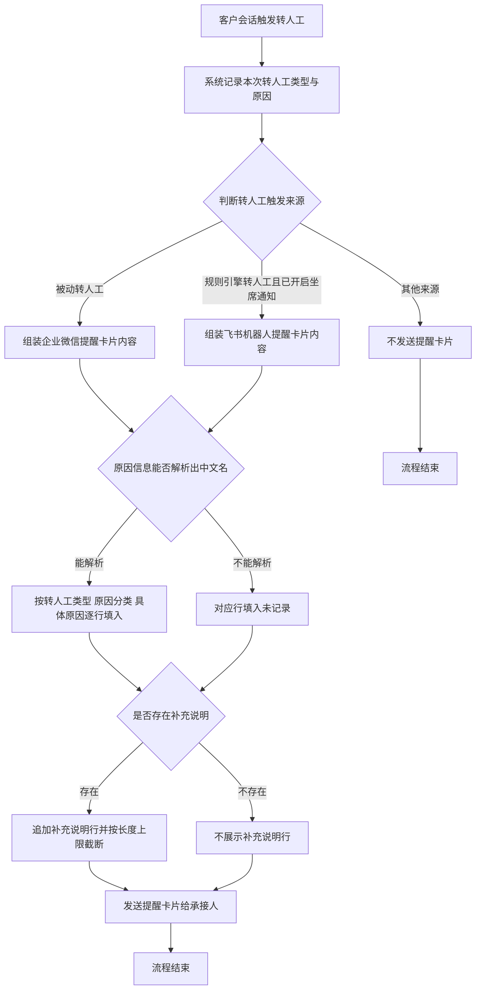
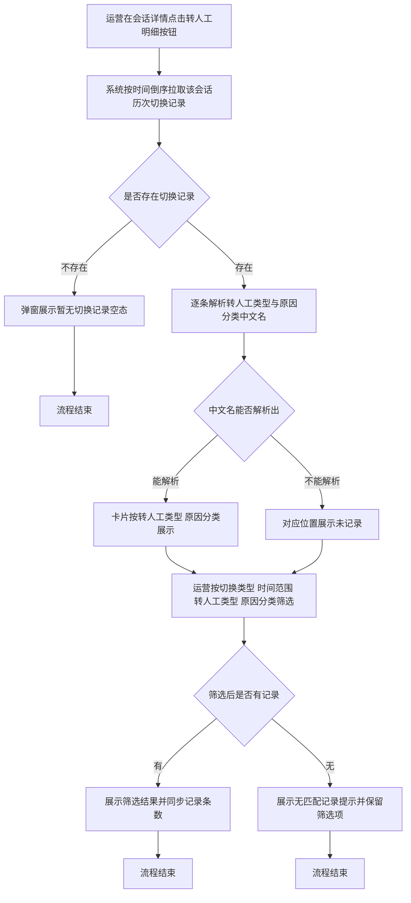

# PRD-转人工提醒卡片增加原因细分提示

## 一、修订记录

| 版本号 | 修改日期 | 修改原因 | 修订人 |
|--------|----------|----------|--------|
| v1.0 | 2026-09-01 | 初稿 | AI PRD Writer |
| v1.1 | 2026-09-01 | 补充 AI员工明细「转人工明细」弹窗的原因细分展示与筛选 | AI PRD Writer |

## 二、需求概述

- **背景/现状**：当前企微机器人板块的转人工提醒卡片只告知承接人「客户已由 AI 转为人工接待」，不说明本次转人工属于什么类型、因为什么原因；AI员工明细的转人工明细弹窗也只展示一句合并后的转换原因，看不出原因归属哪一类。承接人与运营都必须打开会话逐条翻聊天记录，才能判断该客户是高意向线索还是 AI 异常需要救火。

- **需求目标**：当系统发送转人工提醒卡片、或运营查看转人工明细弹窗时，均应展示本次切换的转人工类型、原因分类与具体原因，使承接人与运营在不翻聊天记录的情况下即可判断处理优先级；转人工明细弹窗还应支持按原因分类筛选，便于运营批量排查同一类原因。

- **核心逻辑简述**：当转人工完成并满足现有提醒发送条件时，系统应从本次转人工记录中读取转人工类型与原因信息、解析为中文名称后逐行填入提醒卡片，再按现有渠道发送给承接人；当运营打开转人工明细弹窗时，系统应在每条切换记录上展示同一套原因信息，并提供按转人工类型与原因分类筛选的能力。

**测试数据说明**：需覆盖被动转人工的「确认购买意向」「AI 服务异常」两条明细，以及规则引擎转人工的「关键词命中」一条明细；转人工明细弹窗另需一条包含转回 AI 方向的会话（用于验证「转AI接待」「系统自动」两个原因分类的展示），以及一条原因信息缺失的历史会话用于验证兜底文案。冒烟数据待产品提供。

## 三、术语表

| 术语 | 定义 |
|------|------|
| 转人工类型 | 本次切换的触发来源，全部取值为「用户被动」「销售主动」「规则引擎」「防御性被动」「用户主动」「标签回调」「无法识别消息」「空闲自动转回」，沿用现有转人工原因字典。该字段在转回 AI 方向的记录上同样存在，此时表示本次切回 AI 的触发来源；同一触发来源在转人工与转回 AI 两个方向下的中文名可能不同，展示时以本条记录命中的字典对照关系为准 |
| 原因分类 | 转人工原因的一级归类，全部取值为「用户意向」「异常协助」「销售主动」「规则命中」「转AI接待」「系统自动」，沿用现有转人工原因字典。其中「转AI接待」「系统自动」只出现在转回 AI 方向的记录上，两种提醒卡片场景下不会出现 |
| 具体原因 | 转人工原因的二级明细，如「确认购买意向」「AI 服务异常」「关键词命中」，沿用现有转人工原因字典 |
| 补充说明 | 转人工时随本次转人工一并提交的额外文字备注，最长 200 个字，沿用现有配置 |
| 承接销售 | 被动转人工场景下接收企业微信提醒卡片的销售，即该客户当前的归属销售 |
| 承接坐席 | 规则引擎转人工场景下接收飞书机器人提醒卡片的坐席 |
| 被动转人工 | 由 AI 侧判定后把客户从 AI 接待切换为人工接待的转人工，转人工类型为「用户被动」 |
| 规则引擎转人工 | 由规则引擎命中规则后自动触发的转人工，转人工类型为「规则引擎」 |
| 转人工原因字典 | 系统已有的转人工原因三层对照关系，用于把转人工类型、原因分类、具体原因解析为中文展示名，沿用现有配置 |
| 转人工明细弹窗 | AI员工明细页会话详情区头部「转人工明细」按钮打开的弹窗，以时间线形式按时间倒序展示该会话历次 AI 与人工之间的切换记录，沿用现有配置 |
| 切换记录 | 转人工明细弹窗时间线上的一条记录，对应一次 AI 与人工之间的切换，方向为「转人工」或「转 AI」 |
| 触发方标签 | 转人工明细弹窗时间线卡片上的现有标签，取值只有「销售手动」「系统AI」「规则引擎」三档，粒度粗于转人工类型，本次由转人工类型替换 |
| 转换原因 | 转人工明细弹窗时间线卡片上的现有展示行，内容为具体原因与补充说明拼接后的一句话，原因缺失时展示「未知原因」，沿用现有配置 |

## 四、调整范围

1. **企业微信转人工提醒卡片正文扩展**：在现有卡片正文中新增转人工类型、原因分类、具体原因三行，并在存在补充说明时新增补充说明行。
2. **飞书机器人转人工提醒卡片内容扩展**：在现有卡片内容中新增转人工类型、原因分类、具体原因三行，并在存在补充说明时新增补充说明行。
3. **转人工原因中文名解析**：组装卡片内容前，按本次转人工记录的转人工类型与原因信息，从现有转人工原因字典解析出三层中文展示名。
4. **提醒内容兜底规则**：任一层原因信息无法解析出中文名时，对应行填入「未记录」。
5. **企业微信卡片正文长度截断规则**：补充说明超过长度上限时截断展示，优先保证转人工类型、原因分类、具体原因三行完整。
6. **飞书卡片模板内容扩展（通知服务侧配合）**：飞书提醒卡片的正文排版由通知服务侧的卡片模板维护，本次需由通知服务侧在模板中新增上述四行的展示内容，与本侧发版顺序需对齐。
7. **转人工明细弹窗时间线卡片内容扩展**：在每条切换记录上新增原因分类的展示，并把现有触发方标签替换为转人工类型。
8. **转人工明细弹窗筛选项调整**：把现有的「触发方」筛选改为按转人工类型筛选，并新增「原因分类」筛选，沿用现有的弹窗内即时筛选方式。
9. **转人工明细查询结果补充中文名**：该弹窗的查询结果当前只返回转人工类型与原因分类的原始取值、不含中文名，本次需补充返回两者的中文展示名，供弹窗直接展示与筛选。

本次不调整两种提醒卡片的发送条件与发送时机，不调整转人工判定逻辑，不新增转人工原因取值。转人工明细弹窗的入口位置、摘要区、统计区、切换记录的排序方式与现有「转换原因」行均不调整，本次不为该弹窗新增导出能力，也不调整 AI员工明细「客户明细导出」的现有列。

## 五、业务流程图

**主流程：转人工触发到提醒卡片展示**

**辅流程：运营查看转人工明细弹窗**

## 六、可交互原型

可交互原型（公网，点击可直接操作）：https://leo-ai05.github.io/prototypes/%E8%BD%AC%E4%BA%BA%E5%B7%A5%E6%8F%90%E9%86%92%E5%8D%A1%E7%89%87%E5%A2%9E%E5%8A%A0%E5%8E%9F%E5%9B%A0%E7%BB%86%E5%88%86%E6%8F%90%E7%A4%BA/

洋葱静态网站（内网，需飞连）：https://minio.yc345.tv/onionext/prototypes/transfer-reason-card/index.html

原型模式：html-wireframe（单文件可交互原型，无需登录、无需本地启动）

涉及页面：企业微信应用消息中的转人工提醒卡片、飞书机器人会话中的转人工提醒卡片、AI员工明细页的转人工明细弹窗

可操作路径：

1. 打开原型，默认停留在「企业微信提醒卡片」页签，右侧卡片正文可见新增的转人工类型、原因分类、具体原因三行，黄色高亮的即为本次新增行。
2. 左侧「具体原因」下拉切换为「AI 服务异常」，卡片的原因分类同步变为「异常协助」，验证原因分类随具体原因联动。
3. 打开「一键填入超长补充说明」开关，卡片的补充说明行截取前 30 个字并以省略号结尾，输入框下方字数提示变红并标注「卡片内截取前 30 字」。
4. 关闭该开关并清空补充说明输入框，卡片的补充说明整行消失，正文中不出现空行。
5. 打开「模拟原因信息缺失」开关，转人工类型、原因分类、具体原因三行同时变为「未记录」，卡片仍正常展示。
6. 点击右上角「改造前」，卡片回到当前线上的单行话术，与「改造后」逐行对比。
7. 切换到「飞书机器人提醒卡片」页签，卡片在客户昵称、命中规则名与切换时间之间插入新增的三行与补充说明行。
8. 打开「模拟原因信息缺失」开关，飞书卡片的三行同时变为「未记录」。
9. 关闭上一个开关，打开「模拟卡片模板尚未扩展」开关，新增四行不展示，卡片按现有样式正常发送，下方出现降级说明。
10. 关闭上一个开关，打开「关闭该规则的坐席通知开关」，卡片区域变为不发送的空态。
11. 点击右上角「改造前」，飞书卡片回到当前的三行内容，与「改造后」对比。
12. 切换到「AI员工明细 · 转人工明细弹窗」页签，时间线上每条切换记录的原触发方标签位置变为转人工类型，「切换后状态」右侧新增「原因分类」，两处均为黄色高亮。
13. 在弹窗筛选区把「全部原因分类」切换为「用户意向」，时间线只保留该分类的记录，右侧条数提示同步变为「共 4 条记录（总 8）」。
14. 把原因分类还原为「全部原因分类」，把「全部转人工类型」切换为「规则引擎」，时间线只保留规则引擎触发的记录。
15. 在上一步基础上把原因分类切换为「系统自动」，时间线出现「无匹配记录」提示，两个筛选项保留已选值不自动重置。
16. 还原两个下拉，点击「转人工」胶囊，打开「模拟历史记录字典未配置」开关，最后一条历史记录的转人工类型与原因分类变为「未记录」，转换原因同步变为「未知原因」，该条记录仍留在时间线上。
17. 关闭上一个开关并点回「全部」胶囊，打开「模拟查询结果未返回中文名」开关，全部记录的转人工类型与原因分类变为「未记录」，转换原因不受影响。
18. 关闭上一个开关，打开「模拟该会话暂无切换记录」开关，时间线区域变为「暂无切换记录」空态，摘要区与统计区照常展示。
19. 关闭上一个开关，点击右上角「改造前」，卡片回到现有的「销售手动 / 系统AI / 规则引擎」触发方标签、无原因分类行，筛选区也回到现有的「触发方」筛选，与「改造后」逐处对比。

关键态截图：`需求汇总/转人工提醒卡片增加原因细分提示/proto-shots/`，共 19 张

## 七、功能需求详细描述

### 7.1 企业微信转人工提醒卡片

**发送场景**：沿用现有配置，仅在被动转人工且方向为「转人工接待」时发送给承接销售。销售主动转人工、标签回调转人工、无法识别消息转人工、规则引擎转人工均不发送本卡片。

**卡片结构**：卡片由标题、正文、跳转链接三部分组成。标题与跳转链接沿用现有配置，本次只扩展正文。

**正文行清单**（按从上到下展示顺序）：

| 行序 | 行名称 | 展示内容 | 内容来源 | 是否新增 | 备注 |
|------|--------|----------|----------|----------|------|
| 1 | 转接说明 | 您的好友【客户昵称】由AI转为人工接待 | 客户昵称来自该客户在企业微信中的昵称 | 沿用现有 | 客户昵称为空时展示为空的括号内容，沿用现有配置 |
| 2 | 转人工类型 | 转人工类型：用户被动 | 由本次转人工记录的触发来源经转人工原因字典解析出的中文名 | 新增 | 解析不到时展示「转人工类型：未记录」 |
| 3 | 原因分类 | 原因分类：用户意向 | 由本次转人工记录的原因分类经转人工原因字典解析出的中文名 | 新增 | 解析不到时展示「原因分类：未记录」 |
| 4 | 具体原因 | 具体原因：确认购买意向 | 由本次转人工记录的具体原因经转人工原因字典解析出的中文名 | 新增 | 解析不到时展示「具体原因：未记录」 |
| 5 | 补充说明 | 补充说明：客户已询问优惠券使用方式 | 本次转人工提交的补充说明 | 新增 | 补充说明为空时整行不展示；超过 30 个字时截取前 30 个字并以省略号结尾 |
| 6 | 操作引导 | 请点击卡片跳转，接待完成后，请在"AI助理"中切换为Ai接待 | 固定话术 | 沿用现有 | — |

**交互说明**：

1. 当被动转人工执行成功且已完成转人工记录写入时，系统组装上述正文并发送卡片；提醒卡片发送与转人工主流程相互独立，卡片发送失败不影响转人工结果。
2. 承接销售点击卡片时，跳转到该客户的会话接待页面，携带该客户与承接销售的会话上下文，沿用现有配置。
3. 正文各行之间换行展示，所有行使用统一文字样式，不对任何原因做颜色区分或视觉强调。
4. 卡片正文整体长度受渠道上限约束，组装时按 7.4 的截断规则处理。

**异常与兜底**：

1. 转人工原因字典中不存在本次转人工对应的对照关系时（如历史会话、字典尚未配置的新增取值），转人工类型、原因分类、具体原因三行中解析失败的行填入「未记录」，其余能解析的行照常展示，卡片正常发送。
2. 三行全部解析失败时，三行均展示「未记录」，卡片仍然发送，不因原因缺失而放弃发送。
3. 卡片发送失败时，仅记录失败信息，不重发、不阻断转人工主流程，沿用现有配置。

### 7.2 飞书机器人转人工提醒卡片

**发送场景**：沿用现有配置，仅在规则引擎转人工、该规则已开启坐席通知、方向为「转人工接待」且客户此前不处于人工接待状态时，发送给承接坐席。客户已处于人工接待状态的重复转人工不发送。

**卡片内容行清单**（按从上到下展示顺序）：

| 行序 | 行名称 | 展示内容 | 内容来源 | 是否新增 | 备注 |
|------|--------|----------|----------|----------|------|
| 1 | 客户昵称 | 客户在企业微信中的昵称 | 客户档案 | 沿用现有 | 昵称为空时展示「—」 |
| 2 | 命中规则名 | 触发本次转人工的规则名称 | 规则引擎的规则配置 | 沿用现有 | — |
| 3 | 转人工类型 | 规则引擎 | 由本次转人工记录的触发来源经转人工原因字典解析出的中文名 | 新增 | 解析不到时展示「未记录」 |
| 4 | 原因分类 | 规则命中 | 由本次转人工记录的原因分类经转人工原因字典解析出的中文名 | 新增 | 解析不到时展示「未记录」 |
| 5 | 具体原因 | 关键词命中 | 由本次转人工记录的具体原因经转人工原因字典解析出的中文名 | 新增 | 解析不到时展示「未记录」 |
| 6 | 补充说明 | 本次转人工提交的补充说明 | 规则动作配置中填写的补充说明 | 新增 | 补充说明为空时整行不展示；有内容时完整展示，不截断 |
| 7 | 切换时间 | 本次转人工发生的日期与时间 | 转人工执行时间 | 沿用现有 | 精确到秒 |

**交互说明**：

1. 当规则引擎转人工执行成功且满足上述发送场景时，系统组装上述内容并向承接坐席发送飞书卡片。
2. 承接坐席无对应飞书账号信息时，不发送卡片并记录失败信息，沿用现有配置。
3. 卡片各行使用统一文字样式，不对任何原因做颜色区分或视觉强调。

**异常与兜底**：

1. 转人工原因字典中不存在本次转人工对应的对照关系时，转人工类型、原因分类、具体原因三行中解析失败的行展示「未记录」，卡片正常发送。
2. 卡片模板尚未完成内容扩展时，新增的四行不会在卡片上展示，卡片仍按现有样式正常发送，不报错、不阻断转人工主流程；上线时需先完成通知服务侧的卡片模板扩展，再发布本侧改动。
3. 卡片发送失败时，仅记录失败信息，不重发、不阻断转人工主流程，沿用现有配置。

### 7.3 转人工原因中文名解析规则

**功能目标**：把本次转人工记录中的转人工类型与原因信息解析为可直接展示的中文名称。

| 解析项 | 解析规则 | 解析失败时的展示 |
|--------|----------|------------------|
| 转人工类型 | 按本次转人工记录的触发来源，从转人工原因字典中取对应的转人工类型中文名 | 未记录 |
| 原因分类 | 按本次转人工记录的触发来源与原因分类，从转人工原因字典中取对应的原因分类中文名 | 未记录 |
| 具体原因 | 按本次转人工记录的触发来源、原因分类与具体原因三者的组合，从转人工原因字典中取对应的具体原因中文名 | 未记录 |

**逻辑约束**：

1. 解析只读取现有转人工原因字典，本次不新增、不修改任何原因取值与对照关系。
2. 解析结果只用于提醒卡片展示，不回写转人工记录、不改变客户画像中已有的原因分类写入逻辑。
3. 解析过程中出现任何异常时，按解析失败处理，对应行展示「未记录」，不抛出错误、不阻断卡片发送。

### 7.4 企业微信卡片正文长度截断规则

**功能目标**：保证扩展后的正文不超过企业微信卡片正文的长度上限，避免因超长导致卡片发送失败。

**规则**：

1. 组装正文时按 7.1 的行序依次拼接，转人工类型、原因分类、具体原因三行必须完整保留。
2. 补充说明超过 30 个字时，截取前 30 个字，并在末尾追加省略号；未超过时完整展示。
3. 补充说明为空时，整行不参与拼接，正文中不出现空行。
4. 完成上述处理后，正文整体仍超过渠道长度上限时，从末尾开始丢弃补充说明行后重新拼接；转人工类型、原因分类、具体原因三行在任何情况下都不被丢弃。

### 7.5 发送范围与开关

**规则**：

1. 本次不新增任何开关，不调整两种提醒卡片各自的发送条件与发送时机。
2. 规则引擎转人工的坐席通知开关沿用现有配置，开关关闭时不发送飞书卡片，扩展内容随之不展示。
3. 除被动转人工与规则引擎转人工两个场景外，其余转人工场景本次仍不发送任何提醒卡片。

### 7.6 AI员工明细 - 转人工明细弹窗

**所在位置**：AI员工明细页 → 会话详情区头部「转人工明细」按钮 → 弹窗。入口位置与打开方式沿用现有配置。

**弹窗结构**：由摘要区、统计区、筛选区、切换时间线四部分组成。摘要区与统计区本次不调整，本次只调整筛选区与时间线卡片。

**时间线卡片字段清单**（按从上到下、从左到右展示顺序）：

| 序号 | 字段名称 | 展示内容 | 内容来源 | 是否新增 | 备注 |
|------|----------|----------|----------|----------|------|
| 1 | 切换类型徽章 | 转人工 / 转 AI | 本条切换记录的切换方向 | 沿用现有 | 两种方向用不同底色区分，沿用现有配置 |
| 2 | 转人工类型 | 用户被动 / 销售主动 / 规则引擎 / 防御性被动 / 用户主动 / 标签回调 / 无法识别消息 / 空闲自动转回 | 由本条切换记录的触发来源经转人工原因字典解析出的中文名 | 新增，替换原触发方标签 | 与原触发方标签同一位置展示；解析不到时展示「未记录」 |
| 3 | 切换时间 | 本次切换发生的日期与时间 | 本条切换记录的发生时间 | 沿用现有 | 精确到分，沿用现有配置 |
| 4 | 操作方 | 执行本次切换的销售、命中的规则名或系统 | 本条切换记录的操作方信息 | 沿用现有 | — |
| 5 | 切换后状态 | 人工接待 / AI 接待 | 本条切换记录的切换后状态 | 沿用现有 | — |
| 6 | 原因分类 | 用户意向 / 异常协助 / 销售主动 / 规则命中 / 转AI接待 / 系统自动 | 由本条切换记录的原因分类经转人工原因字典解析出的中文名 | 新增 | 与「切换后状态」同一行展示，形如「原因分类：用户意向」；解析不到时展示「原因分类：未记录」 |
| 7 | 转换原因 | 具体原因与补充说明拼接后的一句话 | 本条切换记录的具体原因与补充说明 | 沿用现有 | 原因缺失时展示「未知原因」，拼接与截断方式均沿用现有配置，本次不拆行、不改文案 |
| 8 | 持续时长 | 本次状态持续的时长 | 本条切换记录与下一条记录的时间差 | 沿用现有 | 最新一条为进行中状态时按现有配置展示 |

**筛选项清单**（按从左到右展示顺序）：

| 序号 | 筛选项名称 | 交互形式 | 选项内容 | 是否新增 |
|------|------------|----------|----------|----------|
| 1 | 切换类型 | 胶囊按钮单选 | 全部 / 转人工 / 转 AI | 沿用现有 |
| 2 | 时间范围 | 下拉单选 | 全部时间 / 最近 24 小时 / 最近 7 天 / 最近 30 天 | 沿用现有 |
| 3 | 转人工类型 | 下拉单选 | 全部 / 用户被动 / 销售主动 / 规则引擎 / 防御性被动 / 用户主动 / 标签回调 / 无法识别消息 / 空闲自动转回 | 改造，替换原「触发方」筛选 |
| 4 | 原因分类 | 下拉单选 | 全部 / 用户意向 / 异常协助 / 销售主动 / 规则命中 / 转AI接待 / 系统自动 | 新增 |

**交互说明**：

1. 四个筛选项相互独立、可同时生效，取交集；筛选在弹窗内即时生效，不重新拉取数据，沿用现有筛选方式。
2. 筛选项变化后，筛选区右侧的记录条数提示同步更新，展示筛选后条数与总条数，沿用现有配置。
3. 关闭弹窗后重新打开时，四个筛选项均回到「全部」，沿用现有配置。
4. 转人工类型与原因分类的下拉选项为固定选项，不随当前会话的实际记录动态收窄；选中某项后该会话没有匹配记录时，按下方兜底规则展示。
5. 时间线卡片内所有文字使用统一样式，除切换类型徽章沿用现有底色区分外，不对任何原因做颜色区分或视觉强调。

**异常与兜底**：

1. 转人工原因字典中不存在本条切换记录对应的对照关系时（如历史记录、字典尚未配置的新增取值），转人工类型与原因分类中解析失败的位置展示「未记录」，该条记录仍正常展示在时间线上。
2. 同一触发来源在转人工与转回 AI 两个方向下的中文名不一致时，按本条切换记录实际命中的字典对照关系取名，不做统一改写。
3. 筛选后无匹配记录时，时间线区域展示「无匹配记录」提示，筛选项保留用户已选值，不自动重置。
4. 该会话没有任何切换记录时，弹窗展示「暂无切换记录」空态，沿用现有配置。
5. 查询结果中缺少中文名字段时（如查询服务尚未完成扩展），转人工类型与原因分类展示「未记录」，弹窗其余内容照常展示，不报错、不影响弹窗打开。

## 八、埋点与数据需求

本次需求不新增埋点，不新增数据指标。

## 九、权限说明

本次需求不涉及角色权限变更。提醒卡片的接收范围沿用现有配置：企业微信卡片发送给该客户的承接销售，飞书卡片发送给该规则的承接坐席。
